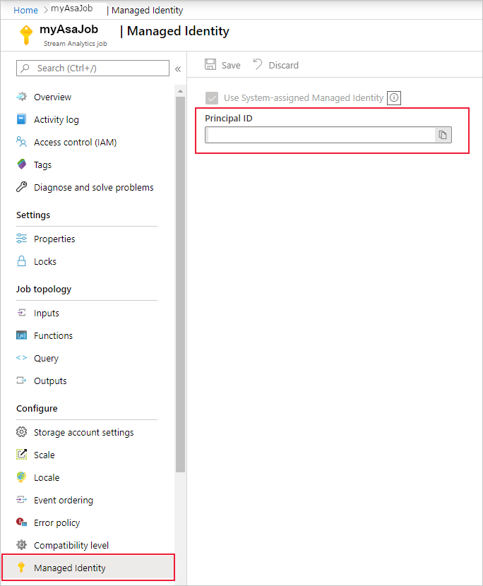

# Use managed identities to access Azure SQL Database or Azure Synapse Analytics from an Azure Stream Analytics job

Azure Stream Analytics supports [Managed Identity authentication](../active-directory/managed-identities-azure-resources/overview.md) for Azure SQL Database and Azure Synapse Analytics output sinks. Managed identities eliminate the limitations of user-based authentication methods, like the need to reauthenticate due to password changes or user token expirations that occur every 90 days. When you remove the need to manually authenticate, your Stream Analytics deployments can be fully automated.

A managed identity is a managed application registered in Azure Active Directory that represents a given Stream Analytics job. The managed application is used to authenticate to a targeted resource. This article shows you how to enable Managed Identity for an Azure SQL Database or an Azure Synapse Analytics output(s) of a Stream Analytics job through the Azure portal.

## Overview

This article shows you the steps needed to connect your Stream Analytics job to your Azure SQL Database or Azure Synapse Analytics SQL pool using Managed Identity authentication mode.

- You first create a system-assigned managed identity for your Stream Analytics job. This is your job’s identity in Azure Active Directory.

- Add an Active Directory admin to your SQL server or Synapse workspace, which enables Azure AD (Managed Identity) authentication for that resource.

- Next, create a contained user representing the Stream Analytics job's identity in the database. Whenever the Stream Analytics job interacts with your SQL DB or Synapse SQL DB resource, this is the identity it will refer to for checking what permissions your Stream Analytics job has.

- Grant permissions to your Stream Analytics job to access your SQL Database or Synapse SQL pools.

- Finally, add your Azure SQL Database/Azure Synapse Analytics as output in the Stream Analytics job.

## Prerequisites

#### [Azure SQL Database](#tab/azure-sql)

The following are required to use this feature:

- An Azure Stream Analytics job.

- An Azure SQL Database resource.

#### [Azure Synapse Analytics](#tab/azure-synapse)

The following are required to use this feature:

- An Azure Stream Analytics job.

- An Azure Synapse Analytics SQL pool.

- An Azure Storage account that is [configured to your Stream Analytics job](azure-synapse-analytics-output.md).

- Note: Stream Analytics account storage MSI integrated with Synapse SQL MSI is currently unavailable.

---

## Create a managed identity

First, you create a managed identity for your Azure Stream Analytics job.

1. In the [Azure portal](https://portal.azure.com), open your Azure Stream Analytics job.

1. From the left navigation menu, select **Managed Identity** located under **Configure**. Then, check the box next to **Use System-assigned Managed Identity** and select **Save**.

   

   A service principal for the Stream Analytics job's identity is created in Azure Active Directory. The life cycle of the newly created identity is managed by Azure. When the Stream Analytics job is deleted, the associated identity (that is, the service principal) is automatically deleted by Azure.

1. You can also switch to [user-assigned managed identities](stream-analytics-user-assigned-managed-identity-overview.md). 
 
3. When you save the configuration, the Object ID (OID) of the service principal is listed as the Principal ID as shown below:

   

   The service principal has the same name as the Stream Analytics job. For example, if the name of your job is *MyASAJob*, the name of the service principal is also *MyASAJob*.

## Select an Active Directory admin

After you've created a managed identity, you select an Active Directory admin.

1. Navigate to your Azure SQL Database or Azure Synapse Analytics SQL Pool resource and select the SQL Server or Synapse Workspace the resource is under, respectively. You can find the link to these in the resource overview page next to *Server name* or *Workspace name*.

1. Select **Active Directory Admin** or **SQL Active Directory Admin** under **Settings**, for SQL Server and Synapse Workspace respectively. Then, select **Set admin**.

   

1. On the Active Directory admin page, search for a user or group to be an administrator for the SQL Server and click **Select**. This will be the user who will be able to create the **Contained Database User** in the next section.

   

   The Active Directory admin page shows all members and groups of your Active Directory. Grayed out users or groups can't be selected as they're not supported as Azure Active Directory administrators. See the list of supported admins in the **Azure Active Directory Features and Limitations** section of [Use Azure Active Directory Authentication for authentication with SQL Database or Azure Synapse](/azure/azure-sql/database/authentication-aad-overview#azure-ad-features-and-limitations).

1. Select **Save** on the **Active Directory admin** page. The process for changing admin takes a few minutes.

## Create a contained database user

Next, you create a contained database user in your Azure SQL or Azure Synapse database that is mapped to the Azure Active Directory identity. The contained database user doesn't have a login for the primary database, but it maps to an identity in the directory that is associated with the database. The Azure Active Directory identity can be an individual user account or a group. In this case, you want to create a contained database user for your Stream Analytics job.

For more information, review the following article for background on Azure AD integration: [Universal Authentication with SQL Database and Azure Synapse Analytics (SSMS support for MFA)](/azure/azure-sql/database/authentication-mfa-ssms-overview)

1. Connect to your Azure SQL or Azure Synapse database using SQL Server Management Studio. The **User name** is an Azure Active Directory user with the **ALTER ANY USER** permission. The admin you set on the SQL Server is an example. Use **Azure Active Directory – Universal with MFA** authentication.

   

   The server name `<SQL Server name>.database.windows.net` may be different in different regions. For example, the China region should use `<SQL Server name>.database.chinacloudapi.cn`.

   You can specify a specific Azure SQL or Azure Synapse database by going to **Options > Connection Properties > Connect to Database**.

   

1. When you connect for the first time, you may encounter the following window:

   

   1. If so, go to your SQL Server/Synapse Workspace resource on the Azure portal. Under the **Security** section, open the **Firewalls and virtual network/Firewalls** page.
   1. Add a new rule with any rule name.
   1. Use the *From* IP address from the **New Firewall Rule** window for the *Start IP*.
   1. Use the *To* IP address from the **New Firewall Rule** window for *End IP*.
   1. Select **Save** and attempt to connect from SQL Server Management Studio again.

1. Once you're connected, create the contained database user. The following SQL command creates a contained database user that has the same name as your Stream Analytics job. Be sure to include the brackets around the *ASA_JOB_NAME*. Use the following T-SQL syntax and run the query.

   ```sql
   CREATE USER [ASA_JOB_NAME] FROM EXTERNAL PROVIDER;
   ```

    To verify if you have added the contained database user correctly, run the following command in SSMS under the pertaining database and check if your *ASA_JOB_NAME* is under the “name” column.

   ```sql
   SELECT * FROM <SQL_DB_NAME>.sys.database_principals
   WHERE type_desc = 'EXTERNAL_USER'
   ```

1. For Microsoft's Azure Active Directory to verify if the Stream Analytics job has access to the SQL Database, we need to give Azure Active Directory permission to communicate with the database. To do this, go to the "Firewalls and virtual network"/”Firewalls” page in Azure portal again, and enable "Allow Azure services and resources to access this server/workspace."

   

## Grant Stream Analytics job permissions

#### [Azure SQL Database](#tab/azure-sql)

Once you've created a contained database user and given access to Azure services in the portal as described in the previous section, your Stream Analytics job has permission from Managed Identity to **CONNECT** to your Azure SQL database resource via managed identity. We recommend that you grant the **SELECT** and **INSERT** permissions to the Stream Analytics job as those will be needed later in the Stream Analytics workflow. The **SELECT** permission allows the job to test its connection to the table in the Azure SQL database. The **INSERT** permission allows testing end-to-end Stream Analytics queries once you have configured an input and the Azure SQL database output.

#### [Azure Synapse Analytics](#tab/azure-synapse)

Once you've created a contained database user and given access to Azure services in the portal as described in the previous section, your Stream Analytics job has permission from Managed Identity to **CONNECT** to your Azure Synapse database resource via managed identity. We recommend that you further grant the **SELECT**, **INSERT**, and **ADMINISTER DATABASE BULK OPERATIONS** permissions to the Stream Analytics job as those will be needed later in the Stream Analytics workflow. The **SELECT** permission allows the job to test its connection to the table in the Azure Synapse database. The **INSERT** and **ADMINISTER DATABASE BULK OPERATIONS** permissions allow testing end-to-end Stream Analytics queries once you have configured an input and the Azure Synapse database output.

To grant the **ADMINISTER DATABASE BULK OPERATIONS** permission, you will need to grant all permissions that are labeled as **CONTROL** under [Implied by database permission](/sql/t-sql/statements/grant-database-permissions-transact-sql?view=azure-sqldw-latest&preserve-view=true#remarks) to the Stream Analytics job. You need this permission because the Stream Analytics job performs the **COPY** statement, which requires [ADMINISTER DATABASE BULK OPERATIONS and INSERT](/sql/t-sql/statements/copy-into-transact-sql).

---

You can grant those permissions to the Stream Analytics job using SQL Server Management Studio. For more information, see the GRANT (Transact-SQL) reference.

To only grant permission to a certain table or object in the database, use the following T-SQL syntax and run the query.

#### [Azure SQL Database](#tab/azure-sql)

```sql
GRANT CONNECT TO ASA_JOB_NAME;
GRANT SELECT, INSERT ON OBJECT::TABLE_NAME TO ASA_JOB_NAME;
```

#### [Azure Synapse Analytics](#tab/azure-synapse)

```sql
GRANT CONNECT, CONTROL, ADMINISTER DATABASE BULK OPERATIONS TO ASA_JOB_NAME;
GRANT SELECT, INSERT ON OBJECT::TABLE_NAME TO ASA_JOB_NAME;
```

---

Alternatively, you can right-click on your Azure SQL or Azure Synapse database in SQL Server Management Studio and select **Properties > Permissions**. From the permissions menu, you can see the Stream Analytics job you added previously, and you can manually grant or deny permissions as you see fit.

To look at all the permissions you have added to your *ASA_JOB_NAME* user, run the following command in SSMS under the pertaining DB:

```sql
SELECT dbprin.name, dbprin.type_desc, dbperm.permission_name, dbperm.state_desc, dbperm.class_desc, object_name(dbperm.major_id)
FROM sys.database_principals dbprin
LEFT JOIN sys.database_permissions dbperm
ON dbperm.grantee_principal_id = dbprin.principal_id
WHERE dbprin.name = '<ASA_JOB_NAME>'
```

## Create an Azure SQL Database or Azure Synapse output

#### [Azure SQL Database](#tab/azure-sql)

Now that your managed identity is configured, you're ready to add an Azure SQL Database or Azure Synapse output to your Stream Analytics job.

Ensure you have created a table in your SQL Database with the appropriate output schema. The name of this table is one of the required properties that has to be filled out when you add the SQL Database output to the Stream Analytics job. Also, ensure that the job has **SELECT** and **INSERT** permissions to test the connection and run Stream Analytics queries. Refer to the [Grant Stream Analytics job permissions](#grant-stream-analytics-job-permissions) section if you haven't already done so.

1. Go back to your Stream Analytics job, and navigate to the **Outputs** page under **Job Topology**.

1. Select **Add > SQL Database**. In the output properties window of the SQL Database output sink, select **Managed Identity** from the Authentication mode drop-down.

1. Fill out the rest of the properties. To learn more about creating an SQL Database output, see [Create a SQL Database output with Stream Analytics](sql-database-output.md). When you are finished, select **Save**.

1. After clicking **Save**, a connection test to your resource should automatically trigger. Once that successfully completes, you have successfully configured your Stream Analytics job to connect to you Azure SQL Database or Synapse SQL Database using managed identity authentication mode.

#### [Azure Synapse Analytics](#tab/azure-synapse)

Now that your managed identity and storage account are configured, you're ready to add an Azure SQL Database or Azure Synapse output to your Stream Analytics job.

Ensure you have created a table in your Azure Synapse database with the appropriate output schema. The name of this table is one of the required properties that has to be filled out when you add the Azure Synapse output to the Stream Analytics job. Also, ensure that the job has **SELECT** and **INSERT** permissions to test the connection and run Stream Analytics queries. Refer to the [Grant Stream Analytics job permissions](#grant-stream-analytics-job-permissions) section if you haven't already done so.

1. Go back to your Stream Analytics job, and navigate to the **Outputs** page under **Job Topology**.

1. Select **Add > Azure Synapse Analytics**. In the output properties window of the SQL Database output sink, select **Managed Identity** from the Authentication mode drop-down.

1. Fill out the rest of the properties. To learn more about creating an Azure Synapse output, see [Azure Synapse Analytics output from Azure Stream Analytics](azure-synapse-analytics-output.md). When you are finished, select **Save**.

1. After clicking **Save**, a connection test to your resource should automatically trigger. Once that successfully completes, you are now ready to proceed with using Managed Identity for your Azure Synapse Analytics resource with Stream Analytics.

---

## Additional Steps with User-Assigned Managed Identity

Repeat the steps if you selected user-assigned managed identity to connect ASA to Synapse:
1. Create a contained database user. Replace ASA_Job_Name with User-Assigned Managed Identity. See the example below.
   ```sql
   CREATE USER [User-Assigned Managed Identit] FROM EXTERNAL PROVIDER;
   ```
2. Grant permissions to the User-Assigned Managed Identity. Replace ASA_Job_Name with User-Assigned Managed Identity.

For more details, please refer to the sections above.

## Remove Managed Identity

The Managed Identity created for a Stream Analytics job is deleted only when the job is deleted. There is no way to delete the Managed Identity without deleting the job. If you no longer want to use the Managed Identity, you can change the authentication method for the output. The Managed Identity will continue to exist until the job is deleted, and will be used if you decide to use Managed Identity authentication again.

## Next steps

* [Understand outputs from Azure Stream Analytics](stream-analytics-define-outputs.md)
* [Azure Stream Analytics output to Azure SQL Database](sql-database-output.md)
* [Increase throughput performance to Azure SQL Database from Azure Stream Analytics](stream-analytics-sql-output-perf.md)
* [Use reference data from a SQL Database for an Azure Stream Analytics job](sql-reference-data.md)
* [Update or merge records in Azure SQL Database with Azure Functions](sql-database-upsert.md)
* [Quickstart: Create a Stream Analytics job by using the Azure portal](stream-analytics-quick-create-portal.md)
