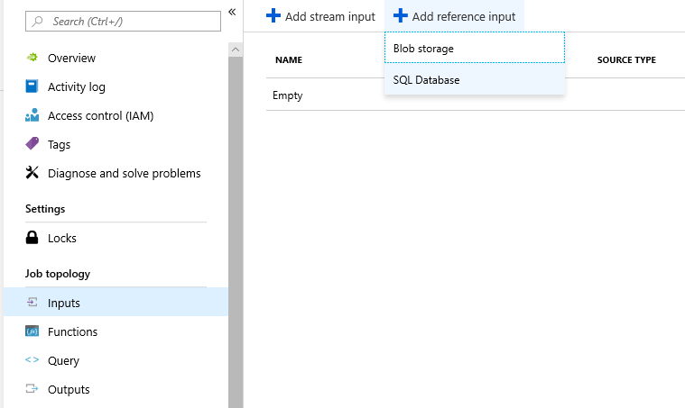
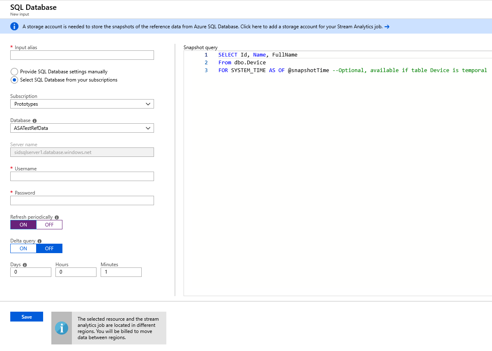
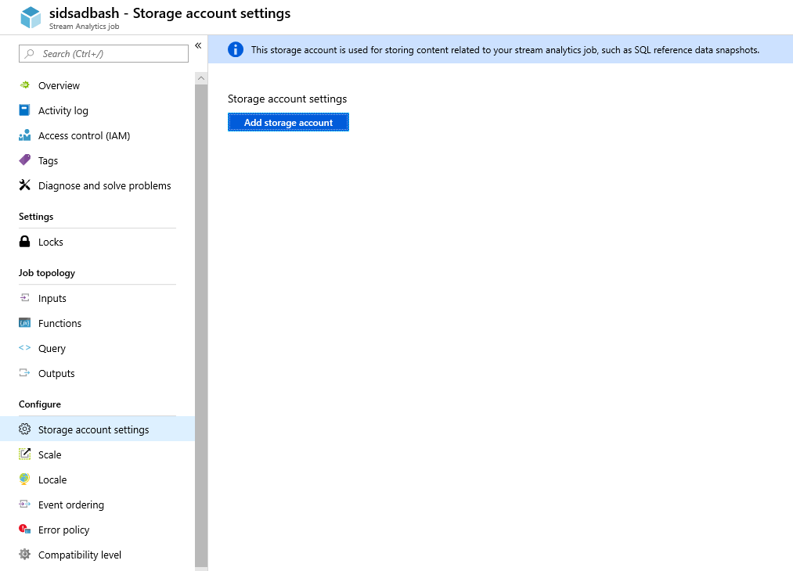
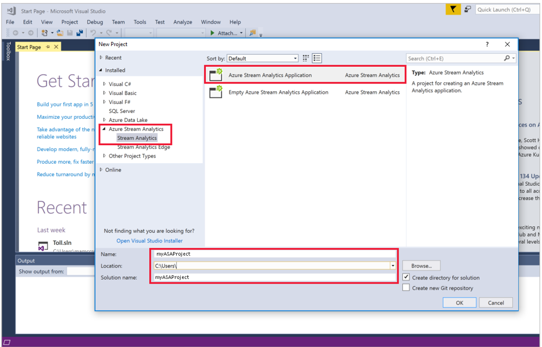
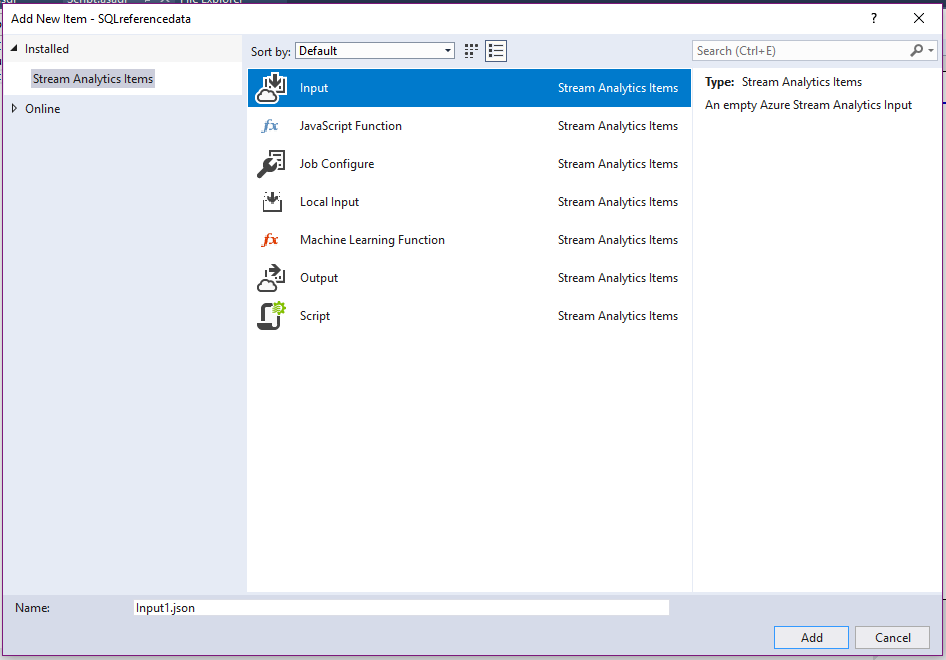
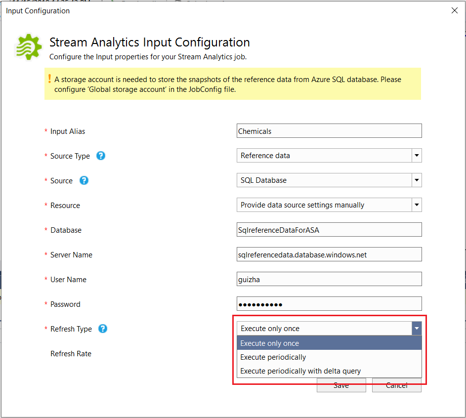
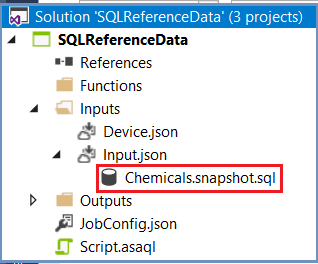
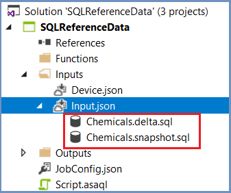
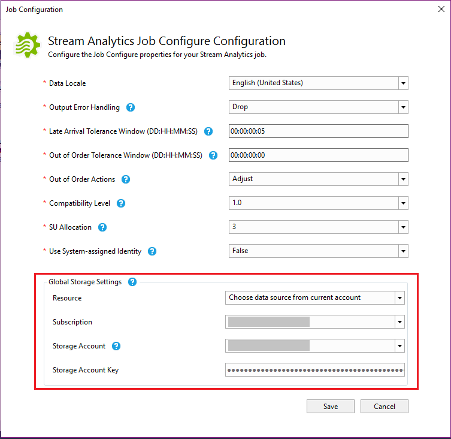

# Use reference data from a SQL Database for an Azure Stream Analytics job

Azure Stream Analytics supports Azure SQL Database as a source of input for reference data. You can use SQL Database as reference data for your Stream Analytics job in the Azure portal and in Visual Studio with Stream Analytics tools. This article demonstrates how to do both methods.

## Azure portal

Use the following steps to add Azure SQL Database as a reference input source using the Azure portal:

### Portal prerequisites

1. Create a Stream Analytics job.

2. Create a storage account to be used by the Stream Analytics job.

3. Create your Azure SQL Database with a data set to be used as reference data by the Stream Analytics job.

### Define SQL Database reference data input

1. In your Stream Analytics job, select **Inputs** under **Job topology**. Click **Add reference input** and choose **SQL Database**.

   

2. Fill out the Stream Analytics Input Configurations. Choose the database name, server name, username and password. If you want your reference data input to refresh periodically, choose “On” to specify the refresh rate in DD:HH:MM. If you have large data sets with a short refresh rate, you can use a [delta query](sql-reference-data.md#delta-query).

   

3. Test the snapshot query in the SQL query editor. For more information, see [Use the Azure portal's SQL query editor to connect and query data](../azure-sql/database/connect-query-portal.md)

### Specify storage account in Job config

Navigate to **Storage account settings** under **Configure** and select **Add storage account**.

   

### Start the job

Once you have configured other inputs, outputs, and query, you can start the Stream Analytics job.

## Tools for Visual Studio

Use the following steps to add Azure SQL Database as a reference input source using Visual Studio:

### Visual Studio prerequisites

1. [Install the Stream Analytics tools for Visual Studio](stream-analytics-tools-for-visual-studio-install.md). The following versions of Visual Studio are supported:

   * Visual Studio 2015
   * Visual Studio 2019

2. Become familiar with the [Stream Analytics tools for Visual Studio](stream-analytics-quick-create-vs.md) quickstart.

3. Create a storage account.

### Create a SQL Database table

Use SQL Server Management Studio to create a table to store your reference data. See [Design your first Azure SQL database using SSMS](../azure-sql/database/design-first-database-tutorial.md) for details.

The example table used in the following example was created from the following statement:

```SQL
create table chemicals(Id Bigint,Name Nvarchar(max),FullName Nvarchar(max));
```

### Choose your subscription

1. In Visual Studio, on the **View** menu, select **Server Explorer**.

2. Right click on **Azure**, select **Connect to Microsoft Azure Subscription**, and sign in with your Azure account.

### Create a Stream Analytics project

1. Select **File > New Project**. 

2. In the templates list on the left, select **Stream Analytics**, and then select **Azure Stream Analytics Application**. 

3. Enter the project **Name**, **Location**, and **Solution name**, and select **OK**.

   

### Define SQL Database reference data input

1. Create a new input.

   

2. Double-click **Input.json** in the **Solution Explorer**.

3. Fill out the **Stream Analytics Input Configuration**. Choose the database name, server name, refresh type and refresh rate. Specify the refresh rate in the format `DD:HH:MM`.

   

   If you choose "Execute only once" or "Execute periodically", one SQL CodeBehind file named **[Input Alias].snapshot.sql** is generated in the project under the **Input.json** file node.

   

   If you choose "Refresh Periodically with Delta", two SQL CodeBehind files will be generated: **[Input Alias].snapshot.sql** and **[Input Alias].delta.sql**.

   

4. Open the SQL file in the editor and write the SQL query.

5. If you are using Visual Studio 2019, and you have installed SQL Server Data tools, you can test the query by clicking **Execute**. A wizard window will pop up to help you connect to the SQL database and the query result will appear in the window at the bottom.

### Specify storage account

Open **JobConfig.json** to specify the storage account for storing SQL reference snapshots.

   

### Test locally and deploy to Azure

Before deploying the job to Azure, you can test the query logic locally against live input data. For more information on this feature, see [Test live data locally using Azure Stream Analytics tools for Visual Studio (Preview)](stream-analytics-live-data-local-testing.md). When you're done testing, click **Submit to Azure**. Reference the [Create a Stream Analytics using the Azure Stream Analytics tools for Visual Studio](stream-analytics-quick-create-vs.md) quickstart to learn how to start the job.

## Delta query

When using the delta query, [temporal tables in Azure SQL Database](../azure-sql/temporal-tables.md) are recommended.

1. Create a temporal table in Azure SQL Database.
   
   ```SQL 
      CREATE TABLE DeviceTemporal 
      (  
         [DeviceId] int NOT NULL PRIMARY KEY CLUSTERED 
         , [GroupDeviceId] nvarchar(100) NOT NULL
         , [Description] nvarchar(100) NOT NULL 
         , [ValidFrom] datetime2 (0) GENERATED ALWAYS AS ROW START
         , [ValidTo] datetime2 (0) GENERATED ALWAYS AS ROW END
         , PERIOD FOR SYSTEM_TIME (ValidFrom, ValidTo)
      )  
      WITH (SYSTEM_VERSIONING = ON (HISTORY_TABLE = dbo.DeviceHistory));  -- DeviceHistory table will be used in Delta query
   ```
2. Author the snapshot query. 

   Use the **\@snapshotTime** parameter to instruct the Stream Analytics runtime to obtain the reference data set from SQL database temporal table valid at the system time. If  you don't provide this parameter, you risk obtaining an inaccurate base reference data set due to clock skews. An example of full snapshot query is shown below:
   ```SQL
      SELECT DeviceId, GroupDeviceId, [Description]
      FROM dbo.DeviceTemporal
      FOR SYSTEM_TIME AS OF @snapshotTime
   ```
 
2. Author the delta query. 
   
   This query retrieves all of the rows in your SQL database that were inserted or deleted within a start time, **\@deltaStartTime**, and an end time **\@deltaEndTime**. The delta query must return the same columns as the snapshot query, as well as the column **_operation_**. This column defines if the row is inserted or deleted between **\@deltaStartTime** and **\@deltaEndTime**. The resulting rows are flagged as **1** if the records were inserted, or **2** if deleted. The query must also add **watermark** from the SQL Server side to ensure all the updates in the delta period are captured appropriately. Using delta query without **watermark** may result in incorrect reference dataset.  

   For records that were updated, the temporal table does bookkeeping by capturing an insertion and deletion operation. The Stream Analytics runtime will then apply the results of the delta query to the previous snapshot to keep the reference data up to date. An example of delta query is show below:

   ```SQL
      SELECT DeviceId, GroupDeviceId, Description, ValidFrom as _watermark_, 1 as _operation_
      FROM dbo.DeviceTemporal
      WHERE ValidFrom BETWEEN @deltaStartTime AND @deltaEndTime   -- records inserted
      UNION
      SELECT DeviceId, GroupDeviceId, Description, ValidTo as _watermark_, 2 as _operation_
      FROM dbo.DeviceHistory   -- table we created in step 1
      WHERE ValidTo BETWEEN @deltaStartTime AND @deltaEndTime     -- record deleted
   ```
 
   Note that Stream Analytics runtime may periodically run the snapshot query in addition to the delta query to store checkpoints.

## Test your query
   It is important to verify that your query is returning the expected dataset that the Stream Analytics job will use as reference data. To test your query, go to Input under Job Topology section on portal. You can then select Sample Data on your SQL Database Reference input. After the sample becomes available, you can download the file and check to see if the data being returned is as expected. If you want a optimize your development and test iterations, it is recommended to use the [Stream Analytics tools for Visual Studio](https://docs.microsoft.com/azure/stream-analytics/stream-analytics-tools-for-visual-studio-install). You can also any other tool of your preference to first ensure the query is returning the right results from you Azure SQL Database and then use that in your Stream Analytics job. 

## FAQs

**Will I incur additional cost by using SQL reference data input in Azure Stream Analytics?**

There are no additional [cost per streaming unit](https://azure.microsoft.com/pricing/details/stream-analytics/) in the Stream Analytics job. However, the Stream Analytics job must have an associated Azure storage account. The Stream Analytics job queries the SQL DB (during job start and refresh interval) to retrieve the reference data set and stores that snapshot in the storage account. Storing these snapshots will incur additional charges detailed in the [pricing page](https://azure.microsoft.com/pricing/details/storage/) for Azure storage account.

**How do I know reference data snapshot is being queried from SQL DB and used in the Azure Stream Analytics job?**

There are two metrics filtered by Logical Name (under Metrics Azure Portal) which you can use to monitor the health of the SQL database reference data input.

   * InputEvents: This metric measures the number of records loaded in from the SQL database reference data set.
   * InputEventBytes: This metric measures the size of the reference data snapshot loaded in memory of the Stream Analytics job. 

The combination of both of these metrics can be used to infer if the job is querying the SQL database to fetch the reference data set and then loading it to memory.

**Will I require a special type of Azure SQL Database?**

Azure Stream Analytics will work with any type of Azure SQL Database. However, it is important to understand that the refresh rate set for your reference data input could impact your query load. To use the delta query option, it is recommended to use temporal tables in Azure SQL Database.

**Why does Azure Stream Analytics store snapshots in Azure Storage account?**

Stream Analytics guarantees exactly once event processing and at least once delivery of events. In cases where transient issues impact your job, a small amount of replay is necessary to restore state. To enable replay, it is required to have these snapshots stored in an Azure Storage account. For more information on checkpoint replay, see [Checkpoint and replay concepts in Azure Stream Analytics jobs](stream-analytics-concepts-checkpoint-replay.md).

## Next steps

* [Using reference data for lookups in Stream Analytics](stream-analytics-use-reference-data.md)
* [Quickstart: Create a Stream Analytics job by using the Azure Stream Analytics tools for Visual Studio](stream-analytics-quick-create-vs.md)
* [Test live data locally using Azure Stream Analytics tools for Visual Studio (Preview)](stream-analytics-live-data-local-testing.md)
