# Use reference data from a SQL Database for an Azure Stream Analytics job

Reference data is a static or slowly changing dataset that you join with your streaming data to enrich it, such as adding product details to a stream of sales events. Azure Stream Analytics supports Azure SQL Database as a source of reference data, so you can look up and combine this data with your real-time input.

This article shows you how to configure an Azure SQL Database as a reference data input for a Stream Analytics job, by using both the Azure portal and Visual Studio with Stream Analytics tools.

## Add SQL Database reference data by using the Azure portal

Use the following steps to add Azure SQL Database as a reference input source by using the Azure portal:

### Portal prerequisites

1. Create a Stream Analytics job.

1. Create a storage account for the Stream Analytics job to use.
   > [!IMPORTANT]
   > Azure Stream Analytics retains snapshots within this storage account. When you configure the retention policy, ensure that the chosen timespan includes the recovery duration that you want for your Stream Analytics job.

1. Create your Azure SQL Database with a dataset that the Stream Analytics job uses as reference data.

### Define SQL Database reference data input

1. In your Stream Analytics job, select **Inputs** under **Job topology**. Select **Add reference input**, and then select **SQL Database**.

   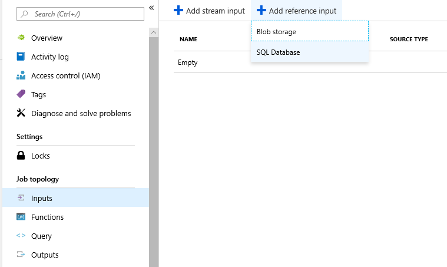

1. Fill out the Stream Analytics input configuration. Choose the database name, server name, and the sign-in credentials for the database. To refresh your reference data input periodically, select **On** and specify the refresh rate in DD:HH:MM. For large datasets with a short refresh rate, delta query tracks changes within your reference data by retrieving all the rows in SQL Database that were inserted or deleted between a start time, `@deltaStartTime`, and an end time, `@deltaEndTime`.

   For more information, see [delta query](#delta-query).

   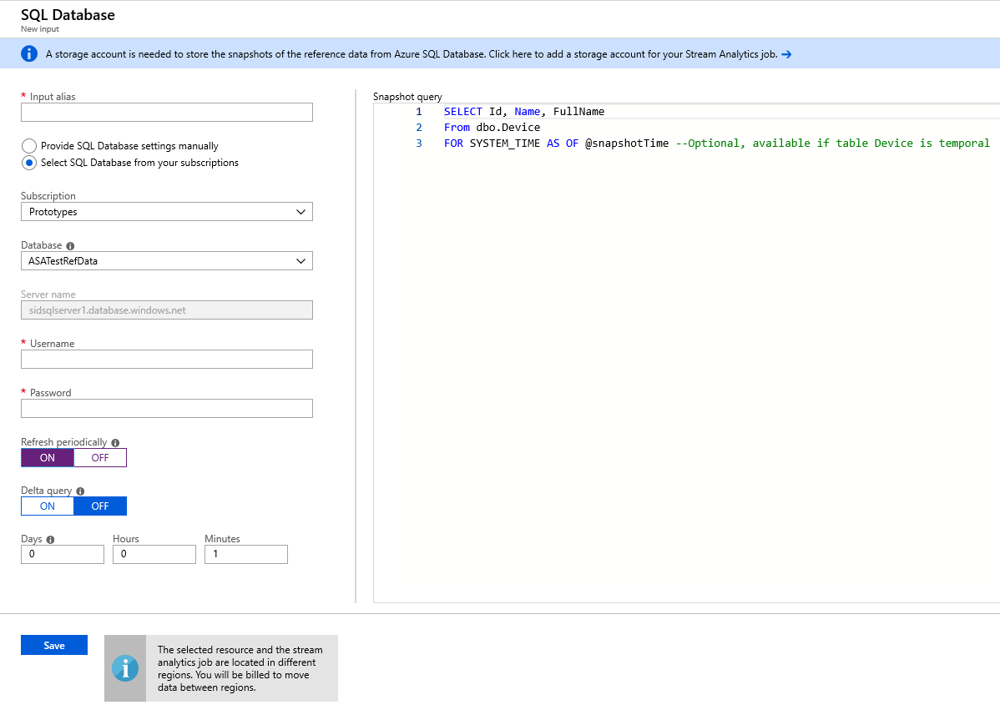

1. Test the snapshot query in the SQL query editor. For more information, see [Use the Azure portal's SQL query editor to connect and query data](/azure/azure-sql/database/connect-query-portal).

### Specify the storage account in the job config

Go to **Storage account settings** under **Configure**, and then select **Add storage account**.

   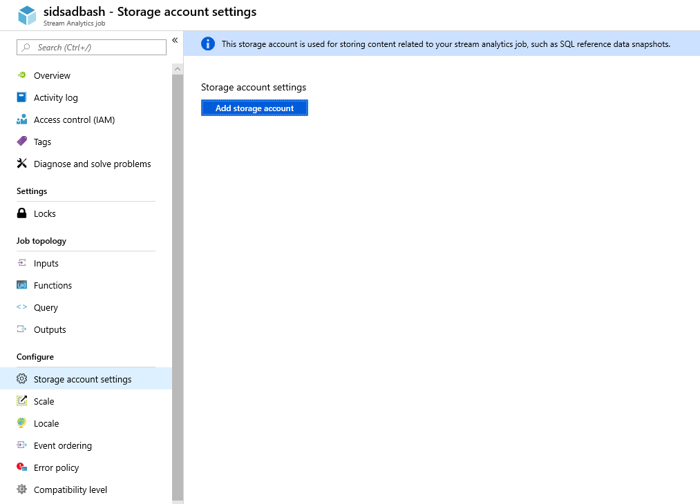

### Start the job

1. After you configure the other inputs, outputs, and query, start the Stream Analytics job.

## Add SQL Database reference data by using Visual Studio

Use the following steps to add Azure SQL Database as a reference input source by using Visual Studio:

### Visual Studio prerequisites

1. [Install the Stream Analytics tools for Visual Studio](stream-analytics-tools-for-visual-studio-install.md). The Stream Analytics tools support the following versions of Visual Studio:

   * Visual Studio 2015
   * Visual Studio 2019

1. Become familiar with the [Stream Analytics tools for Visual Studio](stream-analytics-quick-create-vs.md) quickstart.

1. Create a storage account.
   > [!IMPORTANT]
   > Azure Stream Analytics retains snapshots within this storage account. When you configure the retention policy, ensure that the chosen timespan includes the recovery duration that you want for your Stream Analytics job.

### Create a SQL Database table

Use SQL Server Management Studio to create a table to store your reference data. See [Design your first Azure SQL Database using SSMS](/azure/azure-sql/database/design-first-database-tutorial) for details.

The following statement creates the example table:

```sql
create table chemicals(Id Bigint,Name Nvarchar(max),FullName Nvarchar(max));
```

### Choose your subscription

1. In Visual Studio, on the **View** menu, select **Server Explorer**.

1. Select and hold (or right-click) **Azure**, select **Connect to Microsoft Azure Subscription**, and sign in with your Azure account.

### Create a Stream Analytics project

1. Select **File** > **New Project**.

1. In the templates list, select **Stream Analytics**, and then select **Azure Stream Analytics Application**.

1. Enter the project **Name**, **Location**, and **Solution name**, and then select **OK**.

   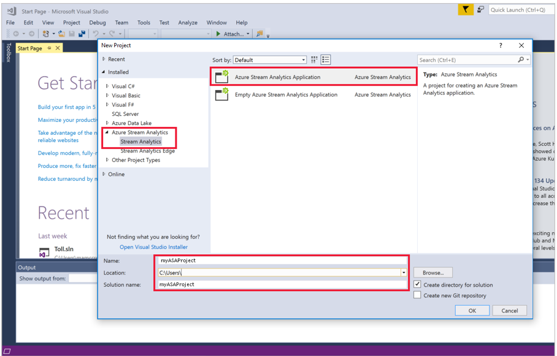

### Define SQL Database reference data input

1. Create a new input.

   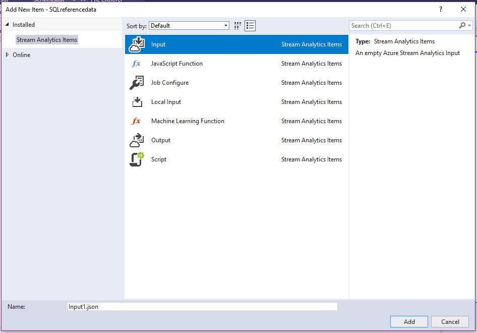

1. Open **Input.json** in **Solution Explorer**.

1. Fill out the **Stream Analytics Input Configuration**. Enter the database name, server name, refresh type, and refresh rate. Specify the refresh rate in the format `DD:HH:MM`.

   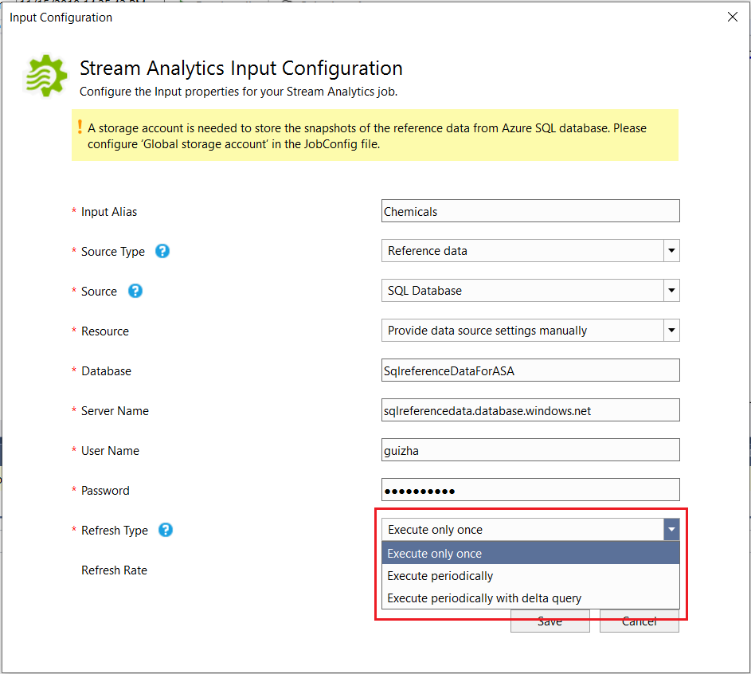

   If you choose **Execute only once** or **Execute periodically**, Visual Studio generates one SQL CodeBehind file named **[Input Alias].snapshot.sql** in the project under the **Input.json** file node.

   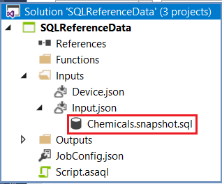

   If you choose **Refresh Periodically with Delta**, Visual Studio generates two SQL CodeBehind files: **[Input Alias].snapshot.sql** and **[Input Alias].delta.sql**.

   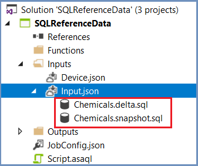

1. Open the SQL file in the editor and write the SQL query.

1. If you're using Visual Studio 2019 and you installed SQL Server Data Tools, you can test the query by selecting **Execute**. A wizard opens to help you connect to SQL Database, and the query result appears in the window at the bottom.

### Specify storage account

Open **JobConfig.json** to specify the storage account to store SQL reference snapshots.

   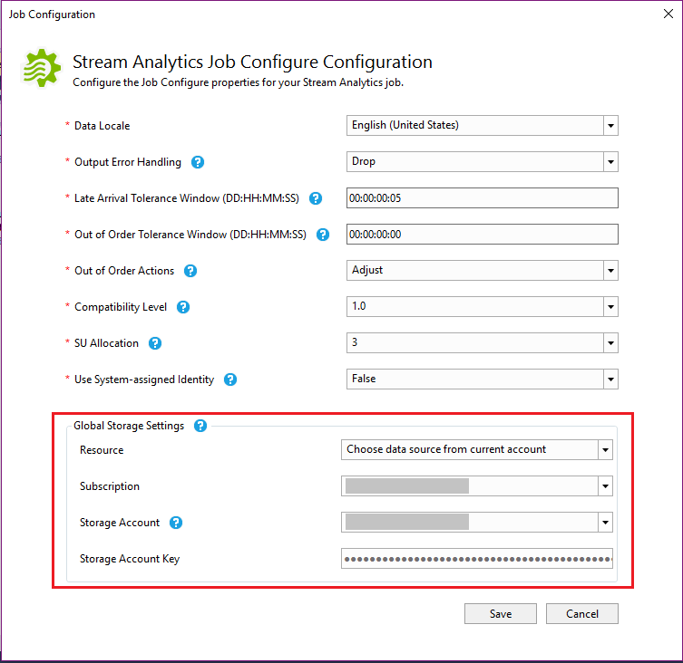

### Test locally and deploy to Azure

Before you deploy the job to Azure, you can test the query logic locally against live input data. For more information about this feature, see [Test live data locally using Azure Stream Analytics tools for Visual Studio (Preview)](stream-analytics-live-data-local-testing.md). When you're done testing, select **Submit to Azure**. To learn how to start the job, see the [Create a Stream Analytics job by using the Azure Stream Analytics tools for Visual Studio](stream-analytics-quick-create-vs.md) quickstart.

## Delta query

When you use the delta query, use [temporal tables in Azure SQL Database](/azure/azure-sql/temporal-tables).

1. Create a temporal table in Azure SQL Database.

   ```sql
      CREATE TABLE DeviceTemporal
      (
         [DeviceId] int NOT NULL PRIMARY KEY CLUSTERED
         , [GroupDeviceId] nvarchar(100) NOT NULL
         , [Description] nvarchar(100) NOT NULL
         , [ValidFrom] datetime2 (0) GENERATED ALWAYS AS ROW START
         , [ValidTo] datetime2 (0) GENERATED ALWAYS AS ROW END
         , PERIOD FOR SYSTEM_TIME (ValidFrom, ValidTo)
      )
      WITH (SYSTEM_VERSIONING = ON (HISTORY_TABLE = dbo.DeviceHistory));  -- DeviceHistory table will be used in Delta query
   ```

1. Author the snapshot query.

   Use the **@snapshotTime** parameter to instruct the Stream Analytics runtime to obtain the reference dataset from the SQL Database temporal table valid at the system time. If you don't provide this parameter, you risk obtaining an inaccurate base reference dataset due to clock skews. The following example shows a full snapshot query:

   ```sql
      SELECT DeviceId, GroupDeviceId, [Description]
      FROM dbo.DeviceTemporal
      FOR SYSTEM_TIME AS OF @snapshotTime
   ```

1. Author the delta query.

   This query retrieves all the rows in SQL Database that were inserted or deleted within a start time, **@deltaStartTime**, and an end time, **@deltaEndTime**. The delta query must return the same columns as the snapshot query, as well as the column **_operation_**. This column defines whether the row is inserted or deleted between **@deltaStartTime** and **@deltaEndTime**. The resulting rows are flagged as **1** if the records were inserted, or **2** if deleted. The query must also add **watermark** from the SQL Server side to ensure all the updates in the delta period are captured appropriately. Using a delta query without **watermark** might result in an incorrect reference dataset.

   For records that were updated, the temporal table does bookkeeping by capturing an insertion and deletion operation. The Stream Analytics runtime then applies the results of the delta query to the previous snapshot to keep the reference data up to date. The following example shows a delta query:

   ```sql
      SELECT DeviceId, GroupDeviceId, Description, ValidFrom as _watermark_, 1 as _operation_
      FROM dbo.DeviceTemporal
      WHERE ValidFrom BETWEEN @deltaStartTime AND @deltaEndTime   -- records inserted
      UNION
      SELECT DeviceId, GroupDeviceId, Description, ValidTo as _watermark_, 2 as _operation_
      FROM dbo.DeviceHistory   -- table we created in step 1
      WHERE ValidTo BETWEEN @deltaStartTime AND @deltaEndTime     -- record deleted
   ```

   The Stream Analytics runtime might periodically run the snapshot query in addition to the delta query to store checkpoints.

   > [!IMPORTANT]
   > When you use reference data delta queries, don't make identical updates to the temporal reference data table multiple times. This might produce incorrect results.
   > Here's an example that might cause reference data to produce incorrect results:
   > ```sql
   >  UPDATE myTable SET VALUE=2 WHERE ID = 1;
   >  UPDATE myTable SET VALUE=2 WHERE ID = 1;
   > ```
   > Correct example:
   > ```sql
   >  UPDATE myTable SET VALUE = 2 WHERE ID = 1 and not exists (select * from myTable where ID = 1 and value = 2);
   > ```
   > This condition ensures no duplicate updates occur.

## Test your query

Verify that your query returns the expected dataset that the Stream Analytics job uses as reference data. To test your query, go to **Inputs** under the **Job topology** section in the portal. Then select **Sample data** on your SQL Database reference input. After the sample becomes available, you can download the file and check whether the returned data is as expected. To optimize your development and test iterations, use the [Stream Analytics tools for Visual Studio](./stream-analytics-tools-for-visual-studio-install.md). You can also use any other tool you prefer to first ensure the query returns the right results from your Azure SQL Database, and then use that query in your Stream Analytics job.

### Test your query with Visual Studio Code

   Install [Azure Stream Analytics Tools](https://marketplace.visualstudio.com/items?itemName=ms-bigdatatools.vscode-asa) and [SQL Server (mssql)](https://marketplace.visualstudio.com/items?itemName=ms-mssql.mssql) on Visual Studio Code and set up your ASA project. For more information, see [Quickstart: Create an Azure Stream Analytics job in Visual Studio Code](./quick-create-visual-studio-code.md) and the [SQL Server (mssql) extension tutorial](/sql/tools/visual-studio-code/sql-server-develop-use-vscode).

1. Configure your SQL reference data input.

   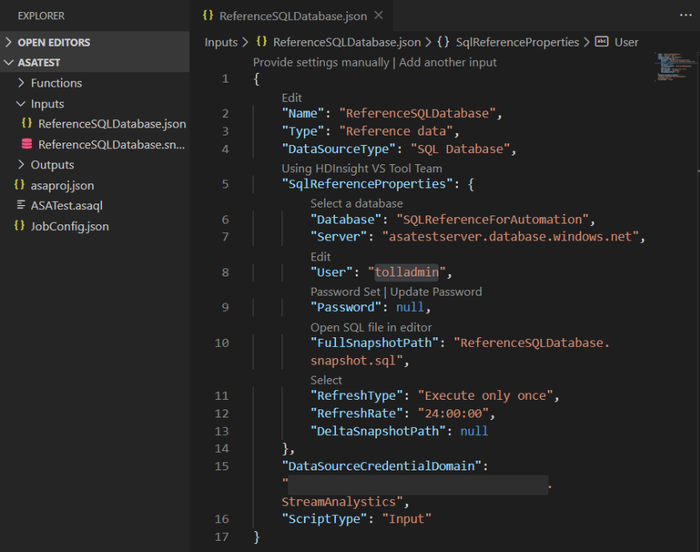

1. Select the SQL Server icon and select **Add Connection**.

   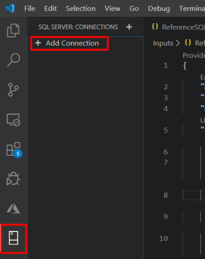

1. Fill in the connection information.

   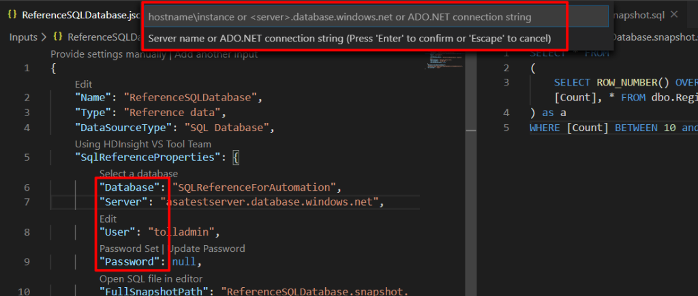

1. Select and hold (or right-click) in reference SQL and select **Execute Query**.

   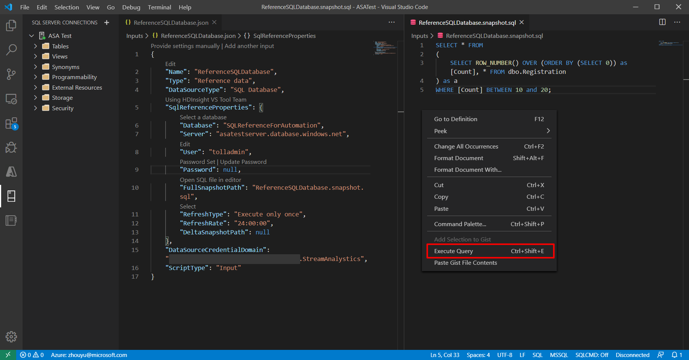

1. Choose your connection.

   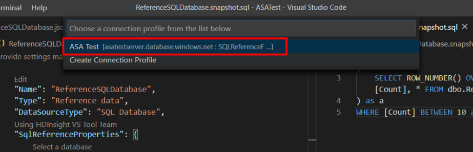

1. Review and verify your query result.

   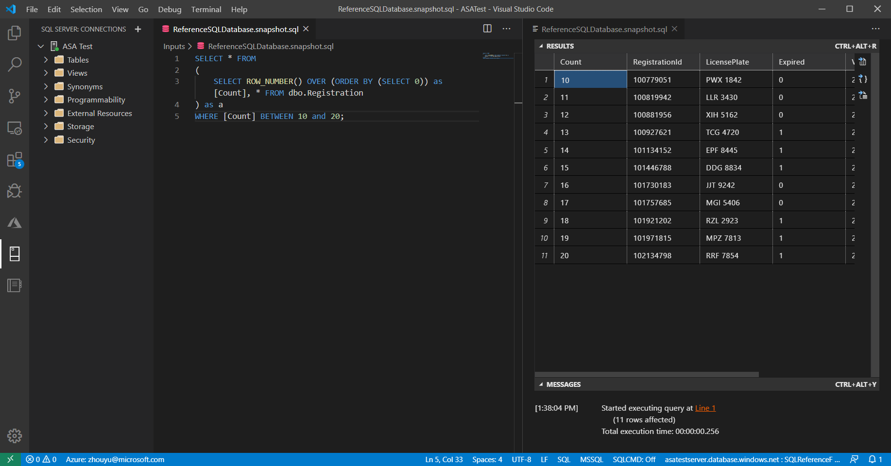


## FAQs

### Do I incur extra costs by using SQL reference data input in Azure Stream Analytics?

There's no extra [cost per streaming unit](https://azure.microsoft.com/pricing/details/stream-analytics/) in the Stream Analytics job. However, the Stream Analytics job must have an associated Azure storage account. The Stream Analytics job queries the SQL Database (during job start and refresh interval) to retrieve the reference dataset and stores that snapshot in the storage account. Storing these snapshots incurs extra charges detailed on the [pricing page](https://azure.microsoft.com/pricing/details/storage/) for the Azure storage account.

### How do I know if a reference data snapshot is being queried from SQL Database and used in the Azure Stream Analytics job?

Two metrics, filtered by Logical Name (under **Metrics** in the Azure portal), let you monitor the health of the SQL Database reference data input.

* InputEvents: This metric measures the number of records loaded from the SQL Database reference dataset.
* InputEventBytes: This metric measures the size of the reference data snapshot loaded in memory of the Stream Analytics job.

Together, both metrics indicate whether the job queries SQL Database to fetch the reference dataset and then loads it to memory.

### Do I need a special type of Azure SQL Database?

Azure Stream Analytics works with any type of Azure SQL Database. However, the refresh rate you set for your reference data input might affect your query load. To use the delta query option, use temporal tables in Azure SQL Database.

### Why does Azure Stream Analytics store snapshots in an Azure Storage account?

Stream Analytics guarantees exactly-once event processing and at-least-once delivery of events. If transient issues affect your job, a small amount of replay is necessary to restore state. To enable replay, these snapshots must be stored in an Azure Storage account. For more information about checkpoint replay, see [Checkpoint and replay concepts in Azure Stream Analytics jobs](stream-analytics-concepts-checkpoint-replay.md).

## Related content

* [Understand outputs from Azure Stream Analytics](stream-analytics-define-outputs.md)
* [Azure Stream Analytics output to Azure SQL Database](sql-database-output.md)
* [Increase throughput performance to Azure SQL Database from Azure Stream Analytics](stream-analytics-sql-output-perf.md)
* [Use managed identities to access Azure SQL Database or Azure Synapse Analytics from an Azure Stream Analytics job](./sql-database-output-managed-identity.md)
* [Update or merge records in Azure SQL Database with Azure Functions](sql-database-upsert.md)
* [Quickstart: Create a Stream Analytics job by using the Azure portal](stream-analytics-quick-create-portal.md)
