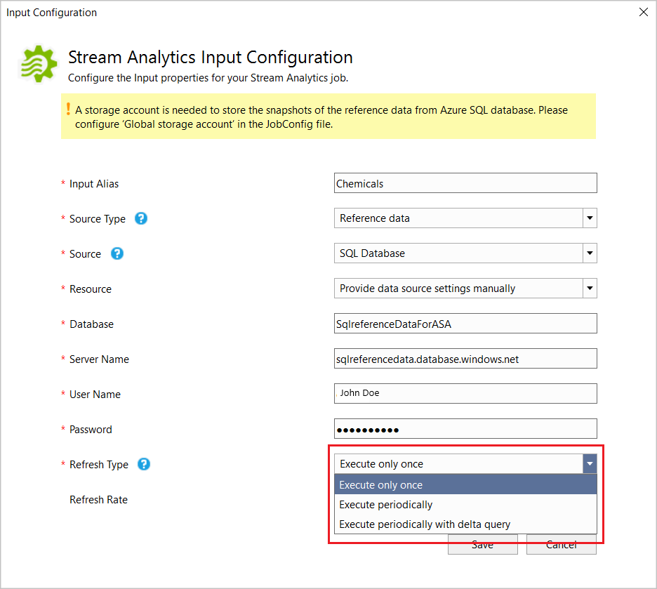

# Use reference data from a SQL Database for an Azure Stream Analytics job (Preview)

Azure Stream Analytics supports Azure SQL Database as a source of input for reference data. You can use SQL Database as reference data for your Stream Analytics job in the Azure portal and in Visual Studio with Stream Analytics tools. This article demonstrates how to implement both methods.

> [!NOTE]
> This preview feature is available only in West Central US. Please make sure your Stream Analytics jobs are deployed to this region.

## Azure portal

Use the following steps to add Azure SQL Database as a reference input source using the Azure portal:

### Portal prerequisites

1. Create a Stream Analytics job located in **West Central US**.

2. Create a storage account to be used by the Stream Analytics job.

3. Create your Azure SQL Database with a data set to be used as reference data by the Stream Analytics job.

### Define SQL Database reference data input

1. In your Stream Analytics job, select **Inputs** under **Job topology**. Click **Add reference input** and choose **SQL Database**. You *MUST* access the portal using [this link](https://portal.azure.com/?Microsoft_Azure_StreamAnalytics_sqlreference=true) to see the SQL reference data preview option in the portal.

   

2. Fill out the Stream Analytics Input Configurations. Choose the database name, server name, username and password. You also need to configure if you want this reference data input to refresh periodically. Choosing “On” will allow you to specify refresh rate in DD:HH:MM. If you have large datasets with a short refresh rate, then we recommend you author a delta query (only for advanced scenarios.

   

### Specify storage account in Job config

Navigate to the “Storage account settings” blade and configure storage account by clicking on “Add storage account”.

   

### Start the job


## Tools for Visual Studio

### Visual Studio prerequisites

- If you are using Visual Studio 2017, update to 15.8.2 or above. Note that 16.0 and above are not supported at this point.
- Install the Stream Analytics tools for Visual Studio which have support for this feature (in preview) using the following links:
   * [VS 2015](https://1drv.ms/u/s!Anul7jITCHl0i_1WCyB0xa7zMgIxZw)
   * [VS 2017](https://1drv.ms/u/s!Anul7jITCHl0i_1VF7nlx6w7ipKiKA)
- Familiarize yourself with the {Stream Analytics tools for Visual Studio Quickstart](stream-analytics-quick-create-vs.md).
- Create a storage account.

### Create a SQL Database table

Use SSMS to create table to store your reference data. See SQL create tables guide for details.

The example table used in the following example is created from the statement below:

```SQL
create table chemicals(Id Bigint,Name Nvarchar(max),FullName Nvarchar(max));
```

### Choose your subscription

1.	In Visual Studio, on the **View** menu, select **Server Explorer**.

2.	Right click on **Azure**, select **Connect to Microsoft Azure Subscription**, and then sign in with your Azure account.

### Create a Stream Analytics project

1.	Select **File > New Project**. 

2.	In the templates list on the left, select **Stream Analytics**, and then select **Azure Stream Analytics Application**. 

3.	Input the project **Name**, **Location**, and **Solution name**, and select **OK**.

   

### Define SQL Database reference data input

1. Create a new input.

   

2.	Double-click **Input.json** in the **Solution Explorer**.

3.	Fill out the **Stream Analytics Input Configuration**. Choose the database name, server name, refresh type and refresh rate. The refresh rate can be specified in the format `DD:HH:MM`.

   

   If you choose "Execute only once" or "Execute periodically", after saving the input configuration, one SQL CodeBehind file named **<Input Alias>.snapshot.sql** is generated in the project under the **Input.json** file node.

   

   If you choose "Refresh Periodically with Delta", after saving the input configuration, two SQL CodeBehind files will be generated: **<Input Alias>.snapshot.sql** and **<Input Alias>.delta.sql**.

   

4. Open the sql file in the editor and write the sql query. 

5. If you are using Visual Studio 2017 and you have installed SQL Server Data tools, you can test the query by clicking Execute. A wizard window will pop up to help you connect to the SQL database and show the query result in the window at the bottom.

### Specify storage account

Open **JobConfig.json** to specify the storage account for storing SQL reference snapshots.

   


## Next steps

* [Using reference data for lookups in Stream Analytics](stream-analytics-use-reference-data.md)
* [Quickstart: Create a Stream Analytics job by using the Azure Stream Analytics tools for Visual Studio](stream-analytics-quick-create-vs.md)
* [Test live data locally using Azure Stream Analytics tools for Visual Studio (Preview)](stream-analytics-live-data-local-testing.md)
