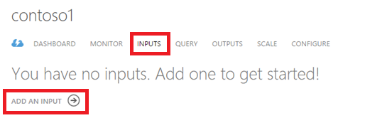
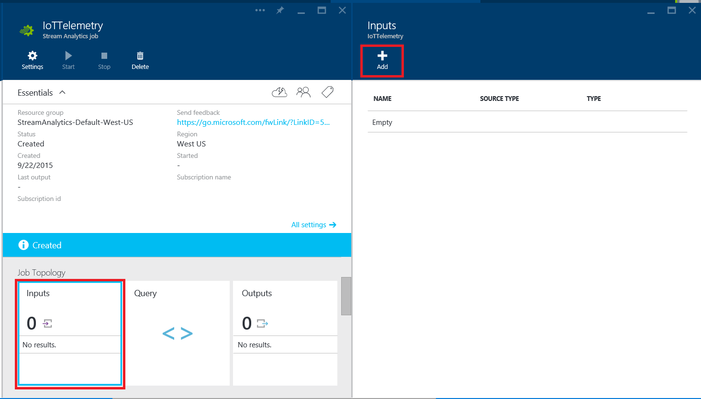
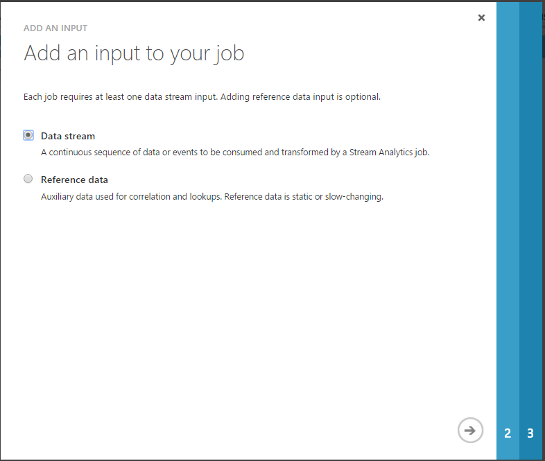
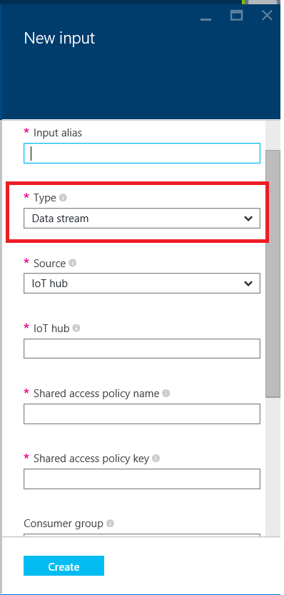
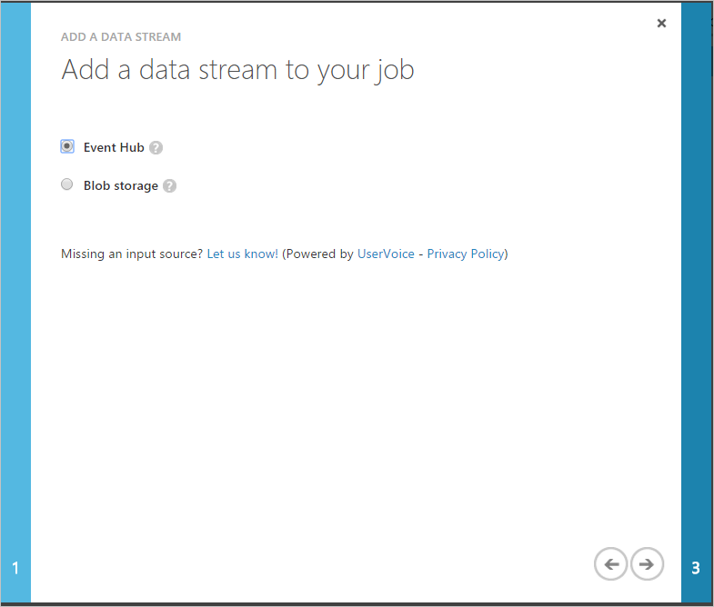
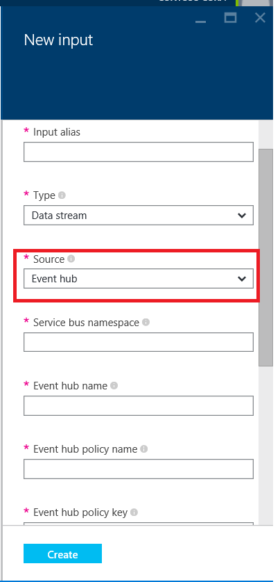
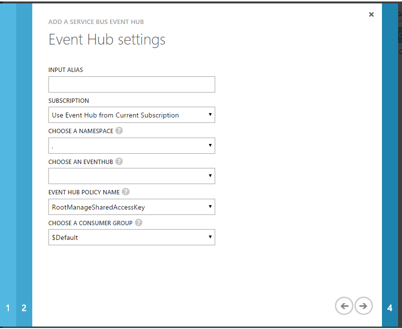
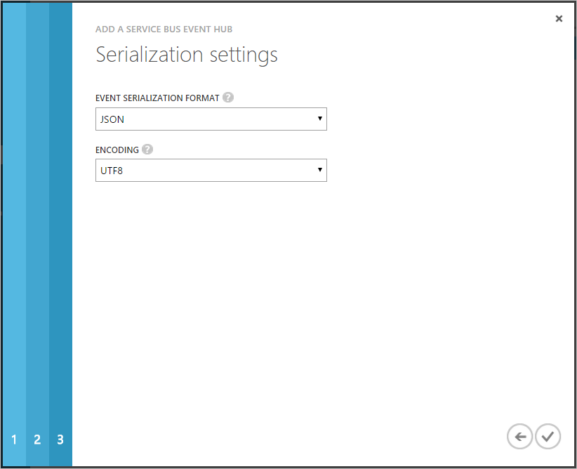
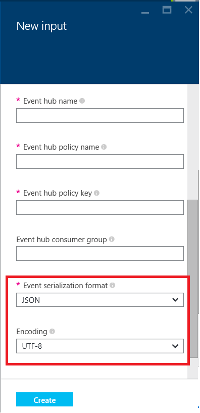
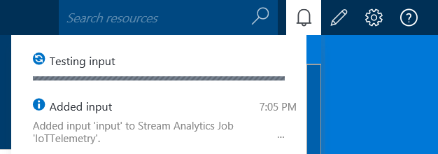

<properties 
	pageTitle="Add Inputs | Microsoft Azure" 
	description="Add Inputs to Stream Analytics jobs | learning path segment."
	documentationCenter=""
	services="stream-analytics"
	authors="jeffstokes72" 
	manager="paulettm" 
	editor="cgronlun"/>

<tags 
	ms.service="stream-analytics" 
	ms.devlang="na" 
	ms.topic="article" 
	ms.tgt_pltfrm="na" 
	ms.workload="data-services" 
	ms.date="09/29/2015" 
	ms.author="jeffstok"/> 

# Add Inputs

Azure Stream Analytics jobs can be connected to one or more inputs, which define a connection to an existing data source.  As data is sent to that data source, it is consumed by the Stream Analytics job and processed in real time. Stream Analytics has first class integration with [Azure Event Hubs](http://azure.microsoft.com/services/event-hubs/) and [Azure Blob storage](./storage/storage-dotnet-how-to-use-blobs.md) both within and outside of the job's subscription. There are two types of inputs in Stream Analytics: data streams and reference data.

- **Data Streams**:
    Stream Analytics jobs must include at least one data stream input to be consumed and transformed by the job. Azure Blob storage and Azure Event Hubs are supported as data stream input sources. Azure Event Hubs are used to collect event streams from connected devices, services and applications. Azure Blob storage can be used as an input source for ingesting bulk data as a stream.  
- **Reference data**:
    Stream Analytics supports a second type of auxiliary input called reference data.  As opposed to data in motion, this data is static or slowing changing.  It is typically used for performing look-ups and correlations with data streams to create a richer data set.  Azure Blob storage is currently the only supported input source for reference data.  

To add an input to your Stream Analytics job:

1. In the Azure portal click **Inputs** and then click **Add an Input** in your Stream Analytics job.

      

    In the Azure preview portal click the **Inputs** tile in your Stream Analytics job.  

      

2. Specify the type of the input: either **Data stream** or **Reference data**.

      

      

3. If creating a Data Stream input, specify the source type for the input.  This step can be skipped during Reference Data creation as only Blob storage is supported at this time.

      

      

4. Provide a friendly name for this input in the Input Alias box.  This name will be used in your job's query later on to refer to the input.

    Fill in the rest of the required connection properties to connect to your data source. These fields vary by type of input and source type and are defined in detail [here](stream-analytics-create-a-job.md.)  

      

5. Specify the serialization settings for the input data:
	- To make sure your queries work the way you expect, specify the **Event Serialization Format** of incoming data.  Supported serialization formats are JSON, CSV, and Avro.
	- Verify the **Encoding** for the data.  UTF-8 is the only supported encoding format at this time.

      

      

6. After completing the input creation, Stream Analytics will verify that it can connect to the input source.  You can view the status of the Test Connection operation in the Notification hub.

      

      

## Get help
For further assistance, try our [Azure Stream Analytics forum](https://social.msdn.microsoft.com/Forums/en-US/home?forum=AzureStreamAnalytics)

## Next steps

- [Introduction to Azure Stream Analytics](stream-analytics-introduction.md)
- [Get started using Azure Stream Analytics](stream-analytics-get-started.md)
- [Scale Azure Stream Analytics jobs](stream-analytics-scale-jobs.md)
- [Azure Stream Analytics Query Language Reference](https://msdn.microsoft.com/library/azure/dn834998.aspx)
- [Azure Stream Analytics Management REST API Reference](https://msdn.microsoft.com/library/azure/dn835031.aspx)