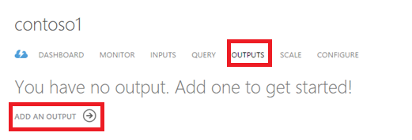
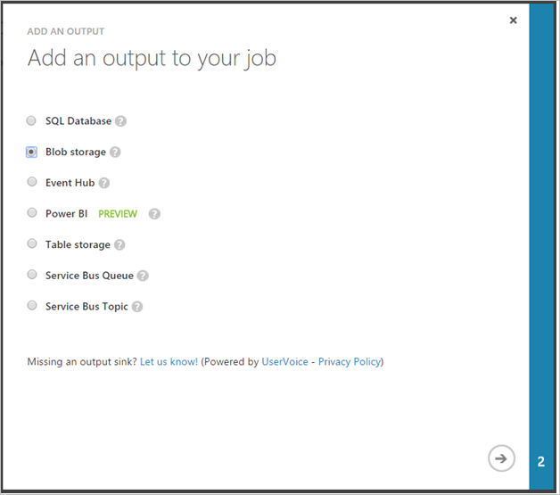
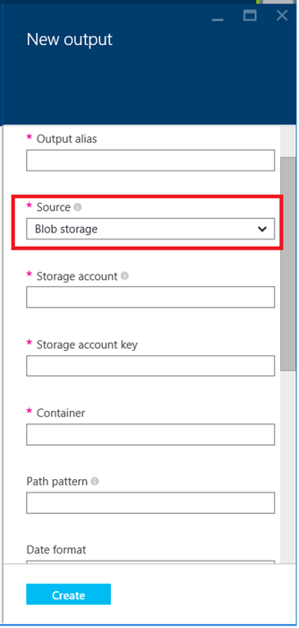
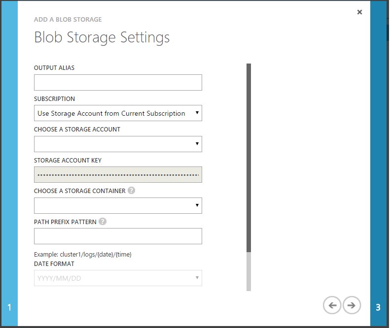
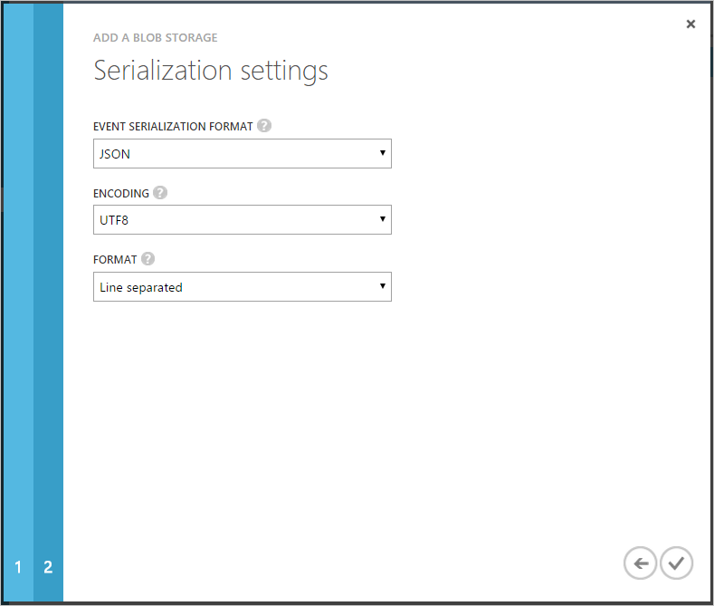
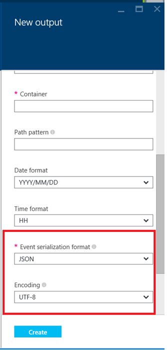

<properties 
	pageTitle="How to configure data outputs for Stream Analytics jobs | Microsoft Azure" 
	description="Configure Outputs for Stream Analytics jobs | learning path segment."
	keywords="data output, data movement"
	documentationCenter=""
	services="stream-analytics"
	authors="jeffstokes72" 
	manager="paulettm" 
	editor="cgronlun"/>

<tags 
	ms.service="stream-analytics" 
	ms.devlang="na" 
	ms.topic="article" 
	ms.tgt_pltfrm="na" 
	ms.workload="data-services" 
	ms.date="07/27/2016" 
	ms.author="jeffstok"/> 

# How to configure data outputs for Stream Analytics jobs

Azure Stream Analytics jobs can be connected to one or more data outputs, which define a connection to an existing data sink. As your Stream Analytics job processes and transforms incoming data, a stream of data output events are written to your job's output.

Stream Analytics data outputs can be used to source real time dashboards or alerts, trigger data movement workflows, or simply archive data for batch processing later on. Stream Analytics has first class integration with several Azure services, which are documented in detail here.

To add an output to your Stream Analytics job:

1. In the Azure Classic Portal, click **Outputs** and then click **Add Output** in your Stream Analytics job.

      

    In the Azure Portal click the **Outputs** tile in your Stream Analytics job.

    

2. Specify the type of the output:

      

    

3. Provide a friendly name for this output in the **Output Alias** box. This name can be used in your job's query later on to refer to the output.  
    
    Fill in the rest of the required connection properties to connect to your output.  These fields vary by output type and are defined in detail here.  

      

4. Depending on the output type, you may need to specify how the data is serialized or formatted. The specific serialization settings for each output type are documented here.

    Fill in the rest of the required connection properties to connect to your data source. These fields vary by type of input and source type and are defined in detail [here](stream-analytics-create-a-job.md).  

      

      

> [Azure.Note] Any output element added to the job, must exist before the job is started and events start flowing. For example, if you use Blob storage as an output, the job will not create a storage account automatically. It needs to be created by the user before the ASA job is started.

## Get help
For further assistance, try our [Azure Stream Analytics forum](https://social.msdn.microsoft.com/Forums/en-US/home?forum=AzureStreamAnalytics)

## Next steps

- [Introduction to Azure Stream Analytics](stream-analytics-introduction.md)
- [Get started using Azure Stream Analytics](stream-analytics-get-started.md)
- [Scale Azure Stream Analytics jobs](stream-analytics-scale-jobs.md)
- [Azure Stream Analytics Query Language Reference](https://msdn.microsoft.com/library/azure/dn834998.aspx)
- [Azure Stream Analytics Management REST API Reference](https://msdn.microsoft.com/library/azure/dn835031.aspx)