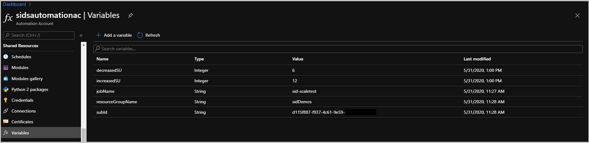
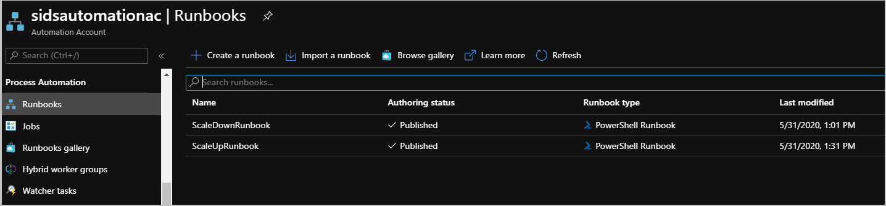
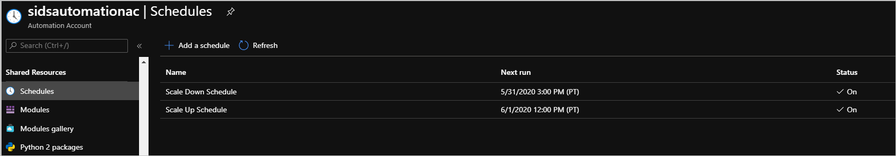
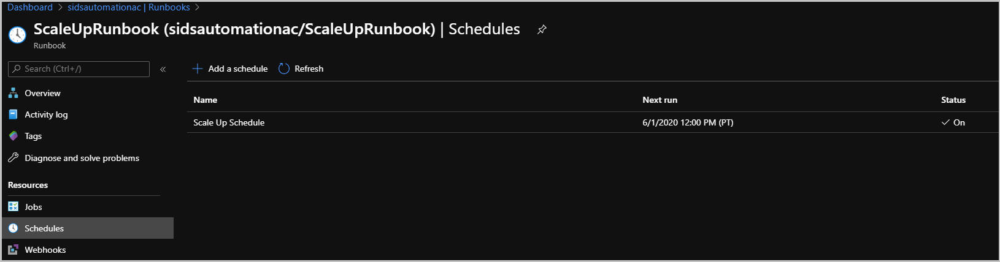
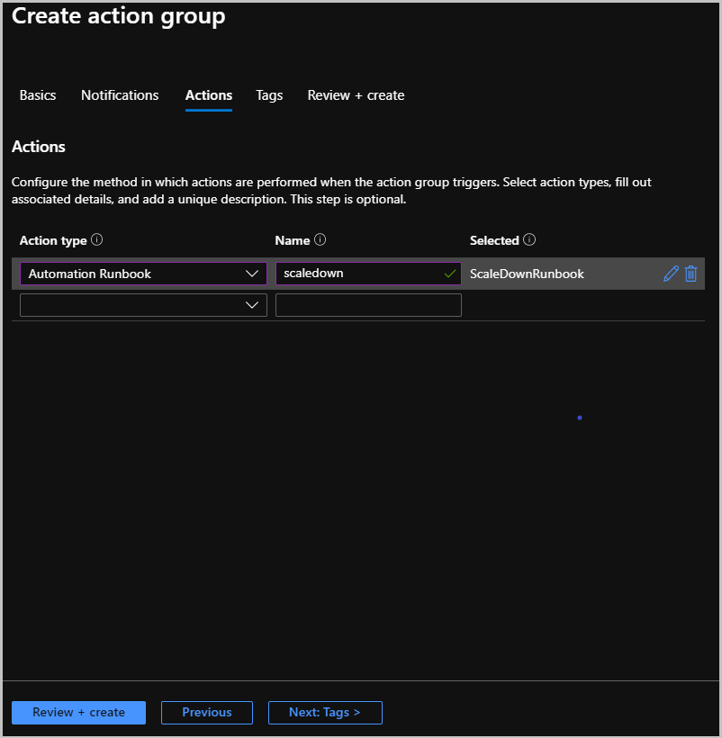

# Autoscale Stream Analytics jobs using Azure Automation

You can optimize the cost of your Stream Analytics jobs by configuring autoscale. Autoscaling increases or decreases the number of Streaming Units (SUs) to match the change in your input load by setting up autoscaling. You don't have to over-provision your job and instead scale up or down as needed. You can configure your jobs to autoscale in two ways.
1. **Pre-defining a schedule** when you have a predictable input load. For example, you expect a higher rate of input events during the daytime and want your job to run with more SUs.
2. **Triggering scale up/down operations based on job metrics** when you don't have a predictable input load. You can dynamically change the number of SUs based on your job metrics such as number of input events or backlogged input events.

## Prerequisites
Before you start configure autoscaling for your job, you should complete the following steps.
1. Your job is optimized to have a [parallel topology](https://docs.microsoft.com/azure/stream-analytics/stream-analytics-parallelization). If you can change the scale of your job while it is running, then your job has a parallel topology and can be configured to autoscale.
2. [Create an Azure Automation account](https://docs.microsoft.com/azure/automation/automation-create-standalone-account) with the option "RunAsAccount" enabled. This account must have permissions to manage your Stream Analytics jobs.

## Setup Azure Automation
### Configure variables
Add the following variables inside the Azure Automation account. These variables will be used in the runbooks that are described in the next steps.
| Name | Type | Value |
| --- | --- | --- |
| **jobName** | String | Name of your Stream Analytics job that you want to autoscale. |
| **resourceGroupName** | String | Name of the resource group in which your job is present. |
| **subId** | String | Subscription ID in which your job is present. |
| **increasedSU** | Integer | The higher SU value you want your job to scale to. This value must be one of the valid SU options you see in the **Scale** settings of your job while it is running. |
| **decreasedSU** | Integer | The lower SU value you want your job to scale to. This value must be one of the valid SU options you see in the **Scale** settings of your job while it is running. |

### Create runbooks
The next step is to create two PowerShell runbooks. One for scale up and the other for scale down operations.
1. In your Azure Automation account, go to **Runbooks** under **Process Automation**  and select **Create Runbook**.
2. Name the first runbook as *ScaleUpRunbook* with type as PowerShell. Reuse the [ScaleUpRunbook PowerShell script](https://github.com/Azure/azure-stream-analytics/blob/master/Autoscale/ScaleUpRunbook.ps1) available in GitHub. Save and publish it.
3. Create another runbook called *ScaleDownRunbook* with type PowerShell. Reuse the [ScaleDownRunbook PowerShell script](https://github.com/Azure/azure-stream-analytics/blob/master/Autoscale/ScaleDownRunbook.ps1) available in GitHub. Save and publish it.

You now have runbooks that can automatically trigger scale up/down operations on your Stream Analytics job. These runbooks can be triggered using a pre-defined scheduled or dynamically based on job metrics.

## Autoscale based on a schedule
Azure Automation allows you to configure a schedule to trigger your runbooks.
1. In your Azure Automation account, select **Schedules** under **Shared resources**. And then select **Add a schedule**.
2. For example, you can create two schedules. One that represents when you want your job to scale up and another that represents when you want your job to scale down. You can define a recurrence for these schedules.
   

3. Now open your **ScaleUpRunbook** and then select **Schedules** under **Resources**. You can then link your runbook to a schedule you created in the previous steps. You can have multiple schedules linked with the same runbook which can be helpful when you want to run the same scale operation at different times of the day.

1. Repeat the previous step for **ScaleDownRunbook** as well.

## Autoscale based on load
There might be cases where you cannot predict input load. In such cases, it more optimal to scale up/down in steps within a minimum and maximum bound. You can configure alert rules in your Stream Analytics jobs to trigger runbooks when job metrics go above or below a threshold.
1. In your Azure Automation account, create two more Integer variables called **minSU** and **maxSU**. This sets the bounds within which your job will scale in steps.
2. You then create 2 new runbooks. You can reuse the [autoscaleup PowerShell script](https://github.com/Azure/azure-stream-analytics/blob/master/Autoscale/Autoscaleup.ps1) that will increase SUs of your job in increments until **maxSU** value. You can also reuse the [autoscaledown PowerShell script](https://github.com/Azure/azure-stream-analytics/blob/master/Autoscale/autoscaledown.ps1) that will decrease the SUs of your job in steps until **minSU** value. Alternatively, you can also use the runbooks from the previous section if you have specific SU values you want to scale to.
3. In your Stream Analytics job, select **Alert rules** under **Monitoring**. 
4. You then have to create two action groups. One that will be used for scale up operation and another for scale down operation. Select **Manage Actions** and then click on **Add action group**. 
5. Fill out the required fields. Choose **Automation Runbook** when choosing your **Action Type**. Select the runbook you want to trigger when this alert fires. And then create the action group.
   
6. Create a [**New alert rule**](https://docs.microsoft.com/azure/stream-analytics/stream-analytics-set-up-alerts#set-up-alerts-in-the-azure-portal) in your job. Specify a condition based on a metric of your choice. *Input Events*, *SU% Utilization* or *Backlogged Input Events* are recommended metrics to use for defining autoscaling logic. It is also recommended to use 1 minute *Aggregation granularity* and *Frequency of evaluation* when triggering scale up operations. Doing so ensures your job has ample resources to cope with large spikes in input volume.
7. Then select the Action Group created in the last step. And then create the alert.
8. Repeat steps 2 through 4 for any additional scale operations you want to trigger based on condition of job metrics.

It is a best practice to run scale tests before running your job in production. By testing your job against varying input load, you will get a sense of how many SUs your job needs for different input throughput. This can inform the conditions you define in your alert rules that trigger scale up/down operations. 

## Next steps
* [Create parallelizable queries in Azure Stream Analytics](stream-analytics-parallelization.md)
* [Scale Azure Stream Analytics jobs to increase throughput](stream-analytics-scale-jobs.md)
