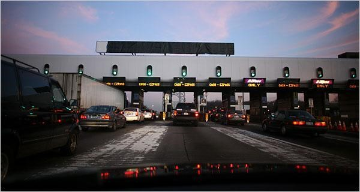

# Build an IoT solution by using Stream Analytics

## Introduction
In this solution, you learn how to use Azure Stream Analytics to get real-time insights from your data. Developers can easily combine streams of data, such as click-streams, logs, and device-generated events, with historical records or reference data to derive business insights. As a fully managed, real-time stream computation service that's hosted in Microsoft Azure, Azure Stream Analytics provides built-in resiliency, low latency, and scalability to get you up and running in minutes.

After completing this solution, you're able to:

* Familiarize yourself with the Azure Stream Analytics portal.
* Configure and deploy a streaming job.
* Articulate real-world problems and solve them by using the Stream Analytics query language.
* Develop streaming solutions for your customers by using Stream Analytics with confidence.
* Use the monitoring and logging experience to troubleshoot issues.

## Prerequisites
You need the following prerequisites to complete this solution:
* An [Azure subscription](https://azure.microsoft.com/pricing/free-trial/)

## Scenario introduction: "Hello, Toll!"
A toll station is a common phenomenon. You encounter them on many expressways, bridges, and tunnels across the world. Each toll station has multiple toll booths. At manual booths, you stop to pay the toll to an attendant. At automated booths, a sensor on top of each booth scans an RFID card that's affixed to the windshield of your vehicle as you pass the toll booth. It's easy to visualize the passage of vehicles through these toll stations as an event stream over which interesting operations can be performed.



## Incoming data
This solution works with two streams of data. Sensors installed in the entrance and exit of the toll stations produce the first stream. The second stream is a static lookup dataset that has vehicle registration data.

### Entry data stream
The entry data stream contains information about cars as they enter toll stations. The exit data events are live streamed into an event hub from a Web App included in the sample app.

```
| TollID | EntryTime | LicensePlate | State | Make | Model | VehicleType | VehicleWeight | Toll | Tag |
| --- | --- | --- | --- | --- | --- | --- | --- | --- | --- |
| 1 |2014-09-10 12:01:00.000 |JNB 7001 |NY |Honda |CRV |1 |0 |7 | |
| 1 |2014-09-10 12:02:00.000 |YXZ 1001 |NY |Toyota |Camry |1 |0 |4 |123456789 |
| 3 |2014-09-10 12:02:00.000 |ABC 1004 |CT |Ford |Taurus |1 |0 |5 |456789123 |
| 2 |2014-09-10 12:03:00.000 |XYZ 1003 |CT |Toyota |Corolla |1 |0 |4 | |
| 1 |2014-09-10 12:03:00.000 |BNJ 1007 |NY |Honda |CRV |1 |0 |5 |789123456 |
| 2 |2014-09-10 12:05:00.000 |CDE 1007 |NJ |Toyota |4x4 |1 |0 |6 |321987654 |
```

Here's a short description of the columns:

| Column | Description |
| --- | --- |
| TollID |The toll booth ID that uniquely identifies a toll booth |
| EntryTime |The date and time of entry of the vehicle to the toll booth in UTC |
| LicensePlate |The license plate number of the vehicle |
| State |A state in United States |
| Make |The manufacturer of the automobile |
| Model |The model number of the automobile |
| VehicleType |Either 1 for passenger vehicles or 2 for commercial vehicles |
| WeightType |Vehicle weight in tons; 0 for passenger vehicles |
| Toll |The toll value in USD |
| Tag |The e-Tag on the automobile that automates payment; blank where the payment was done manually |

### Exit data stream
The exit data stream contains information about cars leaving the toll station. The exit data events are live streamed into an event hub from a Web App included in the sample app.

| **TollId** | **ExitTime** | **LicensePlate** |
| --- | --- | --- |
| 1 |2014-09-10T12:03:00.0000000Z |JNB 7001 |
| 1 |2014-09-10T12:03:00.0000000Z |YXZ 1001 |
| 3 |2014-09-10T12:04:00.0000000Z |ABC 1004 |
| 2 |2014-09-10T12:07:00.0000000Z |XYZ 1003 |
| 1 |2014-09-10T12:08:00.0000000Z |BNJ 1007 |
| 2 |2014-09-10T12:07:00.0000000Z |CDE 1007 |

Here's a short description of the columns:

| Column | Description |
| --- | --- |
| TollID |The toll booth ID that uniquely identifies a toll booth |
| ExitTime |The date and time of exit of the vehicle from toll booth in UTC |
| LicensePlate |The license plate number of the vehicle |

### Commercial vehicle registration data
The solution uses a static snapshot of a commercial vehicle registration database. This data is saved as a JSON file into Azure blob storage, included in the sample.

| LicensePlate | RegistrationId | Expired |
| --- | --- | --- |
| SVT 6023 |285429838 |1 |
| XLZ 3463 |362715656 |0 |
| BAC 1005 |876133137 |1 |
| RIV 8632 |992711956 |0 |
| SNY 7188 |592133890 |0 |
| ELH 9896 |678427724 |1 |

Here's a short description of the columns:

| Column | Description |
| --- | --- |
| LicensePlate |The license plate number of the vehicle |
| RegistrationId |The vehicle's registration ID |
| Expired |The registration status of the vehicle: 0 if vehicle registration is active, 1 if registration is expired |

## Set up the environment for Azure Stream Analytics
To complete this solution, you need a Microsoft Azure subscription. If you don't have an Azure account, you can [request a free trial version](https://azure.microsoft.com/pricing/free-trial/).

Be sure to follow the steps in the "Clean up your Azure account" section at the end of this article so that you can make the best use of your Azure credit.

## Deploy the sample
There are several resources that can easily be deployed in a resource group together with a few clicks. The solution definition is hosted in GitHub repository at [https://github.com/Azure/azure-stream-analytics/tree/master/Samples/TollApp](https://github.com/Azure/azure-stream-analytics/tree/master/Samples/TollApp).

### Deploy the TollApp template in the Azure portal
1. To deploy the TollApp environment to Azure, use this link to [Deploy TollApp Azure Template](https://portal.azure.com/#create/Microsoft.Template/uri/https%3A%2F%2Fraw.githubusercontent.com%2FAzure%2Fazure-stream-analytics%2Fmaster%2FSamples%2FTollApp%2FVSProjects%2FTollAppDeployment%2Fazuredeploy.json).

2. Sign in to the Azure portal if prompted.

3. Choose the subscription in which the various resources are billed.

4. Specify a new resource group, with a unique name, for example `MyTollBooth`.

5. Select an Azure location.

6. Specify an **Interval** as a number of seconds. This value is used in the sample web app, for how frequently to send data into an event hub.

7. **Check** to agree to the terms and conditions.

8. Select **Pin to dashboard** so that you can easily locate the resources later on.

9. Select **Purchase** to deploy the sample template.

10. After a few moments, a notification appears to confirm the **Deployment succeeded**.

### Review the Azure Stream Analytics TollApp resources

1. Sign in to the Azure portal.

2. Locate the Resource Group that you named in the previous section.

3. Verify that the following resources are listed in the resource group:
   - One Azure Cosmos DB Account
   - One Azure Stream Analytics Job
   - One Azure Storage Account
   - One Azure event hub
   - Two Web Apps

## Examine the sample TollApp job
1. Starting from the resource group in the previous section, select the Stream Analytics streaming job starting with the name `tollapp` (name contains random characters for uniqueness).

2. On the **Overview** page of the job, notice the **Query** box to view the query syntax.

   ```sql
   SELECT TollId, System.Timestamp AS WindowEnd, COUNT(*) AS Count
   INTO CosmosDB
   FROM EntryStream TIMESTAMP BY EntryTime
   GROUP BY TUMBLINGWINDOW(minute, 3), TollId
   ```

   To paraphrase the intent of the query, let’s say that you need to count the number of vehicles that enter a toll booth. Because a highway toll booth has a continuous stream of vehicles entering, those are entrance events are analogous to a stream that never stops. To quantify the stream, you have to define a "period of time" to measure over. Let's refine the question further, to "How many vehicles enter a toll booth every three minutes?" This is commonly referred to as the tumbling count.

   As you can see, Azure Stream Analytics uses a query language that's like SQL and adds a few extensions to specify time-related aspects of the query.  For more details, read about [Time Management](/stream-analytics-query/time-management-azure-stream-analytics) and [Windowing](/stream-analytics-query/windowing-azure-stream-analytics) constructs used in the query.

3. Examine the Inputs of the TollApp sample job. Only the EntryStream input is used in the current query.
   - **EntryStream** input is an event hub connection that queues data representing each time a car enters a tollbooth on the highway. A web app that is part of the sample is creating the events, and that data is queued in this event hub. Note that this input is queried in the FROM clause of the streaming query.
   - **ExitStream** input is an event hub connection that queues data representing each time a car exits a tollbooth on the highway. This streaming input is used in later variations of the query syntax.
   - **Registration** input is an Azure Blob storage connection, pointing to a static registration.json file, used for lookups as needed. This reference data input is used in later variations of the query syntax.

4. Examine the Outputs of the TollApp sample job.
   - **Azure Cosmos DB** output is an Azure Cosmos DB database container that receives the output sink events. Note that this output is used in INTO clause of the streaming query.

## Start the TollApp streaming job
Follow these steps to start the streaming job:

1. On the **Overview** page of the job, select **Start**.

2. On the **Start job** pane, select **Now**.

3. After a few moments, once the job is running, on the **Overview** page of the streaming job, view the **Monitoring** graph. The graph should show several thousand input events, and tens of output events.

## Review the Azure Cosmos DB output data
1. Locate the resource group that contains the TollApp resources.

2. Select the Azure Cosmos DB Account with the name pattern **tollapp\<random\>-cosmos**.

3. Select the **Data Explorer** heading to open the Data Explorer page.

4. Expand the **tollAppDatabase** > **tollAppCollection** > **Documents**.

5. In the list of IDs, several docs are shown once the output is available.

6. Select each ID to review the JSON document. Notice each `tollid`, `windowend time`, and the `count of cars` from that window.

7. After an additional three minutes, another set of four documents is available, one document per `tollid`.


## Report total time for each car
The average time that's required for a car to pass through the toll helps to assess the efficiency of the process and the customer experience.

To find the total time, join the EntryTime stream with the ExitTime stream. Join the two input streams on the equal matching TollId and LicencePlate columns. The **JOIN** operator requires you to specify temporal leeway that describes the acceptable time difference between the joined events. Use the **DATEDIFF** function to specify that events should be no more than 15 minutes from each other. Also apply the **DATEDIFF** function to exit and entry times to compute the actual time that a car spends in the toll station. Note the difference of the use of **DATEDIFF** when it's used in a **SELECT** statement rather than a **JOIN** condition.

```sql
SELECT EntryStream.TollId, EntryStream.EntryTime, ExitStream.ExitTime, EntryStream.LicensePlate, DATEDIFF (minute, EntryStream.EntryTime, ExitStream.ExitTime) AS DurationInMinutes
INTO CosmosDB
FROM EntryStream TIMESTAMP BY EntryTime
JOIN ExitStream TIMESTAMP BY ExitTime
ON (EntryStream.TollId= ExitStream.TollId AND EntryStream.LicensePlate = ExitStream.LicensePlate)
AND DATEDIFF (minute, EntryStream, ExitStream ) BETWEEN 0 AND 15
```

### To update the TollApp streaming job query syntax:

1. On the **Overview** page of the job, select **Stop**.

2. Wait a few moments for the notification that the job has stopped.

3. Under the JOB TOPOLOGY heading, select **< > Query**

4. Paste the adjusted streaming SQL query.

5. Select **Save** to save the query. Confirm **Yes** to save the changes.

6. On the **Overview** page of the job, select **Start**.

7. On the **Start job** pane, select **Now**.

### Review the total time in the output
Repeat the steps in the preceding section to review the Azure Cosmos DB output data from the streaming job. Review the latest JSON documents.

For example, this document shows an example car with a certain license plate, the `entrytime` and `exit time`, and the DATEDIFF calculated `durationinminutes` field showing the toll booth duration as two minutes:
```JSON
{
    "tollid": 4,
    "entrytime": "2018-04-05T06:51:39.0491173Z",
    "exittime": "2018-04-05T06:53:09.0491173Z",
    "licenseplate": "JVR 9425",
    "durationinminutes": 2,
    "id": "ff52eb25-d580-7566-2879-1f52bba6601e",
    "_rid": "+8E4AI1DZgBjAAAAAAAAAA==",
    "_self": "dbs/+8E4AA==/colls/+8E4AI1DZgA=/docs/+8E4AI1DZgBjAAAAAAAAAA==/",
    "_etag": "\"ad02f6b8-0000-0000-0000-5ac5c8330000\"",
    "_attachments": "attachments/",
    "_ts": 1522911283
}
```

## Report vehicles with expired registration
Azure Stream Analytics can use static snapshots of reference data to join with temporal data streams. To demonstrate this capability, use the following sample question. The Registration input is a static blob json file that lists the expirations of license tags. By joining on the license plate, the reference data is compared to each vehicle passing through the toll both.

If a commercial vehicle is registered with the toll company, it can pass through the toll booth without being stopped for inspection. Use the registration lookup table to identify all commercial vehicles that have expired registrations.

```sql
SELECT EntryStream.EntryTime, EntryStream.LicensePlate, EntryStream.TollId, Registration.RegistrationId
INTO CosmosDB
FROM EntryStream TIMESTAMP BY EntryTime
JOIN Registration
ON EntryStream.LicensePlate = Registration.LicensePlate
WHERE Registration.Expired = '1'
```

1. Repeat the steps in the preceding section to update the TollApp streaming job query syntax.

2. Repeat the steps in the preceding section to review the Azure Cosmos DB output data from the streaming job.

Example output:
```json
    {
        "entrytime": "2018-04-05T08:01:28.0252168Z",
        "licenseplate": "GMT 3221",
        "tollid": 1,
        "registrationid": "763220582",
        "id": "47db0535-9716-4eb2-db58-de7886966cbf",
        "_rid": "y+F8AJ9QWACSAQAAAAAAAA==",
        "_self": "dbs/y+F8AA==/colls/y+F8AJ9QWAA=/docs/y+F8AJ9QWACSAQAAAAAAAA==/",
        "_etag": "\"88007d8d-0000-0000-0000-5ac5d7e20000\"",
        "_attachments": "attachments/",
        "_ts": 1522915298
    }
```

## Scale out the job
Azure Stream Analytics is designed to elastically scale so that it can handle large volumes of data. The Azure Stream Analytics query can use a **PARTITION BY** clause to tell the system that this step scales out. **PartitionId** is a special column that the system adds to match the partition ID of the input (event hub).

To scale out the query to partitions, edit the query syntax to the following code:
```sql
SELECT TollId, System.Timestamp AS WindowEnd, COUNT(*)AS Count
INTO CosmosDB
FROM EntryStream
TIMESTAMP BY EntryTime
PARTITION BY PartitionId
GROUP BY TUMBLINGWINDOW(minute,3), TollId, PartitionId
```

To scale up the streaming job to more streaming units:

1. **Stop** the current job.

2. Update the query syntax in the **< > Query** page, and save the changes.

3. Under the CONFIGURE heading on the streaming job, select **Scale**.

4. Slide the **Streaming units** slider from 1 to 6. Streaming units define the amount of compute power that the job can receive. Select **Save**.

5. **Start** the streaming job to demonstrate the additional scale. Azure Stream Analytics distributes work across more compute resources and achieves better throughput, partitioning the work across resources using the column designated in the PARTITION BY clause.

## Monitor the job
The **MONITOR** area contains statistics about the running job. First-time configuration is needed to use the storage account in the same region (name toll like the rest of this document).


You can access **Activity Logs** from the job dashboard **Settings** area as well.

## Clean up the TollApp resources
1. Stop the Stream Analytics job in the Azure portal.

2. Locate the resource group that contains eight resources related to the TollApp template.

3. Select **Delete resource group**. Type the name of the resource group to confirm deletion.

## Conclusion
This solution introduced you to the Azure Stream Analytics service. It demonstrated how to configure inputs and outputs for the Stream Analytics job. By using the Toll Data scenario, the solution explained common types of problems that arise in the space of data in motion and how they can be solved with simple SQL-like queries in Azure Stream Analytics. The solution described SQL extension constructs for working with temporal data. It showed how to join data streams, how to enrich the data stream with static reference data, and how to scale out a query to achieve higher throughput.

Although this solution provides a good introduction, it isn't complete by any means. You can find more query patterns using the SAQL language at [Query examples for common Stream Analytics usage patterns](stream-analytics-stream-analytics-query-patterns.md).
