<properties 
	pageTitle="Build an IOT solution using Stream Analytics | Microsoft Azure" 
	description="getting started tutorial for the Stream Analytics iot solution of a tollbooth scenario"
	keywords="iot solution, window functions"
	documentationCenter=""
	services="stream-analytics"
	authors="jeffstokes72" 
	manager="paulettm" 
	editor="cgronlun"
/>

<tags 
	ms.service="stream-analytics" 
	ms.devlang="na" 
	ms.topic="article" 
	ms.tgt_pltfrm="na" 
	ms.workload="data-services" 
	ms.date="08/11/2016" 
	ms.author="jeffstok"
/>

# Build an IOT solution using Stream Analytics

## Introduction

In this tutorial you will learn how to get real-time insights from your data using Azure Stream Analytics. Azure's stream processing service enables developers to easily tackle the space of data in motion by combining streams of data such as click-streams, logs and device generated events with historical records or reference data to derive business insights easily and quickly. Being a fully managed, real-time stream computation service hosted in Microsoft Azure, Azure Stream Analytics provides built-in resiliency, low latency, and scalability to get you up and running in minutes.

After completing this tutorial, you will be able to:

-   Familiarize yourself with the Azure Stream Analytics Portal.
-   Configure and deploy a streaming job.
-   Articulate real world problems and solve them using Stream Analytics Query Language.
-   Develop streaming solutions for your customers using Azure Streaming Analytics with confidence.
-   Use the monitoring and logging experience to troubleshoot issues.

## Prerequisites

You will need the following pre-requisites to successfully complete this tutorial.

-   Latest [Azure PowerShell](../powershell-install-configure.md)
-   Visual Studio 2015 or the free [Visual Studio Community](https://www.visualstudio.com/products/visual-studio-community-vs.aspx)
-   [Azure Subscription](https://azure.microsoft.com/pricing/free-trial/)
-   Administrative Privileges on the computer
-   Download [TollApp.zip](http://download.microsoft.com/download/D/4/A/D4A3C379-65E8-494F-A8C5-79303FD43B0A/TollApp.zip) from the Microsoft Download Center
-   Optional: Source code for TollApp event generator in [GitHub](https://aka.ms/azure-stream-analytics-toll-source)

## Scenario Introduction - “Hello, Toll!”

A tolling station is a common phenomenon – we encounter them in many expressways, bridges, and tunnels across the world. Each toll station has multiple toll booths, which may be manual – meaning that you stop to pay the toll to an attendant, or automated – where a sensor placed on top of the booth scans an RFID card affixed to the windshield of your vehicle as you pass the toll booth. It is easy to visualize the passage of vehicles through these toll stations as an event stream over which interesting operations can be performed.

## Incoming data

We will work with two streams of data which are produced by sensors installed in the entrance and exit of the toll stations and a static look up dataset with vehicle registration data.

### Entry Data Stream

Entry data stream contains information about cars entering toll stations.

| Toll Id | EntryTime               | LicensePlate | State | Make   | Model   | Vehicle Type | Vehicle Weight | Toll | Tag       |
|---------|-------------------------|--------------|-------|--------|---------|--------------|----------------|------|-----------|
| 1       | 2014-09-10 12:01:00.000 | JNB 7001     | NY    | Honda  | CRV     | 1            | 0              | 7    |           |
| 1       | 2014-09-10 12:02:00.000 | YXZ 1001     | NY    | Toyota | Camry   | 1            | 0              | 4    | 123456789 |
| 3       | 2014-09-10 12:02:00.000 | ABC 1004     | CT    | Ford   | Taurus  | 1            | 0              | 5    | 456789123 |
| 2       | 2014-09-10 12:03:00.000 | XYZ 1003     | CT    | Toyota | Corolla | 1            | 0              | 4    |           |
| 1       | 2014-09-10 12:03:00.000 | BNJ 1007     | NY    | Honda  | CRV     | 1            | 0              | 5    | 789123456 |
| 2       | 2014-09-10 12:05:00.000 | CDE 1007     | NJ    | Toyota | 4x4     | 1            | 0              | 6    | 321987654 |

Here is a short description of the columns:

| TollID       | Toll booth ID uniquely identifying a toll booth                |
|--------------|----------------------------------------------------------------|
| EntryTime    | The date and time of entry of the vehicle to Toll Booth in UTC |
| LicensePlate | License Plate number of the vehicle                            |
| State        | Is a State in United States                                    |
| Make         | The manufacturer of the automobile                             |
| Model        | Model number of the automobile                                 |
| VehicleType  | 1 for Passenger and 2 for Commercial vehicles                  |
| WeightType   | Vehicle weight in tons; 0 for passenger vehicles               |
| Toll         | The toll value in USD                                          |
| Tag          | e-Tag on the automobile that automates payment  left blank where the payment was done manually |

### Exit Data Stream

Exit data stream contains information about cars leaving the toll station.

| **TollId** | **ExitTime**                 | **LicensePlate** |
|------------|------------------------------|------------------|
| 1          | 2014-09-10T12:03:00.0000000Z | JNB 7001         |
| 1          | 2014-09-10T12:03:00.0000000Z | YXZ 1001         |
| 3          | 2014-09-10T12:04:00.0000000Z | ABC 1004         |
| 2          | 2014-09-10T12:07:00.0000000Z | XYZ 1003         |
| 1          | 2014-09-10T12:08:00.0000000Z | BNJ 1007         |
| 2          | 2014-09-10T12:07:00.0000000Z | CDE 1007         |

Here is a short description of the columns:

| Column | Description |
|--------------|-----------------------------------------------------------------|
| TollID       | Toll booth ID uniquely identifying a toll booth                 |
| ExitTime     | The date and time of exit of the vehicle from Toll Booth in UTC |
| LicensePlate | License Plate number of the vehicle                             |

### Commercial Vehicle Registration Data

We will use a static snapshot of commercial vehicle registration database.

| LicensePlate | RegistrationId | Expired |
|--------------|----------------|---------|
| SVT 6023     | 285429838      | 1       |
| XLZ 3463     | 362715656      | 0       |
| BAC 1005     | 876133137      | 1       |
| RIV 8632     | 992711956      | 0       |
| SNY 7188     | 592133890      | 0       |
| ELH 9896     | 678427724      | 1       |

Here is a short description of the columns:

| Column | Description |
|--------------|-----------------------------------------------------------------|
| LicensePlate | License Plate number of the vehicle                |
| RegistrationId     | RegistrationId |
| Expired | 0 if vehicle registration is active, 1 if registration is expired                 |

## Setting up environment for Azure Stream Analytics

To perform this tutorial, you will need a Microsoft Azure subscription. Microsoft offers free trial for Microsoft Azure services as described below.

If you do not have an Azure account, you can request a free trial version by going to <http://azure.microsoft.com/pricing/free-trial/> .

Note: To sign up for a free trial, you will need a mobile device that can receive text messages and a valid credit card.

Be sure to follow the “Clean up your Azure account” section steps at the end of this exercise so that you can make the most use of your \$200 free Azure credit.

## Provisioning Azure resources required for the Tutorial

This tutorial will require 2 Azure Event Hubs to receive “Entry” and “Exit” data streams. We will use Azure SQL Database to output the results of the Stream Analytics jobs. We will also use Azure Storage to store reference data about vehicle registration.

The Setup.ps1 script in the TollApp folder on GitHub can be used to create all required resources. In the interest of time, we recommend that you run it. If you would like to learn more about configuring these resources in Azure portal, please refer to the appendix “Configuring Tutorial resources in Azure Portal”

Download and save the supporting [TollApp](http://download.microsoft.com/download/D/4/A/D4A3C379-65E8-494F-A8C5-79303FD43B0A/TollApp.zip) folder and files.

Open a “Microsoft Azure PowerShell” window **AS AN ADMINISTRATOR**. If you do not yet have Azure PowerShell, follow the instructions here to install it: [Install and configure Azure PowerShell](../powershell-install-configure.md)

Windows automatically blocks ps1, dll and exe files downloaded from the Internet. We need to set the Execution Policy before running the script. Make sure the Azure PowerShell window is running as an administrator. Run “Set-ExecutionPolicy unrestricted”. When prompted, type “Y”.

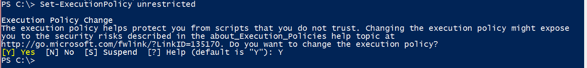

Run Get-ExecutionPolicy to make sure the command worked.

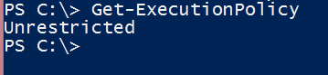

Go to the directory with the scripts and generator application.

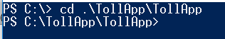

Type “.\\Setup.ps1” to set up your azure account, create and configure all required resources and start generating events. The script will randomly pick up a region to create your resources. If you would like to explicitly specify the region, you can pass the -location parameter like the example below:

**.\\Setup.ps1 -location “Central US”**

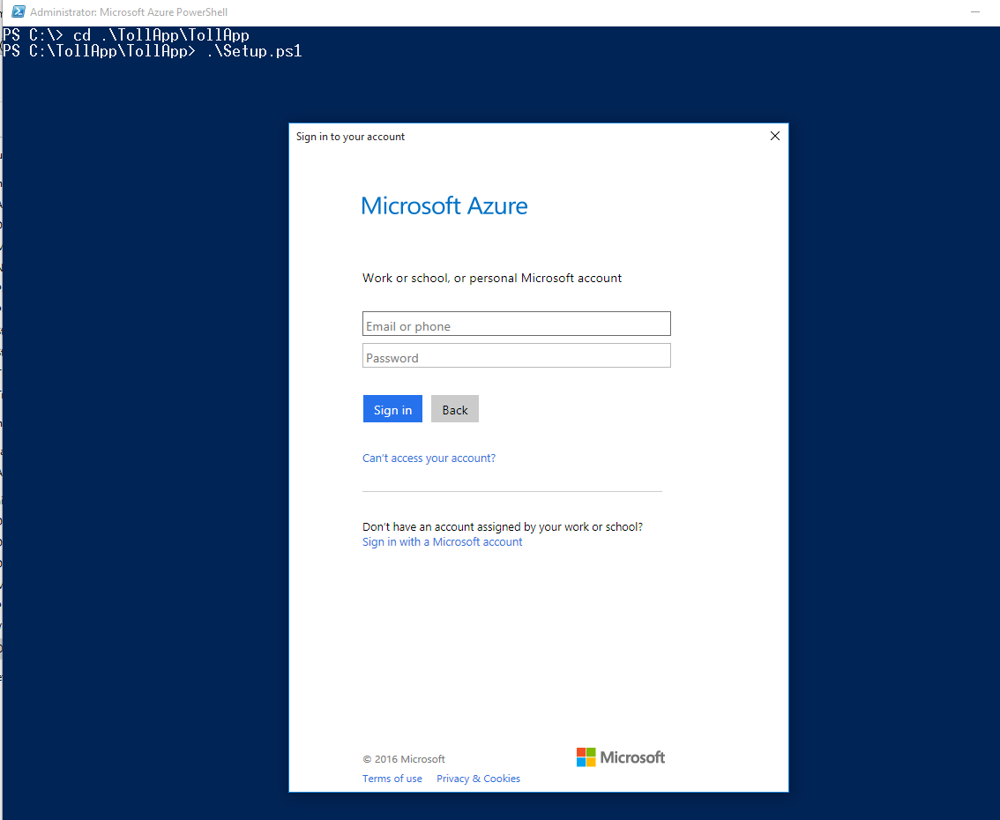

The script will open “Sign In” page for Microsoft Azure. Enter your account credentials.

Please note that if your account has access to multiple subscriptions, you will be asked to enter the subscription name that you want to use for the tutorial.

The script can take several minutes to run. Once completed, the output should look like the screenshot below.

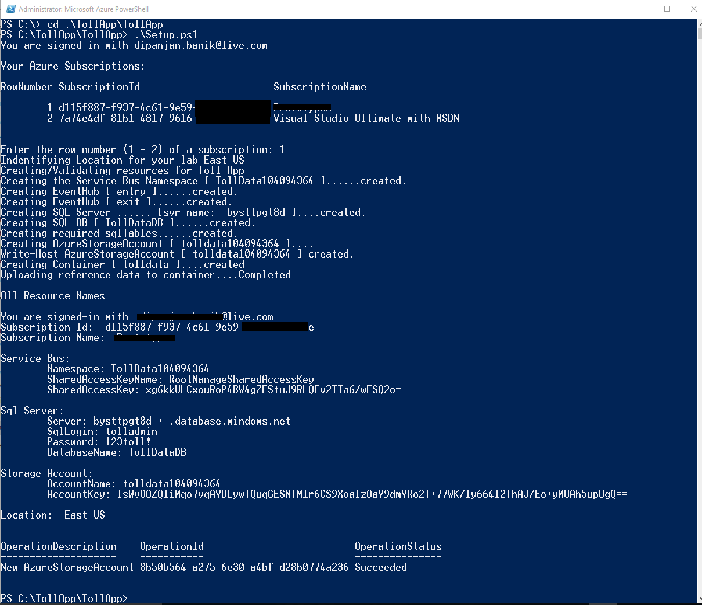

You will also see another window similar to the screen shot below. This application is sending events to your EventHub and is required to run the tutorial exercises. So you should not stop the application or close this window until you finish the tutorial.

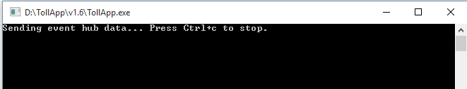

You should be able to see all created resources in Azure Management Portal now. Please go to <https://manage.windowsazure.com> and login with your account credentials.

### Event Hubs

Click on “Service Bus” menu item on the left side of the Azure Management Portal to see Event Hubs created by the script from the previous section.

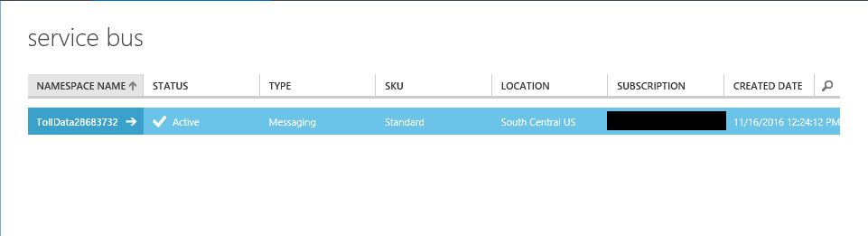

You will see all available namespaces in your subscription. Click on the one starting with “TollData”. (TollData4637388511 in our example). Click on “Event Hubs” tab.

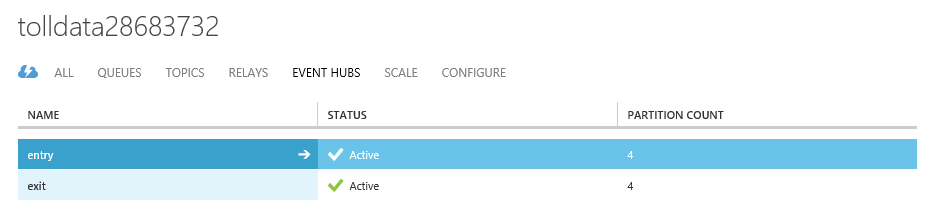

You will see two event hubs named *entry* and *exit* created in this namespace.

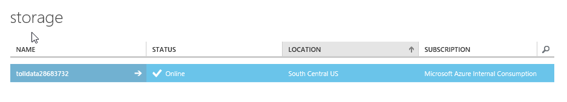

### Azure Storage container

Click on “Storage” menu item on the left side of the Azure Management Portal to see storage container used in the Lab.

Click on the one starting with “tolldata”. (tolldata4637388511 in our example). Open “Containers” tab to see the created container.

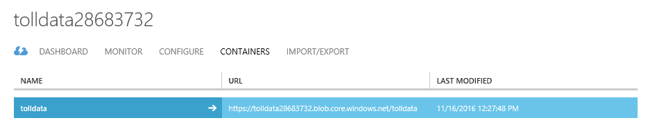

Click on “tolldata” container to see uploaded JSON file with vehicle registration data.

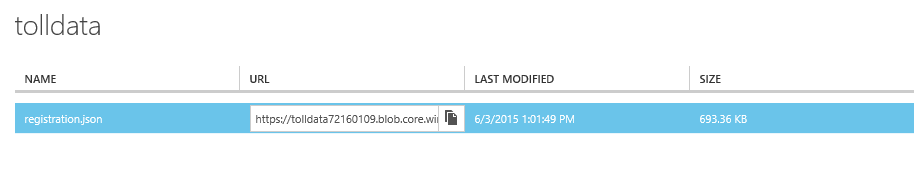

### Azure SQL Database

Click on “SQL Databases” menu item on the left side of the Azure Management Portal to see Azure SQL Database that will be used in the Lab.

Click on “TollDataDB”

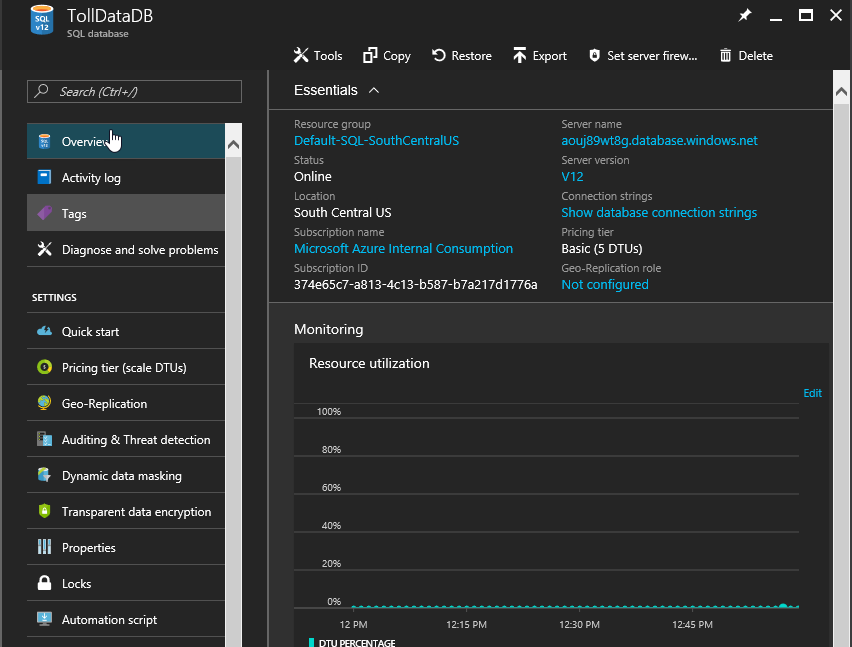

Copy the server name without the port number (*servername*.database.windows.net for example)

## Connect to Database from Visual Studio

We will use Visual Studio to access query results in the output database.

Connect to the Azure database (the destination) from Visual Studio:

1)  Open Visual Studio then click “Tools” and then “Connect to Database…” menu item.

2)  If asked, select “Microsoft SQL Server” as a data source

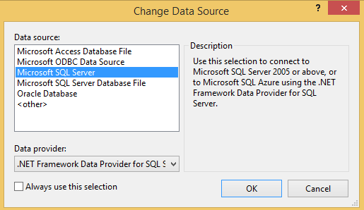

3)  In the Server Name field paste the name of the SQL Server copied in the previous section from Azure Portal (i.e. *servername*.database.windows.net)

4)  In the Authentication field choose SQL Server Authentication

5)  Enter a LOGIN NAME as “tolladmin” and LOGIN PASSWORD as “123toll!”

6)  Choose TollDataDB as the database

7)  Click OK.

8)  Open Server Explorer

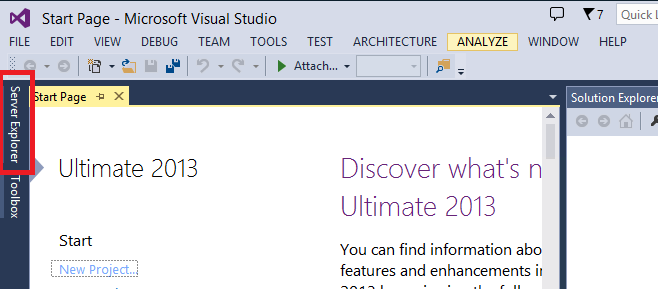

9)  See 4 tables created in the TollDataDB database.

## Event Generator - TollApp Sample Project

The PowerShell script automatically starts sending events using the TollApp sample application program. You don’t need to perform any additional steps.

However, if you are interested in implementation details, you can find the source code of the TollApp application under in GitHub [samples/TollApp](https://aka.ms/azure-stream-analytics-toll-source)

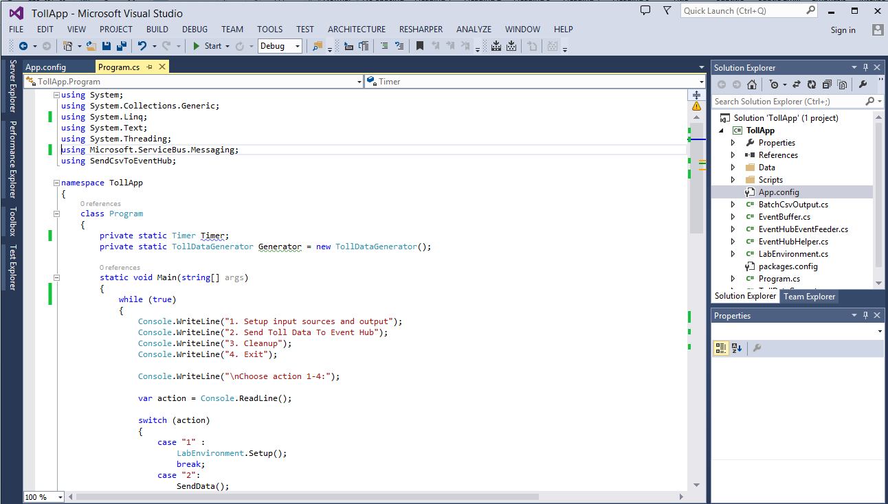

##Create Stream Analytics Job

In Azure portal open Stream Analytics and click “New” in the bottom left hand corner of the page to create a new analytics job.

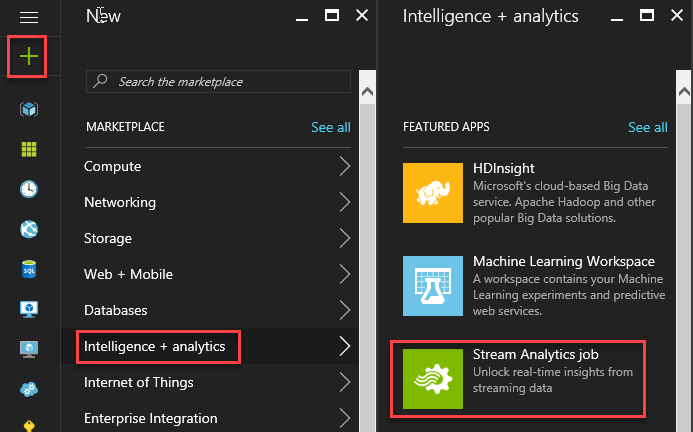

Click “Quick Create”. Select the same region where your other resources are created by the script.

For “Regional Monitoring Storage Account” setting, select “Create new storage account” and give it any unique name. Azure Stream Analytics will use this account to store monitoring information for all your future jobs.

Click “Create Stream Analytics Job” at the bottom of the page.

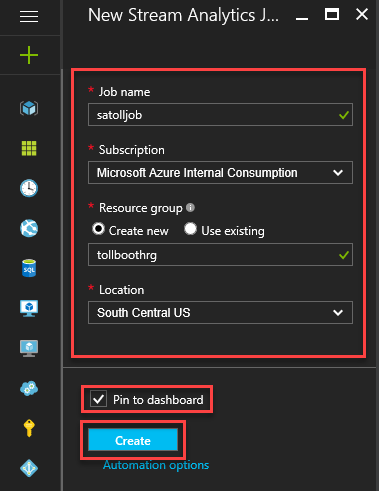

## Define input sources

Click on the created analytics job in the portal.

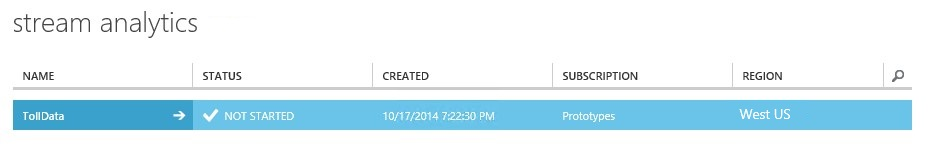

Open “Inputs” tab to define the source data.

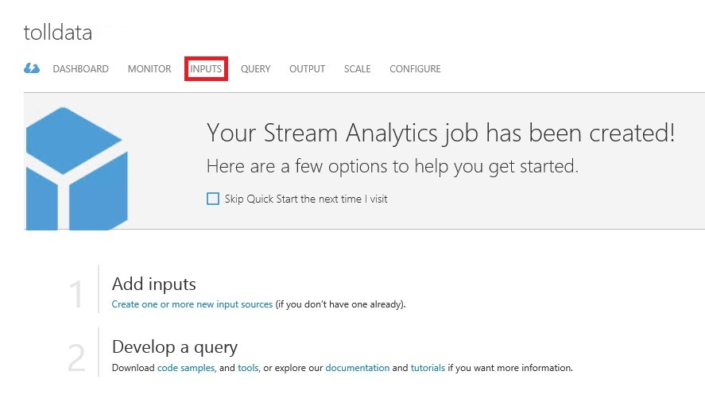

Click “Add an Input”

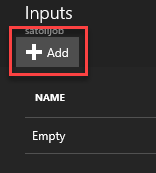

Select “Data Stream” on the first page

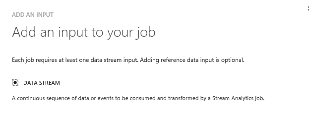

Select “Event Hub” on the second page of the wizard.

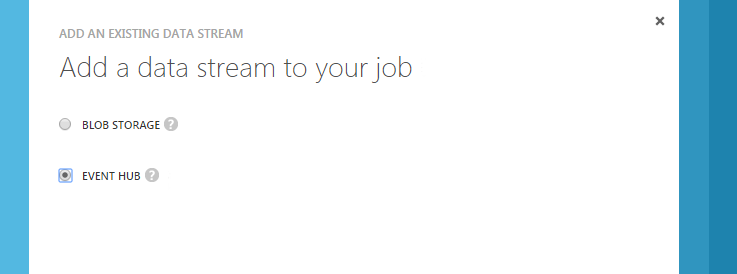

Enter “EntryStream” as Input Alias.

Click on “Event Hub” drop down and select the one starting with “TollData” (e.g. TollData9518658221).

Select “entry” as Event Hub name and “all” as Event Hub policy name.

Your settings will look like:

Move to the next page. Select values as JSON, UTF8 encoding.

Click OK at the bottom of the dialog to finish the wizard.

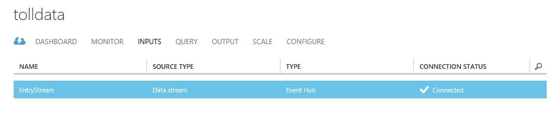

You will need to follow the same sequence of steps to create the second Event Hub input for the stream with Exit events. Make sure on the 3rd page you enter values as on the screenshot bellow.

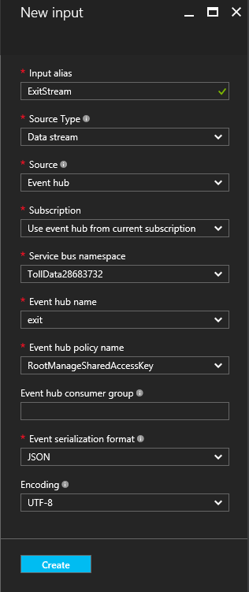

You now have two input streams defined:

Next, we will add “Reference” data input for the blob file with car registration data.

Click “Add Input”. Select “Reference Data”

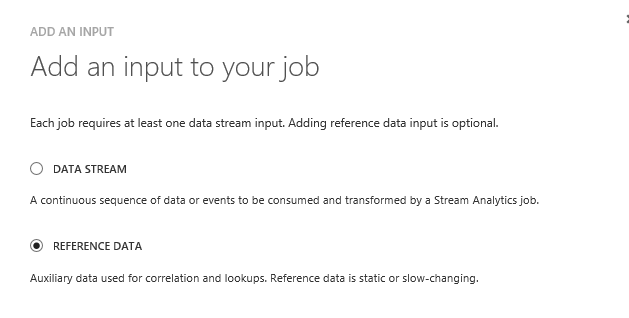

On the next page, select the storage account starting with “tolldata”. Container name should be “tolldata” and blob name under Pattern Path should be “registration.json”. This file name is case sensitive and should be all in lowercase.

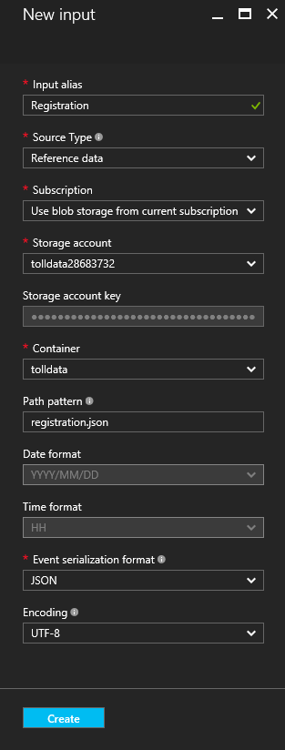

Select the values as shown below on the next page and click OK to finish the wizard.

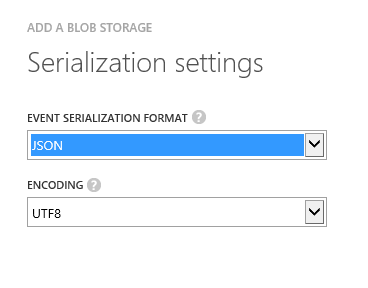

Now all inputs are defined.

## Define output

Go to “Output” tab and click “Add an output”.

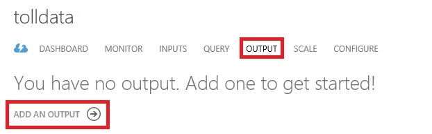

Choose “Sql Database”.

Select the server name that was used in “Connect to Database from Visual Studio”. The database name should be TollDataDB.

Enter “tolladmin” as the user name and “123toll!” as the password. The table name should be set to “TollDataRefJoin”.

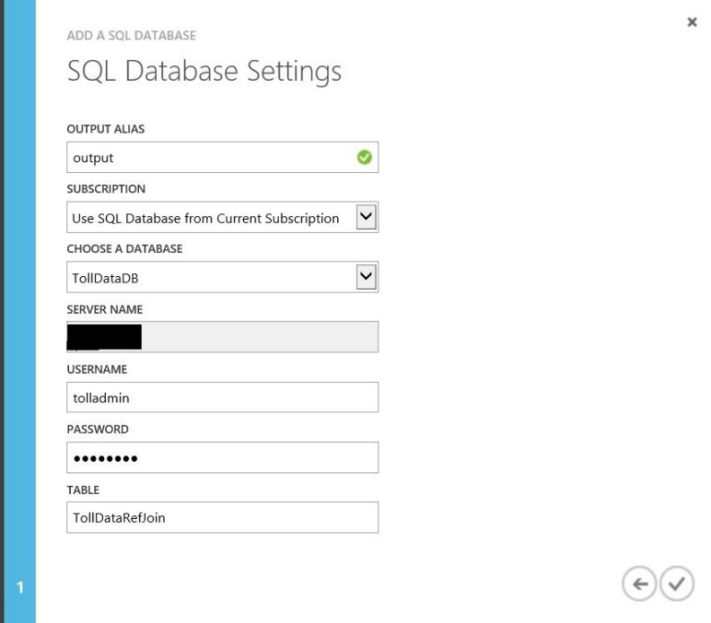

## Azure Stream analytics query

The Query tab contains a SQL query that performs the transformation over the incoming data.

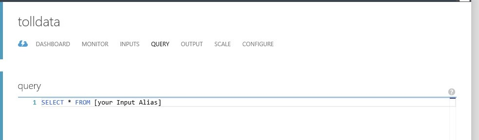

Through this tutorial we will attempt to answer several business questions related to Toll data and construct Stream Analytics queries that can be used in Azure Stream Analytics to provide a relevant answer.

Before we start our first Azure Stream Analytics job, let’s explore few scenarios and query syntax.

## Introduction to Azure Stream Analtyics Query language
-----------------------------------------------------

Let’s say, we need to count the number of vehicles that enter a toll booth. Since this is a continuous stream of events, it is essential we define a “period of time”. So we need to modify our question to be “Number of vehicles entering a toll booth every 3 minutes”. This is commonly referred to as the Tumbling Count.

Let’s look at the Azure Stream Analytics query answering this question:

SELECT TollId, System.Timestamp AS WindowEnd, COUNT(*) AS Count
FROM EntryStream TIMESTAMP BY EntryTime
GROUP BY TUMBLINGWINDOW(minute, 3), TollId

As you can see, Azure Stream Analytics is using a SQL-like query language with a few additional extensions to enable specifying time related aspects of the query.

For more detail, you may read about [Time Management](https://msdn.microsoft.com/library/azure/mt582045.aspx) and [Windowing](https://msdn.microsoft.com/library/azure/dn835019.aspx)
constructs used in the query from MSDN.

## Testing Azure Stream Analytics queries

Now that we have written our first Azure Stream Analytics query, it is time to test it out using sample data files located in your TollApp folder in the path below:

**..\\TollApp\\TollApp\\Data**

This folder contains the following files:

1.  Entry.json

2.  Exit.json

3.  Registration.json

## Question 1 - Number of vehicles entering a toll booth

Open the Azure Management portal and navigate to your created Azure Stream Analytic job. Open the Query tab and copy paste Query from the previous section.

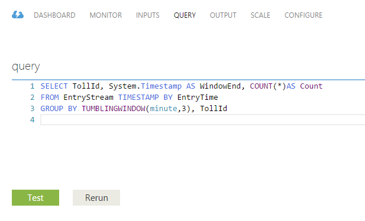

To validate this query against sample data, click the Test button. In the dialog that opens, navigate to Entry.json, a file with sample data from the EntryTime event stream.

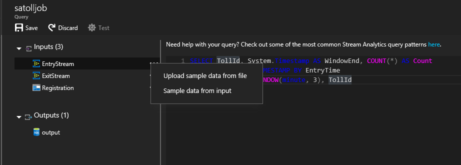

Validate that the output of the query is as expected:

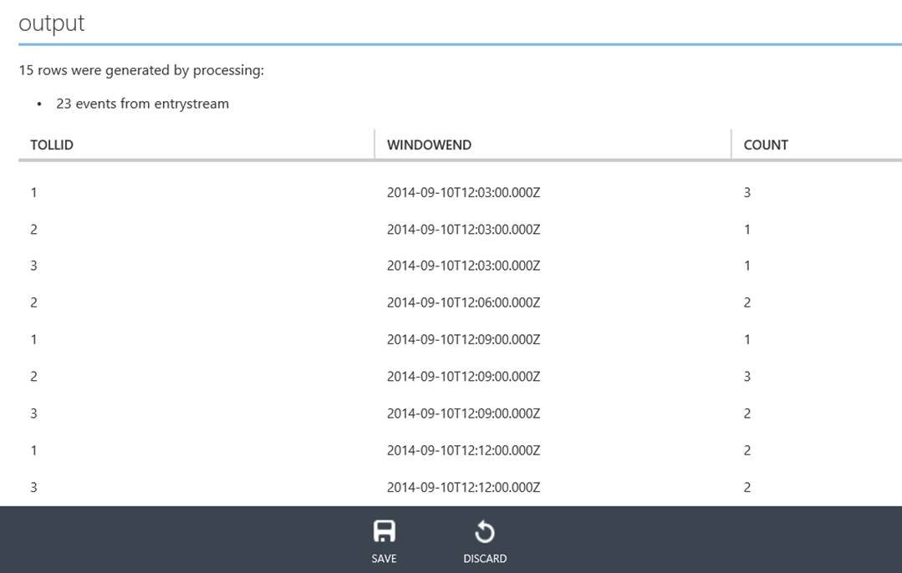

## Question 2 - Report Total time for each car to pass through the toll booth

We want to find average time required for the car to pass the toll to assess efficiency and customer experience.

For this we need to join the stream containing EntryTime with the stream containing ExitTime. We will join the streams on TollId and LicencePlate columns. JOIN operator requires specifying a temporal wiggle room describing acceptable time difference between the joined events. We will use DATEDIFF function to specify that events should be no more than 15 minutes from each other. We will also apply DATEDIFF function to Exit and Entry times to compute actual time a car spends in the toll. Note the difference of the use of DATEDIFF when used in a SELECT statement compared to a JOIN condition.

SELECT EntryStream.TollId, EntryStream.EntryTime, ExitStream.ExitTime, EntryStream.LicensePlate, DATEDIFF (minute , EntryStream.EntryTime, ExitStream.ExitTime) AS DurationInMinutes
FROM EntryStream TIMESTAMP BY EntryTime
JOIN ExitStream TIMESTAMP BY ExitTime
ON (EntryStream.TollId= ExitStream.TollId AND EntryStream.LicensePlate = ExitStream.LicensePlate)
AND DATEDIFF (minute, EntryStream, ExitStream ) BETWEEN 0 AND 15

To test this query, update the query on the Query tab of your job:

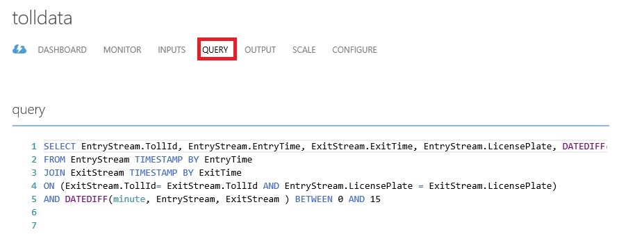

Click test and specify sample input files for EntryTime and ExitTime.

Click the checkbox to test the query and view output:

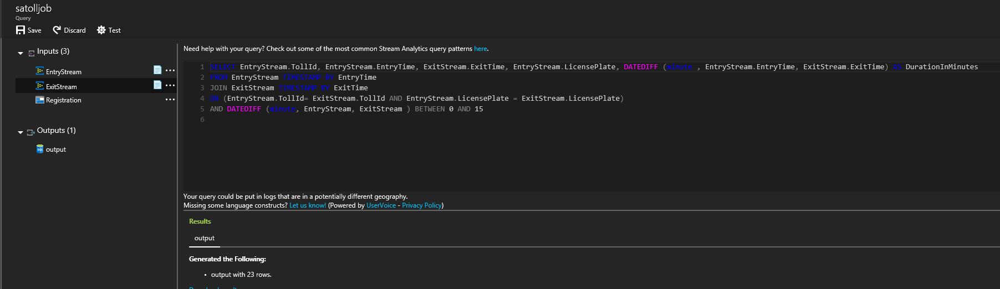

## Question 3 – Report all commercial vehicles with expired registration

Azure Stream Analytics can use static snapshots of data to join with temporal data streams. To demonstrate this capability we will use the following sample question.

If a commercial vehicle is registered with the Toll Company, they can pass through the toll booth without being stopped for inspection. We will use Commercial Vehicle Registration lookup table to identify all commercial vehicles with expired registration.

SELECT EntryStream.EntryTime, EntryStream.LicensePlate, EntryStream.TollId, Registration.RegistrationId
FROM EntryStream TIMESTAMP BY EntryTime
JOIN Registration
ON EntryStream.LicensePlate = Registration.LicensePlate
WHERE Registration.Expired = '1'

Note that testing a query with Reference Data requires that an input source for the Reference Data is defined, which we have done in Step 5.

To test this query, paste the query into the Query tab, click Test, and specify the 2 input sources:

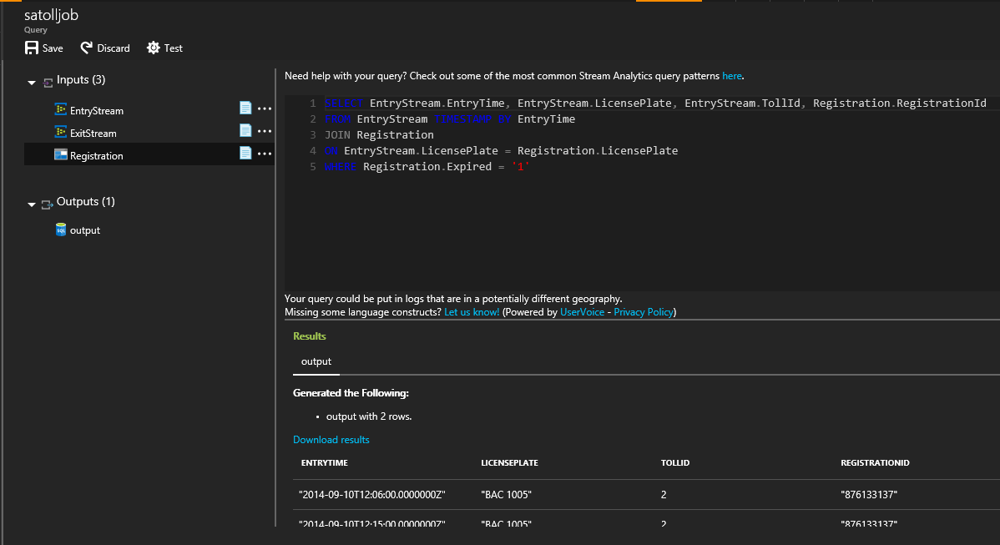

View the output of the query:

## Start the Stream Analytics Job

Now as we have written our first Azure Stream Analytics query, it is time to finish the configuration and start the job. Save the query from Question 3, which will produce output that matches the schema of our output table **TollDataRefJoin**.

Navigate to the job Dashboard and click Start.

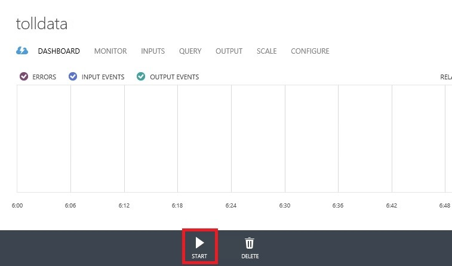

In the dialog that appears, change the Start Output time to Custom Time. Edit the Hour and set it to an hour back. This will ensure that we process all events from the Event Hub since the moment we started generating the events in the beginning of the tutorial. Now click the check mark to start the job.

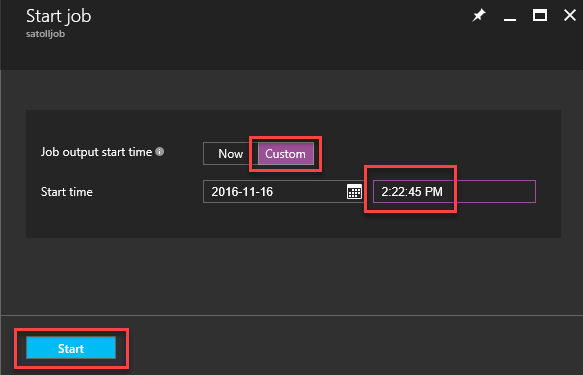

Starting the job can take a few minutes. You will be able to see the status on the top-level page for Stream Analytics.

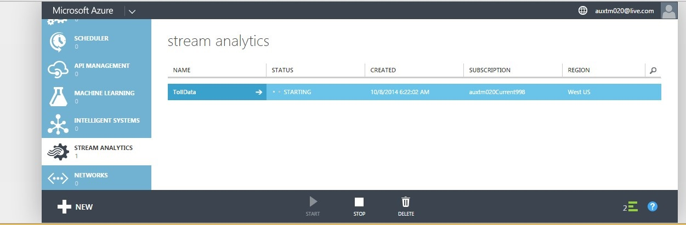

## Check results in Visual Studio

Open Visual Studio Server Explorer and right click TollDataRefJoin table. Select “Show Table Data” to see the output of your job.

## Scaling out Azure Stream Analytics Jobs

Azure Stream Analytics is designed to elastically scale and be able to handle high load of data. The Azure Stream Analytics query can use a **PARTITION BY** clause to tell the system that this step will scale out. PartitionId is a special column added by the system that matches the partition id of the input (Event Hub)

SELECT TollId, System.Timestamp AS WindowEnd, COUNT(*)AS Count
FROM EntryStream TIMESTAMP BY EntryTime PARTITION BY PartitionId
GROUP BY TUMBLINGWINDOW(minute,3), TollId, PartitionId

Stop the current job, update the query in Query tab and open Scale tab.

Streaming units define the amount of compute power the job can receive.

Move the slider to 6.

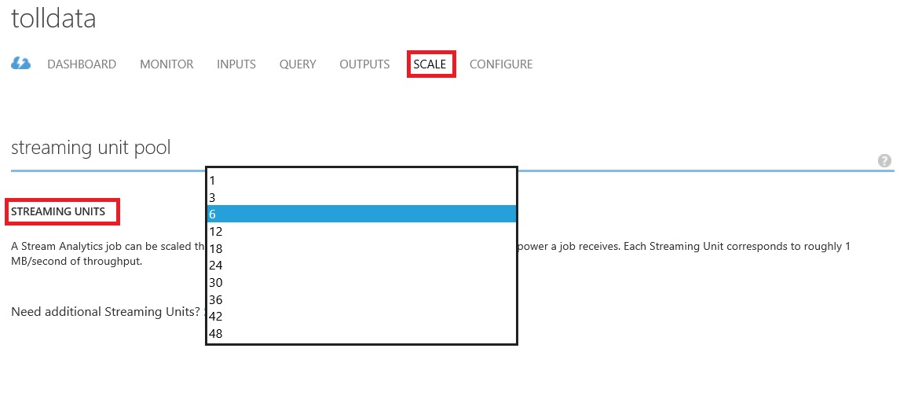

Please go to the output tab and change SQL table name to “TollDataTumblingCountPartitioned”

Now, if you start the job, Azure Stream Analytics will be able to distribute work across more compute resources and achieve better throughput. Please note that TollApp application is also sending events partitioned by TollId.

## Monitoring

Monitoring tab contains statistics about the running job.

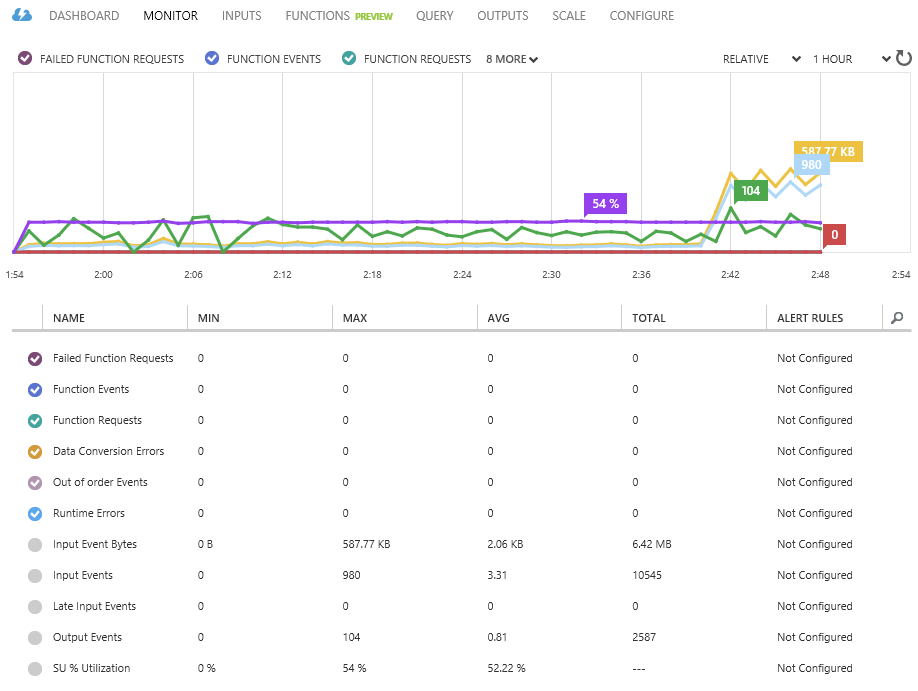

You can access Operation Logs from the Dashboard tab.

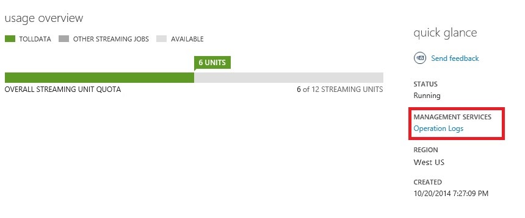

To see additional information about a particular event, select the event and click “Details” button.

## Conclusion

In this tutorial we provided introduction to the Azure Stream Analytics service. We demonstrated how to configure inputs and outputs for the Stream Analytics job. Using the Toll Data scenario, we explained common types of problems that arise in the space of data in motion and how they can be solved with simple SQL-like queries in Azure Stream Analytics. We described SQL extension constructs for working with temporal data. We showed how to join data streams, how to enrich the data stream with static reference data. We explained how to scale out a query to achieve higher throughput.

While this tutorial provides good introductory coverage, it is not complete by any means. You can find more Query Patterns using the SAQL language [here](stream-analytics-stream-analytics-query-patterns.md).
Please refer to the [online documentation](https://azure.microsoft.com/documentation/services/stream-analytics/) to learn more about Azure Stream Analytics.

## Cleanup your Azure account

Please stop the Stream Analytics Job from the Azure Portal.

Setup.ps1 script creates 2 Azure Event Hubs and Azure SQL database server. The following instructions will help you to cleanup resources at the end of the tutorial.

In PowerShell window type “.\\Cleanup.ps1” This will start the script that deletes resources used in the tutorial.

Please note, that resources are identified by the name. Make sure you carefully review each item before confirming removal.

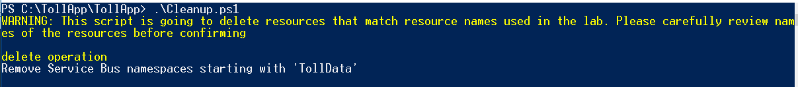
