---
title: Build an IoT solution by using Stream Analytics | Microsoft Docs
description: Getting-started tutorial for the Stream Analytics IoT solution of a tollbooth scenario
keywords: iot solution, window functions
documentationcenter: ''
services: stream-analytics
author: jeffstokes72
manager: jhubbard
editor: cgronlun

ms.assetid: a473ea0a-3eaa-4e5b-aaa1-fec7e9069f20
ms.service: stream-analytics
ms.devlang: na
ms.topic: article
ms.tgt_pltfrm: na
ms.workload: data-services
ms.date: 03/28/2017
ms.author: jeffstok

---
# Build an IoT solution by using Stream Analytics
## Introduction
In this tutorial, you will learn how to use Azure Stream Analytics to get real-time insights from your data. Developers can easily combine streams of data, such as click-streams, logs, and device-generated events, with historical records or reference data to derive business insights. As a fully managed, real-time stream computation service that's hosted in Microsoft Azure, Azure Stream Analytics provides built-in resiliency, low latency, and scalability to get you up and running in minutes.

After completing this tutorial, you will be able to:

* Familiarize yourself with the Azure Stream Analytics portal.
* Configure and deploy a streaming job.
* Articulate real-world problems and solve them by using the Stream Analytics query language.
* Develop streaming solutions for your customers by using Stream Analytics with confidence.
* Use the monitoring and logging experience to troubleshoot issues.

## Prerequisites
You will need the following prerequisites to complete this tutorial:

* The latest version of [Azure PowerShell](/powershell/azure/overview)
* Visual Studio 2017, 2015, or the free [Visual Studio Community](https://www.visualstudio.com/products/visual-studio-community-vs.aspx)
* An [Azure subscription](https://azure.microsoft.com/pricing/free-trial/)
* Administrative privileges on the computer
* Download of [TollApp.zip](https://github.com/Azure/azure-stream-analytics/blob/master/Samples/TollApp/TollApp.zip) from the Microsoft Download Center
* Optional: Source code for the TollApp event generator in [GitHub](https://aka.ms/azure-stream-analytics-toll-source)

## Scenario introduction: “Hello, Toll!”
A toll station is a common phenomenon. You encounter them on many expressways, bridges, and tunnels across the world. Each toll station has multiple toll booths. At manual booths, you stop to pay the toll to an attendant. At automated booths, a sensor on top of each booth scans an RFID card that's affixed to the windshield of your vehicle as you pass the toll booth. It is easy to visualize the passage of vehicles through these toll stations as an event stream over which interesting operations can be performed.


## Incoming data
This tutorial works with two streams of data. Sensors installed in the entrance and exit of the toll stations produce the first stream. The second stream is a static lookup dataset that has vehicle registration data.

### Entry data stream
The entry data stream contains information about cars as they enter toll stations.

| TollID | EntryTime | LicensePlate | State | Make | Model | VehicleType | VehicleWeight | Toll | Tag |
| --- | --- | --- | --- | --- | --- | --- | --- | --- | --- |
| 1 |2014-09-10 12:01:00.000 |JNB 7001 |NY |Honda |CRV |1 |0 |7 | |
| 1 |2014-09-10 12:02:00.000 |YXZ 1001 |NY |Toyota |Camry |1 |0 |4 |123456789 |
| 3 |2014-09-10 12:02:00.000 |ABC 1004 |CT |Ford |Taurus |1 |0 |5 |456789123 |
| 2 |2014-09-10 12:03:00.000 |XYZ 1003 |CT |Toyota |Corolla |1 |0 |4 | |
| 1 |2014-09-10 12:03:00.000 |BNJ 1007 |NY |Honda |CRV |1 |0 |5 |789123456 |
| 2 |2014-09-10 12:05:00.000 |CDE 1007 |NJ |Toyota |4x4 |1 |0 |6 |321987654 |

Here is a short description of the columns:

| Column | Description |
| --- | --- |
| TollID |The toll booth ID that uniquely identifies a toll booth |
| EntryTime |The date and time of entry of the vehicle to the toll booth in UTC |
| LicensePlate |The license plate number of the vehicle |
| State |A state in United States |
| Make |The manufacturer of the automobile |
| Model |The model number of the automobile |
| VehicleType |Either 1 for passenger vehicles or 2 for commercial vehicles |
| WeightType |Vehicle weight in tons; 0 for passenger vehicles |
| Toll |The toll value in USD |
| Tag |The e-Tag on the automobile that automates payment; blank where the payment was done manually |

### Exit data stream
The exit data stream contains information about cars leaving the toll station.

| **TollId** | **ExitTime** | **LicensePlate** |
| --- | --- | --- |
| 1 |2014-09-10T12:03:00.0000000Z |JNB 7001 |
| 1 |2014-09-10T12:03:00.0000000Z |YXZ 1001 |
| 3 |2014-09-10T12:04:00.0000000Z |ABC 1004 |
| 2 |2014-09-10T12:07:00.0000000Z |XYZ 1003 |
| 1 |2014-09-10T12:08:00.0000000Z |BNJ 1007 |
| 2 |2014-09-10T12:07:00.0000000Z |CDE 1007 |

Here is a short description of the columns:

| Column | Description |
| --- | --- |
| TollID |The toll booth ID that uniquely identifies a toll booth |
| ExitTime |The date and time of exit of the vehicle from toll booth in UTC |
| LicensePlate |The license plate number of the vehicle |

### Commercial vehicle registration data
The tutorial uses a static snapshot of a commercial vehicle registration database.

| LicensePlate | RegistrationId | Expired |
| --- | --- | --- |
| SVT 6023 |285429838 |1 |
| XLZ 3463 |362715656 |0 |
| BAC 1005 |876133137 |1 |
| RIV 8632 |992711956 |0 |
| SNY 7188 |592133890 |0 |
| ELH 9896 |678427724 |1 |

Here is a short description of the columns:

| Column | Description |
| --- | --- |
| LicensePlate |The license plate number of the vehicle |
| RegistrationId |The vehicle's registration ID |
| Expired |The registration status of the vehicle: 0 if vehicle registration is active, 1 if registration is expired |

## Set up the environment for Azure Stream Analytics
To complete this tutorial, you need a Microsoft Azure subscription. Microsoft offers free trial for Microsoft Azure services.

If you do not have an Azure account, you can [request a free trial version](http://azure.microsoft.com/pricing/free-trial/).

> [!NOTE]
> To sign up for a free trial, you need a mobile device that can receive text messages and a valid credit card.
> 
> 

Be sure to follow the steps in the “Clean up your Azure account” section at the end of this article so that you can make the best use of your $200 free Azure credit.

## Provision Azure resources required for the tutorial
This tutorial requires two event hubs to receive *entry* and *exit* data streams. Azure SQL Database outputs the results of the Stream Analytics jobs. Azure Storage stores reference data about vehicle registrations.

You can use the Setup.ps1 script in the TollApp folder on GitHub to create all required resources. In the interest of time, we recommend that you run it. If you would like to learn more about how to configure these resources in the Azure portal, refer to the “Configuring tutorial resources in Azure portal” appendix.

Download and save the supporting [TollApp](https://github.com/Azure/azure-stream-analytics/blob/master/Samples/TollApp/TollApp.zip) folder and files.

Open a **Microsoft Azure PowerShell** window *as an administrator*. If you do not yet have Azure PowerShell, follow the instructions in [Install and configure Azure PowerShell](/powershell/azure/overview) to install it.

Because Windows automatically blocks .ps1, .dll, and .exe files, you need to set the execution policy before you run the script. Make sure the Azure PowerShell window is running *as an administrator*. Run **Set-ExecutionPolicy unrestricted**. When prompted, type **Y**.


Run **Get-ExecutionPolicy** to make sure that the command worked.


Go to the directory that has the scripts and generator application.


Type **.\\Setup.ps1** to set up your Azure account, create and configure all required resources, and start to generate events. The script randomly picks up a region to create your resources. To explicitly specify a region, you can pass the **-location** parameter as in the following example:

**.\\Setup.ps1 -location “Central US”**


The script opens the **Sign In** page for Microsoft Azure. Enter your account credentials.

> [!NOTE]
> If your account has access to multiple subscriptions, you will be asked to enter the subscription name that you want to use for the tutorial.
> 
> 

The script can take several minutes to run. After it finishes, the output should look like the following screenshot.


You will also see another window that's similar to the following screenshot. This application is sending events to Azure Event Hubs, which is required to run the tutorial. So, do not stop the application or close this window until you finish the tutorial.


You should be able to see your resources in Azure portal now. Go to <https://portal.azure.com>, and sign in with your account credentials. Note that currently some functionality utilizes the classic portal. These steps will be clearly indicated.

### Azure Event Hubs
In the Azure portal, click **More services** on the bottom of the left management pane. Type **Event hubs** in the field provided and click **Event hubs**. This launches a new browser window to display the **SERVICE BUS** area in the **classic portal**. Here you can see the Event Hub created by the Setup.ps1 script.


Click the one that starts with *tolldata*. Click the **EVENT HUBS** tab. You will see two event hubs named *entry* and *exit* created in this namespace.


### Azure Storage container
1. Go back to the tab in your browser open to Azure portal. Click **STORAGE** on the left side of the Azure portal to see the Azure Storage container that's used in the tutorial.
   
    
2. Click the one that start with *tolldata*. Click the **CONTAINERS** tab to see the created container.
   
    
3. Click the **tolldata** container to see the uploaded JSON file that has vehicle registration data.
   
    

### Azure SQL Database
1. Go back to the Azure portal on the first tab that was opened in the browser. Click **SQL DATABASES** on the left side of the Azure portal to see the SQL database that will be used in the tutorial and click **tolldatadb**.
   
    
2. Copy the server name without the port number (*servername*.database.windows.net, for example).
    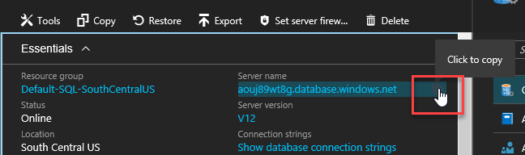

## Connect to the database from Visual Studio
Use Visual Studio to access query results in the output database.

Connect to the SQL database (the destination) from Visual Studio:

1. Open Visual Studio, and then click **Tools** > **Connect to Database**.
2. If asked, click **Microsoft SQL Server** as a data source.
   
    
3. In the **Server name** field, paste the name that you copied in the previous section from the Azure portal (that is, *servername*.database.windows.net).
4. Click **Use SQL Server Authentication**.
5. Enter **tolladmin** in the **User name** field and **123toll!** in the **Password** field.
6. Click **Select or enter a database name**, and select **TollDataDB** as the database.
   
    
7. Click **OK**.
8. Open Server Explorer.
   
    
9. See four tables in the TollDataDB database.
   
    

## Event generator: TollApp sample project
The PowerShell script automatically starts to send events by using the TollApp sample application program. You don’t need to perform any additional steps.

However, if you are interested in implementation details, you can find the source code of the TollApp application in GitHub [samples/TollApp](https://aka.ms/azure-stream-analytics-toll-source).


## Create a Stream Analytics job
1. In the Azure portal, click the green plus sign in the top-left corner of the page to create a new Stream Analytics job. Select **Intelligence + Analytics** and then click **Stream Analytics job**.
   
    
2. Provide a job name, validate the subscription is correct and then create a new Resource group in the same region as the Event hub storage (default is South Central US for the script).
3. Click **Pin to dashboard** and then **CREATE** at the bottom of the page.
   
    

## Define input sources
1. The job will create and open the job page. Or you can click the created analytics job on the portal dashboard.

2. Click the **INPUTS** tab to define the source data.
   
    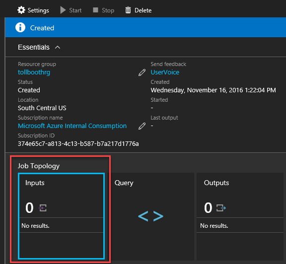
3. Click **ADD AN INPUT**.
   
    
4. Enter **EntryStream** as **INPUT ALIAS**.
5. Source Type is **Data Stream**
6. Source is **Event hub**.
7. **Service bus namespace** should be the TollData one in the drop down.
8. **Event hub name** should be set to **entry**.
9. **Event hub policy name*is **RootManageSharedAccessKey**  (the default value).
10. Select **JSON** for **EVENT SERIALIZATION FORMAT** and **UTF8** for **ENCODING**.
   
    Your settings will look like:
   
    

10. Click **Create** at the bottom of the page to finish the wizard.
    
    Now that you've created the entry stream, you will follow the same steps to create the exit stream. Be sure to enter values as on the following screenshot.
    
    
    
    You have defined two input streams:
    
    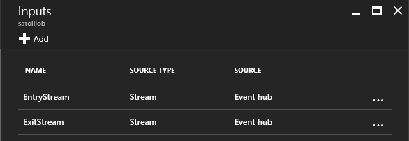
    
    Next, you will add reference data input for the blob file that contains car registration data.
11. Click **ADD**, and then follow the same process for the stream inputs but select **REFERENCE DATA** instead of **Data Stream** and the **Input Alias** is **Registration**.

12. storage account that starts with **tolldata**. The container name should be **tolldata**, and the **PATH PATTERN** should be **registration.json**. This file name is case sensitive and should be **lowercase**.
    
    
13. Click **Create** to finish the wizard.

Now all inputs are defined.

## Define output
1. On the Stream Analytics job overview pane, select **OUTPUTS**.
   
    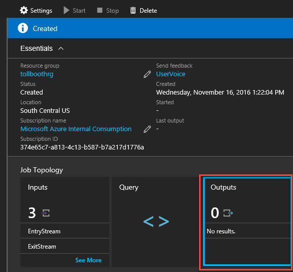
2. Click **Add**.
3. Set the **Output alias** to 'output' and then **Sink** to **SQL database**.
3. Select the server name that was used in the “Connect to Database from Visual Studio” section of the article. The database name is **TollDataDB**.
4. Enter **tolladmin** in the **USERNAME** field, **123toll!** in the **PASSWORD** field, and **TollDataRefJoin** in the **TABLE** field.
   
    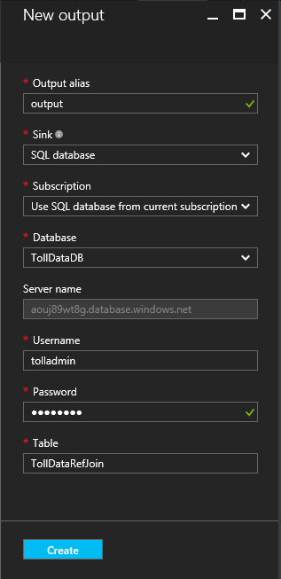
5. Click **Create**.

## Azure Stream analytics query
The **QUERY** tab contains a SQL query that transforms the incoming data.

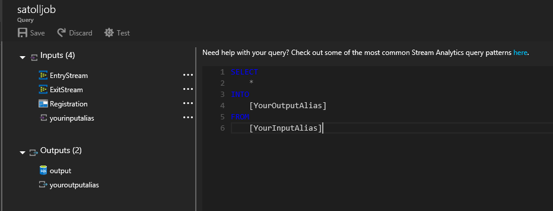

This tutorial attempts to answer several business questions that are related to toll data and constructs Stream Analytics queries that can be used in Azure Stream Analytics to provide a relevant answer.

Before you start your first Stream Analytics job, let’s explore a few scenarios and the query syntax.

## Introduction to Azure Stream Analytics query language
- - -
Let’s say that you need to count the number of vehicles that enter a toll booth. Because this is a continuous stream of events, you have to define a “period of time.” Let's modify the question to be “How many vehicles enter a toll booth every three minutes?”. This is commonly referred to as the tumbling count.

Let’s look at the Azure Stream Analytics query that answers this question:

    SELECT TollId, System.Timestamp AS WindowEnd, COUNT(*) AS Count
    FROM EntryStream TIMESTAMP BY EntryTime
    GROUP BY TUMBLINGWINDOW(minute, 3), TollId

As you can see, Azure Stream Analytics uses a query language that's like SQL and adds a few extensions to specify time-related aspects of the query.

For more details, read about [Time Management](https://msdn.microsoft.com/library/azure/mt582045.aspx) and [Windowing](https://msdn.microsoft.com/library/azure/dn835019.aspx)
constructs used in the query from MSDN.

## Testing Azure Stream Analytics queries
Now that you have written your first Azure Stream Analytics query, it is time to test it by using sample data files located in your TollApp folder in the following path:

**..\\TollApp\\TollApp\\Data**

This folder contains the following files:

* Entry.json
* Exit.json
* Registration.json

## Question 1: Number of vehicles entering a toll booth
1. Open the Azure portal and go to your created Azure Stream Analytics job. Click the **QUERY** tab and paste query from the previous section.

2. To validate this query against sample data, upload the data into the EntryStream input by clicking the ... symbol and selecting **Upload sample data from file**.

    
3. In the pane that appears select the file (Entry.json) on your local machine and click **OK**. The **Test** icon will now illuminate and be clickable.
   
    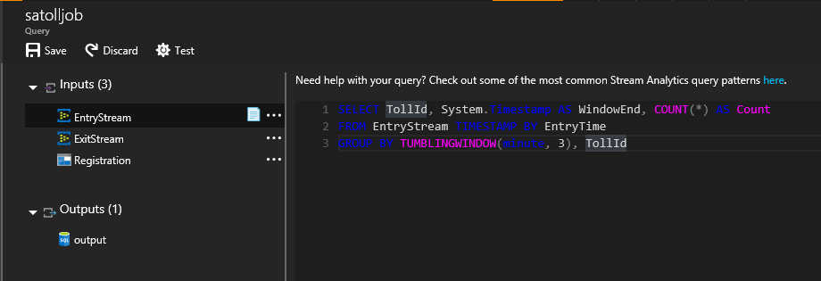
3. Validate that the output of the query is as expected:
   
    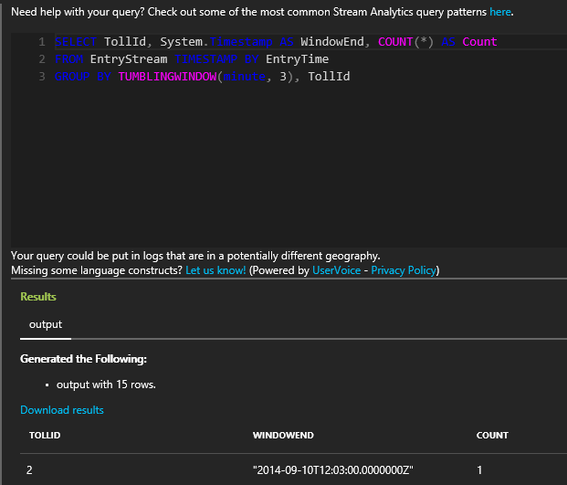

## Question 2: Report total time for each car to pass through the toll booth
The average time that's required for a car to pass through the toll helps to assess the efficiency of the process and the customer experience.

To find the total time, you need to join the EntryTime stream with the ExitTime stream. You will join the streams on TollId and LicencePlate columns. The **JOIN** operator requires you to specify temporal leeway that describes the acceptable time difference between the joined events. You will use **DATEDIFF** function to specify that events should be no more than 15 minutes from each other. You will also apply the **DATEDIFF** function to exit and entry times to compute the actual time that a car spends in the toll station. Note the difference of the use of **DATEDIFF** when it's used in a **SELECT** statement rather than a **JOIN** condition.

    SELECT EntryStream.TollId, EntryStream.EntryTime, ExitStream.ExitTime, EntryStream.LicensePlate, DATEDIFF (minute , EntryStream.EntryTime, ExitStream.ExitTime) AS DurationInMinutes
    FROM EntryStream TIMESTAMP BY EntryTime
    JOIN ExitStream TIMESTAMP BY ExitTime
    ON (EntryStream.TollId= ExitStream.TollId AND EntryStream.LicensePlate = ExitStream.LicensePlate)
    AND DATEDIFF (minute, EntryStream, ExitStream ) BETWEEN 0 AND 15

1. To test this query, update the query on the **QUERY** for the job. Add the test file for **ExitStream** just like **EntryStream** was entered above.
   
2. Click **Test**.

3. Select the check box to test the query and view the output:
   
    

## Question 3: Report all commercial vehicles with expired registration
Azure Stream Analytics can use static snapshots of data to join with temporal data streams. To demonstrate this capability, use the following sample question.

If a commercial vehicle is registered with the toll company, it can pass through the toll booth without being stopped for inspection. You will use Commercial Vehicle Registration lookup table to identify all commercial vehicles that have expired registrations.

```
SELECT EntryStream.EntryTime, EntryStream.LicensePlate, EntryStream.TollId, Registration.RegistrationId
FROM EntryStream TIMESTAMP BY EntryTime
JOIN Registration
ON EntryStream.LicensePlate = Registration.LicensePlate
WHERE Registration.Expired = '1'
```

To test a query by using reference data, you need to define an input source for the reference data, which you have done already.

To test this query, paste the query into the **QUERY** tab, click **Test**, and specify the two input sources and the registration sample data and click **Test**.  
   


## Start the Stream Analytics job
Now it's time to finish the configuration and start the job. Save the query from Question 3, which will produce output that matches the schema of the **TollDataRefJoin** output table.

Go to the job **DASHBOARD**, and click **START**.

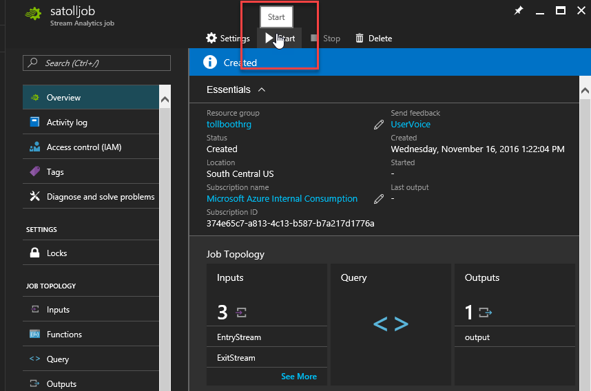

In the dialog box that opens, change the **START OUTPUT** time to **CUSTOM TIME**. Change the hour to one hour before the current time. This change ensures that all events from the event hub are processed since you started to generate the events at the beginning of the tutorial. Now click the **Start** button to start the job.


Starting the job can take a few minutes. You can see the status on the top-level page for Stream Analytics.

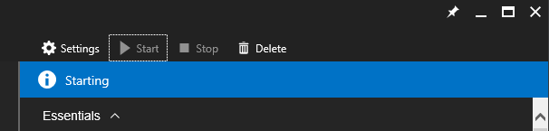

## Check results in Visual Studio
1. Open Visual Studio Server Explorer, and right-click the **TollDataRefJoin** table.
2. Click **Show Table Data** to see the output of your job.
   
    

## Scale out Azure Stream Analytics jobs
Azure Stream Analytics is designed to elastically scale so that it can handle a lot of data. The Azure Stream Analytics query can use a **PARTITION BY** clause to tell the system that this step will scale out. **PartitionId** is a special column that the system adds to match the partition ID of the input (event hub).

    SELECT TollId, System.Timestamp AS WindowEnd, COUNT(*)AS Count
    FROM EntryStream TIMESTAMP BY EntryTime PARTITION BY PartitionId
    GROUP BY TUMBLINGWINDOW(minute,3), TollId, PartitionId

1. Stop the current job, update the query in the **QUERY** tab, and open the **Settings** gear in the job dashboard. Click **Scale**.
   
    **STREAMING UNITS** define the amount of compute power that the job can receive.
2. Change the drop down from 1 from 6.
   
    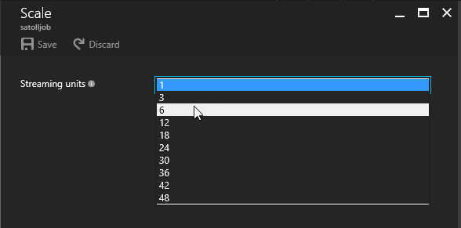
3. Go to the **OUTPUTS** tab and change the name of the SQL table to **TollDataTumblingCountPartitioned**.

If you start the job now, Azure Stream Analytics can distribute work across more compute resources and achieve better throughput. Please note that the TollApp application is also sending events partitioned by TollId.

## Monitor
The **MONITOR** area contains statistics about the running job. First time configuration is needed to use the storage account in the same region (name toll like the rest of this document).   


You can access **Activity Logs** from the job dashboard **Settings** area as well.


## Conclusion
This tutorial introduced you to the Azure Stream Analytics service. It demonstrated how to configure inputs and outputs for the Stream Analytics job. Using the Toll Data scenario, the tutorial explained common types of problems that arise in the space of data in motion and how they can be solved with simple SQL-like queries in Azure Stream Analytics. The tutorial described SQL extension constructs for working with temporal data. It showed how to join data streams, how to enrich the data stream with static reference data, and how to scale out a query to achieve higher throughput.

Although this tutorial provides a good introduction, it is not complete by any means. You can find more query patterns using the SAQL language at [Query examples for common Stream Analytics usage patterns](stream-analytics-stream-analytics-query-patterns.md).
Refer to the [online documentation](https://azure.microsoft.com/documentation/services/stream-analytics/) to learn more about Azure Stream Analytics.

## Clean up your Azure account
1. Stop the Stream Analytics job in the Azure portal.
   
    The Setup.ps1 script creates two event hubs and a SQL database. The following instructions help you clean up resources at the end of the tutorial.
2. In a PowerShell window, type **.\\Cleanup.ps1** to start the script that deletes resources used in the tutorial.
   
   > [!NOTE]
   > Resources are identified by the name. Make sure you carefully review each item before confirming removal.
   > 
   > 


