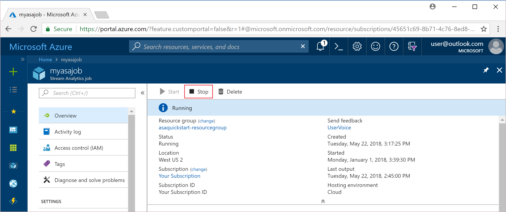
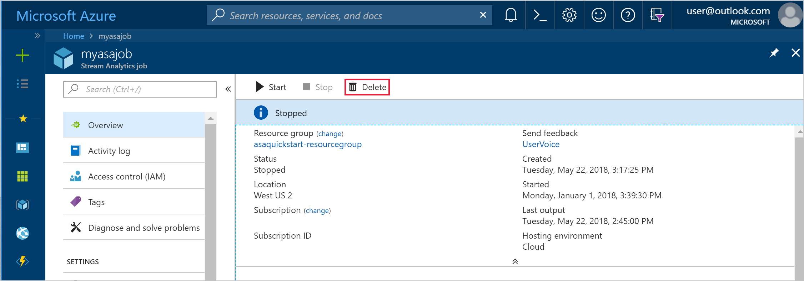

# Clean up your Azure Stream Analytics job

Azure Stream Analytics jobs can be easily deleted through the Azure portal or Azure PowerShell.

>[!NOTE] 
>When you stop your Stream Analytics job, the data persists only in the input and output storage, such as Event Hubs, Azure SQL Database, etc. If you are required to remove data from Azure, be sure to follow the removal process for the input and output resources of your Stream Analytics job.

## Stop a job in Azure portal

1. Sign in to the [Azure portal](https://portal.azure.com). 

2. Locate your running Stream Analytics job and select it.

3. On the Stream Analytics job page, select **Stop** to stop the job. 

   

## Delete a job in Azure portal

1. Sign in to the Azure portal. 

2. Locate your existing Stream Analytics job and select it.

3. On the Stream Analytics job page, select **Delete** to delete the job. 

   

## Stop or delete a job using PowerShell

To stop or delete a job using PowerShell, refer to [Monitor and manage Stream Analytics jobs with Azure PowerShell cmdlets](stream-analytics-monitor-and-manage-jobs-use-powershell.md).