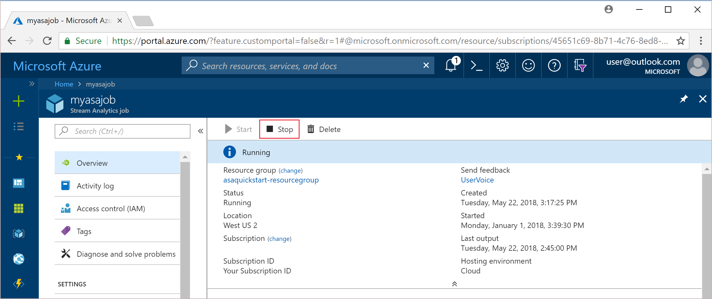

# Stop or delete your Azure Stream Analytics job

Azure Stream Analytics jobs can be easily stopped or deleted through the Azure portal, Azure PowerShell, Azure SDK for .Net, or REST API. A Stream Analytics job cannot be recovered once it has been deleted.

>[!NOTE] 
>When you stop your Stream Analytics job, the data persists only in the input and output storage, such as Event Hubs or Azure SQL Database. If you are required to remove data from Azure, be sure to follow the removal process for the input and output resources of your Stream Analytics job.

## Stop a job in Azure portal

When you stop a job, the resources are deprovisionned and it stops processing events. Charges related to this job are also stopped. However all your configuration are kept and you can restart the job later 

1. Sign in to the [Azure portal](https://portal.azure.com). 

2. Locate your running Stream Analytics job and select it.

3. On the Stream Analytics job page, select **Stop** to stop the job. 

   

## Delete a job in Azure portal

>[!WARNING] 
>A Stream Analytics job cannot be recovered once it has been deleted.

1. Sign in to the Azure portal. 

2. Locate your existing Stream Analytics job and select it.

3. On the Stream Analytics job page, select **Delete** to delete the job. 

   

## Stop or delete a job using PowerShell

[!INCLUDE [updated-for-az](../../includes/updated-for-az.md)]

To stop a job using PowerShell, use the [Stop-AzStreamAnalyticsJob](https://docs.microsoft.com/powershell/module/az.streamanalytics/stop-azstreamanalyticsjob) cmdlet. To delete a job using PowerShell, use the [Remove-AzStreamAnalyticsJob](https://docs.microsoft.com/powershell/module/az.streamanalytics/Remove-azStreamAnalyticsJob) cmdlet.

## Stop or delete a job using Azure SDK for .NET

To stop a job using Azure SDK for .NET, use the [StreamingJobsOperationsExtensions.BeginStop](https://docs.microsoft.com/dotnet/api/microsoft.azure.management.streamanalytics.streamingjobsoperationsextensions.beginstop?view=azure-dotnet) method. To delete a job using Azure SDK for .NET, [StreamingJobsOperationsExtensions.BeginDelete](https://docs.microsoft.com/dotnet/api/microsoft.azure.management.streamanalytics.streamingjobsoperationsextensions.begindelete?view=azure-dotnet) method.

## Stop or delete a job using REST API

To stop a job using REST API, refer to the [Stop](https://docs.microsoft.com/rest/api/streamanalytics/stream-analytics-job#stop) method. To delete a job using REST API, refer to the [Delete](https://docs.microsoft.com/rest/api/streamanalytics/stream-analytics-job#delete) method.
