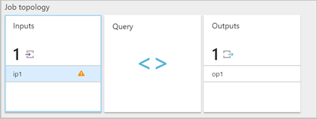
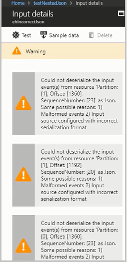

# Common issues in Stream Analytics and steps to troubleshoot

## Troubleshoot malformed input events

 Serialization issues are caused when the input stream of your Stream Analytics job contains malformed messages. For example, a malformed message could be caused by a missing parenthesis or a missing brace in a JSON object, or incorrect time stamp format in a time field. 
 
 When a Stream Analytics job receives a malformed message from an input, it drops the message and notifies user with a warning. A warning symbol is shown on the **Inputs** tile of your Stream Analytics job (This warning sign exists as long as the job is in running state):

To see more information, enable the diagnostics logs to view the details of the warning. For malformed input events, the execution logs contain an entry with the message that looks like: "Message: Could not deserialize the input event(s) from resource <blob URI> as json". 

### Troubleshooting steps

1. Navigate to the input tile and click to view warnings.

2. The input details tile displays a set of warnings with details about the issue. Following is an example warning message, the warning message shows the Partition, Offset, and sequence numbers where there is malformed JSON data. 

   

3. To get the JSON data that has incorrect format, run the CheckMalformedEvents.cs code. This example is available in the [GitHub samples repository](https://github.com/Azure/azure-stream-analytics/tree/master/Samples/CheckMalformedEventsEH). This code reads the partition ID, offset, and prints the data that's located in that offset. 

4. Once you read the data, you can analyze and correct the serialization format.

5. You can also [read events from an IoT Hub with the Service Bus Explorer](https://code.msdn.microsoft.com/How-to-read-events-from-an-1641eb1b).

## Delayed output

### First output is delayed
When a Stream Analytics job is started, the input events are read, but there can be a delay in the output being produced in certain circumstances.

Large time values in temporal query elements can contribute to the output delay. To produce correct output over the large time windows, the streaming job starts up by reading data from the latest time possible (up to seven days ago) to fill the time window. During that time, no output is produced until the catch-up read of the outstanding input events is complete. This problem can surface when the system upgrades the streaming jobs, thus restarting the job. Such upgrades generally occur once every couple of months. 

Therefore, use discretion when designing your Stream Analytics query. If you use a large time window (more than several hours, up to seven days) for temporal elements in the job's query syntax, it can lead to a delay on the first output when the job is started or restarted.  

One mitigation for this kind of first output delay is to use query parallelization techniques (partitioning the data), or add more Streaming Units to improve the throughput until the job catches up.  For more information, see [Considerations when creating Stream Analytics jobs](stream-analytics-concepts-checkpoint-replay.md)

These factors impact the timeliness of the first output that is generated:

1. Use of windowed aggregates (GROUP BY of Tumbling, Hopping, and Sliding windows)
   - For tumbling or hopping window aggregates, results are generated at the end of the window timeframe. 
   - For a sliding window, the results are generated when an event enters or exits the sliding window. 
   - If you are planning to use large window size (> 1 hour), it’s best to choose hopping or sliding window so that you can see the output more frequently.

2. Use of temporal joins (JOIN with DATEDIFF)
   - Matches are generated as soon as when both sides of the matched events arrive.
   - Data that lacks a match (LEFT OUTER JOIN) is generated at the end of the DATEDIFF window with respect to each event on the left side.

3. Use of temporal analytic functions (ISFIRST, LAST, and LAG with LIMIT DURATION)
   - For analytic functions, the output is generated for every event, there is no delay.

### Output falls behind
During normal operation of the job, if you find the job’s output is falling behind (longer and longer latency), you can pinpoint the root causes by examining these factors:
- Whether the downstream sink is throttled
- Whether the upstream source is throttled
- Whether the processing logic in the query is compute-intensive

To see those details, in the Azure portal, select the streaming job, and select the **Job diagram**. For each input, there is a per partition backlog event metric. If the backlog event metric keeps increasing, it’s an indicator that the system resources are constrained. Potentially that is due to of output sink throttling, or high CPU. For more information on using the job diagram, see [Data-driven debugging by using the job diagram](stream-analytics-job-diagram-with-metrics.md).

## Handle duplicate records in Azure SQL Database output

When you configure Azure SQL database as output to a Stream Analytics job, it bulk inserts records into the destination table. In general, Azure stream analytics guarantees [at least once delivery]( https://msdn.microsoft.com/azure/stream-analytics/reference/event-delivery-guarantees-azure-stream-analytics) to the output sink, one can still [achieve exactly-once delivery]( https://blogs.msdn.microsoft.com/streamanalytics/2017/01/13/how-to-achieve-exactly-once-delivery-for-sql-output/) to SQL output when SQL table has a unique constraint defined. 

Once unique key constraints are set up on the SQL table, and there are duplicate records being inserted into SQL table, Azure Stream Analytics removes the duplicate record. It splits the data into batches and recursively inserting the batches until a single duplicate record is found. If the streaming job has a considerable number of duplicate rows, this split and insert process has to ignore the duplicates one by one, which is less efficient and time-consuming. If you see multiple key violation warning messages in your Activity log within the past hour, it’s likely that your SQL output is slowing down the entire job. 

To resolve this issue, you should [configure the index]( https://docs.microsoft.com/sql/t-sql/statements/create-index-transact-sql) that is causing the key violation by enabling the IGNORE_DUP_KEY option. Enabling this option allows duplicate values to be ignored by SQL during bulk inserts and SQL Azure simply produces a warning message instead of an error. Azure Stream Analytics does not produce primary key violation errors anymore.

Note the following observations when configuring IGNORE_DUP_KEY for several types of indexes:

* You cannot set IGNORE_DUP_KEY on a primary key or a unique constraint that uses ALTER INDEX, you need to drop and recreate the index.  
* You can set the IGNORE_DUP_KEY option using ALTER INDEX for a unique index, which is different from PRIMARY KEY/UNIQUE constraint and created using CREATE INDEX or INDEX definition.  
* IGNORE_DUP_KEY doesn’t apply to column store indexes because you can’t enforce uniqueness on such indexes.  

## Next steps
* [Azure Stream Analytics Query Language Reference](https://msdn.microsoft.com/library/azure/dn834998.aspx)
* [Azure Stream Analytics Management REST API Reference](https://msdn.microsoft.com/library/azure/dn835031.aspx)
