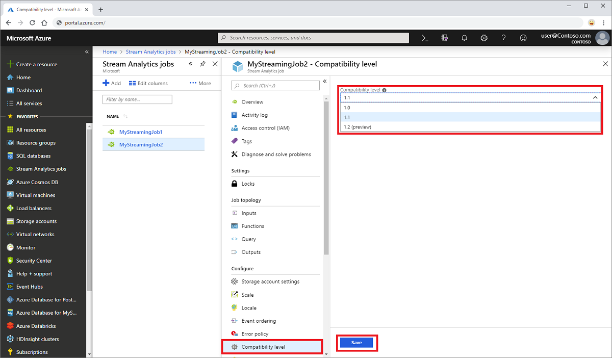

# Compatibility level for Azure Stream Analytics jobs
 
Compatibility level refers to the release-specific behaviors of an Azure Stream Analytics service. Azure Stream Analytics is a managed service, with regular feature updates, and performance improvements. Usually updates are automatically made available to end users. However, some new features may introduce major changes such as- change in the behavior of an existing job, change in the processes consuming data from these jobs etc. A compatibility level is used to represent a major change introduced in Stream Analytics. Major changes are always introduced with a new compatibility level. 

Compatibility level makes sure existing jobs run without any failure. When you create a new Stream Analytics job, it's a best practice to create it by using the latest compatibility level. 
 
## Set a compatibility level 

Compatibility level controls the runtime behavior of a stream analytics job. You can set the compatibility level for a Stream Analytics job by using portal or by using the [create job REST API call](https://docs.microsoft.com/rest/api/streamanalytics/stream-analytics-job). Azure Stream Analytics currently supports two compatibility levels- "1.0" and "1.1". By default, the compatibility level is set to "1.0" which was introduced during general availability of Azure Stream Analytics. To update the default value, navigate to your existing Stream Analytics job > select the **Compatibility Level** option in **Configure** section and change the value. 

Make sure that you stop the job before updating the compatibility level. You can’t update the compatibility level if your job is in a running state. 

 
When you update the compatibility level, the T-SQL compiler validates the job with the syntax that corresponds to the selected compatibility level. 

## Major changes in the latest compatibility level (1.2)

The following major changes are introduced in compatibility level 1.2:

### Geospatial functions 

**previous versions:** Azure Stream Analytics used Geography calculations.

**current version:** Azure Stream Analytics allows you to compute Geometric projected geo coordinates. There's no change in the signature of the geospatial functions. However, their semantics is slightly different, allowing more precise computation than before.

Azure Stream Analytics supports geospatial reference data indexing. Reference Data containing geospatial elements can be indexed for a faster join computation.

The updated geospatial functions bring the full expressiveness of Well Known Text (WKT) geospatial format. You can specify other geospatial components that weren't previously supported with GeoJson.

For more information, see [Updates to geospatial features in Azure Stream Analytics – Cloud and IoT Edge](https://azure.microsoft.com/blog/updates-to-geospatial-functions-in-azure-stream-analytics-cloud-and-iot-edge/).

### Parallel query execution for input sources with multiple partitions 

**previous versions:** Azure Stream Analytics queries required the use of PARTITION BY clause to parallelize query processing across input source partitions.

**current version:** If query logic can be parallelized across input source partitions, Azure Stream Analytics creates separate query instances and runs computations in parallel.

### Native Bulk API integration with CosmosDB output

**previous versions:** The upsert behavior was *insert or merge*.

**current version:** Native Bulk API integration with CosmosDB output maximizes throughput and efficiently handles throttling requests.

The upsert behavior is *insert or replace*.

### DateTimeOffset when writing to SQL output

**previous versions:** [DateTimeOffset](https://docs.microsoft.com/sql/t-sql/data-types/datetimeoffset-transact-sql?view=sql-server-2017) types were adjusted to UTC.

**current version:** DateTimeOffset is no longer adjusted.

### Strict validation of prefix of functions

**previous versions:** There was no strict validation of function prefixes.

**current version:** Azure Stream Analytics has a strict validation of function prefixes. Adding a prefix to a built-in function causes an error. For example,`myprefix.ABS(…)` isn't supported.

Adding a prefix to built-in aggregates also results in error. For example, `myprefix.SUM(…)` isn't supported.

Using the prefix "system" for any user-defined functions results in error.

### Disallow Array and Object as key properties in Cosmos DB output adapter

**previous versions:** Array and Object types were supported as a key property.

**current version:** Array and Object types are no longer supported as a key property.

## Next steps
* [Troubleshoot Azure Stream Analytics inputs](stream-analytics-troubleshoot-input.md)
* [Stream Analytics Resource health](stream-analytics-resource-health.md)
