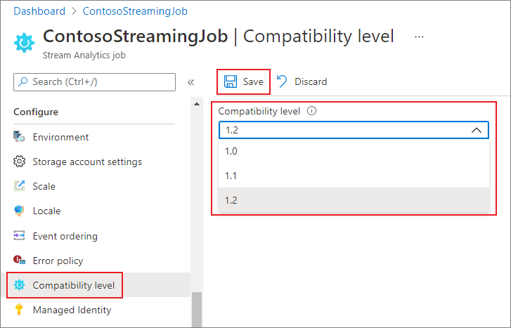

# Compatibility level for Azure Stream Analytics jobs

This article describes the compatibility level option in Azure Stream Analytics.

Stream Analytics is a managed service, with [regular feature updates and constant performance improvements](https://azure.microsoft.com/updates/?product=stream-analytics). Most of the service's runtimes updates are automatically made available to end users, independently from the compatibility level. However, when a new functionality introduces a change in the behavior of existing jobs, or a change in the way data is consumed in running jobs, we introduce this change under a new compatibility level. 
You can keep your existing Stream Analytics jobs running without major changes by leaving the compatibility level setting lowered. When you are ready for the latest runtime behaviors, you can opt-in by raising the compatibility level.

## Choose a compatibility level

Compatibility level controls the runtime behavior of a stream analytics job.

Azure Stream Analytics currently supports three compatibility levels:

* 1.2 - Newest behavior with most recent improvements
* 1.1 - Previous behavior
* 1.0 - Original compatibility level, introduced during general availability of Azure Stream Analytics several years ago. 

When you create a new Stream Analytics job, it's a best practice to create it by using the latest compatibility level. Start your job design relying upon the latest behaviors, to avoid added change and complexity later on.

## Set the compatibility level

You can set the compatibility level for a Stream Analytics job in the Azure portal or by using the [create job REST API call](/rest/api/streamanalytics/2020-03-01/streaming-jobs/create-or-replace#compatibilitylevel).

To update the compatibility level of the job in the Azure portal:

1. Use the [Azure portal](https://portal.azure.com) to locate to your Stream Analytics job.
2. **Stop** the job before updating the compatibility level. You can't update the compatibility level if your job is in a running state.
3. Under the **Configure** heading, select **Compatibility level**.
4. Choose the compatibility level value that you want.
5. Select **Save** at the bottom of the page.

When you update the compatibility level, the T-compiler validates the job with the syntax that corresponds to the selected compatibility level.

## Compatibility level 1.2

The following major changes are introduced in compatibility level 1.2:

###  AMQP messaging protocol

**1.2 level**: Azure Stream Analytics uses [Advanced Message Queueing Protocol (AMQP)](../service-bus-messaging/service-bus-amqp-overview.md) messaging protocol to write to Service Bus Queues and Topics. AMQP enables you to build cross-platform, hybrid applications using an open standard protocol.

### Geospatial functions

**Previous levels:** Azure Stream Analytics used Geography calculations.

**1.2 level:** Azure Stream Analytics allows you to compute Geometric projected geo coordinates. There's no change in the signature of the geospatial functions. However, their semantics is slightly different, allowing more precise computation than before.

Azure Stream Analytics supports geospatial reference data indexing. Reference Data containing geospatial elements can be indexed for a faster join computation.

The updated geospatial functions bring the full expressiveness of Well Known Text (WKT) geospatial format. You can specify other geospatial components that weren't previously supported with GeoJson.

For more information, see [Updates to geospatial features in Azure Stream Analytics – Cloud and IoT Edge](https://azure.microsoft.com/blog/updates-to-geospatial-functions-in-azure-stream-analytics-cloud-and-iot-edge/).

### Parallel query execution for input sources with multiple partitions

**Previous levels:** Azure Stream Analytics queries required the use of PARTITION BY clause to parallelize query processing across input source partitions.

**1.2 level:** If query logic can be parallelized across input source partitions, Azure Stream Analytics creates separate query instances and runs computations in parallel.

### Native Bulk API integration with Azure Cosmos DB output

**Previous levels:** The upsert behavior was *insert or merge*.

**1.2 level:** Native Bulk API integration with Azure Cosmos DB output maximizes throughput and efficiently handles throttling requests. For more information, see [the Azure Stream Analytics output to Azure Cosmos DB page](./stream-analytics-documentdb-output.md#improved-throughput-with-compatibility-level-12).

The upsert behavior is *insert or replace*.

### DateTimeOffset when writing to SQL output

**Previous levels:** [DateTimeOffset](/sql/t-sql/data-types/datetimeoffset-transact-sql) types were adjusted to UTC.

**1.2 level:** DateTimeOffset is no longer adjusted.

### Long when writing to SQL output

**Previous levels:** Values were truncated based on the target type.

**1.2 level:** Values that do not fit into the target type are handled according to the output error policy.

### Record and array serialization when writing to SQL output

**Previous levels:** Records were written as "Record" and arrays were written as "Array".

**1.2 level:** Records and arrays are serialized in JSON format.

### Strict validation of prefix of functions

**Previous levels:** There was no strict validation of function prefixes.

**1.2 level:** Azure Stream Analytics has a strict validation of function prefixes. Adding a prefix to a built-in function causes an error. For example,`myprefix.ABS(…)` isn't supported.

Adding a prefix to built-in aggregates also results in error. For example, `myprefix.SUM(…)` isn't supported.

Using the prefix "system" for any user-defined functions results in error.

### Disallow Array and Object as key properties in Azure Cosmos DB output adapter

**Previous levels:** Array and Object types were supported as a key property.

**1.2 level:** Array and Object types are no longer supported as a key property.

### Deserializing boolean type in JSON, AVRO and PARQUET

**Previous levels:** Azure Stream Analytics deserializes Boolean value into type BIGINT - false maps to 0 and true maps to 1. The output only creates boolean values in JSON, AVRO, and PARQUET if you explicitly convert events to BIT.
For example, a pass-through query like `SELECT value INTO output1 FROM input1` reading a JSON `{ "value": true }` from input1 will write into the output1 a JSON value `{ "value": 1 }`.

**1.2 level:** Azure Stream Analytics deserializes Boolean value into type BIT. False maps to 0 and true maps to 1. A pass-through query like `SELECT value INTO output1 FROM input1` reading a JSON `{ "value": true }` from input1 will write into the output1 a JSON value `{ "value": true }`. You can cast value to type BIT in the query to ensure they appear as true and false in the output for formats supporting boolean type.

## Compatibility level 1.1

The following major changes are introduced in compatibility level 1.1:

### Service Bus XML format

**1.0 level:** Azure Stream Analytics used DataContractSerializer, so the message content included XML tags. For example:

`@\u0006string\b3http://schemas.microsoft.com/2003/10/Serialization/\u0001{ "SensorId":"1", "Temperature":64\}\u0001`

**1.1 level:** The message content contains the stream directly with no additional tags. For example:
`{ "SensorId":"1", "Temperature":64}`

### Persisting case-sensitivity for field names

**1.0 level:** Field names were changed to lower case when processed by the Azure Stream Analytics engine.

**1.1 level:** case-sensitivity is persisted for field names when they are processed by the Azure Stream Analytics engine.

> [!NOTE]
> Persisting case-sensitivity isn't yet available for Stream Analytic jobs hosted by using Edge environment. As a result, all field names are converted to lowercase if your job is hosted on Edge.

### FloatNaNDeserializationDisabled

**1.0 level:** CREATE TABLE command did not filter events with NaN (Not-a-Number. For example, Infinity, -Infinity) in a FLOAT column type because they are out of the documented range for these numbers.

**1.1 level:** CREATE TABLE allows you to specify a strong schema. The Stream Analytics engine validates that the data conforms to this schema. With this model, the command can filter events with NaN values.

### Disable automatic conversion of datetime strings to DateTime type at ingress for JSON

**1.0 level:** The JSON parser would automatically convert string values with date/time/zone information to DATETIME type at ingress so the value immediately loses its original formatting and timezone information. Because this is done at ingress, even if that field was not used in the query, it is converted into UTC DateTime.

**1.1 level:** There is no automatic conversion of string values with date/time/zone information to DATETIME type. As a result, timezone information and original formatting are kept. However, if the NVARCHAR(MAX) field is used in the query as part of a DATETIME expression (DATEADD function, for example), it's converted to DATETIME type to perform the computation and it loses its original form.

## Next steps

* [Troubleshoot Azure Stream Analytics inputs](stream-analytics-troubleshoot-input.md)
* [Stream Analytics Resource health](./stream-analytics-troubleshoot-query.md)
