<properties 
	pageTitle="Create Stream Analytics Inputs | Microsoft Azure" 
	description="Learn how to connect to and configure the input sources for Stream Analytics solutions."
	documentationCenter=""
	services="stream-analytics"
	authors="jeffstokes72" 
	manager="paulettm" 
	editor="cgronlun"/>

<tags 
	ms.service="stream-analytics" 
	ms.devlang="na" 
	ms.topic="article" 
	ms.tgt_pltfrm="na" 
	ms.workload="data-services" 
	ms.date="08/19/2015" 
	ms.author="jeffstok"/>

# Create Stream Analytics inputs

## Understanding Stream Analytics inputs
---
Stream Analytics inputs are defined as a connection to a data source. Stream Analytics has first class integration with the Azure sources Event Hub and Blob storage from within and outside of the job subscription. As data is sent to that data source, it is consumed by the Stream Analytics job and processed in real time. Inputs are divided into two distinct types: data stream inputs and reference data inputs.

## Data stream inputs
---
Stream Analytics jobs must include at least one data stream input to be consumed and transformed by the job. Azure Blob storage and Azure Event Hubs are supported as data stream input sources. Azure Event Hubs are used to collect event streams from multiple devices and services, such as social media activity feeds, stock trade information or data from sensors.
Alternately, Azure Blob storage can be used as an input source for ingesting bulk data.

## Reference data inputs
---
Stream Analytics supports a second type of input known as reference data. This is auxiliary data which is typically used for performing correlation and look-ups, and the data here is usually static or infrequently changed. Azure Blob storage is currently the only supported input source for reference data. Reference data source blobs are limited to 50MB in size.

## Creating an Event Hub data input stream
---
### Overview of Event Hubs
Event Hubs are a highly scalable event ingestor, and are the most common method of data ingestion to a Stream Analytics job. Event Hubs and Stream Analytics together provide customers an end to end solution for real time analytics -- Event Hubs allow customers to feed events into Azure in real time, and Stream Analytics jobs can process them in real time. For example, customers can send web clicks, sensor readings, online log events to Event Hubs, and create Stream Analytics jobs to use Event Hubs as the input data streams for real time filtering, aggregating and joining. Event Hubs can be used for data egress also. For further details on Event Hubs see the [Event Hubs](https://azure.microsoft.com/services/event-hubs/ "Event Hubs") documentation.

### Consumer groups
Each Stream Analytics Event Hub input should be configured to have its own consumer group. When a job contains a self-join or multiple inputs, some input may be read by more than one reader downstream, which impacts the number of readers in a single consumer group.  To avoid exceeding Event Hub limit of 5 readers per consumer group per partition, it is a best practice to designate a consumer group for each Stream Analytics job. Note that there is also a limit of 20 consumer groups per Event Hub. For details, see the [Event Hubs Programming Guide](https://msdn.microsoft.com/library/azure/dn789972.aspx "Event Hubs Programming Guide").

## Creating an Event Hub input data stream
---
### Adding an Event Hub as a data stream input  ###

1. On the inputs tab of the Stream Analytics job, click **ADD INPUT** and then select the default option, **Data stream**, and click the right button.

    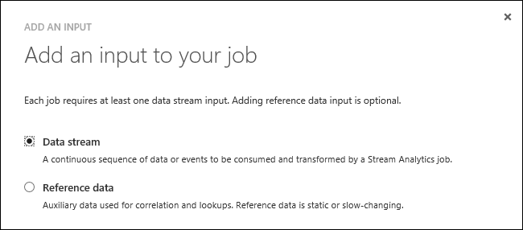  

2. Next select **Event Hub**.

    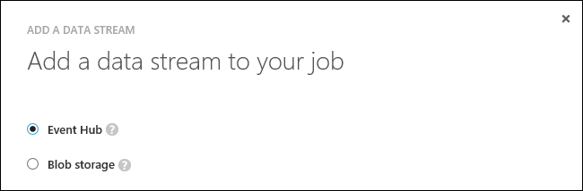  

3. Type or select the following fields and click the right button:

    - **Input Alias**: A friendly name that will be used in the job query to reference this input  
    - **Service Bus Namespace**: A Service Bus namespace is a container for a set of messaging entities. When you created a new Event Hub, you also created a Service Bus namespace.  
    - **Event Hub**: The name of your Event Hub input  
    - **Event Hub Policy Name**: The shared access policy, which can be created on the Event Hub Configure tab. Each shared access policy will have a name, permissions that you set, and access keys.  
    - **Event Hub Consumer Group** (Optional): The Consumer Group to ingest data from the Event Hub. If not specified, Stream Analytics jobs will use the Default Consumer Group to ingest data from the Event Hub. It is recommended to use a distinct consumer Group for each Stream Analytics job.  

    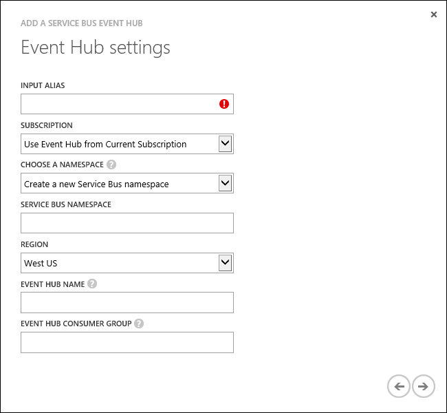  

4. Specify the following settings:

    - **Event Serialization Format**: To make sure your queries work the way you expect, Stream Analytics needs to know which serialization format (JSON, CSV, or Avro) you're using for incoming data streams.  
    - **Encoding**: UTF-8 is the only supported encoding format at this time.  

    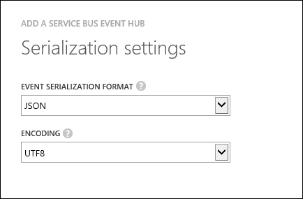  

5. Click the check button to complete the wizard and verify that Stream Analytics can successfully connect to the Event Hub.

## Creating a Blob storage data stream input
---
For scenarios with large amounts of unstructured data to store in the cloud, Blob storage offers a cost-effective and scalable solution. Data in Blob storage is generally considered data “at rest” but it can be processed as a data stream by Stream Analytics. One common scenario for Blob storage inputs with Stream Analytics is log processing, where telemetry is captured from a system and needs to be parsed and processed to extract meaningful data. 
It is important to note that the default timestamp of Blob storage events in Stream Analytics is the timestamp that the blob was created. To process the data as a stream using a timestamp in the event payload, the [TIMESTAMP BY](https://msdn.microsoft.com/library/azure/dn834998.aspx) keyword must be used.
For further information on Blob storage see the [Blob storage](http://azure.microsoft.com/services/storage/blobs/) documentation.

### Adding Blob storage as a data stream input  ###

1. On the inputs tab of the Stream Analytics job, click **ADD INPUT** and then select the default option, **Data stream**, and click the right button.

      

2. Select **Blob storage** and click the right button.

    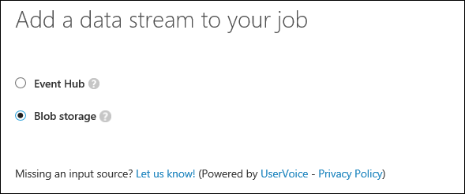  

3. Type or select the following fields:

    - **Input Alias**: A friendly name that  will be used in the job query to reference this input  
    - **Storage Account**: If the storage account is in a different subscription than the streaming job the Storage Account Name and Storage Account Key will be required.  
    - **Storage Container**: Containers provide a logical grouping for blobs stored in the Microsoft Azure Blob service. When you upload a blob to the Blob service, you must specify a container for that blob.  

    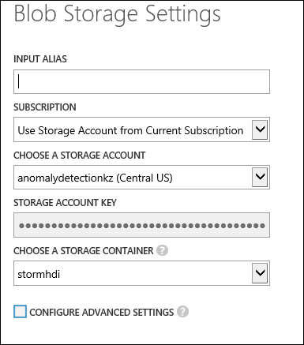  

4. Click the **Configure Advanced Settings** box for the option to configure the Path Prefix Pattern for readings blobs in a customized path. If this field is not specified, Stream Analytics will read all blobs in the container.

    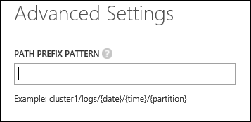  

5. Choose the following settings:

    - **Event Serialization Format**: To make sure your queries work the way you expect, Stream Analytics needs to know which serialization format (JSON, CSV, or Avro) you're using for incoming data streams.  
    - **Encoding**: UTF-8 is the only supported encoding format at this time.  

      

6. Click the check button to complete the wizard and verify that Stream Analytics can successfully connect to the Blob storage account.

## Creating a Blob storage reference data
---
Blob storage can be used to define reference data for a Stream Analytics job.  This is static or slow-changing data that is used for performing lookups or correlating data.
Support for refreshing reference data can be enabled by specifying a path pattern in the input configuration using the {date} and {time} tokens. Stream Analytics will update reference data definitions based on this path pattern. For example, a pattern of `"/sample/{date}/{time}/products.csv"` with a date format of “YYYY-MM-DD” and a time format of “HH:mm” tells Stream Analytics to pick up the updated blob `"/sample/2015-04-16/17:30/products.csv"` at 5:30 PM on April 16th 2015 UTC time zone .

> [AZURE.NOTE] Currently Stream Analytics jobs look for reference blob refresh data only when the time coincides with the time encoded in the blob name: e.g. jobs look for /sample/2015-04-16/17:30/products.csv between 5:30 PM and 5:30:59.999999999PM on April 16th 2015 UTC time zone. When the clock strikes 5:31PM it stops looking for /sample/2015-04-16/17:30/products.csv and starts looking for /sample/2015-04-16/17:31/products.csv.

The only time previous reference data blobs are considered is when the job starts. At that time the job is looking for the blob which has a latest date/time encoded in its name with a value before than the job start time (the newest reference data blob from before the job start time). This is done to ensure there is a non-empty reference data set at the start of the job. If one cannot be found, the job will fail and display a diagnostic notice to the user:

### Adding Blob storage as reference data  ###

1. On the inputs tab of the Stream Analytics job, click **ADD INPUT** and then select **Reference data** and click the right button.

    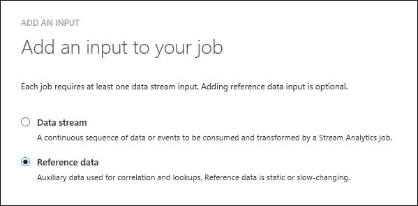  

2.	Type or select the following fields:

    - **Input Alias**: A friendly name that  will be used in the job query to reference this input  
    - **Storage Account**: If the storage account is in a different subscription than the streaming job the Storage Account Name and Storage Account Key will be required.  
    - **Storage Container**: Containers provide a logical grouping for blobs stored in the Microsoft Azure Blob service. When you upload a blob to the Blob service, you must specify a container for that blob.  
    - **Path Pattern**: The file path used to locate your blobs within the specified container. Within the path, you may choose to specify one or more instances of the following 2 variables: {date}, {time}  

    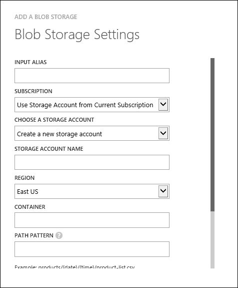  

3. Choose the following settings:

    - **Event Serialization Format**: To make sure your queries work the way you expect, Stream Analytics needs to know which serialization format (JSON, CSV, or Avro) you're using for incoming data streams.  
    - **Encoding**: UTF-8 is the only supported encoding format at this time.  

    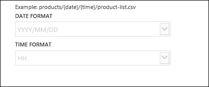  

4.	Click the check button to complete the wizard and verify that Stream Analytics can successfully connect to the Blob storage account.

    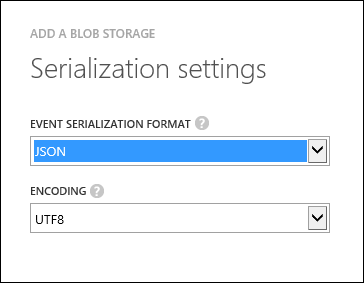  

## Get help
For further assistance, try our [Azure Stream Analytics forum](https://social.msdn.microsoft.com/Forums/en-US/home?forum=AzureStreamAnalytics)

## Next steps

- [Introduction to Azure Stream Analytics](stream-analytics-introduction.md)
- [Get started using Azure Stream Analytics](stream-analytics-get-started.md)
- [Scale Azure Stream Analytics jobs](stream-analytics-scale-jobs.md)
- [Azure Stream Analytics Query Language Reference](https://msdn.microsoft.com/library/azure/dn834998.aspx)
- [Azure Stream Analytics Management REST API Reference](https://msdn.microsoft.com/library/azure/dn835031.aspx)
