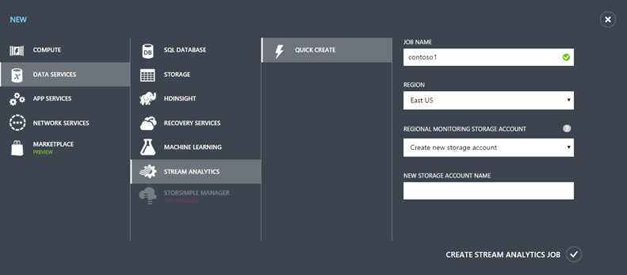
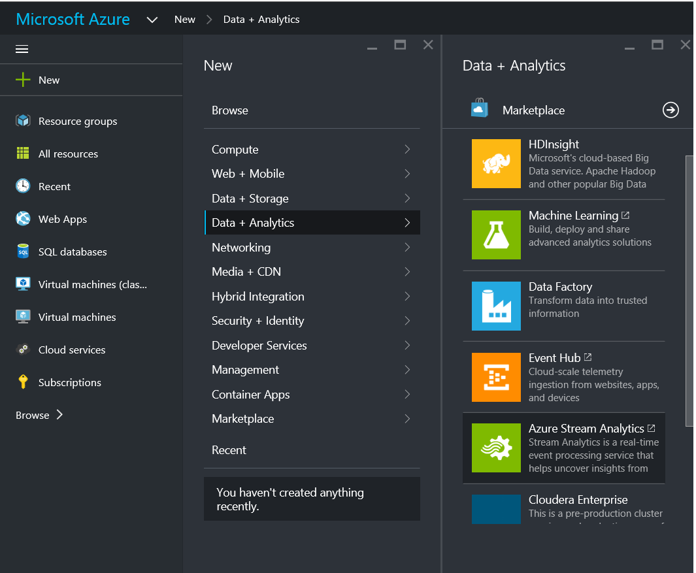
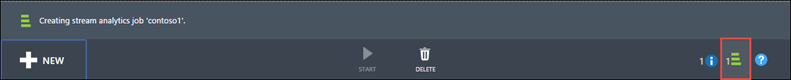
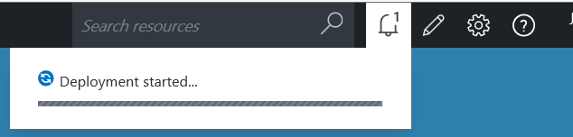
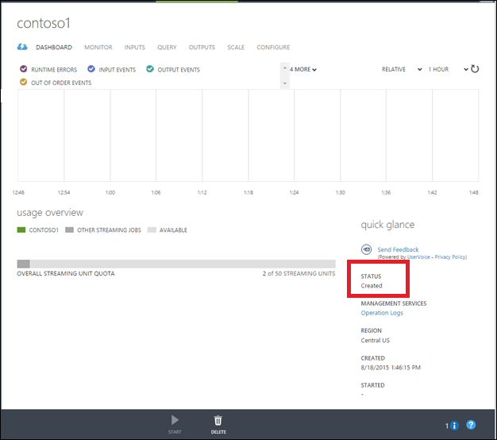
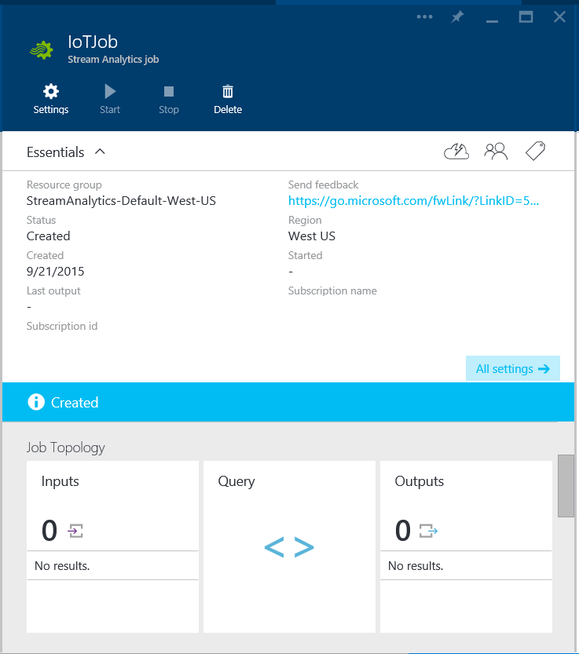

<properties 
	pageTitle="How to create a data analytics processing job for Stream Analytics | Microsoft Azure" 
	description="Create a data analytics processing job for Stream Analytics | learning path segment."
	keywords="data analytics processing"
	documentationCenter=""
	services="stream-analytics"
	authors="jeffstokes72" 
	manager="paulettm" 
	editor="cgronlun"/>

<tags 
	ms.service="stream-analytics" 
	ms.devlang="na" 
	ms.topic="article" 
	ms.tgt_pltfrm="na" 
	ms.workload="data-services" 
	ms.date="07/27/2016" 
	ms.author="jeffstok"/> 

# How to create a data analytics processing job for Stream Analytics

The top-level resource in Azure Stream Analytics is a Stream Analytics Job.  It consists of one or more input data sources, a query expressing the data transformation, and one or more output targets that results are written to. Together these enable the user to perform data analytics processing for streaming data scenarios.

To start using Stream Analytics, begin by creating a new Stream Analytics job.  Note that this action has no billing implications until the job is started.

1.  Sign in on the online [Azure classic portal](http://manage.windowsazure.com) or the [Azure portal](https://portal.azure.com/).
2.  In the portal: **Click New**, then click **Data Services** or **Data Analytics** depending on your portal and then click **Azure Stream Analytics** or **Stream Analytics** and then **Quick Create**.

      

      

3.  Specify the desired configuration for the Stream Analytics job.
	- In the **Job Name** box, enter a name to identify the Stream Analytics job. When the **Job Name** is validated, a green check mark appears in the Job Name box. The **Job Name** may contain only alphanumeric characters and the '-' character, and must be between 3 and 63 characters.
	- Use **Region** in the Azure portal or **Location** in the Azure portal to specify the geographic location where you want to run the job.
	- If using the Azure portal, select or create a storage account to use as the **Regional Monitoring Storage Account**. This storage account is used to store monitoring data for all Stream Analytics jobs running in this region.
	- If using the Azure portal, specify a new or existing **Resource Group** to hold related resources for your application.

4.  Once the new Stream Analytics job options are configured, click **Create Stream Analytics Job**. It can take a few minutes for the Stream Analytics job to be created. To check the status, you can monitor the progress in the Notifications hub.

      

      

5.  The new job will be shown with a status of **Created**. Notice that the **Start** button is disabled. You must configure the job input, query, and output before you can start the job.

      

      

## Get help
For further assistance, try our [Azure Stream Analytics forum](https://social.msdn.microsoft.com/Forums/en-US/home?forum=AzureStreamAnalytics)

## Next steps

- [Introduction to Azure Stream Analytics](stream-analytics-introduction.md)
- [Get started using Azure Stream Analytics](stream-analytics-get-started.md)
- [Scale Azure Stream Analytics jobs](stream-analytics-scale-jobs.md)
- [Azure Stream Analytics Query Language Reference](https://msdn.microsoft.com/library/azure/dn834998.aspx)
- [Azure Stream Analytics Management REST API Reference](https://msdn.microsoft.com/library/azure/dn835031.aspx)