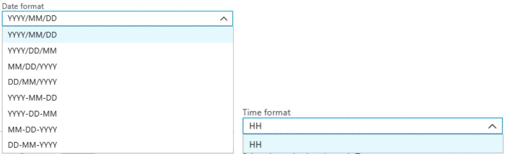
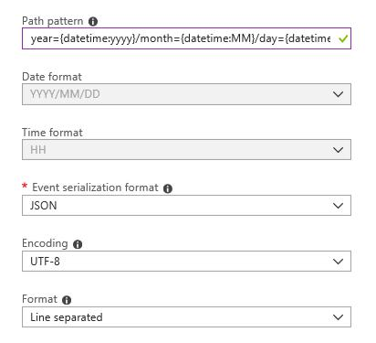
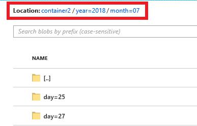

# Custom DateTime path patterns for Azure Stream Analytics blob storage output (Preview)

Azure Stream Analytics supports custom date and time format specifiers in the file path for blob storage outputs. Custom DateTime path patterns allow you to specify an output format that aligns with Hive Streaming conventions, giving Azure Stream Analytics the ability to send data to Azure HDInsight and Azure Databricks for downstream processing. Custom DateTime path patterns are easily implemented using the `datetime` keyword in the Path Prefix field of your blob output, along with the format specifier. For example, `{datetime:yyyy}`.

Use this link for [Azure Portal](https://portal.azure.com/?Microsoft_Azure_StreamAnalytics_bloboutputcustomdatetimeformats=true) to toggle the feature flag that enables the custom DateTime path patterns for blob storage output preview. This feature will be soon enabled in the main portal.

## Supported tokens

The following format specifier tokens can be used alone or in combination to achieve custom DateTime formats:

|Format specifier   |Description   |Results on example time 2018-01-02T10:06:08|
|----------|-----------|------------|
|{datetime:yyyy}|The year as a four-digit number|2018|
|{datetime:MM}|Month from 01 to 12|01|
|{datetime:M}|Month from 1 to 12|1|
|{datetime:dd}|Day from 01 to 31|02|
|{datetime:d}|Day from 1 to 12|2|
|{datetime:HH}|Hour using the 24-hour format, from 00 to 23|10|
|{datetime:mm}|Minutes from 00 to 24|06|
|{datetime:m}|Minutes from 0 to 24|6|
|{datetime:ss}|Seconds from 00 to 60|08|

If you do not wish to use custom DateTime patterns, you can add the {date} and/or {time} token to the Path Prefix to generate a dropdown with built-in DateTime formats.



## Extensibility and restrictions

You can use as many tokens, `{datetime:<specifier>}`, as you like in the path pattern until you reach the Path Prefix character limit. Format specifiers can't be combined within a single token beyond the combinations already listed by the date and time dropdowns. 

For a path partition of `logs/MM/dd`:

|Valid expression   |Invalid expression   |
|----------|-----------|
|`logs/{datetime:MM}/{datetime:dd}`|`logs/{datetime:MM/dd}`|

You may use the same format specifier multiple times in the Path Prefix. The token must be repeated each time.

## Hive Streaming conventions

Custom path patterns for blob storage can be used with the Hive Streaming convention, which expects folders to be labeled with `column=` in the folder name.

For example, `year={datetime:yyyy}/month={datetime:MM}/day={datetime:dd}/hour={datetime:HH}`.

Custom output eliminates the hassle of altering tables and manually adding partitions to port data between Azure Stream Analytics and Hive. Instead, many folders can be added automatically using:

```
MSCK REPAIR TABLE while hive.exec.dynamic.partition true
```

### Example

Create a storage account, a resource group, a Stream Analytics job, and an input source according to the [Azure Stream Analytics Azure Portal](stream-analytics-quick-create-portal.md) quickstart guide. Use the same sample data used in the quickstart guide, also available on [GitHub](https://raw.githubusercontent.com/Azure/azure-stream-analytics/master/Samples/GettingStarted/HelloWorldASA-InputStream.json).

Create a blob output sink with the following configuration:



The full path pattern is as follows:

```
year={datetime:yyyy}/month={datetime:MM}/day={datetime:dd}
```

When you start the job, a folder structure based on the path pattern is created in your blob container. You can drill down to the day level.



## Next steps

* [Understand outputs from Azure Stream Analytics](stream-analytics-define-outputs.md)
