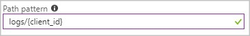
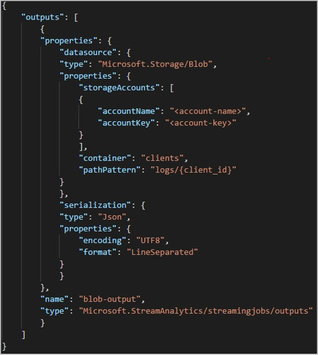
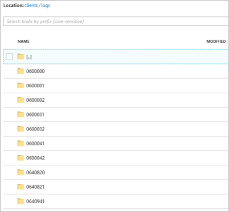
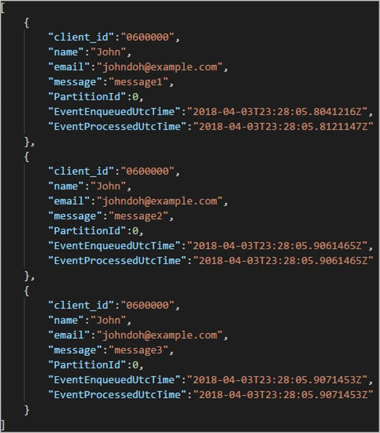

# Azure Stream Analytics custom blob output partitioning

Azure Stream Analytics supports custom blob output partitioning with custom fields or attributes and custom DateTime path patterns. 

## Custom field or attributes

Custom field or input attributes improve downstream data-processing and reporting workflows by allowing more control over the output.

### Partition key options

The partition key, or column name, used to partition input data may contain alphanumeric characters with hyphens, underscores, and spaces. It is not possible to use nested fields as a partition key unless used in conjunction with aliases. The partition key must be NVARCHAR(MAX).

### Example

Suppose a job takes input data from live user sessions connected to an external video game service where ingested data contains a column **client_id** to identify the sessions. To partition the data by **client_id**, set the Blob Path Pattern field to include a partition token **{client_id}** in blob output properties when creating a job. As data with various **client_id** values flow through the Stream Analytics job, the output data is saved into separate folders based on a single **client_id** value per folder.



Similarly, if the job input was sensor data from millions of sensors where each sensor had a **sensor_id**, the Path Pattern would be **{sensor_id}** to partition each sensor data to different folders.  


Using the REST API, the output section of a JSON file used for that request may look like the following:  



Once the job starts running, the *clients* container may look like the following:  



Each folder may contain multiple blobs where each blob contains one or more records. In the above example, there is a single blob in a folder labelled "06000000" with the following contents:



Notice that each record in the blob has a **client_id** column matching the folder name since the column used to partition the output in the output path was **client_id**.

### Limitations

1. Only one custom partition key is permitted in the Path Pattern blob output property. All of the following Path Patterns are valid:

   * cluster1/{date}/{aFieldInMyData}  
   * cluster1/{time}/{aFieldInMyData}  
   * cluster1/{aFieldInMyData}  
   * cluster1/{date}/{time}/{aFieldInMyData} 
   
2. Partition keys are case insensitive, so partition keys like "John" and "john" are equivalent. Also, expressions cannot be used as partition keys. For example, **{columnA + columnB}** does not work.  

3. When an input stream consists of records with a partition key cardinality under 8000, the records will be appended to existing blobs and only create new blobs when necessary. If the cardinality is over 8000 there is no guarantee existing blobs will be written to and new blobs won't be created for an arbitrary number of records with the same partition key.

## Custom DateTime path patterns

Custom DateTime path patterns allow you to specify an output format that aligns with Hive Streaming conventions, giving Azure Stream Analytics the ability to send data to Azure HDInsight and Azure Databricks for downstream processing. Custom DateTime path patterns are easily implemented using the `datetime` keyword in the Path Prefix field of your blob output, along with the format specifier. For example, `{datetime:yyyy}`.

### Supported tokens

The following format specifier tokens can be used alone or in combination to achieve custom DateTime formats:

|Format specifier   |Description   |Results on example time 2018-01-02T10:06:08|
|----------|-----------|------------|
|{datetime:yyyy}|The year as a four-digit number|2018|
|{datetime:MM}|Month from 01 to 12|01|
|{datetime:M}|Month from 1 to 12|1|
|{datetime:dd}|Day from 01 to 31|02|
|{datetime:d}|Day from 1 to 31|2|
|{datetime:HH}|Hour using the 24-hour format, from 00 to 23|10|
|{datetime:mm}|Minutes from 00 to 60|06|
|{datetime:m}|Minutes from 0 to 60|6|
|{datetime:ss}|Seconds from 00 to 60|08|

If you do not wish to use custom DateTime patterns, you can add the {date} and/or {time} token to the Path Prefix to generate a dropdown with built-in DateTime formats.


### Extensibility and restrictions

You can use as many tokens, `{datetime:<specifier>}`, as you like in the path pattern until you reach the Path Prefix character limit. Format specifiers can't be combined within a single token beyond the combinations already listed by the date and time dropdowns. 

For a path partition of `logs/MM/dd`:

|Valid expression   |Invalid expression   |
|----------|-----------|
|`logs/{datetime:MM}/{datetime:dd}`|`logs/{datetime:MM/dd}`|

You may use the same format specifier multiple times in the Path Prefix. The token must be repeated each time.

### Hive Streaming conventions

Custom path patterns for blob storage can be used with the Hive Streaming convention, which expects folders to be labeled with `column=` in the folder name.

For example, `year={datetime:yyyy}/month={datetime:MM}/day={datetime:dd}/hour={datetime:HH}`.

Custom output eliminates the hassle of altering tables and manually adding partitions to port data between Azure Stream Analytics and Hive. Instead, many folders can be added automatically using:

```SQL
MSCK REPAIR TABLE while hive.exec.dynamic.partition true
```

### Example

Create a storage account, a resource group, a Stream Analytics job, and an input source according to the [Azure Stream Analytics Azure Portal](stream-analytics-quick-create-portal.md) quickstart guide. Use the same sample data used in the quickstart guide, also available on [GitHub](https://raw.githubusercontent.com/Azure/azure-stream-analytics/master/Samples/GettingStarted/HelloWorldASA-InputStream.json).

Create a blob output sink with the following configuration:


The full path pattern is as follows:


`year={datetime:yyyy}/month={datetime:MM}/day={datetime:dd}`


When you start the job, a folder structure based on the path pattern is created in your blob container. You can drill down to the day level.


## Next steps

* [Understand outputs from Azure Stream Analytics](stream-analytics-define-outputs.md)
