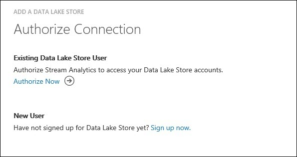
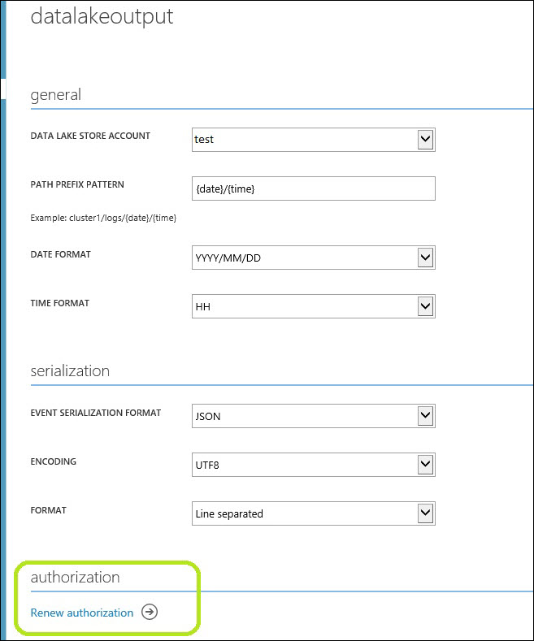

<properties
	pageTitle="Stream Analytics Data Lake Store Output | Microsoft Azure"
	description="Configuration of authentication and authorization of an Azure Data Lake Store in a Stream Analytics job"
	keywords=""
	services="stream-analytics"
	documentationCenter=""
	authors="jeffstokes72"
	manager="paulettm"
	editor="cgronlun"
/>

<tags
	ms.service="stream-analytics"
	ms.devlang="na"
	ms.topic="article"
	ms.tgt_pltfrm="na"
	ms.workload="big-data"
	ms.date="07/27/2016"
	ms.author="jeffstok"
/>

# Stream Analytics Data Lake Store output

Stream Analytics jobs support several output methods, one being an [Azure Data Lake Store](https://azure.microsoft.com/services/data-lake-store/). Azure Data Lake Store is an enterprise-wide hyper-scale repository for big data analytic workloads. Data Lake Store enables you to store data of any size, type and ingestion speed for operational and exploratory analytics. This article covers authorization, configuration and authorization renewal of an Azure Data Lake Store in the Stream Analytics Azure Classic Portal.

> [AZURE.NOTE] At this time, creation and configuration of Data Lake Store outputs is supported **only** in the Azure Classic Portal.

## Authorize a Data Lake Store account

1.  When Data Lake Store is selected as an output in the Azure Management portal, you will be prompted to authorize the usage of your existing Data Lake Store or to request access to the Data Lake Store Preview via the Azure Classic Portal.

      

2.  If you already have access to Data Lake Store, click “Authorize Now” and for a brief time a page will pop up indicating “Redirecting to authorization..”. The page will automatically close and you will be presented with the page that would allow you to configure the Data Lake Store output.

If you have not signed up for Data Lake Store Preview, you can follow the “Sign up now” link to initiate the request, or follow the [get started instructions](../data-lake-store/data-lake-store-get-started-portal.md).

## Configure the Data Lake Store output properties

Once you have the Data Lake Store account authenticated, you can configure the properties for your Data Lake Store output. The table below is the list of property names and their description to configure your Data Lake Store output.

<table>
<tbody>
<tr>
<td><B>PROPERTY NAME</B></td>
<td><B>DESCRIPTION</B></td>
</tr>
<tr>
<td>Output Alias</td>
<td>This is a friendly name used in queries to direct the query output to this Data Lake Store.</td>
</tr>
<tr>
<td>Data Lake Store Account</td>
<td>The name of the storage account where you are sending your output. You will be presented with a drop down list of Data Lake Store accounts to which the user logged in to the portal has access to.</td>
</tr>
<tr>
<td>Path Prefix Pattern [<I>optional</I>]</td>
<td>The file path used to write your files within the specified Data Lake Store Account.  {date}, {time} Example 1: folder1/logs/{date}/{time} Example 2: folder1/logs/{date}</td>
</tr>
<tr>
<td>Date Format [<I>optional</I>]</td>
<td>If the date token is used in the prefix path, you can select the date format in which your files are organized. Example: YYYY/MM/DD</td>
</tr>
<tr>
<td>Time Format [<I>optional</I>]</td>
<td>If the time token is used in the prefix path, specify the time format in which your files are organized. Currently the only supported value is HH.</td>
</tr>
<tr>
<td>Event Serialization Format</td>
<td>Serialization format for output data. JSON, CSV, and Avro are supported.</td>
</tr>
<tr>
<td>Encoding</td>
<td>If CSV or JSON format, an encoding must be specified. UTF-8 is the only supported encoding format at this time.</td>
</tr>
<tr>
<td>Delimiter</td>
<td>Only applicable for CSV serialization. Stream Analytics supports a number of common delimiters for serializing CSV data. Supported values are comma, semicolon, space, tab and vertical bar.</td>
</tr>
<tr>
<td>Format</td>
<td>Only applicable for JSON serialization. Line separated specifies that the output will be formatted by having each JSON object separated by a new line. Array specifies that the output will be formatted as an array of JSON objects.</td>
</tr>
</tbody>
</table>

## Renew Data Lake Store Authorization

Currently, there is a limitation where the authentication token needs to be manually refreshed every 90 days for all jobs with Data Lake Store output. You will also need to re-authenticate your Data Lake Store account if you have changed your password since your job was created or last authenticated. A symptom of this issue is no job output and an error in the Operation Logs indicating need for re-authorization.

To resolve this issue, stop your running job and go to your Data Lake Store output. Click the “Renew authorization” link, and for a brief time a page will pop up indicating “Redirecting to authorization..”. The page will automatically close and if successful, will indicate “Authorization has been successfully renewed”. You then need to click “Save” at the bottom of the page, and can proceed by restarting your job from the Last Stopped Time to avoid data loss.

