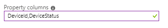

# Understand outputs from Azure Stream Analytics

This article describes the types of outputs available for an Azure Stream Analytics job. Outputs let you store and save the results of the Stream Analytics job. By using the output data, you can do further business analytics and data warehousing of your data.

When you design your Stream Analytics query, refer to the name of the output by using the [INTO clause](https://docs.microsoft.com/stream-analytics-query/into-azure-stream-analytics). You can use a single output per job, or multiple outputs per streaming job (if you need them) by providing multiple INTO clauses in the query.

To create, edit, and test Stream Analytics job outputs, you can use the [Azure portal](stream-analytics-quick-create-portal.md#configure-job-output), [Azure PowerShell](stream-analytics-quick-create-powershell.md#configure-output-to-the-job), [.NET API](https://docs.microsoft.com/dotnet/api/microsoft.azure.management.streamanalytics.ioutputsoperations?view=azure-dotnet), [REST API](https://docs.microsoft.com/rest/api/streamanalytics/stream-analytics-output), and [Visual Studio](stream-analytics-quick-create-vs.md).

Some outputs types support [partitioning](#partitioning). [Output batch sizes](#output-batch-size) vary to optimize throughput.

## Azure Data Lake Storage Gen 1

Stream Analytics supports [Azure Data Lake Storage Gen 1](../data-lake-store/data-lake-store-overview.md). Azure Data Lake Storage is an enterprise-wide, hyperscale repository for big data analytic workloads. You can use Data Lake Storage to store data of any size, type, and ingestion speed for operational and exploratory analytics. Stream Analytics needs to be authorized to access Data Lake Storage.

Azure Data Lake Storage output from Stream Analytics is currently not available in the Azure China 21Vianet and Azure Germany (T-Systems International) regions.

The following table lists property names and their descriptions to configure your Data Lake Storage Gen 1 output.   

| Property name | Description |
| --- | --- |
| Output alias | A friendly name used in queries to direct the query output to Data Lake Store. |
| Subscription | The subscription that contains your Azure Data Lake Storage account. |
| Account name | The name of the Data Lake Store account where you're sending your output. You're presented with a drop-down list of Data Lake Store accounts that are available in your subscription. |
| Path prefix pattern | The file path that's used to write your files within the specified Data Lake Store account. You can specify one or more instances of the {date} and {time} variables: <ul><li>Example 1: folder1/logs/{date}/{time}</li><li>Example 2: folder1/logs/{date}</li></ul> The time stamp of the created folder structure follows UTC and not local time.  If the file path pattern doesn't contain a trailing slash (/), the last pattern in the file path is treated as a file name prefix.   New files are created in these circumstances:<ul><li>Change in output schema</li><li>External or internal restart of a job</li></ul> |
| Date format | Optional. If the date token is used in the prefix path, you can select the date format in which your files are organized. Example: YYYY/MM/DD |
|Time format | Optional. If the time token is used in the prefix path, specify the time format in which your files are organized. Currently the only supported value is HH. |
| Event serialization format | The serialization format for output data. JSON, CSV, and Avro are supported.|
| Encoding | If you're using CSV or JSON format, an encoding must be specified. UTF-8 is the only supported encoding format at this time.|
| Delimiter | Applicable only for CSV serialization. Stream Analytics supports a number of common delimiters for serializing CSV data. Supported values are comma, semicolon, space, tab, and vertical bar.|
| Format | Applicable only for JSON serialization. **Line separated** specifies that the output is formatted by having each JSON object separated by a new line. If you select **Line separated**, the JSON is read one object at a time. The whole content by itself would not be a valid JSON.  **Array** specifies that the output is formatted as an array of JSON objects. This array is closed only when the job stops or Stream Analytics has moved on to the next time window. In general, it's preferable to use line-separated JSON, because it doesn't require any special handling while the output file is still being written to.|
| Authentication mode | You can authorize access to your Data Lake Storage account using [Managed Identity](stream-analytics-managed-identities-adls.md) or User token. Once you grant access, you can revoke access by changing the user account password, deleting the Data Lake Storage output for this job, or deleting the Stream Analytics job. |

## SQL Database

You can use [Azure SQL Database](https://azure.microsoft.com/services/sql-database/) as an output for data that's relational in nature or for applications that depend on content being hosted in a relational database. Stream Analytics jobs write to an existing table in SQL Database. The table schema must exactly match the fields and their types in your job's output. You can also specify [Azure SQL Data Warehouse](https://azure.microsoft.com/documentation/services/sql-data-warehouse/) as an output via the SQL Database output option. To learn about ways to improve write throughput, see the [Stream Analytics with Azure SQL Database as output](stream-analytics-sql-output-perf.md) article.

You can also use [Azure SQL Managed Instance](https://docs.microsoft.com/azure/sql-database/sql-database-managed-instance) as an output. You have to [configure public endpoint in SQL Managed Instance](https://docs.microsoft.com/azure/sql-database/sql-database-managed-instance-public-endpoint-configure) and then manually configure the following settings in Azure Stream Analytics. Azure virtual machine running SQL Server with a database attached is also supported by manually configuring the settings below.

The following table lists the property names and their description for creating a SQL Database output.

| Property name | Description |
| --- | --- |
| Output alias |A friendly name used in queries to direct the query output to this database. |
| Database | The name of the database where you're sending your output. |
| Server name | The logical SQL server name or managed instance name. For SQL Managed Instance, it is required to specify the port 3342. For example, *sampleserver.public.database.windows.net,3342* |
| Username | The username that has write access to the database. Stream Analytics supports only SQL authentication. |
| Password | The password to connect to the database. |
| Table | The table name where the output is written. The table name is case-sensitive. The schema of this table should exactly match the number of fields and their types that your job output generates. |
|Inherit partition scheme| An option for inheriting the partitioning scheme of your previous query step, to enable fully parallel topology with multiple writers to the table. For more information, see [Azure Stream Analytics output to Azure SQL Database](stream-analytics-sql-output-perf.md).|
|Max batch count| The recommended upper limit on the number of records sent with every bulk insert transaction.|

There are two adapters that enable output from Azure Stream Analytics to Azure Synapse Analytics (formerly SQL Data Warehouse): SQL Database and Azure Synapse. We recommend that you choose the Azure Synapse Analytics adapter instead of the SQL Database adapter if any of the following conditions hold true:

* **Throughput**: If your expected throughput now or in the future is greater than 10MB/sec, use the Azure Synapse output option for better performance.

* **Input Partitions**: If you have eight or more input partitions, use the Azure Synapse output option for better scale-out.

## Azure Synapse Analytics (Preview)

[Azure Synapse Analytics](https://azure.microsoft.com/services/synapse-analytics) (formerly SQL Data Warehouse) is a limitless analytics service that brings together enterprise data warehousing and Big Data analytics. 

Azure Stream Analytics jobs can output to a SQL pool table in Azure Synapse Analytics and can process throughput rates up to 200MB/sec. This supports the most demanding real-time analytics and hot-path data processing needs for workloads such as reporting and dashboarding.  

The SQL pool table must exist before you can add it as output to your Stream Analytics job. The table's schema must match the fields and their types in your job's output. 

To use Azure Synapse as output, you need to ensure that you have the storage account configured. Navigate to Storage account settings to configure the storage account. Only the storage account types that support tables are permitted: General-purpose V2 and General-purpose V1. Select Standard Tier only. Premium tier is not supported.   

The following table lists the property names and their descriptions for creating am Azure Synapse Analytics output.

|Property name|Description|
|-|-|
|Output alias |A friendly name used in queries to direct the query output to this database. |
|Database |SQL pool name where you're sending your output. |
|Server name |Azure Synapse server name.  |
|Username |The username that has write access to the database. Stream Analytics supports only SQL authentication. |
|Password |The password to connect to the database. |
|Table  | The table name where the output is written. The table name is case-sensitive. The schema of this table should exactly match the number of fields and their types that your job output generates.|

## Blob storage and Azure Data Lake Gen2

Data Lake Storage Gen2 makes Azure Storage the foundation for building enterprise data lakes on Azure. Designed from the start to service multiple petabytes of information while sustaining hundreds of gigabits of throughput, Data Lake Storage Gen2 allows you to easily manage massive amounts of data.A fundamental part of Data Lake Storage Gen2 is the addition of a hierarchical namespace to Blob storage.

Azure Blob storage offers a cost-effective and scalable solution for storing large amounts of unstructured data in the cloud. For an introduction on Blob storage and its usage, see [Upload, download, and list blobs with the Azure portal](../storage/blobs/storage-quickstart-blobs-portal.md).

The following table lists the property names and their descriptions for creating a blob or ADLS Gen2 output.

| Property name       | Description                                                                      |
| ------------------- | ---------------------------------------------------------------------------------|
| Output alias        | A friendly name used in queries to direct the query output to this blob storage. |
| Storage account     | The name of the storage account where you're sending your output.               |
| Storage account key | The secret key associated with the storage account.                              |
| Storage container   | A logical grouping for blobs stored in the Azure Blob service. When you upload a blob to the Blob service, you must specify a container for that blob. |
| Path pattern | Optional. The file path pattern that's used to write your blobs within the specified container.    In the path pattern, you can choose to use one or more instances of the date and time variables to specify the frequency that blobs are written:   {date}, {time}   You can use custom blob partitioning to specify one custom {field} name from your event data to partition blobs. The field name is alphanumeric and can include spaces, hyphens, and underscores. Restrictions on custom fields include the following: <ul><li>Field names aren't case-sensitive. For example, the service can't differentiate between column "ID" and column "id."</li><li>Nested fields are not permitted. Instead, use an alias in the job query to "flatten" the field.</li><li>Expressions can't be used as a field name.</li></ul>  This feature enables the use of custom date/time format specifier configurations in the path. Custom date and time formats must be specified one at a time, enclosed by the {datetime:\<specifier>} keyword. Allowable inputs for \<specifier> are yyyy, MM, M, dd, d, HH, H, mm, m, ss, or s. The {datetime:\<specifier>} keyword can be used multiple times in the path to form custom date/time configurations.   Examples: <ul><li>Example 1: cluster1/logs/{date}/{time}</li><li>Example 2: cluster1/logs/{date}</li><li>Example 3: cluster1/{client_id}/{date}/{time}</li><li>Example 4: cluster1/{datetime:ss}/{myField} where the query is: SELECT data.myField AS myField FROM Input;</li><li>Example 5: cluster1/year={datetime:yyyy}/month={datetime:MM}/day={datetime:dd}</ul> The time stamp of the created folder structure follows UTC and not local time.  File naming uses the following convention:   {Path Prefix Pattern}/schemaHashcode_Guid_Number.extension  Example output files:<ul><li>Myoutput/20170901/00/45434_gguid_1.csv</li>  <li>Myoutput/20170901/01/45434_gguid_1.csv</li></ul>  For more information about this feature, see [Azure Stream Analytics custom blob output partitioning](stream-analytics-custom-path-patterns-blob-storage-output.md). |
| Date format | Optional. If the date token is used in the prefix path, you can select the date format in which your files are organized. Example: YYYY/MM/DD |
| Time format | Optional. If the time token is used in the prefix path, specify the time format in which your files are organized. Currently the only supported value is HH. |
| Event serialization format | Serialization format for output data. JSON, CSV, Avro, and Parquet are supported. |
|Minimum  rows |The number of minimum rows per batch. For Parquet, every batch will create a new file. The current default value is 2,000 rows and the allowed maximum is 10,000 rows.|
|Maximum time |The maximum wait time per batch. After this time, the batch will be written to the output even if the minimum rows requirement is not met. The current default value is 1 minute and the allowed maximum is 2 hours. If your blob output has path pattern frequency, the wait time cannot be higher than the partition time range.|
| Encoding    | If you're using CSV or JSON format, an encoding must be specified. UTF-8 is the only supported encoding format at this time. |
| Delimiter   | Applicable only for CSV serialization. Stream Analytics supports a number of common delimiters for serializing CSV data. Supported values are comma, semicolon, space, tab, and vertical bar. |
| Format      | Applicable only for JSON serialization. **Line separated** specifies that the output is formatted by having each JSON object separated by a new line. If you select **Line separated**, the JSON is read one object at a time. The whole content by itself would not be a valid JSON. **Array** specifies that the output is formatted as an array of JSON objects. This array is closed only when the job stops or Stream Analytics has moved on to the next time window. In general, it's preferable to use line-separated JSON, because it doesn't require any special handling while the output file is still being written to. |

When you're using Blob storage as output, a new file is created in the blob in the following cases:

* If the file exceeds the maximum number of allowed blocks (currently 50,000). You might reach the maximum allowed number of blocks without reaching the maximum allowed blob size. For example, if the output rate is high, you can see more bytes per block, and the file size is larger. If the output rate is low, each block has less data, and the file size is smaller.
* If there's a schema change in the output, and the output format requires fixed schema (CSV and Avro).
* If a job is restarted, either externally by a user stopping it and starting it, or internally for system maintenance or error recovery.
* If the query is fully partitioned, and a new file is created for each output partition.
* If the user deletes a file or a container of the storage account.
* If the output is time partitioned by using the path prefix pattern, and a new blob is used when the query moves to the next hour.
* If the output is partitioned by a custom field, and a new blob is created per partition key if it does not exist.
* If the output is partitioned by a custom field where the partition key cardinality exceeds 8,000, and a new blob is created per partition key.

## Event Hubs

The [Azure Event Hubs](https://azure.microsoft.com/services/event-hubs/) service is a highly scalable publish-subscribe event ingestor. It can collect millions of events per second. One use of an event hub as output is when the output of a Stream Analytics job becomes the input of another streaming job. For information about the maximum message size and batch size optimization, see the [output batch size](#output-batch-size) section.

You need a few parameters to configure data streams from event hubs as an output.

| Property name | Description |
| --- | --- |
| Output alias | A friendly name used in queries to direct the query output to this event hub. |
| Event hub namespace | A container for a set of messaging entities. When you created a new event hub, you also created an event hub namespace. |
| Event hub name | The name of your event hub output. |
| Event hub policy name | The shared access policy, which you can create on the event hub's **Configure** tab. Each shared access policy has a name, permissions that you set, and access keys. |
| Event hub policy key | The shared access key that's used to authenticate access to the event hub namespace. |
| Partition key column | Optional. A column that contains the partition key for event hub output. |
| Event serialization format | The serialization format for output data. JSON, CSV, and Avro are supported. |
| Encoding | For CSV and JSON, UTF-8 is the only supported encoding format at this time. |
| Delimiter | Applicable only for CSV serialization. Stream Analytics supports a number of common delimiters for serializing data in CSV format. Supported values are comma, semicolon, space, tab, and vertical bar. |
| Format | Applicable only for JSON serialization. **Line separated** specifies that the output is formatted by having each JSON object separated by a new line. If you select **Line separated**, the JSON is read one object at a time. The whole content by itself would not be a valid JSON. **Array** specifies that the output is formatted as an array of JSON objects.  |
| Property columns | Optional. Comma-separated columns that need to be attached as user properties of the outgoing message instead of the payload. More information about this feature is in the section [Custom metadata properties for output](#custom-metadata-properties-for-output). |

## Power BI

You can use [Power BI](https://powerbi.microsoft.com/) as an output for a Stream Analytics job to provide for a rich visualization experience of analysis results. You can use this capability for operational dashboards, report generation, and metric-driven reporting.

Power BI output from Stream Analytics is currently not available in the Azure China 21Vianet and Azure Germany (T-Systems International) regions.

The following table lists property names and their descriptions to configure your Power BI output.

| Property name | Description |
| --- | --- |
| Output alias |Provide a friendly name that's used in queries to direct the query output to this Power BI output. |
| Group workspace |To enable sharing data with other Power BI users, you can select groups inside your Power BI account or choose **My Workspace** if you don't want to write to a group. Updating an existing group requires renewing the Power BI authentication. |
| Dataset name |Provide a dataset name that you want the Power BI output to use. |
| Table name |Provide a table name under the dataset of the Power BI output. Currently, Power BI output from Stream Analytics jobs can have only one table in a dataset. |
| Authorize connection | You need to authorize with Power BI to configure your output settings. Once you grant this output access to your Power BI dashboard, you can revoke access by changing the user account password, deleting the job output, or deleting the Stream Analytics job. | 

For a walkthrough of configuring a Power BI output and dashboard, see the [Azure Stream Analytics and Power BI](stream-analytics-power-bi-dashboard.md) tutorial.

> [!NOTE]
> Don't explicitly create the dataset and table in the Power BI dashboard. The dataset and table are automatically populated when the job is started and the job starts pumping output into Power BI. If the job query doesn't generate any results, the dataset and table aren't created. If Power BI already had a dataset and table with the same name as the one provided in this Stream Analytics job, the existing data is overwritten.
>

### Create a schema
Azure Stream Analytics creates a Power BI dataset and table schema for the user if they don't already exist. In all other cases, the table is updated with new values. Currently, only one table can exist within a dataset. 

Power BI uses the first-in, first-out (FIFO) retention policy. Data will collect in a table until it hits 200,000 rows.

### Convert a data type from Stream Analytics to Power BI
Azure Stream Analytics updates the data model dynamically at runtime if the output schema changes. Column name changes, column type changes, and the addition or removal of columns are all tracked.

This table covers the data type conversions from [Stream Analytics data types](https://docs.microsoft.com/stream-analytics-query/data-types-azure-stream-analytics) to Power BI [Entity Data Model (EDM) types](https://docs.microsoft.com/dotnet/framework/data/adonet/entity-data-model), if a Power BI dataset and table don't exist.

From Stream Analytics | To Power BI
-----|-----
bigint | Int64
nvarchar(max) | String
datetime | Datetime
float | Double
Record array | String type, constant value "IRecord" or "IArray"

### Update the schema
Stream Analytics infers the data model schema based on the first set of events in the output. Later, if necessary, the data model schema is updated to accommodate incoming events that might not fit into the original schema.

Avoid the `SELECT *` query to prevent dynamic schema update across rows. In addition to potential performance implications, it might result in uncertainty of the time taken for the results. Select the exact fields that need to be shown on the Power BI dashboard. Additionally, the data values should be compliant with the chosen data type.

Previous/current | Int64 | String | Datetime | Double
-----------------|-------|--------|----------|-------
Int64 | Int64 | String | String | Double
Double | Double | String | String | Double
String | String | String | String | String 
Datetime | String | String |  Datetime | String

## Table storage

[Azure Table storage](../storage/common/storage-introduction.md) offers highly available, massively scalable storage, so that an application can automatically scale to meet user demand. Table storage is Microsoft's NoSQL key/attribute store, which you can use for structured data with fewer constraints on the schema. Azure Table storage can be used to store data for persistence and efficient retrieval.

The following table lists the property names and their descriptions for creating a table output.

| Property name | Description |
| --- | --- |
| Output alias |A friendly name used in queries to direct the query output to this table storage. |
| Storage account |The name of the storage account where you're sending your output. |
| Storage account key |The access key associated with the storage account. |
| Table name |The name of the table. The table gets created if it doesn't exist. |
| Partition key |The name of the output column that contains the partition key. The partition key is a unique identifier for the partition within a table that forms the first part of an entity's primary key. It's a string value that can be up to 1 KB in size. |
| Row key |The name of the output column that contains the row key. The row key is a unique identifier for an entity within a partition. It forms the second part of an entity's primary key. The row key is a string value that can be up to 1 KB in size. |
| Batch size |The number of records for a batch operation. The default (100) is sufficient for most jobs. See the [Table Batch Operation spec](https://docs.microsoft.com/java/api/com.microsoft.azure.storage.table.tablebatchoperation) for more details on modifying this setting. |

## Service Bus queues

[Service Bus queues](../service-bus-messaging/service-bus-queues-topics-subscriptions.md) offer a FIFO message delivery to one or more competing consumers. Typically, messages are received and processed by the receivers in the temporal order in which they were added to the queue. Each message is received and processed by only one message consumer.

In [compatibility level 1.2](stream-analytics-compatibility-level.md), Azure Stream Analytics uses [Advanced Message Queueing Protocol (AMQP)](../service-bus-messaging/service-bus-amqp-overview.md) messaging protocol to write to Service Bus Queues and Topics. AMQP enables you to build cross-platform, hybrid applications using an open standard protocol.

The following table lists the property names and their descriptions for creating a queue output.

| Property name | Description |
| --- | --- |
| Output alias |A friendly name used in queries to direct the query output to this Service Bus queue. |
| Service Bus namespace |A container for a set of messaging entities. |
| Queue name |The name of the Service Bus queue. |
| Queue policy name |When you create a queue, you can also create shared access policies on the queue's **Configure** tab. Each shared access policy has a name, permissions that you set, and access keys. |
| Queue policy key |The shared access key that's used to authenticate access to the Service Bus namespace. |
| Event serialization format |The serialization format for output data. JSON, CSV, and Avro are supported. |
| Encoding |For CSV and JSON, UTF-8 is the only supported encoding format at this time. |
| Delimiter |Applicable only for CSV serialization. Stream Analytics supports a number of common delimiters for serializing data in CSV format. Supported values are comma, semicolon, space, tab, and vertical bar. |
| Format |Applicable only for JSON type. **Line separated** specifies that the output is formatted by having each JSON object separated by a new line. If you select **Line separated**, the JSON is read one object at a time. The whole content by itself would not be a valid JSON. **Array** specifies that the output is formatted as an array of JSON objects. |
| Property columns | Optional. Comma-separated columns that need to be attached as user properties of the outgoing message instead of the payload. More information about this feature is in the section [Custom metadata properties for output](#custom-metadata-properties-for-output). |
| System Property columns | Optional. Key value pairs of System Properties and corresponding column names that need to be attached to the outgoing message instead of the payload. More information about this feature is in the section [System properties for Service Bus Queue and Topic outputs](#system-properties-for-service-bus-queue-and-topic-outputs)  |

The number of partitions is [based on the Service Bus SKU and size](../service-bus-messaging/service-bus-partitioning.md). Partition key is a unique integer value for each partition.

## Service Bus Topics
Service Bus queues provide a one-to-one communication method from sender to receiver. [Service Bus topics](https://msdn.microsoft.com/library/azure/hh367516.aspx) provide a one-to-many form of communication.

The following table lists the property names and their descriptions for creating a Service Bus topic output.

| Property name | Description |
| --- | --- |
| Output alias |A friendly name used in queries to direct the query output to this Service Bus topic. |
| Service Bus namespace |A container for a set of messaging entities. When you created a new event hub, you also created a Service Bus namespace. |
| Topic name |Topics are messaging entities, similar to event hubs and queues. They're designed to collect event streams from devices and services. When a topic is created, it's also given a specific name. The messages sent to a topic aren't available unless a subscription is created, so ensure there's one or more subscriptions under the topic. |
| Topic policy name |When you create a Service Bus topic, you can also create shared access policies on the topic's **Configure** tab. Each shared access policy has a name, permissions that you set, and access keys. |
| Topic policy key |The shared access key that's used to authenticate access to the Service Bus namespace. |
| Event serialization format |The serialization format for output data. JSON, CSV, and Avro are supported. |
| Encoding |If you're using CSV or JSON format, an encoding must be specified. UTF-8 is the only supported encoding format at this time. |
| Delimiter |Applicable only for CSV serialization. Stream Analytics supports a number of common delimiters for serializing data in CSV format. Supported values are comma, semicolon, space, tab, and vertical bar. |
| Property columns | Optional. Comma-separated columns that need to be attached as user properties of the outgoing message instead of the payload. More information about this feature is in the section [Custom metadata properties for output](#custom-metadata-properties-for-output). |
| System Property columns | Optional. Key value pairs of System Properties and corresponding column names that need to be attached to the outgoing message instead of the payload. More information about this feature is in the section [System properties for Service Bus Queue and Topic outputs](#system-properties-for-service-bus-queue-and-topic-outputs) |

The number of partitions is [based on the Service Bus SKU and size](../service-bus-messaging/service-bus-partitioning.md). The partition key is a unique integer value for each partition.

## Azure Cosmos DB
[Azure Cosmos DB](https://azure.microsoft.com/services/documentdb/) is a globally distributed database service that offers limitless elastic scale around the globe, rich query, and automatic indexing over schema-agnostic data models. To learn about Azure Cosmos DB container options for Stream Analytics, see the [Stream Analytics with Azure Cosmos DB as output](stream-analytics-documentdb-output.md) article.

Azure Cosmos DB output from Stream Analytics is currently not available in the Azure China 21Vianet and Azure Germany (T-Systems International) regions.

> [!Note]
> At this time, Azure Stream Analytics only supports connection to Azure Cosmos DB by using the SQL API.
> Other Azure Cosmos DB APIs are not yet supported. If you point Azure Stream Analytics to the Azure Cosmos DB accounts created with other APIs, the data might not be properly stored.

The following table describes the properties for creating an Azure Cosmos DB output.

| Property name | Description |
| --- | --- |
| Output alias | An alias to refer this output in your Stream Analytics query. |
| Sink | Azure Cosmos DB. |
| Import option | Choose either **Select Cosmos DB from your subscription** or **Provide Cosmos DB settings manually**.
| Account ID | The name or endpoint URI of the Azure Cosmos DB account. |
| Account key | The shared access key for the Azure Cosmos DB account. |
| Database | The Azure Cosmos DB database name. |
| Container name | The container name to be used, which must exist in Cosmos DB. Example:   <ul><li> _MyContainer_: A container named "MyContainer" must exist.</li>|
| Document ID |Optional. The name of the field in output events that's used to specify the primary key on which insert or update operations are based.

## Azure Functions
Azure Functions is a serverless compute service that you can use to run code on-demand without having to explicitly provision or manage infrastructure. It lets you implement code that's triggered by events occurring in Azure or partner services. This ability of Azure Functions to respond to triggers makes it a natural output for Azure Stream Analytics. This output adapter enables users to connect Stream Analytics to Azure Functions, and run a script or piece of code in response to a variety of events.

Azure Functions output from Stream Analytics is currently not available in the Azure China 21Vianet and Azure Germany (T-Systems International) regions.

Azure Stream Analytics invokes Azure Functions via HTTP triggers. The Azure Functions output adapter is available with the following configurable properties:

| Property name | Description |
| --- | --- |
| Function app |The name of your Azure Functions app. |
| Function |The name of the function in your Azure Functions app. |
| Key |If you want to use an Azure Function from another subscription, you can do so by providing the key to access your function. |
| Max batch size |A property that lets you set the maximum size for each output batch that's sent to your Azure function. The input unit is in bytes. By default, this value is 262,144 bytes (256 KB). |
| Max batch count  |A property that lets you specify the maximum number of events in each batch that's sent to Azure Functions. The default value is 100. |

Azure Stream Analytics expects HTTP status 200 from the Functions app for batches that were processed successfully.

When Azure Stream Analytics receives a 413 ("http Request Entity Too Large") exception from an Azure function, it reduces the size of the batches that it sends to Azure Functions. In your Azure function code, use this exception to make sure that Azure Stream Analytics doesn't send oversized batches. Also, make sure that the maximum batch count and size values used in the function are consistent with the values entered in the Stream Analytics portal.

> [!NOTE]
> During test connection, Stream Analytics sends an empty batch to Azure Functions to test if the connection between the two works. Make sure that your Functions app handles empty batch requests to make sure test connection passes.

Also, in a situation where there's no event landing in a time window, no output is generated. As a result, the **computeResult** function isn't called. This behavior is consistent with the built-in windowed aggregate functions.

## Custom metadata properties for output 

You can attach query columns as user properties to your outgoing messages. These columns don't go into the payload. The properties are present in the form of a dictionary on the output message. *Key* is the column name and *value* is the column value in the properties dictionary. All Stream Analytics data types are supported except Record and Array.  

Supported outputs: 
* Service Bus queue 
* Service Bus topic 
* Event hub 

In the following example, we add the two fields `DeviceId` and `DeviceStatus` to the metadata. 
* Query: `select *, DeviceId, DeviceStatus from iotHubInput`
* Output configuration: `DeviceId,DeviceStatus`

The following screenshot shows output message properties inspected in EventHub through [Service Bus Explorer](https://github.com/paolosalvatori/ServiceBusExplorer).

## System properties for Service Bus Queue and Topic outputs 
You can attach query columns as [system properties](https://docs.microsoft.com/dotnet/api/microsoft.servicebus.messaging.brokeredmessage?view=azure-dotnet#properties) to your outgoing service bus Queue or Topic messages. 
These columns don't go into the payload instead the corresponding BrokeredMessage [system property](https://docs.microsoft.com/dotnet/api/microsoft.servicebus.messaging.brokeredmessage?view=azure-dotnet#properties) is populated with the query column values.
These system properties are supported - `MessageId, ContentType, Label, PartitionKey, ReplyTo, SessionId, CorrelationId, To, ForcePersistence, TimeToLive, ScheduledEnqueueTimeUtc`.
String values of these columns are parsed as corresponding system property value type and any parsing failures are treated as data errors.
This field is provided as a JSON object format. Details about this format are as follows -
* Surrounded by curly braces {}.
* Written in key/value pairs.
* Keys and values must be strings.
* Key is the system property name and value is the query column name.
* Keys and values are separated by a colon.
* Each key/value pair is separated by a comma.

This shows how to use this property –

* Query: `select *, column1, column2 INTO queueOutput FROM iotHubInput`
* System Property Columns:
`{ "MessageId": "column1", "PartitionKey": "column2"}`

This sets the `MessageId` on service bus queue messages with `column1`'s values and PartitionKey is set with `column2`'s values.

## Partitioning

The following table summarizes the partition support and the number of output writers for each output type:

| Output type | Partitioning support | Partition key  | Number of output writers |
| --- | --- | --- | --- |
| Azure Data Lake Store | Yes | Use {date} and {time} tokens in the path prefix pattern. Choose the date format, such as YYYY/MM/DD, DD/MM/YYYY, or MM-DD-YYYY. HH is used for the time format. | Follows the input partitioning for [fully parallelizable queries](stream-analytics-scale-jobs.md). |
| Azure SQL Database | Yes, needs to enabled. | Based on the PARTITION BY clause in the query. | When Inherit Partitioning option is enabled, follows the input partitioning for [fully parallelizable queries](stream-analytics-scale-jobs.md). To learn more about achieving better write throughput performance when you're loading data into Azure SQL Database, see [Azure Stream Analytics output to Azure SQL Database](stream-analytics-sql-output-perf.md). |
| Azure Blob storage | Yes | Use {date} and {time} tokens from your event fields in the path pattern. Choose the date format, such as YYYY/MM/DD, DD/MM/YYYY, or MM-DD-YYYY. HH is used for the time format. Blob output can be partitioned by a single custom event attribute {fieldname} or {datetime:\<specifier>}. | Follows the input partitioning for [fully parallelizable queries](stream-analytics-scale-jobs.md). |
| Azure Event Hubs | Yes | Yes | Varies depending on partition alignment.  When the partition key for event hub output is equally aligned with the upstream (previous) query step, the number of writers is the same as the number of partitions in event hub output. Each writer uses the [EventHubSender class](/dotnet/api/microsoft.servicebus.messaging.eventhubsender?view=azure-dotnet) to send events to the specific partition.   When the partition key for event hub output is not aligned with the upstream (previous) query step, the number of writers is the same as the number of partitions in that prior step. Each writer uses the [SendBatchAsync class](/dotnet/api/microsoft.servicebus.messaging.eventhubclient.sendasync?view=azure-dotnet) in **EventHubClient** to send events to all the output partitions. |
| Power BI | No | None | Not applicable. |
| Azure Table storage | Yes | Any output column.  | Follows the input partitioning for [fully parallelized queries](stream-analytics-scale-jobs.md). |
| Azure Service Bus topic | Yes | Automatically chosen. The number of partitions is based on the [Service Bus SKU and size](../service-bus-messaging/service-bus-partitioning.md). The partition key is a unique integer value for each partition.| Same as the number of partitions in the output topic.  |
| Azure Service Bus queue | Yes | Automatically chosen. The number of partitions is based on the [Service Bus SKU and size](../service-bus-messaging/service-bus-partitioning.md). The partition key is a unique integer value for each partition.| Same as the number of partitions in the output queue. |
| Azure Cosmos DB | Yes | Based on the PARTITION BY clause in the query. | Follows the input partitioning for [fully parallelized queries](stream-analytics-scale-jobs.md). |
| Azure Functions | Yes | Based on the PARTITION BY clause in the query. | Follows the input partitioning for [fully parallelized queries](stream-analytics-scale-jobs.md). |

The number of output writers can also be controlled using `INTO <partition count>` (see [INTO](https://docs.microsoft.com/stream-analytics-query/into-azure-stream-analytics#into-shard-count)) clause in your query, which can be helpful in achieving a desired job topology. If your output adapter is not partitioned, lack of data in one input partition will cause a delay up to the late arrival amount of time. In such cases, the output is merged to a single writer, which might cause bottlenecks in your pipeline. To learn more about late arrival policy, see [Azure Stream Analytics event order considerations](stream-analytics-out-of-order-and-late-events.md).

## Output batch size
Azure Stream Analytics uses variable-size batches to process events and write to outputs. Typically the Stream Analytics engine doesn't write one message at a time, and uses batches for efficiency. When the rate of both the incoming and outgoing events is high, Stream Analytics uses larger batches. When the egress rate is low, it uses smaller batches to keep latency low.

The following table explains some of the considerations for output batching:

| Output type |    Max message size | Batch size optimization |
| :--- | :--- | :--- |
| Azure Data Lake Store | See [Data Lake Storage limits](../azure-resource-manager/management/azure-subscription-service-limits.md#data-lake-store-limits). | Use up to 4 MB per write operation. |
| Azure SQL Database | Configurable using Max batch count. 10,000 maximum and 100 minimum rows per single bulk insert by default. See [Azure SQL limits](../sql-database/sql-database-resource-limits.md). |  Every batch is initially bulk inserted with maximum batch count. Batch is split in half (until minimum batch count) based on retryable errors from SQL. |
| Azure Blob storage | See [Azure Storage limits](../azure-resource-manager/management/azure-subscription-service-limits.md#storage-limits). | The maximum blob block size is 4 MB. The maximum blob bock count is 50,000. |
| Azure Event Hubs    | 256 KB or 1 MB per message.  See [Event Hubs limits](../event-hubs/event-hubs-quotas.md). |    When input/output partitioning isn't aligned, each event is packed individually in `EventData` and sent in a batch of up to the maximum message size. This also happens if [custom metadata properties](#custom-metadata-properties-for-output) are used.     When input/output partitioning is aligned, multiple events are packed into a single `EventData` instance, up to the maximum message size, and sent.    |
| Power BI | See [Power BI Rest API limits](https://msdn.microsoft.com/library/dn950053.aspx). |
| Azure Table storage | See [Azure Storage limits](../azure-resource-manager/management/azure-subscription-service-limits.md#storage-limits). | The default is 100 entities per single transaction. You can configure it to a smaller value as needed. |
| Azure Service Bus queue    | 256 KB per message for Standard tier, 1MB for Premium tier.  See [Service Bus limits](../service-bus-messaging/service-bus-quotas.md). | Use a single event per message. |
| Azure Service Bus topic | 256 KB per message for Standard tier, 1MB for Premium tier.  See [Service Bus limits](../service-bus-messaging/service-bus-quotas.md). | Use a single event per message. |
| Azure Cosmos DB    | See [Azure Cosmos DB limits](../azure-resource-manager/management/azure-subscription-service-limits.md#azure-cosmos-db-limits). | Batch size and write frequency are adjusted dynamically based on Azure Cosmos DB responses.   There are no predetermined limitations from Stream Analytics. |
| Azure Functions    | | The default batch size is 262,144 bytes (256 KB).   The default event count per batch is 100.   The batch size is configurable and can be increased or decreased in the Stream Analytics [output options](#azure-functions).

## Next steps
> [!div class="nextstepaction"]
> 
> [Quickstart: Create a Stream Analytics job by using the Azure portal](stream-analytics-quick-create-portal.md)

<!--Link references-->
[stream.analytics.developer.guide]: ../stream-analytics-developer-guide.md
[stream.analytics.scale.jobs]: stream-analytics-scale-jobs.md
[stream.analytics.introduction]: stream-analytics-introduction.md
[stream.analytics.get.started]: stream-analytics-real-time-fraud-detection.md
[stream.analytics.query.language.reference]: https://go.microsoft.com/fwlink/?LinkID=513299
[stream.analytics.rest.api.reference]: https://go.microsoft.com/fwlink/?LinkId=517301
