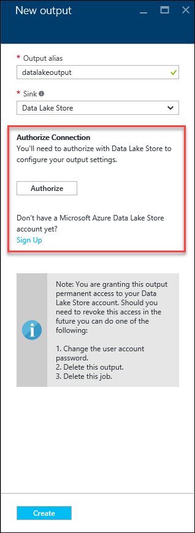
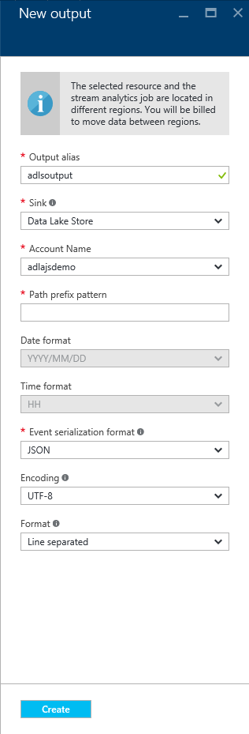
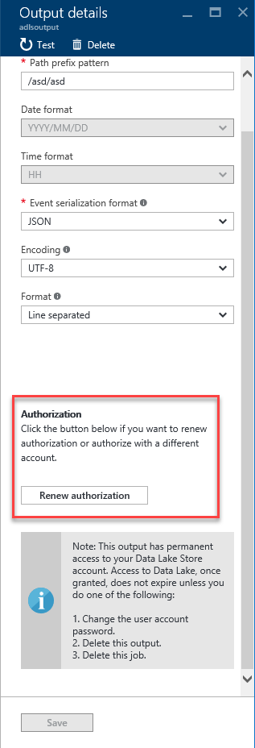

# Understand outputs from Azure Stream Analytics
This article describes the different types of outputs available for an Azure Stream Analytics job. Outputs let you store and save the results of the Stream Analytics job. Using the output data, you can do further business analytics and data warehousing of your data. 

When you design your Stream Analytics query, refer to the name of the output using the [INTO clause](https://msdn.microsoft.com/azure/stream-analytics/reference/into-azure-stream-analytics). You can use a single output per job, or multiple outputs per streaming job if you need by providing multiple INTO clauses in the query.

To create, edit, and test Stream Analytics job outputs, you can use the [Azure portal](stream-analytics-quick-create-portal.md#configure-output-to-the-job), [Azure PowerShell](stream-analytics-quick-create-powershell.md#configure-output-to-the-job), [.Net API](https://docs.microsoft.com/dotnet/api/microsoft.azure.management.streamanalytics.ioutputsoperations?view=azure-dotnet), [REST API](https://docs.microsoft.com/rest/api/streamanalytics/stream-analytics-output), and [Visual Studio](stream-analytics-quick-create-vs.md).

Some outputs types support [partitioning](#partitioning), and [output batch sizes](#output-batch-size) vary to optimize throughput.

## Azure Data Lake Store
Stream Analytics supports [Azure Data Lake Store](https://azure.microsoft.com/services/data-lake-store/). Azure Data Lake Store is an enterprise-wide hyper-scale repository for big data analytic workloads. Data Lake Store enables you to store data of any size, type and ingestion speed for operational and exploratory analytics. Stream Analytics has to be authorized to access the Data Lake Store.

Azure Data Lake Store output from Stream Analytics is currently not available in the Azure China (21Vianet) and Azure Germany (T-Systems International) regions.

### Authorize an Azure Data Lake Store account

1. When Data Lake Storage is selected as an output in the Azure portal, you are prompted to authorize a connection to an existing Data Lake Store.  

     

2. If you already have access to Data Lake Store, select **Authorize Now** and a page pops up indicating **Redirecting to authorization**. After authorization succeeds, you are presented with the page that allows you to configure the Data Lake Store output.

3. Once you have the Data Lake Store account authenticated, you can configure the properties for your Data Lake Store output. The table below is the list of property names and their description to configure your Data Lake Store output.

     

| Property name | Description | 
| --- | --- |
| Output alias | A friendly name used in queries to direct the query output to this Data Lake Store. | 
| Account name | The name of the Data Lake Storage account where you are sending your output. You are presented with a drop-down list of Data Lake Store accounts that are available in your subscription. |
| Path prefix pattern | The file path used to write your files within the specified Data Lake Store Account. You can specify one or more instances of the {date} and {time} variables. <ul><li>Example 1: folder1/logs/{date}/{time}</li><li>Example 2: folder1/logs/{date}</li></ul> The timestamp of the folder structure created follows UTC and not local time.  If the file path pattern does not contain a trailing "/", the last pattern in the file path is treated as a filename prefix.   New files are created in these circumstances:<ul><li>Change in output schema</li><li>External or Internal restart of a job.</li></ul> |
| Date format | Optional. If the date token is used in the prefix path, you can select the date format in which your files are organized. Example: YYYY/MM/DD |
|Time format | Optional. If the time token is used in the prefix path, specify the time format in which your files are organized. Currently the only supported value is HH. |
| Event serialization format | Serialization format for output data. JSON, CSV, and Avro are supported.| 
| Encoding | If using CSV or JSON format, an encoding must be specified. UTF-8 is the only supported encoding format at this time.|
| Delimiter | Only applicable for CSV serialization. Stream Analytics supports a number of common delimiters for serializing CSV data. Supported values are comma, semicolon, space, tab and, vertical bar.|
| Format | Only applicable for JSON serialization. Line separated specifies that the output is formatted by having each JSON object separated by a new line. Array specifies that the output is formatted as an array of JSON objects. This array is closed only when the job stops or Stream Analytics has moved on to the next time window. In general, it is preferable to use line separated JSON, since it doesn't require any special handling while the output file is still being written to.|

### Renew Data Lake Store authorization
You need to reauthenticate your Data Lake Store account if its password has changed since your job was created or last authenticated. If you don't reauthenticate, your job does not produce output results and shows an error indicating the need for reauthorization in the Operation Logs. Currently, there is a limitation where the authentication token needs to be manually refreshed every 90 days for all jobs with Data Lake Store output. 

To renew authorization, **Stop** your job > go to your Data Lake Store output > click the **Renew authorization** link, and for a brief time a page will pop up indicating **Redirecting to authorization...**. The page automatically closes and if successful, indicates **Authorization has been successfully renewed**. You then need to click **Save** at the bottom of the page, and can proceed by restarting your job from the **Last Stopped Time** to avoid data loss.

  

## SQL Database
[Azure SQL Database](https://azure.microsoft.com/services/sql-database/) can be used as an output for data that is relational in nature or for applications that depend on content being hosted in a relational database. Stream Analytics jobs write to an existing table in an Azure SQL Database.  The table schema must exactly match the fields and their types being output from your job. An [Azure SQL Data Warehouse](https://azure.microsoft.com/documentation/services/sql-data-warehouse/) can also be specified as an output via the SQL Database output option as well. To learn about ways to improve write throughput, refer to the [Stream Analytics with Azure SQL DB as output](stream-analytics-sql-output-perf.md) article. The table below lists the property names and their description for creating a SQL Database output.

| Property name | Description |
| --- | --- |
| Output alias |A friendly name used in queries to direct the query output to this database. |
| Database | The name of the database where you are sending your output. |
| Server name | The SQL Database server name. |
| Username | The Username, which has access to write to the database. |
| Password | The password to connect to the database |
| Table | The table name where the output is written. The table name is case-sensitive and the schema of this table should match exactly to the number of fields and their types being generated by your job output. |

> [!NOTE]
> Currently the Azure SQL Database offering is supported for a job output in Stream Analytics. However, an Azure Virtual Machine running SQL Server with a database attached is not supported. This is subject to change in future releases.
> 

## Blob storage
Blob storage offers a cost-effective and scalable solution for storing large amounts of unstructured data in the cloud.  For an introduction on Azure Blob storage and its usage, see the documentation at [How to use Blobs](../storage/blobs/storage-dotnet-how-to-use-blobs.md).

The table below lists the property names and their description for creating a blob output.

| Property name       | Description                                                                      |
| ------------------- | ---------------------------------------------------------------------------------|
| Output Alias        | A friendly name used in queries to direct the query output to this blob storage. |
| Storage Account     | The name of the storage account where you are sending your output.               |
| Storage Account Key | The secret key associated with the storage account.                              |
| Storage Container   | Containers provide a logical grouping for blobs stored in the Microsoft Azure Blob service. When you upload a blob to the Blob service, you must specify a container for that blob. |
| Path Pattern | Optional. The file path pattern used to write your blobs within the specified container.    In the path pattern, you may choose to use one or more instances of the date time variables to specify the frequency that blobs are written:   {date}, {time}   If you are signed up for the [preview](https://aka.ms/ASAPreview), you may specify one custom {field} name from your event data to partition blobs. The field name is alphanumeric and can include spaces, hyphens, and underscores. Restrictions on custom fields include the following: <ul><li>Case insensitivity (cannot differentiate between column "ID" and column "id")</li><li>Nested fields are not permitted (instead use an alias in the job query to "flatten" the field)</li><li>Expressions cannot be used as a field name.</li></ul>    The preview also enables the use of custom date/time format specifier configurations in the path. Custom date and time formats must be specified one at a time, enclosed by the {datetime:\<specifier>} keyword. Allowable inputs \<specifier> are yyyy, MM, M, dd, d, HH, H, mm, m, ss, or s. The {datetime:\<specifier>} keyword may be used multiple times in the path to form custom date/time configurations.   Examples: <ul><li>Example 1: cluster1/logs/{date}/{time}</li><li>Example 2: cluster1/logs/{date}</li><li>Example 3 (preview): cluster1/{client_id}/{date}/{time}</li><li>Example 4 (preview): cluster1/{datetime:ss}/{myField} where the query is: SELECT data.myField AS myField FROM Input;</li><li>Example 5 (preview): cluster1/year={datetime:yyyy}/month={datetime:MM}/day={datetime:dd}</ul>  The timestamp of the folder structure created follows UTC and not local time.  File naming follows the following convention:   {Path Prefix Pattern}/schemaHashcode_Guid_Number.extension  Example output files:<ul><li>Myoutput/20170901/00/45434_gguid_1.csv</li>  <li>Myoutput/20170901/01/45434_gguid_1.csv</li></ul> |
| Date format | Optional. If the date token is used in the prefix path, you can select the date format in which your files are organized. Example: YYYY/MM/DD |
| Time format | Optional. If the time token is used in the prefix path, specify the time format in which your files are organized. Currently the only supported value is HH. |
| Event serialization format | Serialization format for output data.  JSON, CSV, and Avro are supported. |
| Encoding    | If using CSV or JSON format, an encoding must be specified. UTF-8 is the only supported encoding format at this time. |
| Delimiter   | Only applicable for CSV serialization. Stream Analytics supports a number of common delimiters for serializing CSV data. Supported values are comma, semicolon, space, tab, and vertical bar. |
| Format      | Only applicable for JSON serialization. Line separated specifies that the output is formatted by having each JSON object separated by a new line. Array specifies that the output is formatted as an array of JSON objects. This array is closed only when the job stops or Stream Analytics has moved on to the next time window. In general, it is preferable to use line separated JSON, since it doesn't require any special handling while the output file is still being written to. |

When using blob storage as output, a new file is created in the blob in the following cases:

* If the file exceeds the maximum number of allowed blocks (currently 50,000). The maximum allowed number of blocks may be reached without reaching the maximum allowed blob size. For example, if the output rate is high, you can see more bytes per block, and the file size is larger. If the output rate is low, each block has less data, and the file size is smaller.
* If there is a schema change in the output, and the output format requires fixed schema (CSV and Avro).  
* If a job is restarted, either externally by a user stopping it and starting it, or internally for system maintenance or error recovery.  
* If the query is fully partitioned, new file is created for each output partition.  
* If a file or a container of the storage account is deleted by the user.  
* If the output is time partitioned by using the path prefix pattern, a new blob is used when the query moves to the next hour.
* If the output is partitioned by a custom field, a new blob is created per partition key if it does not exist.
* If the output is partitioned by a custom field where the partition key cardinality exceeds 8000, a new blob may be created per partition key.

## Event Hub
The [Azure Event Hubs](https://azure.microsoft.com/services/event-hubs/) service is a highly scalable publish-subscribe event ingestor. It can collect millions of events per second. One use of an Event Hub as output is when the output of a Stream Analytics job becomes the input of another streaming job.

There are a few parameters that are needed to configure Event Hub data streams as an output.

| Property name | Description |
| --- | --- |
| Output alias | A friendly name used in queries to direct the query output to this Event Hub. |
| Event Hub namespace |An Event Hub namespace is a container for a set of messaging entities. When you created a new Event Hub, you also created an Event Hub namespace. |
| Event Hub name | The name of your Event Hub output. |
| Event Hub policy name | The shared access policy, which can be created on the Event Hub Configure tab. Each shared access policy has a name, permissions that you set, and access keys. |
| Event Hub policy key | The Shared Access key used to authenticate access to the Event Hub namespace. |
| Partition key column [optional] | This column contains the partition key for Event Hub output. |
| Event serialization format | Serialization format for output data.  JSON, CSV, and Avro are supported. |
| Encoding | For CSV and JSON, UTF-8 is the only supported encoding format at this time. |
| Delimiter | Only applicable for CSV serialization. Stream Analytics supports a number of common delimiters for serializing data in CSV format. Supported values are comma, semicolon, space, tab, and vertical bar. |
| Format | Only applicable for JSON serialization. Line separated specifies that the output is formatted by having each JSON object separated by a new line. Array specifies that the output is formatted as an array of JSON objects. This array is closed only when the job stops or Stream Analytics has moved on to the next time window. In general, it is preferable to use line separated JSON, since it doesn't require any special handling while the output file is still being written to. |

## Power BI
[Power BI](https://powerbi.microsoft.com/) can be used as an output for a Stream Analytics job to provide for a rich visualization experience of analysis results. This capability can be used for operational dashboards, report generation, and metric driven reporting.

Power BI output from Stream Analytics is currently not available in the Azure China (21Vianet) and Azure Germany (T-Systems International) regions.

### Authorize a Power BI account
1. When Power BI is selected as an output in the Azure portal, you are prompted to authorize an existing Power BI User or to create a new Power BI account.  
   
     

2. Create a new account if you don’t yet have one, then click Authorize Now.  The following page is shown:
   
     

3. In this step, provide the work or school account for authorizing the Power BI output. If you are not already signed up for Power BI, choose Sign up now. The work or school account you use for Power BI could be different from the Azure subscription account, which you are currently logged in with.

### Configure the Power BI output properties
Once you have the Power BI account authenticated, you can configure the properties for your Power BI output. The table below is the list of property names and their description to configure your Power BI output.

| Property name | description |
| --- | --- |
| Output alias |A friendly name used in queries to direct the query output to this PowerBI output. |
| Group workspace |To enable sharing data with other Power BI users you can select groups inside your Power BI account or choose "My Workspace" if you do not want to write to a group.  Updating an existing group requires renewing the Power BI authentication. |
| Dataset name |Provide a dataset name that it is desired for the Power BI output to use |
| Table name |Provide a table name under the dataset of the Power BI output. Currently, Power BI output from Stream Analytics jobs can only have one table in a dataset |

For a walk-through of configuring a Power BI output and dashboard, see the [Azure Stream Analytics & Power BI](stream-analytics-power-bi-dashboard.md) article.

> [!NOTE]
> Do not explicitly create the dataset and table in the Power BI dashboard. The dataset and table is automatically populated when the job is started and the job starts pumping output into Power BI. Note that if the job query doesn’t generate any results, the dataset, and table isn't created. Note that if Power BI already had a dataset and table with the same name as the one provided in this Stream Analytics job, the existing data is overwritten.
> 

### Schema Creation
Azure Stream Analytics creates a Power BI dataset and table on behalf of the user if one does not already exist. In all other cases, the table is updated with new values. Currently, there is a limitation that only one table can exist within a dataset.

### Data type conversion from Stream Analytics to Power BI
Azure Stream Analytics updates the data model dynamically at runtime if the output schema changes. Column name changes, column type changes, and the addition or removal of columns are all tracked.

This table covers the data type conversions from [Stream Analytics data types](https://msdn.microsoft.com/library/azure/dn835065.aspx) to Power BIs [Entity Data Model (EDM) types](https://powerbi.microsoft.com/documentation/powerbi-developer-walkthrough-push-data/) if a POWER BI dataset and table do not exist.

From Stream Analytics | To Power BI
-----|-----|------------
bigint | Int64
nvarchar(max) | String
datetime | Datetime
float | Double
Record array | String type, Constant value "IRecord" or "IArray"

### Schema Update
Stream Analytics infers the data model schema based on the first set of events in the output. Later, if necessary, the data model schema is updated to accommodate incoming events that may not fit into the original schema.

The `SELECT *` query should be avoided to prevent dynamic schema update across rows. In addition to potential performance implications, it could also result in uncertainty of the time taken for the results. The exact fields that need to be shown on Power BI dashboard should be selected. Additionally, the data values should be compliant with the chosen data type.

Previous/Current | Int64 | String | Datetime | Double
-----------------|-------|--------|----------|-------
Int64 | Int64 | String | String | Double
Double | Double | String | String | Double
String | String | String | String |  | String | 
Datetime | String | String |  Datetime | String

### Renew Power BI Authorization
If your Power BI account password changes after your Stream Analytics job was created or last authenticated, you need to reauthenticate the Stream Analytics. If Multi-Factor Authentication (MFA) is configured on your Azure Active Directory (AAD) tenant, you also need to renew Power BI authorization every two weeks. A symptom of this issue is no job output and an "Authenticate user error" in the Operation Logs:

    

To resolve this issue, stop your running job and go to your Power BI output.  Select the **Renew authorization** link, and restart your job from the **Last Stopped Time** to avoid data loss.

    

## Table Storage
[Azure Table storage](../storage/common/storage-introduction.md)  offers highly available, massively scalable storage, so that an application can automatically scale to meet user demand. Table storage is Microsoft’s NoSQL key/attribute store, which one can leverage for structured data with fewer constraints on the schema. Azure Table storage can be used to store data for persistence and efficient retrieval.

The table below lists the property names and their description for creating a table output.

| Property Name | description |
| --- | --- |
| Output alias |A friendly name used in queries to direct the query output to this table storage. |
| Storage account |The name of the storage account where you are sending your output. |
| Storage account key |The access key associated with the storage account. |
| Table Name |The name of the table. The table gets created if it does not exist. |
| Partition key |The name of the output column containing the partition key. The partition key is a unique identifier for the partition within a given table that forms the first part of an entity's primary key. It is a string value that may be up to 1 KB in size. |
| Row key |The name of the output column containing the row key. The row key is a unique identifier for an entity within a given partition. It forms the second part of an entity’s primary key. The row key is a string value that may be up to 1 KB in size. |
| Batch size |The number of records for a batch operation. The default (100) is sufficient for most jobs. Refer to the [Table Batch Operation spec](https://msdn.microsoft.com/library/microsoft.windowsazure.storage.table.tablebatchoperation.aspx) for more details on modifying this setting. |
 
## Service Bus Queues
[Service Bus Queues](https://msdn.microsoft.com/library/azure/hh367516.aspx) offer a First In, First Out (FIFO) message delivery to one or more competing consumers. Typically, messages are expected to be received and processed by the receivers in the temporal order in which they were added to the queue, and each message is received and processed by only one message consumer.

The table below lists the property names and their description for creating a Queue output.

| Property name | description |
| --- | --- |
| Output alias |A friendly name used in queries to direct the query output to this Service Bus Queue. |
| Service Bus namespace |A Service Bus namespace is a container for a set of messaging entities. |
| Queue name |The name of the Service Bus Queue. |
| Queue policy name |When you create a Queue, you can also create shared access policies on the Queue Configure tab. Each shared access policy has a name, permissions that you set, and access keys. |
| Queue policy key |The Shared Access key used to authenticate access to the Service Bus namespace |
| Event serialization format |Serialization format for output data.  JSON, CSV, and Avro are supported. |
| Encoding |For CSV and JSON, UTF-8 is the only supported encoding format at this time |
| Delimiter |Only applicable for CSV serialization. Stream Analytics supports a number of common delimiters for serializing data in CSV format. Supported values are comma, semicolon, space, tab, and vertical bar. |
| Format |Only applicable for JSON type. Line separated specifies that the output is formatted by having each JSON object separated by a new line. Array specifies that the output is formatted as an array of JSON objects. |

The number of partitions is [based on the Service Bus SKU and size](../service-bus-messaging/service-bus-partitioning.md). Partition key is a unique integer value for each partition.

## Service Bus Topics
While Service Bus Queues provide a one to one communication method from sender to receiver, [Service Bus Topics](https://msdn.microsoft.com/library/azure/hh367516.aspx) provide a one-to-many form of communication.

The table below lists the property names and their description for creating a table output.

| Property name | Description |
| --- | --- |
| Output alias |A friendly name used in queries to direct the query output to this Service Bus Topic. |
| Service Bus namespace |A Service Bus namespace is a container for a set of messaging entities. When you created a new Event Hub, you also created a Service Bus namespace |
| Topic name |Topics are messaging entities, similar to event hubs and queues. They're designed to collect event streams from a number of different devices and services. When a topic is created, it is also given a specific name. The messages sent to a Topic isn't available unless a subscription is created, so ensure there are one or more subscriptions under the topic |
| Topic policy name |When you create a Topic, you can also create shared access policies on the Topic Configure tab. Each shared access policy has name, permissions that you set, and access keys |
| Topic policy key |The Shared Access key used to authenticate access to the Service Bus namespace |
| Event serialization format |Serialization format for output data.  JSON, CSV, and Avro are supported. |
| Encoding |If using CSV or JSON format, an encoding must be specified. UTF-8 is the only supported encoding format at this time |
| Delimiter |Only applicable for CSV serialization. Stream Analytics supports a number of common delimiters for serializing data in CSV format. Supported values are comma, semicolon, space, tab, and vertical bar. |

The number of partitions is [based on the Service Bus SKU and size](../service-bus-messaging/service-bus-partitioning.md). Partition key is a unique integer value for each partition.

## Azure Cosmos DB
[Azure Cosmos DB](https://azure.microsoft.com/services/documentdb/) is a globally distributed, multi-model database service that offers limitless elastic scale around the globe, rich query, and automatic indexing over schema-agnostic data models, guaranteed low latency, and industry-leading comprehensive SLAs. To learn about Cosmos DB collection options for Stream Analytics, refer to the [Stream Analytics with Cosmos DB as output](stream-analytics-documentdb-output.md) article.

Azure Cosmos DB output from Stream Analytics is currently not available in the Azure China (21Vianet) and Azure Germany (T-Systems International) regions.

> [!Note]
> At this time, Azure Stream Analytics only supports connection to CosmosDB using **SQL API**.
> Other Azure Cosmos DB APIs are not yet supported. If you point Azure Stream Analytics to the Azure Cosmos DB accounts created with other APIs, the data might not be properly stored. 

The following table describes the properties for creating an Azure Cosmos DB output.
| Property name | description |
| --- | --- |
| Output alias | An alias to refer this output in your Stream Analytics query. |
| Sink | Cosmos DB |
| Import option | Choose either to "Select Cosmos DB from your subscription", or to "Provide Cosmos DB settings manually".
| Account id | The name or endpoint URI of the Cosmos DB account. |
| Account key | The shared access key for the Cosmos DB account. |
| Database | The Cosmos DB database name. |
| Collection name pattern | The collection name or their pattern for the collections to be used.  The collection name format can be constructed using the optional {partition} token, where partitions start from 0. Two examples:   1. _MyCollection_ – One collection named "MyCollection" must exist.   2. _MyCollection{partition}_ – Based on the partitioning column.  The partitioning column collections must exist– "MyCollection0", "MyCollection1", "MyCollection2" and so on. |
| Partition Key | Optional. This is only needed if you are using a {partition} token in your collection name pattern.  The partition key is the name of the field in output events used to specify the key for partitioning output across collections.  For single collection output, any arbitrary output column can be used. For example, PartitionId. |
| Document ID |Optional. The name of the field in output events used to specify the primary key on which insert or update operations are based.  

## Azure Functions
Azure Functions is a serverless compute service that enables you to run code on-demand without having to explicitly provision or manage infrastructure. It lets you implement code that is triggered by events occurring in Azure or third-party services.  This ability of Azure Functions to respond to triggers makes it a natural output for an Azure Stream Analytics. This output adapter allows users to connect Stream Analytics to Azure Functions, and run a script or piece of code in response to a variety of events.

Azure Functions output from Stream Analytics is currently not available in the Azure China (21Vianet) and Azure Germany (T-Systems International) regions.

Azure Stream Analytics invokes Azure Functions via HTTP triggers. The new Azure Function Output adapter is available with the following configurable properties:

| Property name | description |
| --- | --- |
| Function app |Name of your Azure Functions App |
| Function |Name of the function in your Azure Functions App |
| Key |If you want to use an Azure Function from another subscription, you can do so by providing the key to access your function |
| Max batch size |This property can be used to set the maximum size for each output batch that is sent to your Azure Function. By default, this value is 256 KB |
| Max batch count  |As the name indicates, this property lets you specify the maximum number of events in each batch that gets sent to Azure Functions. The default max batch count value is 100 |

When Azure Stream Analytics receives 413 (http Request Entity Too Large) exception from Azure function, it reduces the size of the batches it sends to Azure Functions. In your Azure function code, use this exception to make sure that Azure Stream Analytics doesn’t send oversized batches. Also, make sure that the max batch count and size values used in the function are consistent with the values entered in the Stream Analytics portal. 

Also, in a situation where there is no event landing in a time window, no output is generated. As a result, computeResult function is not called. This behavior is consistent with the built-in windowed aggregate functions.

## Partitioning

The following table summarizes the partition support and the number of output writers for each output type:

| Output type | Partitioning support | Partition key  | Number of output writers | 
| --- | --- | --- | --- |
| Azure Data Lake Store | Yes | Use {date} and {time} tokens in the Path prefix pattern. Choose the Date format, such as YYYY/MM/DD, DD/MM/YYYY, MM-DD-YYYY. HH is used for the Time format. | Follows the input partitioning for [fully parallelizable queries](stream-analytics-scale-jobs.md). | 
| Azure SQL Database | Yes | Based on the PARTITION BY clause in the query | Follows the input partitioning for [fully parallelizable queries](stream-analytics-scale-jobs.md). | 
| Azure Blob storage | Yes | Use {date} and {time} tokens from your event fields in the Path pattern. Choose the Date format, such as YYYY/MM/DD, DD/MM/YYYY, MM-DD-YYYY. HH is used for the Time format. As part of the [preview](https://aka.ms/ASAPreview), blob output can be partitioned by a single custom event attribute {fieldname} or {datetime:\<specifier>}. | Follows the input partitioning for [fully parallelizable queries](stream-analytics-scale-jobs.md). | 
| Azure Event Hub | Yes | Yes | Varies depending on partition alignment.  When the output Event Hub partition key is equally aligned with upstream (previous) query step, the number of writers is the same the number of output Event Hub partitions. Each writer uses EventHub’s [EventHubSender class](/dotnet/api/microsoft.servicebus.messaging.eventhubsender?view=azure-dotnet) to send events to the specific partition.   When the output Event Hub partition key is not aligned with upstream (previous) query step, the number of writers is the same as the number of partitions in that prior step. Each writer uses EventHubClient [SendBatchAsync class](https://docs.microsoft.com/dotnet/api/microsoft.servicebus.messaging.eventhubclient.sendasync?view=azure-dotnet) to send events to all the output partitions. |
| Power BI | No | None | Not applicable. | 
| Azure Table storage | Yes | Any output column.  | Follows the input partitioning for [fully parallelized queries](stream-analytics-scale-jobs.md). | 
| Azure Service Bus Topic | Yes | Automatically chosen. The number of partitions is based on the [Service Bus SKU and size](../service-bus-messaging/service-bus-partitioning.md). Partition key is a unique integer value for each partition.| Same as the number of partitions in the output topic.  |
| Azure Service Bus Queue | Yes | Automatically chosen. The number of partitions is based on the [Service Bus SKU and size](../service-bus-messaging/service-bus-partitioning.md). Partition key is a unique integer value for each partition.| Same as the number of partitions in the output queue. |
| Azure Cosmos DB | Yes | Use {partition} token in the Collection name pattern. {partition} value is based on the PARTITION BY clause in the query. | Follows the input partitioning for [fully parallelized queries](stream-analytics-scale-jobs.md). |
| Azure Functions | No | None | Not applicable. | 

## Output batch size
Azure Stream Analytics uses variable size batches to process events and write to outputs. Typically the Stream Analytics engine does not write one message at a time, and uses batches for efficiency. When both the incoming and the outgoing events rate is high, it uses larger batches. When the egress rate is low, it uses smaller batches to keep latency low. 

The following table explains some of the considerations to output batching:

| Output type |	Max message size | Batch size optimization |
| :--- | :--- | :--- | 
| Azure Data Lake Store | See [Data Lake Storage limits](../azure-subscription-service-limits.md#data-lake-store-limits) | Up to 4 MB per write operation |
| Azure SQL Database | 10,000 Max rows per single bulk insert 100 Min rows per single bulk insert  See also [Azure SQL limits](../sql-database/sql-database-resource-limits.md) |  Every batch is initially bulk inserted with Max batch size and may split batch into half (until Min batch size) based on retryable errors from SQL. |
| Azure Blob storage | See [Azure Storage limits](../azure-subscription-service-limits.md#storage-limits) | Maximum Blob block size is 4 MB Maximum Blob bock count is 50000 |
| Azure Event Hub	| 256 KB per message  See also [Event Hubs limits](../event-hubs/event-hubs-quotas.md) |	When Input Output partitioning doesn’t align, each event is packed individually in an EventData and sent in a batch of up to the max message size (1 MB for Premium SKU).     When Input-Output partitioning is aligned, multiple events are packed into a single EventData up to max message size and sent.	|
| Power BI | See [Power BI Rest API limits](https://msdn.microsoft.com/library/dn950053.aspx) |
| Azure Table storage | See [Azure Storage limits](../azure-subscription-service-limits.md#storage-limits) | Default is 100 entities per single transaction, and can be configured to a smaller value as needed. |
| Azure Service Bus queue	| 256 KB per message  See also [Service Bus limits](../service-bus-messaging/service-bus-quotas.md) | Single event per message |
| Azure Service Bus topic | 256 KB per message  See also [Service Bus limits](../service-bus-messaging/service-bus-quotas.md) | Single event per message |
| Azure Cosmos DB	| See [Azure Cosmos DB limits](../azure-subscription-service-limits.md#azure-cosmos-db-limits) | Batch size and Write frequency is adjusted dynamically based CosmosDB responses.   No predetermined limitations from Stream Analytics. |
| Azure Functions	| | Default batch size is 246 KB.   Default event count per batch is 100.   The batch size is configurable and can be increased or decreased in the Stream Analytics [output options](#azure-functions). 

## Next steps
> [!div class="nextstepaction"]
> [Quickstart: Create a Stream Analytics job by using the Azure portal](stream-analytics-quick-create-portal.md)

<!--Link references-->
[stream.analytics.developer.guide]: ../stream-analytics-developer-guide.md
[stream.analytics.scale.jobs]: stream-analytics-scale-jobs.md
[stream.analytics.introduction]: stream-analytics-introduction.md
[stream.analytics.get.started]: stream-analytics-real-time-fraud-detection.md
[stream.analytics.query.language.reference]: http://go.microsoft.com/fwlink/?LinkID=513299
[stream.analytics.rest.api.reference]: http://go.microsoft.com/fwlink/?LinkId=517301
