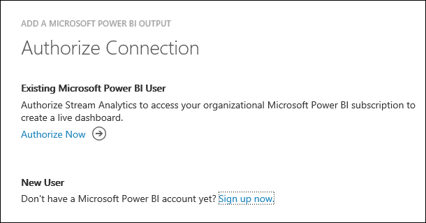
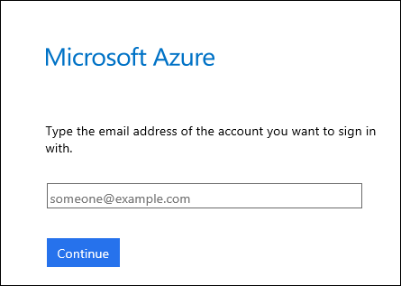
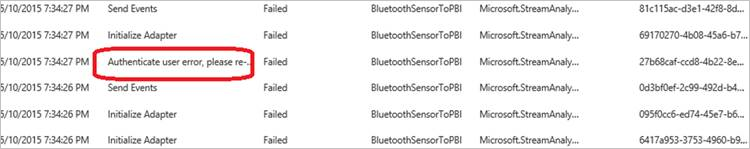

<properties
	pageTitle="Data transformation outputs: Options for storage, analysis | Microsoft Azure"
	description="Learn about targeting Stream Analytics data transformation outputs to data storage options. Also, use Power BI for analysis results."
	keywords="data transformation, analysis results, data storage options"
	services="stream-analytics,documentdb,sql-database,event-hubs,service-bus,storage"
	documentationCenter="" 
	authors="jeffstokes72"
	manager="paulettm" 
	editor="cgronlun"/>

<tags
	ms.service="stream-analytics"
	ms.devlang="na"
	ms.topic="article"
	ms.tgt_pltfrm="na"
	ms.workload="data-services"
	ms.date="07/27/2016"
	ms.author="jeffstok"/>

# Target Stream Analytics data transformation outputs to analysis tools and data storage options

When authoring a Stream Analytics job, consider how the data transformation output will be consumed. How will you view the results of the Stream Analytics job? What tools you use to show data analysis results? Is a data storage option a requirement?

In order to enable a variety of application patterns, Azure Stream Analytics has different options for storing output and viewing analysis results. This makes it easy to view job output and gives you flexibility in the consumption and storage of the job output for data warehousing and other purposes. Any output configured in the job must exist before the job is started and events start flowing. For example, if you use Blob storage as an output, the job will not create a storage account automatically. It needs to be created by the user before the ASA job is started.

## Azure Data Lake Store

Stream Analytics supports [Azure Data Lake Store](https://azure.microsoft.com/services/data-lake-store/). This storage enables you to store data of any size, type and ingestion speed for operational and exploratory analytics. At this time, creation and configuration of Data Lake Store outputs is supported only in the Azure Classic Portal. Further, Stream Analytics needs to be authorized to access the Data Lake Store. Details on authorization and how to sign up for the Data Lake Store Preview (if needed) are discussed in the [Data Lake output article](stream-analytics-data-lake-output.md).

The table below lists the property names and their description needed for creating a Data Lake Store output.

<table>
<tbody>
<tr>
<td><B>PROPERTY NAME</B></td>
<td><B>DESCRIPTION</B></td>
</tr>
<tr>
<td>Output Alias</td>
<td>This is a friendly name used in queries to direct the query output to this Data Lake Store.</td>
</tr>
<tr>
<td>Data Lake Store Account</td>
<td>The name of the storage account where you are sending your output. You will be presented with a drop down list of Data Lake Store accounts to which the user logged in to the portal has access to.</td>
</tr>
<tr>
<td>Path Prefix Pattern [<I>optional</I>]</td>
<td>The file path used to write your files within the specified Data Lake Store Account.  {date}, {time} Example 1: folder1/logs/{date}/{time} Example 2: folder1/logs/{date}</td>
</tr>
<tr>
<td>Date Format [<I>optional</I>]</td>
<td>If the date token is used in the prefix path, you can select the date format in which your files are organized. Example: YYYY/MM/DD</td>
</tr>
<tr>
<td>Time Format [<I>optional</I>]</td>
<td>If the time token is used in the prefix path, specify the time format in which your files are organized. Currently the only supported value is HH.</td>
</tr>
<tr>
<td>Event Serialization Format</td>
<td>Serialization format for output data. JSON, CSV, and Avro are supported.</td>
</tr>
<tr>
<td>Encoding</td>
<td>If CSV or JSON format, an encoding must be specified. UTF-8 is the only supported encoding format at this time.</td>
</tr>
<tr>
<td>Delimiter</td>
<td>Only applicable for CSV serialization. Stream Analytics supports a number of common delimiters for serializing CSV data. Supported values are comma, semicolon, space, tab and vertical bar.</td>
</tr>
<tr>
<td>Format</td>
<td>Only applicable for JSON serialization. Line separated specifies that the output will be formatted by having each JSON object separated by a new line. Array specifies that the output will be formatted as an array of JSON objects.</td>
</tr>
</tbody>
</table>

## SQL Database

[Azure SQL Database](https://azure.microsoft.com/services/sql-database/) can be used as an output for data that is relational in nature or for applications that depend on content being hosted in a relational database. Stream Analytics jobs will write to an existing table in an Azure SQL Database.  Note that the table schema must exactly match the fields and their types being output from your job. An [Azure SQL Data Warehouse](https://azure.microsoft.com/documentation/services/sql-data-warehouse/) can also be specified as an output via the SQL Database output option as well (this is a preview feature). The table below lists the property names and their description for creating a SQL Database output.

| Property Name | Description |
|---------------|-------------|
| Output Alias | This is a friendly name used in queries to direct the query output to this database. |
| Database | The name of the database where you are sending your output |
| Server Name | The SQL Database server name |
| Username | The Username which has access to write to the database |
| Password | The password to connect to the database |
| Table | The table name where the output will be written. The table name is case sensitive and the schema of this table should match exactly to the number of fields and their types being generated by your job output. |

> [AZURE.NOTE] Currently the Azure SQL Database offering is supported for a job output in Stream Analytics. However, an Azure Virtual Machine running SQL Server with a database attached is not supported. This is subject to change in future releases.

## Blob storage

Blob storage offers a cost-effective and scalable solution for storing large amounts of unstructured data in the cloud.  For an introduction on Azure Blob storage and its usage, see the documentation at [How to use Blobs](../storage/storage-dotnet-how-to-use-blobs.md).

The table below lists the property names and their description for creating a blob output.

<table>
<tbody>
<tr>
<td>PROPERTY NAME</td>
<td>DESCRIPTION</td>
</tr>
<tr>
<td>Output Alias</td>
<td>This is a friendly name used in queries to direct the query output to this blob storage.</td>
</tr>
<tr>
<td>Storage Account</td>
<td>The name of the storage account where you are sending your output.</td>
</tr>
<tr>
<td>Storage Account Key</td>
<td>The secret key associated with the storage account.</td>
</tr>
<tr>
<td>Storage Container</td>
<td>Containers provide a logical grouping for blobs stored in the Microsoft Azure Blob service. When you upload a blob to the Blob service, you must specify a container for that blob.</td>
</tr>
<tr>
<td>Path Prefix Pattern [optional]</td>
<td>The file path used to write your blobs within the specified container. Within the path, you may choose to use one or more instances of the following 2 variables to specify the frequency that blobs are written: {date}, {time} Example 1: cluster1/logs/{date}/{time} Example 2: cluster1/logs/{date}</td>
</tr>
<tr>
<td>Date Format [optional]</td>
<td>If the date token is used in the prefix path, you can select the date format in which your files are organized. Example: YYYY/MM/DD</td>
</tr>
<tr>
<td>Time Format [optional]</td>
<td>If the time token is used in the prefix path, specify the time format in which your files are organized. Currently the only supported value is HH.</td>
</tr>
<tr>
<td>Event Serialization Format</td>
<td>Serialization format for output data.  JSON, CSV, and Avro are supported.</td>
</tr>
<tr>
<td>Encoding</td>
<td>If CSV or JSON format, an encoding must be specified. UTF-8 is the only supported encoding format at this time.</td>
</tr>
<tr>
<td>Delimiter</td>
<td>Only applicable for CSV serialization. Stream Analytics supports a number of common delimiters for serializing CSV data. Supported values are comma, semicolon, space, tab and vertical bar.</td>
</tr>
<tr>
<td>Format</td>
<td>Only applicable for JSON serialization. Line separated specifies that the output will be formatted by having each JSON object separated by a new line. Array specifies that the output will be formatted as an array of JSON objects.</td>
</tr>
</tbody>
</table>

## Event Hub

[Event Hubs](https://azure.microsoft.com/services/event-hubs/) is a highly scalable publish-subscribe event ingestor. It can collect millions of events per second.  One use of an Event Hub as output is when the output of a Stream Analytics job will be the input of another streaming job.

There are a few parameters that are needed to configure Event Hub data streams as an output.

| Property Name | Description |
|---------------------------------|------------------------------------------------------------------------------------------------------------------------------------------------------------------------------------------------------------------------------|
| Output Alias | This is a friendly name used in queries to direct the query output to this Event Hub. |
| Service Bus Namespace | A Service Bus namespace is a container for a set of messaging entities. When you created a new Event Hub, you also created a Service Bus namespace |
| Event Hub | The name of your Event Hub output |
| Event Hub Policy Name | The shared access policy, which can be created on the Event Hub Configure tab. Each shared access policy will have a name, permissions that you set, and access keys |
| Event Hub Policy Key | The Shared Access key used to authenticate access to the Service Bus namespace |
| Partition Key Column [optional] | This column contains the partition key for Event Hub output. |
| Event Serialization Format | Serialization format for output data.  JSON, CSV, and Avro are supported. |
| Encoding | For CSV and JSON, UTF-8 is the only supported encoding format at this time |
| Delimiter | Only applicable for CSV serialization. Stream Analytics supports a number of common delimiters for serializing data in CSV format. Supported values are comma, semicolon, space, tab and vertical bar. |
| Format | Only applicable for JSON type. Line separated specifies that the output will be formatted by having each JSON object separated by a new line. Array specifies that the output will be formatted as an array of JSON objects. |

## Power BI

[Power BI](https://powerbi.microsoft.com/) can be used as an output for a Stream Analytics job to provide for a rich visualization experience of analysis results. This capability can be used for operational dashboards, report generation and metric driven reporting.

### Authorize a Power BI account

1.	When Power BI is selected as an output in the Azure Management portal, you will be prompted to authorize an existing Power BI User or to create a new Power BI account.  

      

2.	Create a new account if you don’t yet have one, then click Authorize Now.  A screen like the following is presented.  

      

3.	In this step, provide the work or school account for authorizing the Power BI output. If you are not already signed up for Power BI, choose Sign up now. The work or school account you use for Power BI could be different from the Azure subscription account which you are currently logged in with.

### Configure the Power BI output properties

Once you have the Power BI account authenticated, you can configure the properties for your Power BI output. The table below is the list of property names and their description to configure your Power BI output.

| Property Name | Description |
|---------------------------------|------------------------------------------------------------------------------------------------------------------------------------------------------------------------------------------------------------------------------|
| Output Alias | This is a friendly name used in queries to direct the query output to this PowerBI output. |
| Dataset Name | Provide a dataset name that it is desired for the Power BI output to use |
| Table Name | Provide a table name under the dataset of the Power BI output. Currently, Power BI output from Stream Analytics jobs can only have one table in a dataset |
| Group Name | To enabling sharing data with other Power BI users, write data to groups.  You can select groups inside your Power BI account or choose “My Workspace” if you do not want to write to a group.  Updating an existing group requires renewing the Power BI authentication. |

For a walk-through of configuring a Power BI output and dashboard, please see the [Azure Stream Analytics & Power BI](stream-analytics-power-bi-dashboard.md) article.

> [AZURE.NOTE] Do not explicitly create the dataset and table in the Power BI dashboard. The dataset and table will be automatically populated when the job is started and the job starts pumping output into Power BI. Note that if the job query doesn’t generate any results, the dataset and table will not be created. Also be aware that if Power BI already had a dataset and table with the same name as the one provided in this Stream Analytics job, the existing data will be overwritten.

### Renew Power BI Authorization

You will need to re-authenticate your Power BI account if its password has changed since your job was created or last authenticated. If Multi-Factor Authentication (MFA) is configured on your Azure Active Directory (AAD) tenant you will also need to renew Power BI authorization every 2 weeks. A symptom of this issue is no job output and an "Authenticate user error" in the Operation Logs:

    

To resolve this issue, stop your running job and go to your Power BI output.  Click the “Renew authorization” link, and restart your job from the Last Stopped Time to avoid data loss.

    

## Table Storage

[Azure Table storage](../storage/storage-introduction.md)  offers highly available, massively scalable storage, so that an application can automatically scale to meet user demand. Table storage is Microsoft’s NoSQL key/attribute store which one can leverage for structured data with less constraints on the schema. Azure Table storage can be used to store data for persistence and efficient retrieval.

The table below lists the property names and their description for creating a table output.

| Property Name | Description |
|---------------------|--------------------------------------------------------------------------------------------------------------------------------------------------------------------------------------------------------------------------------------------------------|
| Output Alias | This is a friendly name used in queries to direct the query output to this table storage. |
| Storage Account | The name of the storage account where you are sending your output. |
| Storage Account Key | The access key associated with the storage account. |
| Table Name | The name of the table. The table will get created if it does not exist. |
| Partition Key | The name of the output column containing the partition key. The partition key is a unique identifier for the partition within a given table that forms the first part of an entity's primary key. It is a string value that may be up to 1 KB in size. |
| Row Key | The name of the output column containing the row key. The row key is a unique identifier for an entity within a given partition. It forms the second part of an entity’s primary key. The row key is a string value that may be up to 1 KB in size. |
| Batch Size | The number of records for a batch operation. Typically the default is sufficient for most jobs, refer to the [Table Batch Operation spec](https://msdn.microsoft.com/library/microsoft.windowsazure.storage.table.tablebatchoperation.aspx) for more details on modifying this setting. |

## Service Bus Queues

[Service Bus Queues](https://msdn.microsoft.com/library/azure/hh367516.aspx) offer a First In, First Out (FIFO) message delivery to one or more competing consumers. Typically, messages are expected to be received and processed by the receivers in the temporal order in which they were added to the queue, and each message is received and processed by only one message consumer.

The table below lists the property names and their description for creating a Queue output.

| Property Name | Description |
|----------------------------|------------------------------------------------------------------------------------------------------------------------------------------------------------------------------------------------------------------------------|
| Output Alias | This is a friendly name used in queries to direct the query output to this Service Bus Queue. |
| Service Bus Namespace | A Service Bus namespace is a container for a set of messaging entities. |
| Queue Name | The name of the Service Bus Queue. |
| Queue Policy Name | When you create a Queue, you can also create shared access policies on the Queue Configure tab. Each shared access policy will have a name, permissions that you set, and access keys. |
| Queue Policy Key | The Shared Access key used to authenticate access to the Service Bus namespace |
| Event Serialization Format | Serialization format for output data.  JSON, CSV, and Avro are supported. |
| Encoding | For CSV and JSON, UTF-8 is the only supported encoding format at this time |
| Delimiter | Only applicable for CSV serialization. Stream Analytics supports a number of common delimiters for serializing data in CSV format. Supported values are comma, semicolon, space, tab and vertical bar. |
| Format | Only applicable for JSON type. Line separated specifies that the output will be formatted by having each JSON object separated by a new line. Array specifies that the output will be formatted as an array of JSON objects. |

## Service Bus Topics

While Service Bus Queues provide a one to one communication method from sender to receiver, [Service Bus Topics](https://msdn.microsoft.com/library/azure/hh367516.aspx) provide a one-to-many form of communication.

The table below lists the property names and their description for creating a table output.

| Property Name | Description |
|----------------------------|---------------------------------------------------------------------------------------------------------------------------------------------------------------------------------------------------------------------------------------------------------------------------------------------------------------------------------------------------------------------------|
| Output Alias | This is a friendly name used in queries to direct the query output to this Service Bus Topic. |
| Service Bus Namespace | A Service Bus namespace is a container for a set of messaging entities. When you created a new Event Hub, you also created a Service Bus namespace |
| Topic Name | Topics are messaging entities, similar to event hubs and queues. They're designed to collect event streams from a number of different devices and services. When a topic is created, it is also given a specific name. The messages sent to a Topic will not be available unless a subscription is created, so ensure there are one or more subscriptions under the topic |
| Topic Policy Name | When you create a Topic, you can also create shared access policies on the Topic Configure tab. Each shared access policy will have a name, permissions that you set, and access keys |
| Topic Policy Key | The Shared Access key used to authenticate access to the Service Bus namespace |
| Event Serialization Format | Serialization format for output data.  JSON, CSV, and Avro are supported. |
| Encoding | If CSV or JSON format, an encoding must be specified. UTF-8 is the only supported encoding format at this time |
| Delimiter | Only applicable for CSV serialization. Stream Analytics supports a number of common delimiters for serializing data in CSV format. Supported values are comma, semicolon, space, tab and vertical bar. |

## DocumentDB

[Azure DocumentDB](https://azure.microsoft.com/services/documentdb/) is a fully-managed NoSQL document database service that offers query and transactions over schema-free data, predictable and reliable performance, and rapid development.

The table below lists the property names and their description for creating a DocumentDB output.

<table>
<tbody>
<tr>
<td>PROPERTY NAME</td>
<td>DESCRIPTION</td>
</tr>
<tr>
<td>Account Name</td>
<td>The name of the DocumentDB account.  This can also be the endpoint for the account.</td>
</tr>
<tr>
<td>Account Key</td>
<td>The shared access key for the DocumentDB account.</td>
</tr>
<tr>
<td>Database</td>
<td>The DocumentDB database name.</td>
</tr>
<tr>
<td>Collection Name Pattern</td>
<td>The collection name pattern for the collections to be used. The collection name format can be constructed using the optional {partition} token, where partitions start from 0. E.g. The followings are valid inputs: MyCollection{partition} MyCollection Note that collections must exist before the Stream Analytics job is started and will not be created automatically.</td>
</tr>
<tr>
<td>Partition Key</td>
<td>The name of the field in output events used to specify the key for partitioning output across collections.</td>
</tr>
<tr>
<td>Document ID</td>
<td>The name of the field in output events used to specify the primary key which insert or update operations are based on.</td>
</tr>
</tbody>
</table>

## Get help
For further assistance, try our [Azure Stream Analytics forum](https://social.msdn.microsoft.com/Forums/en-US/home?forum=AzureStreamAnalytics)

## Next steps
You've been introduced to Stream Analytics, a managed service for streaming analytics on data from the Internet of Things. To learn more about this service, see:

- [Get started using Azure Stream Analytics](stream-analytics-get-started.md)
- [Scale Azure Stream Analytics jobs](stream-analytics-scale-jobs.md)
- [Azure Stream Analytics Query Language Reference](https://msdn.microsoft.com/library/azure/dn834998.aspx)
- [Azure Stream Analytics Management REST API Reference](https://msdn.microsoft.com/library/azure/dn835031.aspx)

<!--Link references-->
[stream.analytics.developer.guide]: ../stream-analytics-developer-guide.md
[stream.analytics.scale.jobs]: stream-analytics-scale-jobs.md
[stream.analytics.introduction]: stream-analytics-introduction.md
[stream.analytics.get.started]: stream-analytics-get-started.md
[stream.analytics.query.language.reference]: http://go.microsoft.com/fwlink/?LinkID=513299
[stream.analytics.rest.api.reference]: http://go.microsoft.com/fwlink/?LinkId=517301
