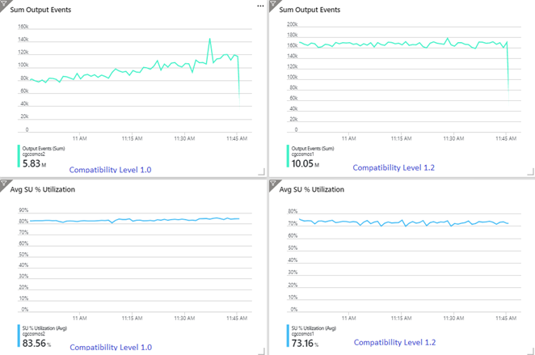
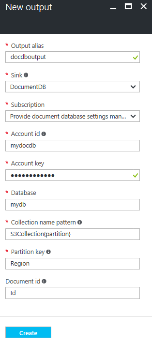
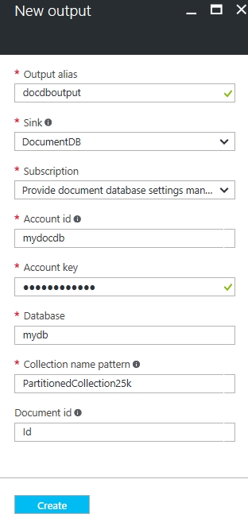

# Azure Stream Analytics output to Azure Cosmos DB  
Azure Stream Analytics can target [Azure Cosmos DB](https://azure.microsoft.com/services/documentdb/) for JSON output, enabling data archiving and low-latency queries on unstructured JSON data. This document covers some best practices for implementing this configuration.

If you're unfamiliar with Azure Cosmos DB, see the [Azure Cosmos DB documentation](https://docs.microsoft.com/azure/cosmos-db/) to get started. 

> [!Note]
> At this time, Stream Analytics supports connection to Azure Cosmos DB only through the *SQL API*.
> Other Azure Cosmos DB APIs are not yet supported. If you point Stream Analytics to Azure Cosmos DB accounts created with other APIs, the data might not be properly stored. 

## Basics of Azure Cosmos DB as an output target
The Azure Cosmos DB output in Stream Analytics enables writing your stream processing results as JSON output into your Azure Cosmos DB containers. 

Stream Analytics doesn't create containers in your database. Instead, it requires you to create them up front. You can then control the billing costs of Azure Cosmos DB containers. You can also tune the performance, consistency, and capacity of your containers directly by using the [Azure Cosmos DB APIs](https://msdn.microsoft.com/library/azure/dn781481.aspx).

> [!Note]
> You must add 0.0.0.0 to the list of allowed IPs from your Azure Cosmos DB firewall.

The following sections detail some of the container options for Azure Cosmos DB.

## Tuning consistency, availability, and latency
To match your application requirements, Azure Cosmos DB allows you to fine-tune the database and containers and make trade-offs between consistency, availability, latency, and throughput. 

Depending on what levels of read consistency your scenario needs against read and write latency, you can choose a consistency level on your database account. You can improve throughput by scaling up Request Units (RUs) on the container. 

Also by default, Azure Cosmos DB enables synchronous indexing on each CRUD operation to your container. This is another useful option to control write/read performance in Azure Cosmos DB. 

For more information, review the [Change your database and query consistency levels](../cosmos-db/consistency-levels.md) article.

## Upserts from Stream Analytics
Stream Analytics integration with Azure Cosmos DB allows you to insert or update records in your container based on a given **Document ID** column. This is also called an *upsert*.

Stream Analytics uses an optimistic upsert approach. Updates happen only when an insert fails with a document ID conflict. 

With compatibility level 1.0, Stream Analytics performs this update as a PATCH operation, so it enables partial updates to the document. Stream Analytics adds new properties or replaces an existing property incrementally. However, changes in the values of array properties in your JSON document result in overwriting the entire array. That is, the array isn't merged. 

With 1.2, upsert behavior is modified to insert or replace the document. The later section about compatibility level 1.2 further describes this behavior.

If the incoming JSON document has an existing ID field, that field is automatically used as the **Document ID** column in Azure Cosmos DB. Any subsequent writes are handled as such, leading to one of these situations:

- Unique IDs lead to insert.
- Duplicate IDs and **Document ID** set to **ID** lead to upsert.
- Duplicate IDs and **Document ID** not set lead to error, after the first document.

If you want to save *all* documents, including the ones that have a duplicate ID, rename the ID field in your query (by using the **AS** keyword). Let Azure Cosmos DB create the ID field or replace the ID with another column's value (by using the **AS** keyword or by using the **Document ID** setting).

## Data partitioning in Azure Cosmos DB
Azure Cosmos DB automatically scales partitions based on your workload. So we recommend [unlimited](../cosmos-db/partition-data.md) containers as the approach for partitioning your data. When Stream Analytics writes to unlimited containers, it uses as many parallel writers as the previous query step or input partitioning scheme.

> [!NOTE]
> Azure Stream Analytics supports only unlimited containers with partition keys at the top level. For example, `/region` is supported. Nested partition keys (for example, `/region/name`) are not supported. 

Depending on your choice of partition key, you might receive this _warning_:

`CosmosDB Output contains multiple rows and just one row per partition key. If the output latency is higher than expected, consider choosing a partition key that contains at least several hundred records per partition key.`

It's important to choose a partition key property that has a number of distinct values, and that lets you distribute your workload evenly across these values. As a natural artifact of partitioning, requests that involve the same partition key are limited by the maximum throughput of a single partition. 

The storage size for documents that belong to the same partition key is limited to 20 GB. An ideal partition key is one that appears frequently as a filter in your queries and has sufficient cardinality to ensure that your solution is scalable.

A partition key is also the boundary for transactions in stored procedures and triggers for Azure Cosmos DB. You should choose the partition key so that documents that occur together in transactions share the same partition key value. The article [Partitioning in Azure Cosmos DB](../cosmos-db/partitioning-overview.md) gives more details on choosing a partition key.

For fixed Azure Cosmos DB containers, Stream Analytics allows no way to scale up or out after they're full. They have an upper limit of 10 GB and 10,000 RU/s of throughput. To migrate the data from a fixed container to an unlimited container (for example, one with at least 1,000 RU/s and a partition key), use the [data migration tool](../cosmos-db/import-data.md) or the [change feed library](../cosmos-db/change-feed.md).

The ability to write to multiple fixed containers is being deprecated. We don't recommend it for scaling out your Stream Analytics job.

## Improved throughput with compatibility level 1.2
With compatibility level 1.2, Stream Analytics supports native integration to bulk write into Azure Cosmos DB. This integration enables writing effectively to Azure Cosmos DB while maximizing throughput and efficiently handling throttling requests. 

The improved writing mechanism is available under a new compatibility level because of a difference in upsert behavior. With levels before 1.2, the upsert behavior is to insert or merge the document. With 1.2, upsert behavior is modified to insert or replace the document.

With levels before 1.2, Stream Analytics uses a custom stored procedure to bulk upsert documents per partition key into Azure Cosmos DB. There, a batch is written as a transaction. Even when a single record hits a transient error (throttling), the whole batch has to be retried. This makes scenarios with even reasonable throttling relatively slow.

The following example shows two identical Stream Analytics jobs reading from the same Azure Event Hubs input. Both Stream Analytics jobs are [fully partitioned](https://docs.microsoft.com/azure/stream-analytics/stream-analytics-parallelization#embarrassingly-parallel-jobs) with a passthrough query and write to identical Azure Cosmos DB containers. Metrics on the left are from the job configured with compatibility level 1.0. Metrics on the right are configured with 1.2. An Azure Cosmos DB container's partition key is a unique GUID that comes from the input event.



The incoming event rate in Event Hubs is two times higher than Azure Cosmos DB containers (20,000 RUs) are configured to take in, so throttling is expected in Azure Cosmos DB. However, the job with 1.2 is consistently writing at a higher throughput (output events per minute) and with a lower average SU% utilization. In your environment, this difference will depend on few more factors. These factors include choice of event format, input event/message size, partition keys, and query.



With 1.2, Stream Analytics is more intelligent in utilizing 100 percent of the available throughput in Azure Cosmos DB with very few resubmissions from throttling or rate limiting. This provides a better experience for other workloads like queries running on the container at the same time. If you want to see how Stream Analytics scales out with Azure Cosmos DB as a sink for 1,000 to 10,000 messages per second, try  [this Azure sample project](https://github.com/Azure-Samples/streaming-at-scale/tree/master/eventhubs-streamanalytics-cosmosdb).

Throughput of Azure Cosmos DB output is identical with 1.0 and 1.1. We *strongly recommend* that you use compatibility level 1.2 in Stream Analytics with Azure Cosmos DB.

## Azure Cosmos DB settings for JSON output

Using Azure Cosmos DB as an output in Stream Analytics generates the following prompt for information.



|Field           | Description|
|-------------   | -------------|
|Output alias    | An alias to refer to this output in your Stream Analytics query.|
|Subscription    | The Azure subscription.|
|Account ID      | The name or endpoint URI of the Azure Cosmos DB account.|
|Account key     | The shared access key for the Azure Cosmos DB account.|
|Database        | The Azure Cosmos DB database name.|
|Container name | The container name, such as `MyContainer`. One container named `MyContainer` must exist.  |
|Document ID     | Optional. The column name in output events used as the unique key on which insert or update operations must be based. If you leave it empty, all events will be inserted, with no update option.|

After you configure the Azure Cosmos DB output, you can use it in the query as the target of an [INTO statement](https://docs.microsoft.com/stream-analytics-query/into-azure-stream-analytics). When you're using an Azure Cosmos DB output that way, [a partition key needs to be set explicitly](https://docs.microsoft.com/azure/stream-analytics/stream-analytics-parallelization#partitions-in-sources-and-sinks). 

The output record must contain a case-sensitive column named after the partition key in Azure Cosmos DB. To achieve greater parallelization, the statement might require a [PARTITION BY clause](https://docs.microsoft.com/azure/stream-analytics/stream-analytics-parallelization#embarrassingly-parallel-jobs) that uses the same column.

Here's a sample query:

```SQL
    SELECT TollBoothId, PartitionId
    INTO CosmosDBOutput
    FROM Input1 PARTITION BY PartitionId
``` 

## Error handling and retries

If a transient failure, service unavailability, or throttling happens while Stream Analytics is sending events to Azure Cosmos DB, Stream Analytics retries indefinitely to finish the operation successfully. But it doesn't attempt retries for the following failures:

- Unauthorized (HTTP error code 401)
- NotFound (HTTP error code 404)
- Forbidden (HTTP error code 403)
- BadRequest (HTTP error code 400)
