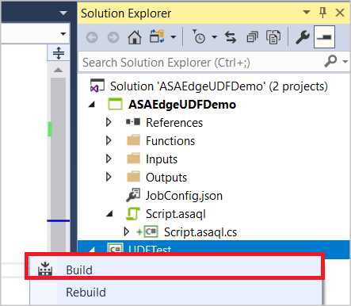
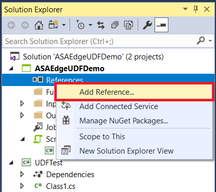
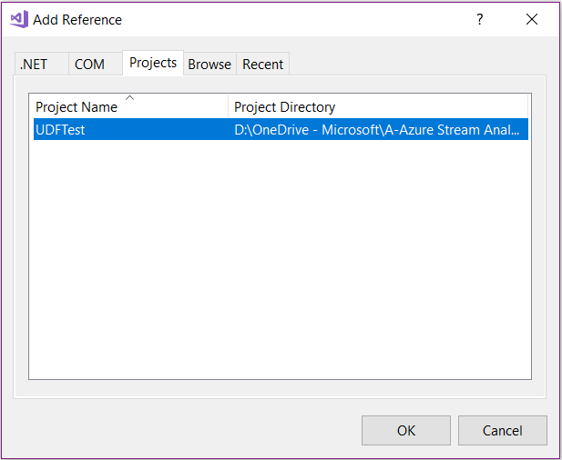
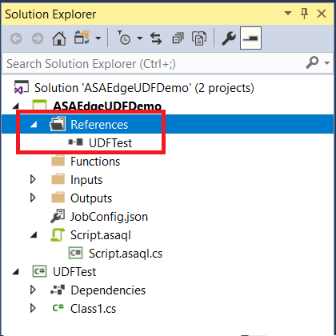
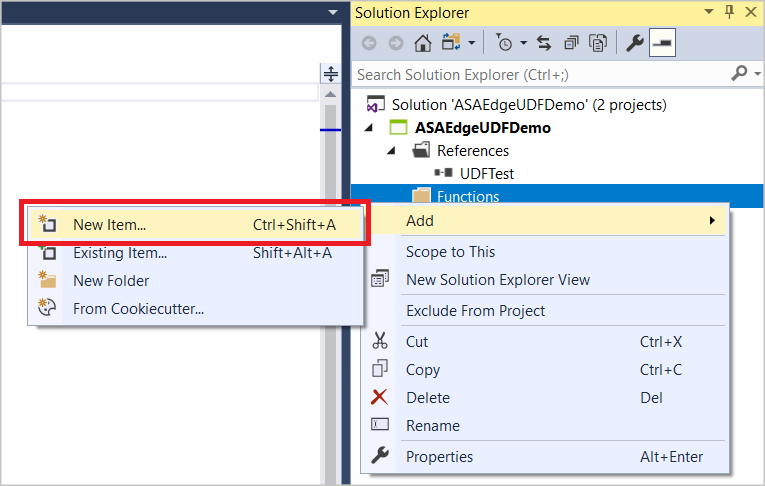
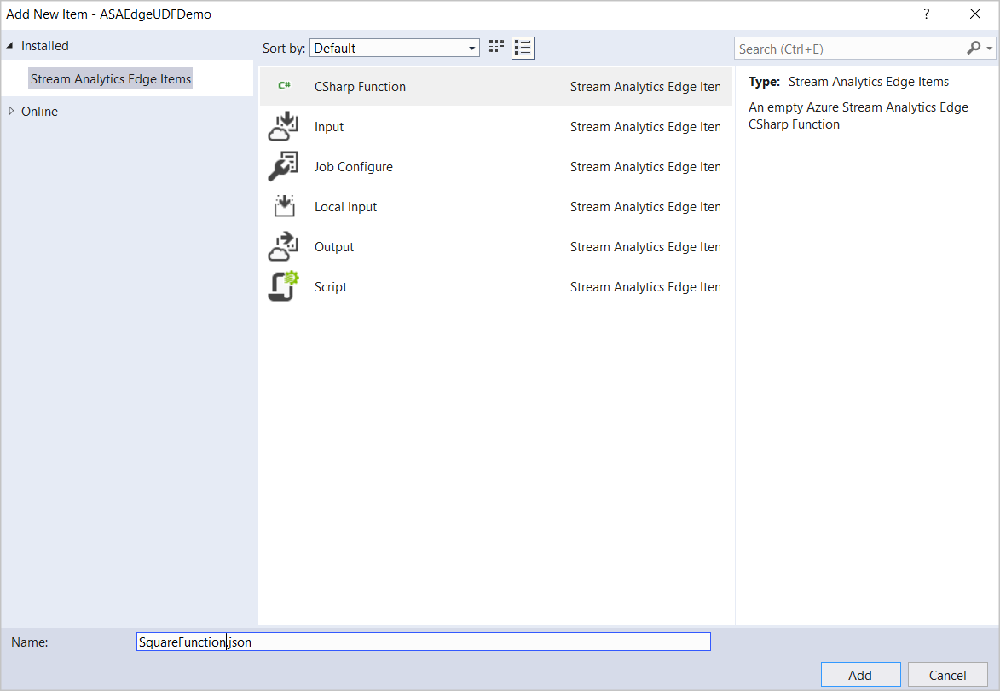
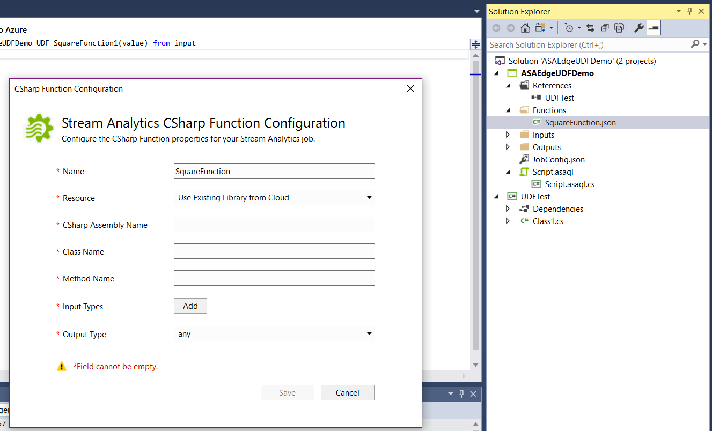
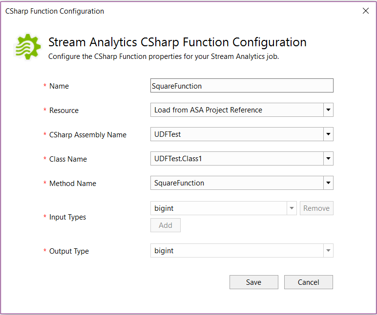
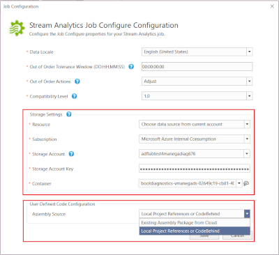

# Develop .NET Standard user-defined functions for Azure Stream Analytics Edge jobs (Preview)

Azure Stream Analytics offers a SQL-like query language for performing transformations and computations over streams of event data. There are many built-in functions, but some complex scenarios require additional flexibility. With .NET Standard user-defined functions (UDF), you can invoke your own functions written in any .NET standard language (C#, F#, etc.) to extend the Stream Analytics query language. UDFs allow you to perform complex math computations, import custom ML models using ML.NET, and use custom imputation logic for missing data. The UDF feature for Stream Analytics Edge jobs is currently in preview and shouldn't be used in production workloads.

## Overview
Visual Studio tools for Azure Stream Analytics make it easy for you to write UDFs, test your jobs locally (even offline), and publish your Stream Analytics job to Azure. Once published to Azure, you can deploy your job to IoT devices using IoT Hub.

There are three ways to implement UDFs:

* CodeBehind files in an ASA project
* UDF from a local project
* An existing package from an Azure storage account

## Package path

The format of any UDF package has the path `/UserCustomCode/CLR/*`. Dynamic Link Libraries (DLLs) and resources are copied under the `/UserCustomCode/CLR/*` folder, which helps isolate user DLLs from system and Azure Stream Analytics DLLs. This package path is used for all functions regardless of the method used to employ them.

## Supported types and mapping

|**UDF type (C#)**  |**Azure Stream Analytics type**  |
|---------|---------|
|long  |  bigint   |
|double  |  double   |
|string  |  nvarchar(max)   |
|dateTime  |  dateTime   |
|struct  |  IRecord   |
|object  |  IRecord   |
|Array\<object>  |  IArray   |
|dictionary<string, object>  |  IRecord   |

## CodeBehind
You can write user-defined functions in the **Script.asql** CodeBehind. Visual Studio tools will automatically compile the CodeBehind file into an assembly file. The assemblies are packaged as a zip file and uploaded to your storage account when you submit your job to Azure. You can learn how to write a C# UDF using CodeBehind by following the [C# UDF for Stream Analytics Edge jobs](stream-analytics-edge-csharp-udf.md) tutorial. 

## Local project
User-defined functions can be written in an assembly that is later referenced in an Azure Stream Analytics query. This is the recommended option for complex functions that require the full power of a .NET Standard language beyond its expression language, such as procedural logic or recursion. UDFs from a local project might also be used when you need to share the function logic across several Azure Stream Analytics queries. Adding UDFs to your local project gives you the ability to debug and test your functions locally from Visual Studio.

To reference a local project:

1. Create a new class library in your solution.
2. Write the code in your class. Remember that the classes must be defined as *public* and objects must be defined as *static public*. 
3. Build your project. The tools will package all the artifacts in the bin folder to a zip file and upload the zip file to the storage account. For external references, use assembly reference instead of the NuGet package.
4. Reference the new class in your Azure Stream Analytics project.
5. Add a new function in your Azure Stream Analytics project.
6. Configure the assembly path in the job configuration file, `JobConfig.json`. Set the Assembly Path to **Local Project Reference or CodeBehind**.
7. Rebuild both the function project and the Azure Stream Analytics project.  

### Example

In this example, **UDFTest** is a C# class library project and **ASAEdgeUDFDemo** is the Azure Stream Analytics Edge project, which will reference **UDFTest**.

1. Build your C# project, which will enable you to add a reference to your C# UDF from the Azure Stream Analytics query.
    
   

2. Add the reference to the C# project in the ASA Edge project. Right-click the References node and choose Add Reference.

   

3. Choose the C# project name from the list. 
    
   

4. You should see the **UDFTest** listed under **References** in **Solution Explorer**.

   

5. Right click on the **Functions** folder and choose **New Item**.

   

6. Add a C# function **SquareFunction.json** to your Azure Stream Analytics project.

   

7. Double-click the function in **Solution Explorer** to open the configuration dialog.

   

8. In the C# function configuration, choose **Load from ASA Project Reference** and the related assembly, class, and method names from the dropdown list. To refer to the methods, types, and functions in the Stream Analytics Edge query, the classes must be defined as *public* and the objects must be defined as *static public*.

   

## Existing packages

You can author .NET Standard UDFs in any IDE of your choice and invoke them from your Azure Stream Analytics query. First compile your code and package all the DLLs. The format of the package has the path `/UserCustomCode/CLR/*`. Then, upload `UserCustomCode.zip` to the root of the container in your Azure storage account.

Once assembly zip packages have been uploaded to your Azure storage account, you can use the functions in Azure Stream Analytics queries. All you need to do is include the storage information in the Stream Analytics Edge job configuration. You can't test the function locally with this option because Visual Studio tools will not download your package. The package path is parsed directly to the service. 

To configure the assembly path in the job configuration file, `JobConfig.json`:

Expand the **User-Defined Code Configuration** section, and fill out the configuration with the following suggested values:

 |**Setting**  |**Suggested value**  |
 |---------|---------|
 |Assembly Source  | Existing Assembly Packages from Cloud    |
 |Resource  |  Choose data from current account   |
 |Subscription  |  Choose your subscription.   |
 |Storage Account  |  Choose your storage account.   |
 |Container  |  Choose the container you created in your storage account.   |

## Limitations
The UDF preview currently has the following limitations:

* .NET Standard languages can only be used for Azure Stream Analytics on IoT Edge. For cloud jobs, you can write JavaScript user-defined functions. To learn more, visit the [Azure Stream Analytics JavaScript UDF](stream-analytics-javascript-user-defined-functions.md) tutorial.

* .NET Standard UDFs can only be authored in Visual Studio and published to Azure. Read-only versions of .NET Standard UDFs can be viewed under **Functions** in the Azure portal. Authoring of .NET Standard functions is not supported in the Azure portal.

* The Azure portal query editor shows an error when using .NET Standard UDF in the portal. 

* Because the custom code shares context with Azure Stream Analytics engine, custom code can't reference anything that has a conflicting namespace/dll_name with Azure Stream Analytics code. For example, you can't reference *Newtonsoft Json*.

## Next steps

* [Tutorial: Write a C# user-defined function for an Azure Stream Analytics Edge job (Preview)](stream-analytics-edge-csharp-udf.md)
* [Tutorial: Azure Stream Analytics JavaScript user-defined functions](stream-analytics-javascript-user-defined-functions.md)
* [Use Visual Studio to view Azure Stream Analytics jobs](stream-analytics-vs-tools.md)
