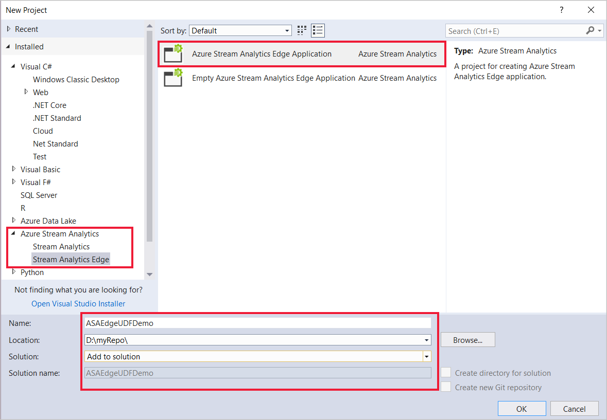
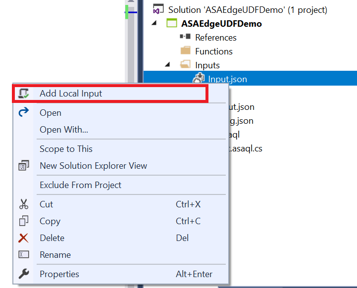
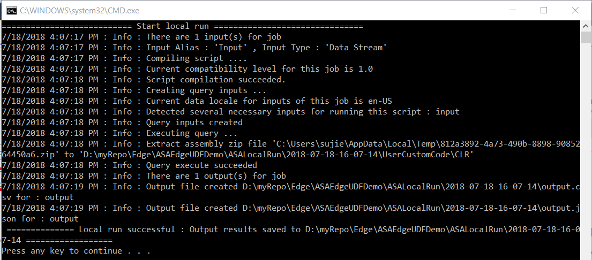
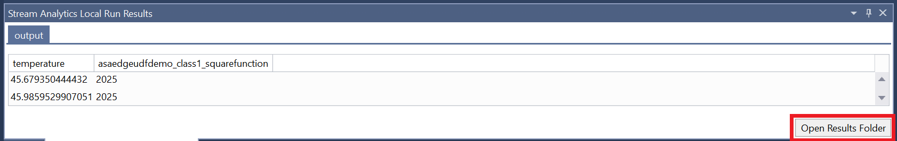
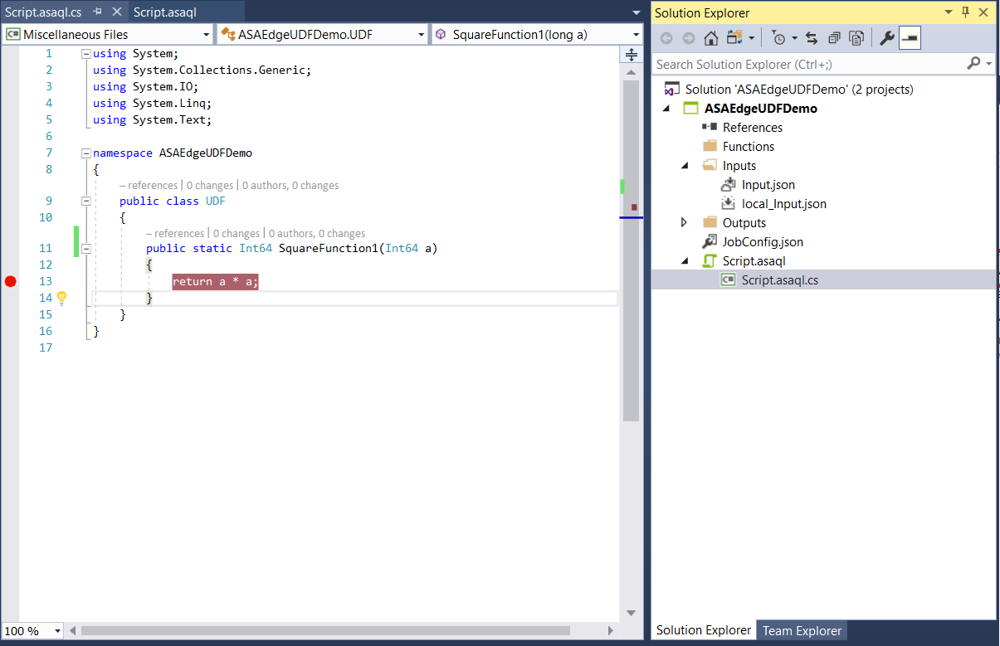
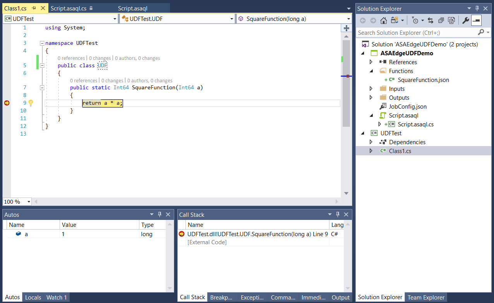
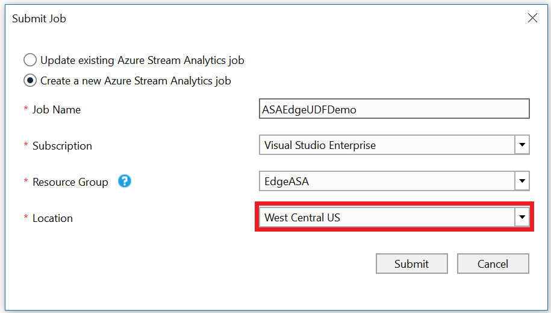

# Tutorial: Write a C# user-defined function for an Azure Stream Analytics Edge job in Visual Studio (Preview)

C# user-defined functions (UDFs) created in Visual Studio allow you to extend the Azure Stream Analytics query language with your own functions. You can reuse existing code (including DLLs) and use mathematical or complex logic with C#. There are three ways to implement UDFs: CodeBehind files in a Stream Analytics project, UDFs from a local C# project, or UDFs from an existing package from a storage account. This tutorial uses the CodeBehind method to implement a basic C# function. The UDF feature for Stream Analytics Edge jobs is currently in preview and shouldn't be used in production workloads.

In this tutorial, you learn how to:

> [!div class="checklist"]
> * Create a C# user defined function using CodeBehind.
> * Test your Stream Analytics Edge job locally.
> * Publish your Edge job to Azure.

## Prerequisites

Before you start, make sure you've completed the following prerequisites:

* If you don't have an Azure subscription, create a [free account](https://azure.microsoft.com/free/?WT.mc_id=A261C142F).
* Install [Stream Analytics tools for Visual Studio](stream-analytics-tools-for-visual-studio-install.md) and the **Azure development** or **Data Storage and Processing** workloads.
* Take a look at the existing [Stream Analytics Edge development guide](stream-analytics-tools-for-visual-studio-edge-jobs.md).

## Create a container in your Azure Storage Account

The container you create will be used to store the compiled C# package and deploy the package to your IoT Edge device. Use a dedicated container for each Stream Analytics job. Reusing the same container for multiple Stream Analytics Edge jobs is not supported. If you already have a storage account with existing containers, you may use them. If not, you'll need to [create a new container](https://docs.microsoft.com/en-us/azure/storage/blobs/storage-quickstart-blobs-portal). 

## Create a Stream Analytics Edge project in Visual Studio

1. Start Visual Studio.

2. Select **File > New > Project**.

3. In the templates list on the left, select **Stream Analytics**, and then select **Azure Stream Analytics Edge Application**.

4.  Input the project **Name**, **Location**, and **Solution name**, and select **OK**.

    

## Configure assembly package path

1. Open Visual Studio and navigate to the **Solution Explorer**.

2. Double-click the job configuration file, `EdgeJobConfig.json`.

3. Expand the **User-Defined Code Configuration** section, and fill out the configuration with the following suggested values:

    |**Setting**  |**Suggested value**  |
    |---------|---------|
    |Assembly Source  |  Local Project Reference or CodeBehind   |
    |Resource  |  Choose data from current account   |
    |Subscription  |  Choose your subscription.   |
    |Storage Account  |  Choose your storage account.   |
    |Container  |  Choose the container you created in your storage account.   |

    


## Write a C# UDF with CodeBehind
A CodeBehind file is a C# file associated with a single ASA Edge query script. Visual Studio tools will automatically zip the CodeBehind file and upload it to your Azure storage account upon submission. All classes must be defined as *public* and all objects must be defined as *static public*.

1. In **Solution Explorer**, expand **Script.asql** to find the **Script.asaql.cs** CodeBehind file.

2. Replace the code with the following sample:

    ```csharp
        using System; 
        using System.Collections.Generic; 
        using System.IO; 
        using System.Linq; 
        using System.Text; 
    
        namespace ASAEdgeUDFDemo 
        { 
            public class Class1 
            { 
                // Public static function 
                public static Int64 SquareFunction(Int64 a) 
                { 
                    return a * a; 
                } 
            } 
        } 
    ```

## Implement the UDF

1. In **Solution Explorer**, open the **Script.asaql** file.

2. Replace the existing query with the following:

    ```sql
        SELECT machine.temperature, udf.ASAEdgeUDFDemo_Class1_SquareFunction(try_cast(machine.temperature as bigint))
        INTO Output
        FROM Input 
    ```

## Local testing

1. Download the Edge [temperature simulator sample data file](https://raw.githubusercontent.com/Azure/azure-stream-analytics/master/Sample%20Data/TemperatureSampleData.json).

2. In **Solution Explorer**, expand **Inputs**, right-click **Input.json**, and select **Add Local Input**.

   

3. Specify the local input file path for the sample data you downloaded and **Save**.

    

4. Click **Run Locally** in the script editor. Once the local run has successfully saved the output results, press any key to see the results in table format. 

    

5. You can also select **Open Results Folder** to see the raw files in JSON and CSV format.

    

## Debug a UDF
You can debug your C# UDF locally the same way you debug standard C# code. 

1. Add breakpoints in your C# function.

    

2. Press **F5** to start debugging. The program will stop at your breakpoints as expected.

    

## Publish your job to Azure
Once you've tested your query locally, select **Submit to Azure** in the script editor to publish the job to Azure.



## Deploy to IoT Edge devices
Your Stream Analytics job is now ready to be deployed as an IoT Edge module. Follow the [IoT Edge quickstart](https://docs.microsoft.com/en-us/azure/iot-edge/quickstart) to create an IoT Hub, register an IoT Edge device, and install and start the IoT Edge runtime on your device. Then follow the [deploy the job](https://docs.microsoft.com/en-us/azure/iot-edge/tutorial-deploy-stream-analytics#deploy-the-job) tutorial to deploy your Stream Analytics job as an IoT Edge module. 

## Next steps

In this tutorial, you created a simple C# user-defined function using CodeBehind, published your job to Azure, and deployed the job to IoT Edge devices using the IoT Hub portal. 

To learn more about the different ways to use C# user-defined functions for Stream Analytics Edge jobs, continue to this article:

> [!div class="nextstepaction"]
> [Write C# user defined functions for Azure Stream Analytics](stream-analytics-edge-csharp-udf-methods.md)
