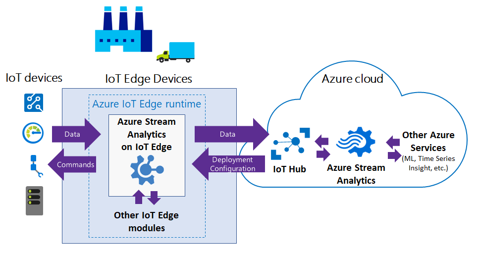
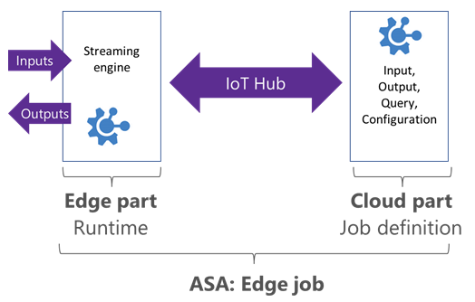
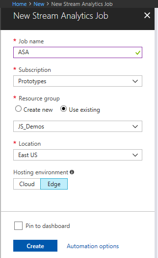
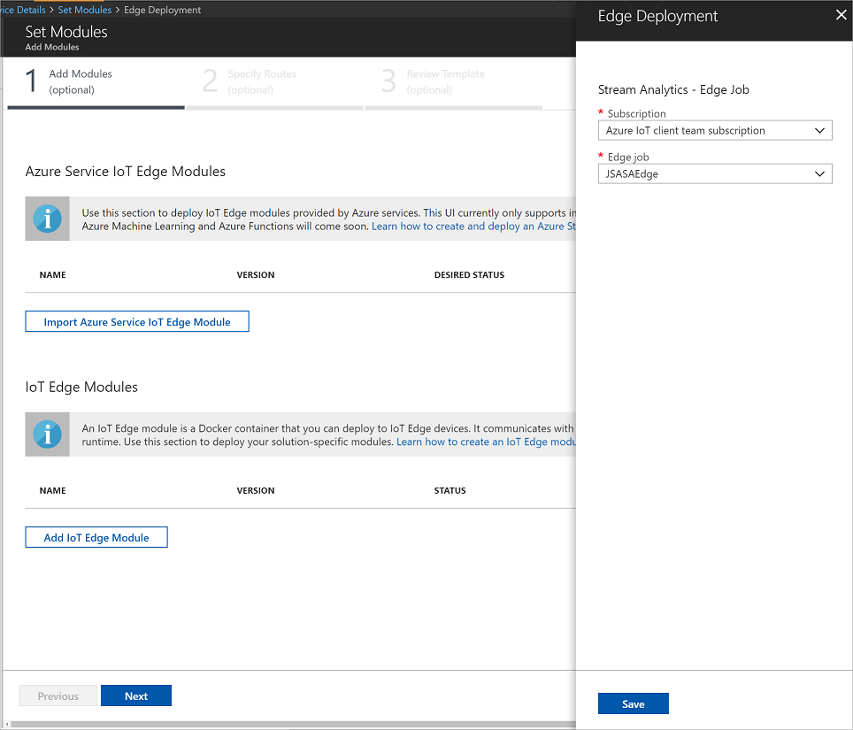
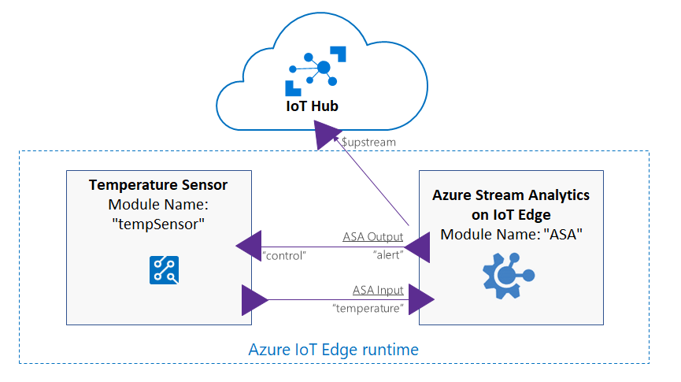
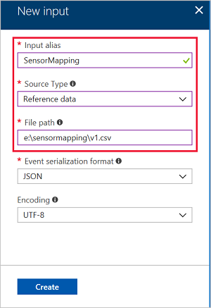

# Azure Stream Analytics on IoT Edge
 
Azure Stream Analytics (ASA) on IoT Edge empowers developers to deploy near-real-time analytical intelligence closer to IoT devices so that they can unlock the full value of device-generated data. Azure Stream Analytics is designed for low latency, resiliency, efficient use of bandwidth, and compliance. Enterprises can now deploy control logic close to the industrial operations and complement Big Data analytics done in the cloud.  

Azure Stream Analytics on IoT Edge runs within the [Azure IoT Edge](https://azure.microsoft.com/campaigns/iot-edge/) framework. Once the job is created in ASA, you can deploy and manage it using IoT Hub.

## Scenarios


* **Low-latency command and control**: For example, manufacturing safety systems must respond to operational data with ultra-low latency. With ASA on IoT Edge, you can analyze sensor data in near real-time, and issue commands when you detect anomalies to stop a machine or trigger alerts.
*	**Limited connectivity to the cloud**: Mission critical systems, such as remote mining equipment, connected vessels, or offshore drilling, need to analyze and react to data even when cloud connectivity is intermittent. With ASA, your streaming logic runs independently of the network connectivity and you can choose what you send to the cloud for further processing or storage.
* **Limited bandwidth**: The volume of data produced by jet engines or connected cars can be so large that data must be filtered or pre-processed before sending it to the cloud. Using ASA, you can filter or aggregate the data that needs to be sent to the cloud.
* **Compliance**: Regulatory compliance may require some data to be locally anonymized or aggregated before being sent to the cloud.

## Edge jobs in Azure Stream Analytics
### What is an "edge" job?

ASA Edge jobs run in containers deployed to [Azure IoT Edge devices](https://docs.microsoft.com/azure/iot-edge/how-iot-edge-works). They are composed of two parts:
1.	A cloud part that is responsible for job definition: users define inputs, output, query, and other settings (out of order events, etc.) in the cloud.
2.	A module running on your IoT devices. It contains the ASA engine and receives the job definition from the cloud. 

ASA uses IoT Hub to deploy edge jobs to device(s). More information about [IoT Edge deployment can be seen here](https://docs.microsoft.com/azure/iot-edge/module-deployment-monitoring).




### Installation instructions
The high-level steps are described in the following table. More details are given in the following sections.

|      |Step   | Notes   |
| ---   | ---   |  ---      |
| 1   | **Create a storage container**   | Storage containers are used to save your job definition where they can be accessed by your IoT devices. <br>  You can reuse any existing storage container.     |
| 2   | **Create an ASA edge job**   |  Create a new job, select **Edge** as **hosting environment**. <br> These jobs are created/managed from the cloud, and run on your own IoT Edge devices.     |
| 3   | **Setup your IoT Edge environment on your device(s)**   | Instructions for [Windows](https://docs.microsoft.com/azure/iot-edge/quickstart) or [Linux](https://docs.microsoft.com/azure/iot-edge/quickstart-linux).          |
| 4   | **Deploy ASA on your IoT Edge device(s)**   |  ASA job definition is exported to the storage container created earlier.       |

You can follow [this step-by-step tutorial](https://docs.microsoft.com/azure/iot-edge/tutorial-deploy-stream-analytics) to deploy your first ASA job on IoT Edge. The following video should help you understand the process to run a Stream Analytics job on an IoT edge device:  


> [!VIDEO https://channel9.msdn.com/Events/Connect/2017/T157/player]

#### Create a storage container
A storage container is required in order to export the ASA compiled query and the job configuration. It is used to configure the ASA Docker image with your specific query. 
1. Follow [these instructions](https://docs.microsoft.com/azure/storage/common/storage-create-storage-account) to create a storage account from the Azure portal. You can keep all default options to use this account with ASA.
2. In the newly created storage account, create a blob storage container:
    1. Click on **Blobs**, then **+ Container**. 
    2. Enter a name and keep the container as **Private**.

#### Create an ASA Edge job
> [!Note]
> This tutorial focuses on ASA job creation using Azure portal. You can also [use Visual Studio plugin to create an ASA Edge job](https://docs.microsoft.com/azure/stream-analytics/stream-analytics-tools-for-visual-studio-edge-jobs)

1. From the Azure portal, create a new "Stream Analytics job". [Direct link to create a new ASA job here](https://ms.portal.azure.com/#create/Microsoft.StreamAnalyticsJob).

2. In the creation screen, select **Edge** as **hosting environment** (see the following picture)

   
3. Job Definition
    1. **Define Input Stream(s)**. Define one or several input streams for your job.
    2. Define Reference data (optional).
    3. **Define Output Stream(s)**. Define one or several outputs streams for your job. 
    4. **Define query**. Define the ASA query in the cloud using the inline editor. The compiler automatically checks the syntax enabled for ASA edge. You can also test your query by uploading sample data. 

4. Set the storage container information in the **IoT Edge settings** menu.

5. Set optional settings
    1. **Event ordering**. You can configure out-of-order policy in the portal. Documentation is available [here](https://docs.microsoft.com/stream-analytics-query/time-skew-policies-azure-stream-analytics).
    2. **Locale**. Set the internalization format.


> [!Note]
> When a deployment is created, ASA exports the job definition to a storage container. This job definition remain the same during the duration of a deployment. 
> As a consequence, if you want to update a job running on the edge, you need to edit the job in ASA, and then create a new deployment in IoT Hub.


#### Set up your IoT Edge environment on your device(s)
Edge jobs can be deployed on devices running Azure IoT Edge.
For this, you need to follow these steps:
- Create an Iot Hub.
- Install Docker and IoT Edge runtime on your edge devices.
- Set your devices as **IoT Edge devices** in IoT Hub.

These steps are described in the IoT Edge documentation for [Windows](https://docs.microsoft.com/azure/iot-edge/quickstart) or [Linux](https://docs.microsoft.com/azure/iot-edge/quickstart-linux).  


####  Deployment ASA on your IoT Edge device(s)
##### Add ASA to your deployment
- In the Azure portal, open IoT Hub, navigate to **IoT Edge** and click on the device you want to target for this deployment.
- Select **Set modules**, then select **+ Add** and choose **Azure Stream Analytics Module**.
- Select the subscription and the ASA Edge job that you created. Click Save.



> [!Note]
> During this step, ASA creates a folder named "EdgeJobs" in the storage container (if it does not exist already). For each  deployment, a new subfolder is created in the "EdgeJobs" folder.
> When you deploy your job to IoT Edge devices, ASA creates a shared access signature (SAS) for the job definition file. The SAS key is securely transmitted to the IoT Edge devices using device twin. The expiration of this key is three years from the day of its creation. 
> When you update an IoT Edge job, the SAS will change, but the image version will not change. Once you **Update**, follow the deployment workflow, and an update notification is logged on the device.


For more information about IoT Edge deployments, see to [this page](https://docs.microsoft.com/azure/iot-edge/module-deployment-monitoring).


##### Configure routes
IoT Edge provides a way to declaratively route messages between modules, and between modules and IoT Hub. The full syntax is described [here](https://docs.microsoft.com/azure/iot-edge/module-composition).
Names of the inputs and outputs created in the ASA job can be used as endpoints for routing.  

###### Example

```json
{
    "routes": {
        "sensorToAsa":   "FROM /messages/modules/tempSensor/* INTO BrokeredEndpoint(\"/modules/ASA/inputs/temperature\")",
        "alertsToCloud": "FROM /messages/modules/ASA/* INTO $upstream",
        "alertsToReset": "FROM /messages/modules/ASA/* INTO BrokeredEndpoint(\"/modules/tempSensor/inputs/control\")"
    }
}

```
This example shows the routes for the scenario described in the following picture. It contains an edge job called "**ASA**", with an input named "**temperature**" and an output named "**alert**".


This example defines the following routes:
- Every message from the **tempSensor** is sent to the module named **ASA** to the input named **temperature**,
- All outputs of **ASA** module are sent to the IoT Hub linked to this device ($upstream),
- All outputs of **ASA** module are sent to the **control** endpoint of the **tempSensor**.


## Technical information
### Current limitations for IoT Edge jobs compared to cloud jobs
The goal is to have parity between IoT Edge jobs and cloud jobs. Most SQL query language features are supported, enabling to run the same logic on both cloud and IoT Edge.
However the following features are not yet supported for edge jobs:
* User-defined functions (UDF) in JavaScript. UDF are available in [C# for IoT Edge jobs](https://docs.microsoft.com/azure/stream-analytics/stream-analytics-edge-csharp-udf) (preview).
* User-defined aggregates (UDA).
* Azure ML functions.
* Using more than 14 aggregates in a single step.
* AVRO format for input/output. At this time, only CSV and JSON are supported.
* The following  SQL operators:
    * PARTITION BY
    * GetMetadataPropertyValue
* Late arrival policy

### Runtime and hardware requirements
To run ASA on IoT Edge, you need devices that can run [Azure IoT Edge](https://azure.microsoft.com/campaigns/iot-edge/). 

ASA and Azure IoT Edge use **Docker** containers to provide a portable solution that runs on multiple host operating systems (Windows, Linux).

ASA on IoT Edge is made available as Windows and Linux images, running on both x86-64 or ARM (Advanced RISC Machines) architectures. 


### Input and output
#### Input and Output Streams
ASA Edge jobs can get inputs and outputs from other modules running on IoT Edge devices. To connect from and to specific modules, you can set the routing configuration at deployment time. More information is described on [the IoT Edge module composition documentation](https://docs.microsoft.com/azure/iot-edge/module-composition).

For both inputs and outputs, CSV and JSON formats are supported.

For each input and output stream you create in your ASA job, a corresponding endpoint is created on your deployed module. These endpoints can be used in the routes of your deployment.

At present, the only supported stream input and stream output types are Edge Hub. Reference input supports reference file type. Other outputs can be reached using a cloud job downstream. For example, a Stream Analytics job hosted in Edge sends output to Edge Hub, which can then send output to IoT Hub. You can use a second cloud hosted Azure Stream Analytics job with input from IoT Hub and output to Power BI or another output type.


##### Reference data
Reference data (also known as a lookup table) is a finite data set that is static or slow changing in nature. It is used to perform a lookup or to correlate with your data stream. To make use of reference data in your Azure Stream Analytics job, you will generally use a [Reference Data JOIN](https://docs.microsoft.com/stream-analytics-query/reference-data-join-azure-stream-analytics) in your query. For more information, see the [Using reference data for lookups in Stream Analytics](stream-analytics-use-reference-data.md).

Only local reference data is supported. When a job is deployed to IoT Edge device, it loads reference data from the user defined file path.

To create a job with reference data on Edge:

1. Create a new input for your job.

2. Choose **Reference data** as the **Source Type**.

3. Have a reference data file ready on the device. For a Windows container, put the reference data file on the local drive and share the local drive with the Docker container. For a Linux container, create a Docker volume and populate the data file to the volume.

4. Set the file path. For Windows Host OS and Windows container, use the absolute path: `E:\<PathToFile>\v1.csv`. For a Windows Host OS and Linux container or a Linux OS and Linux container, use the path in the volume: `<VolumeName>/file1.txt`.



The reference data on IoT Edge update is triggered by a deployment. Once triggered, the ASA module picks the updated data without stopping the running job.

There are two ways to update the reference data:
* Update reference data path in your ASA job from Azure portal.
* Update the IoT Edge deployment.

## License and third-party notices
* [Azure Stream Analytics on IoT Edge license](https://go.microsoft.com/fwlink/?linkid=862827). 
* [Third-party notice for Azure Stream Analytics on IoT Edge](https://go.microsoft.com/fwlink/?linkid=862828).

## Azure Stream Analytics module image information 

This version information was last updated on 2019-06-27:

- Image: `mcr.microsoft.com/azure-stream-analytics/azureiotedge:1.0.5-linux-amd64`
   - base image: microsoft/dotnet:2.1.6-runtime-alpine3.7
   - platform:
      - architecture: amd64
      - os: linux
  
- Image: `mcr.microsoft.com/azure-stream-analytics/azureiotedge:1.0.5-linux-arm32v7`
   - base image: microsoft/dotnet:2.1.6-runtime-bionic-arm32v7
   - platform:
      - architecture: arm
      - os: linux
  
- Image: `mcr.microsoft.com/azure-stream-analytics/azureiotedge:1.0.5-windows-amd64`
   - base image: microsoft/dotnet:2.1.6-runtime-nanoserver-1809
   - platform:
      - architecture: amd64
      - os: windows
      
      
## Get help
For further assistance, try the [Microsoft Q&A question page for Azure Stream Analytics](https://docs.microsoft.com/answers/topics/azure-stream-analytics.html).

## Next steps

* [More information on Azure Iot Edge](https://docs.microsoft.com/azure/iot-edge/how-iot-edge-works)
* [ASA on IoT Edge tutorial](https://docs.microsoft.com/azure/iot-edge/tutorial-deploy-stream-analytics)
* [Develop Stream Analytics Edge jobs using Visual Studio tools](https://docs.microsoft.com/azure/stream-analytics/stream-analytics-tools-for-visual-studio-edge-jobs)
* [Implement CI/CD for Stream Analytics using APIs](stream-analytics-cicd-api.md)

<!--Link references-->
[stream.analytics.developer.guide]: ../stream-analytics-developer-guide.md
[stream.analytics.scale.jobs]: stream-analytics-scale-jobs.md
[stream.analytics.introduction]: stream-analytics-introduction.md
[stream.analytics.get.started]: stream-analytics-real-time-fraud-detection.md
[stream.analytics.query.language.reference]: https://go.microsoft.com/fwlink/?LinkID=513299
[stream.analytics.rest.api.reference]: https://go.microsoft.com/fwlink/?LinkId=517301
