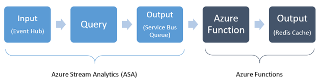
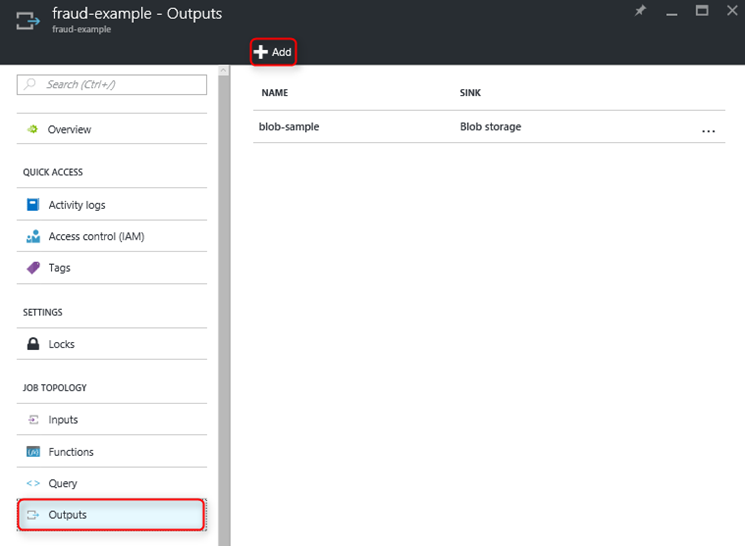
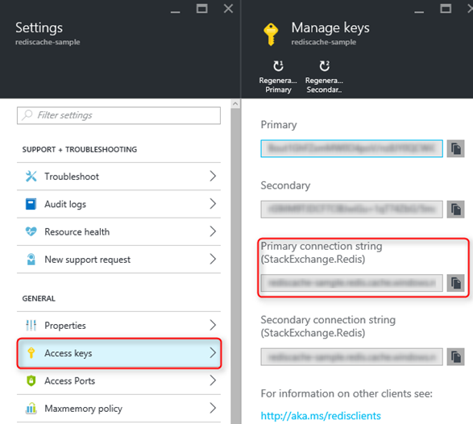
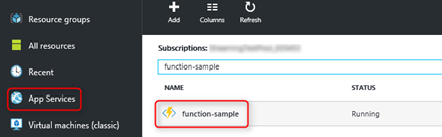
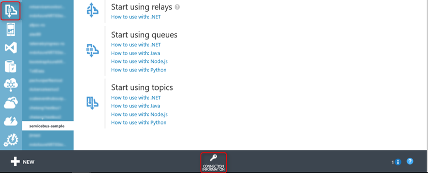
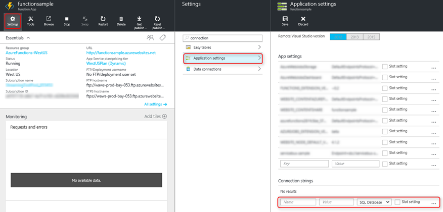
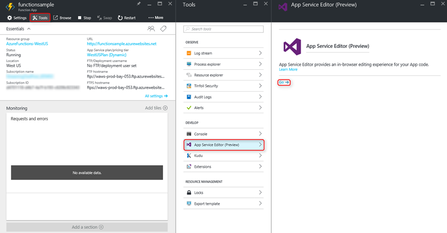
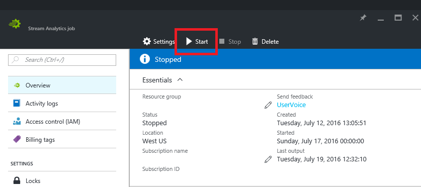
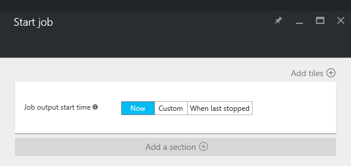
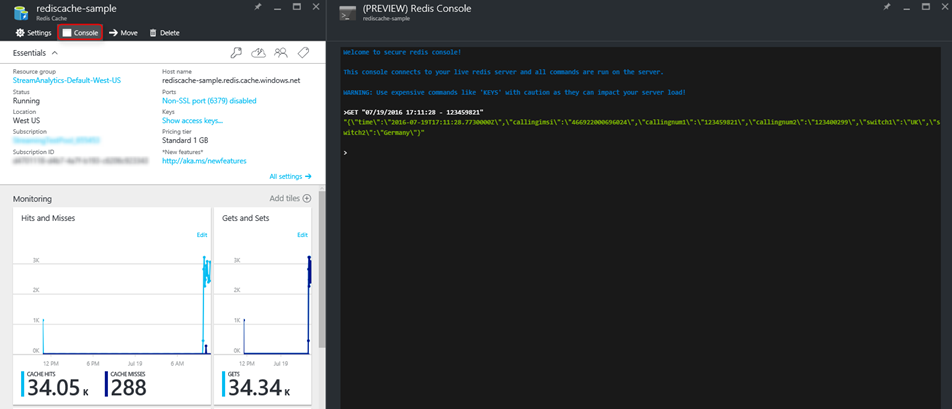

<properties
	pageTitle="How to store data from Azure Stream Analytics into an Azure Redis Cache using Azure Functions | Microsoft Azure"
	description="Learn how to use an Azure Function connected a Service Bus Queue, to populate an Azure Redis Cache from the output of a Stream Analytics job."
	keywords="data stream, redis cache, service bus queue"
	services="stream-analytics"
	authors="ryancrawcour"/>

<tags
	ms.service="stream-analytics"
	ms.devlang="na"
	ms.topic="article"
	ms.tgt_pltfrm="na"
	ms.workload="data-services"
	ms.date="08/09/2016"
	ms.author="ryancraw"/>

# How to store data from Azure Stream Analytics in an Azure Redis Cache using Azure Functions

Azure Stream Analytics lets you rapidly develop and deploy low-cost solutions to gain real-time insights from devices, sensors, infrastructure, and applications, or any stream of data. It enables various use cases such as real-time management and monitoring, command and control, fraud detection, connected cars and many more. In many such scenarios, users may want to store data outputted by Azure Stream Analytics into a distributed data store such as an Azure Redis cache.

Suppose you are part of a telecommunications company. You are trying to detect SIM fraud (multiple calls coming from the same identity around the same time but in geographically different locations), and you are tasked with storing all the fraudulent phone calls in an Azure Redis cache. In this blog, we provide guidance on how you can easily complete your task by storing the fraudulent phone calls coming from the output of the Stream Analytics pipeline in an Azure Redis cache.

## Prerequisites
Complete the [Real-time Fraud Detection][fraud-detection] walk-through for ASA

## Architecture Overview


As shown in the figure above, Stream Analytics allows streaming input data to be queried and sent to an output. Based on the output, Azure Functions can then trigger some type of event. 

In this blog, we focus on the Azure Functions part of this pipeline, or more specifically the triggering of an event that stores fraudulent data into the cache.
After completing the [Real-time Fraud Detection][fraud-detection] tutorial, you will have your input (an event hub), your query, and your output (blob storage) already configured and running. In this blog, we change the output to use a Service Bus Queue instead, to which we will later connect an Azure Function. 

## Create and connect a Service Bus Queue output
To create a Service Bus Queue, follow steps 1 and 2 of the .NET section in [Get Started with Service Bus Queues][servicebus-getstarted].
Now let's connect the queue to the Stream Analytics job that was created in the earlier fraud detection walk-through.


1. In the Azure portal, go to the **Outputs** blade of your job and select **Add** at the top of the page.

	

2. Choose **Service Bus Queue** as the **Sink** and and follow the instructions on the screen. Be sure to choose the namespace of the Service Bus Queue you created in [Get Started with Service Bus Queues][servicebus-getstarted]. Click the "right" button when you are finished.
3. Specify the following values:
	- **Event Serializer Format**: JSON
	- **Encoding**: UTF8
	- **FORMAT**: Line separated

4. Click the **Create** button to add this source and to verify that Stream Analytics can successfully connect to the storage account.

5. In the **Query** tab, replace the current query with the following. Replace <YOUR SERVICE BUS NAME> with the output name you created in step 3. 

    ```    

	    SELECT 
            System.Timestamp as Time, CS1.CallingIMSI, CS1.CallingNum as CallingNum1, 
            CS2.CallingNum as CallingNum2, CS1.SwitchNum as Switch1, CS2.SwitchNum as Switch2

        INTO <YOUR SERVICE BUS NAME>
    
        FROM CallStream CS1 TIMESTAMP BY CallRecTime
	    JOIN CallStream CS2 TIMESTAMP BY CallRecTime
            ON CS1.CallingIMSI = CS2.CallingIMSI AND DATEDIFF(ss, CS1, CS2) BETWEEN 1 AND 5
    
        WHERE CS1.SwitchNum != CS2.SwitchNum
    
    ```

## Create an Azure Redis Cache
Create an Azure Redis cache by following the .NET section in [How to Use Azure Redis Cache][use-rediscache] until the section called ***Configure the cache clients***.
Once complete, you will have a new Redis Cache. Under **All settings**, select **Access keys** and note down the ***Primary connection string***.



## Create an Azure Function
Follow [Create your first Azure Function][functions-getstarted] tutorial to get started with Azure Functions. If you already have an Azure function you would like to use, then skip ahead to [Writing to Redis Cache](#Writing-to-Redis-Cache)

1. In the portal, select App Services from the left-hand navigation, then click your Azure function app name to get to the Function's app website.
	

2. Click **New Function > ServiceBusQueueTrigger – C#**. For the following fields, follow these instructions:
	- **Queue name**: This should be the same name as the name you entered when you created the queue in [Get Started with Service Bus Queues][servicebus-getstarted] (not the name of the service bus). Make sure this is the queue that is connected to the Stream Analytics output.
	- **Service Bus connection**: Select **Add a connection string**. To find the connection string, go to the classic portal, select **Service Bus**, the service bus you created, and **CONNECTION INFORMATION** at the bottom of the screen. Make sure you are on the main screen on this page. Copy and paste the connection string. Feel free to enter any connection name.
	
		
	- **AccessRights**: Choose **Manage**


3. Click **Create**

## Writing to Redis Cache
We have now created an Azure Function that reads from a Service Bus Queue. All that is left to do is use our Function to write this data to the Redis Cache. 

1. Select your newly created **ServiceBusQueueTrigger**, and click **Function app settings** on the top right corner. Select **Go to App Service Settings > Settings > Application settings**

2. In the Connection strings section, create a name in the **Name** section, paste the primary connection string you found in the **Create a Redis Cache** step above into the **Value** section, and select **Custom** where it says **SQL Database**.

3. Click **Save** at the top.

	

4. Now go back to the App Service Settings and select **Tools > App Service Editor (Preview) > On > Go**.

	

5. In an editor of your choice, create a JSON file named **project.json** with the following and save it to your local disk.

````
    {
        "frameworks": {
		        "net46": {
		            "dependencies": {
				        "StackExchange.Redis":"1.1.603",
				        "Newtonsoft.Json": "9.0.1"
			        }
		        }
	        }
        }
````

6. Upload this file into the root directory of your function (not WWWROOT). You should see a file named **project.lock.json** automatically appear. This confirms that the NuGet packages “StackExchange.Redis” and “Newtonsoft.Json” have been imported.

7. In the **run.csx** file, replace the pre-generated code with the following code. In the lazyConnection function, replace “YOUR CONNECTION NAME” with the name you created in step 2 of **Store data into the Redis cache**.

````

	using System;
    using System.Threading.Tasks;
    using StackExchange.Redis;
    using Newtonsoft.Json;
    using System.Configuration;
    
    public static void Run(string myQueueItem, TraceWriter log)
    {
        log.Info($"C# ServiceBus queue trigger function processed message: {myQueueItem}");

        // Connection refers to a property that returns a ConnectionMultiplexer
        IDatabase db = Connection.GetDatabase();
        log.Info($"Created database {db}");
    
        // Parse JSON and extract the time
        var message = JsonConvert.DeserializeObject<dynamic>(myQueueItem);
        string time = message.time;
        string callingnum1 = message.callingnum1;

        // Perform cache operations using the cache object...
        // Simple put of integral data types into the cache
        string key = time + " - " + callingnum1;
        db.StringSet(key, myQueueItem);
        log.Info($"Object put in database. Key is {key} and value is {myQueueItem}");

        // Simple get of data types from the cache
        string value = db.StringGet(key);
        log.Info($"Database got: {value}"); 
    }

    // Connect to the Service Bus
    private static Lazy<ConnectionMultiplexer> lazyConnection = new Lazy<ConnectionMultiplexer>(() =>
    {
        return ConnectionMultiplexer.Connect(ConfigurationManager.ConnectionStrings["YOUR CONNECTION NAME"].ConnectionString);
    });
    
    public static ConnectionMultiplexer Connection
    {
        get
        {
            return lazyConnection.Value;
        }
    }

````

## Start Stream Analytics Job

1. Start the telcodatagen.exe application. The usage is as follows: ````telcodatagen.exe [#NumCDRsPerHour] [SIM Card Fraud Probability] [#DurationHours]````

2. From the Stream Analytics Job blade in the portal, click **Start** at the top of the page.

	

3. In the **Start job** blade that appears, select **Now** and then click the **Start** button at the bottom of the screen. The job status changes to Starting and after some time changes to Running.
 
	

## Run & Check
Going back to your **ServiceBusQueueTrigger **page, you should now see log statements showing that you got something from the Service Bus Queue, put it into the database, and fetched it out using the time as the key!

To verify that your data is in your Redis cache, go to your Redis cache page in the new portal (as shown in the [Create an Azure Redis Cache](#Create-an-Azure-Redis-Cache) step above) and select Console.

Now you can write Redis commands to confirm that data is in fact in the cache.



## Next Steps
We’re excited about the new things Azure Functions and Stream analytics can do together, and we hope that this unlocks new possibilities for you. If you have any feedback on what you want next, feel free to use the [Azure UserVoice site](https://feedback.azure.com/forums/270577-stream-analytics).

If you are new to either Microsoft Azure or Stream Analytics, we invite you to try it out by signing up for a [free Azure trial account](https://azure.microsoft.com/pricing/free-trial/) and [create your first Stream Analytics job](stream-analytics-create-a-job.md).

If you need any help or have questions, please reach out to us through the [MSDN](https://social.msdn.microsoft.com/Forums/en-US/home?forum=AzureStreamAnalytics) or [Stackoverflow](http://stackoverflow.com/questions/tagged/azure-stream-analytics) forums. 

You can also see the following resources:

- [Azure Functions developer reference](../azure-functions/functions-reference.md)
- [Azure Functions C# developer reference](../azure-functions/functions-reference-csharp.md)
- [Azure Functions NodeJS developer reference](../azure-functions/functions-reference.md)
- [Azure Functions triggers and bindings](../azure-functions/functions-triggers-bindings.md)
- [How to monitor Azure Redis Cache](../redis-cache/cache-how-to-monitor.md)

To stay up-to-date on all the latest news and features, follow [@AzureStreaming](https://twitter.com/AzureStreaming) on Twitter.


[fraud-detection]: stream-analytics-real-time-fraud-detection.md
[servicebus-getstarted]: ../service-bus/service-bus-dotnet-get-started-with-queues.md
[use-rediscache]: ../redis-cache/cache-dotnet-how-to-use-azure-redis-cache.md
[functions-getstarted]: ../azure-functions/functions-create-first-azure-function.md