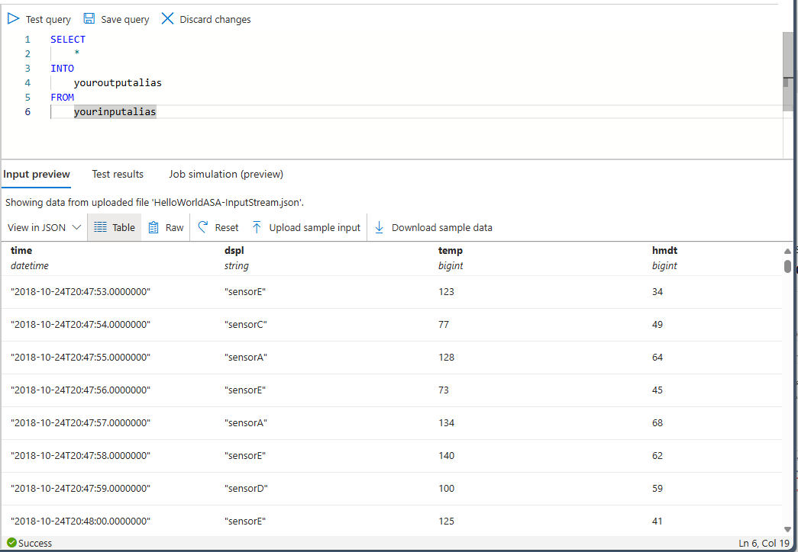

# Process real-time IoT data streams with Azure Stream Analytics

In this article, you learn how to create stream-processing logic to gather data from Internet of Things (IoT) devices. You use a real-world Internet of Things (IoT) use case to demonstrate how to build your solution quickly and economically.

## Prerequisites

* Create a free [Azure subscription](https://azure.microsoft.com/pricing/free-trial/).
* Download sample query and data files from [GitHub](https://aka.ms/azure-stream-analytics-get-started-iot).

## Scenario

Contoso, which is a company in the industrial automation space, has completely automated its manufacturing process. The machinery in this plant has sensors that are capable of emitting streams of data in real time. In this scenario, a production floor manager wants to have real-time insights from the sensor data to look for patterns and take actions on them. You can use Stream Analytics Query Language (SAQL) over the sensor data to find interesting patterns from the incoming stream of data.

In this example, the data is generated from a Texas Instruments sensor tag device. The payload of the data is in JSON format and looks like the following:

```json
{
    "time": "2016-01-26T20:47:53.0000000",  
    "dspl": "sensorE",  
    "temp": 123,  
    "hmdt": 34  
}  
```

In a real-world scenario, you could have hundreds of these sensors generating events as a stream. Ideally, a gateway device would run code to push these events to [Azure Event Hubs](https://azure.microsoft.com/services/event-hubs/) or [Azure IoT Hubs](https://azure.microsoft.com/services/iot-hub/). Your Stream Analytics job would ingest these events from Event Hubs and run real-time analytics queries against the streams. Then, you could send the results to one of the [supported outputs](stream-analytics-define-outputs.md).

For ease of use, this getting started guide provides a sample data file, which was captured from real sensor tag devices. You can run queries on the sample data and see results. In subsequent tutorials, you will learn how to connect your job to inputs and outputs and deploy them to the Azure service.

## Create a Stream Analytics job

1. In the [Azure portal](https://portal.azure.com), select **+ Create a resource** from the left navigation menu. Then, select **Stream Analytics job** from **Analytics**.
   
    

1. Enter a unique job name and verify the subscription is the correct one for your job. Create a new resource group or select an existing one from your subscription.

1. Select a location for your job. Use the same location for your resource group and all resources to increased processing speed and reduced of costs. After you've made the configurations, select **Create**.
   
    

## Create an Azure Stream Analytics query
The next step after your job is created is to write a query. You can test queries against sample data without connecting an input or output to your job.

Download the [HelloWorldASA-InputStream.json](https://github.com/Azure/azure-stream-analytics/blob/master/Samples/GettingStarted/HelloWorldASA-InputStream.json
) from GitHub. Then, navigate to your Azure Stream Analytics job in the Azure portal.

Select **Query** under **Job topology** from the left menu. Then select **Upload sample input**. Upload the `HelloWorldASA-InputStream.json` file, and select **Ok**.


Notice that a preview of the data is automatically populated in the **Input preview** table.



### Query: Archive your raw data

The simplest form of query is a pass-through query that archives all input data to its designated output. This query is the default query populated in a new Azure Stream Analytics job.

```sql
SELECT 
    *
INTO
    Output
FROM
    InputStream
```

Select **Test query** and view the results in the **Test results** table.


### Query: Filter the data based on a condition

Let's try to filter the results based on a condition. We would like to show results for only those events that come from "sensorA."

```sql
SELECT 
    time,
    dspl AS SensorName,
    temp AS Temperature,
    hmdt AS Humidity
INTO
   Output
FROM
    InputStream
WHERE dspl='sensorA'
```

Paste the query in the editor and select **Test query** to review the results.


### Query: Alert to trigger a business workflow

Let's make our query more detailed. For every type of sensor, we want to monitor average temperature per 30-second window and display results only if the average temperature is above 100 degrees.

```sql
SELECT 
    System.Timestamp AS OutputTime,
    dspl AS SensorName,
    Avg(temp) AS AvgTemperature
INTO
   Output
FROM
    InputStream TIMESTAMP BY time
GROUP BY TumblingWindow(second,30),dspl
HAVING Avg(temp)>100
```


You should see results that contain only 245 rows and names of sensors where the average temperate is greater than 100. This query groups the stream of events by **dspl**, which is the sensor name, over a **Tumbling Window** of 30 seconds. Temporal queries must state how you want time to progress. By using the **TIMESTAMP BY** clause, you have specified the **OUTPUTTIME** column to associate times with all temporal calculations. For detailed information, read about [Time Management](https://docs.microsoft.com/stream-analytics-query/time-management-azure-stream-analytics) and [Windowing functions](https://docs.microsoft.com/stream-analytics-query/windowing-azure-stream-analytics).

### Query: Detect absence of events

How can we write a query to find a lack of input events? Let's find the last time that a sensor sent data and then did not send events for the next 5 seconds.

```sql
SELECT 
    t1.time,
    t1.dspl AS SensorName
INTO
   Output
FROM
    InputStream t1 TIMESTAMP BY time
LEFT OUTER JOIN InputStream t2 TIMESTAMP BY time
ON
    t1.dspl=t2.dspl AND
    DATEDIFF(second,t1,t2) BETWEEN 1 and 5
WHERE t2.dspl IS NULL
```


Here we use a **LEFT OUTER** join to the same data stream (self-join). For an **INNER** join, a result is returned only when a match is found.  For a **LEFT OUTER** join, if an event from the left side of the join is unmatched, a row that has NULL for all the columns of the right side is returned. This technique is very useful to find an absence of events. For more information, see [JOIN](https://docs.microsoft.com/stream-analytics-query/join-azure-stream-analytics).

## Conclusion

The purpose of this article is to demonstrate how to write different Stream Analytics Query Language queries and see results in the browser. However, this is just to get you started. Stream Analytics supports a variety of inputs and outputs and can even use functions in Azure Machine Learning to make it a robust tool for analyzing data streams. For more information about how to write queries, read the article about [common query patterns](stream-analytics-stream-analytics-query-patterns.md).

