<properties
	pageTitle="Get started with Azure Stream Analytics to process data from IoT devices. | Stream Analytics"
	description="IoT sensor tags and data streams with stream analytics and real-time data processing"
	services="stream-analytics"
	documentationCenter=""
	authors="jeffstokes72"
	manager="paulettm"
	editor="cgronlun"
/>

<tags 
	ms.service="stream-analytics" 
	ms.devlang="na" 
	ms.topic="hero-article" 
	ms.tgt_pltfrm="na" 
	ms.workload="data-services" 
	ms.date="08/04/2016"
	ms.author="jeffstok"
/>

# Get started with Azure Stream Analytics to process data from IoT devices

In this tutorial you will learn to create stream processing logic to gather data from Internet of Things (IoT) devices. We will use a real-world, Internet of Things (IoT) use-case to demonstrate how to build your solution quickly and economically.

## Prerequisites

-   [Azure Subscription](https://azure.microsoft.com/pricing/free-trial/)
-   Sample query and data files downloadable from [GitHub](https://github.com/Azure/azure-stream-analytics/tree/master/Samples/GettingStarted)

## Scenario

Contoso is a company in the industrial automation space and they have completely automated their manufacturing process. The machinery in this plant has sensors capable of emitting streams of data in real time. In this scenario, a production floor manager wants to have real-time insights from the sensor data to look for patterns and take actions on them. We will use the Stream Analytics Query Language (SAQL) over the sensor data to find out interesting patterns over the incoming stream of data.

Here data is being generated from a Texas Instrument Sensor Tag device.

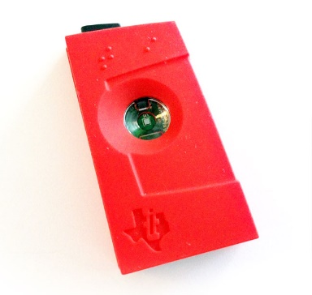

The Payload of the data is in JSON format and looks like the following:

    
	{
    	"time": "2016-01-26T20:47:53.0000000",  
	    "dspl": "sensorE",  
    	"temp": 123,  
	    "hmdt": 34  
	}  
    
In a real world scenario, you could have 100’s of these sensors generating events as a stream. There would ideally be a gateway device running some code to push these events to [Azure Event Hubs](https://azure.microsoft.com/services/event-hubs/) or [Azure IoT Hubs](https://azure.microsoft.com/services/iot-hub/). Your Stream Analytics job would ingest these events from Event Hubs and run real-time analytics queries against the streams. Then you could send the results to one of the [supported outputs](stream-analytics-define-outputs.md).

For ease of use, in this Getting Started guide, we have provided you with a sample data file, captured from real SensorTag devices, on which you can run different queries and see their results. In subsequent tutorials, you will learn how to connect your job to inputs and outputs and deploy them to the Azure service.

## Create Stream Analytics job

In the [Azure portal](http://manage.windowsazure.com) select Stream Analytics and click **“New”** in the bottom left hand corner of the page to create a new analytics job.

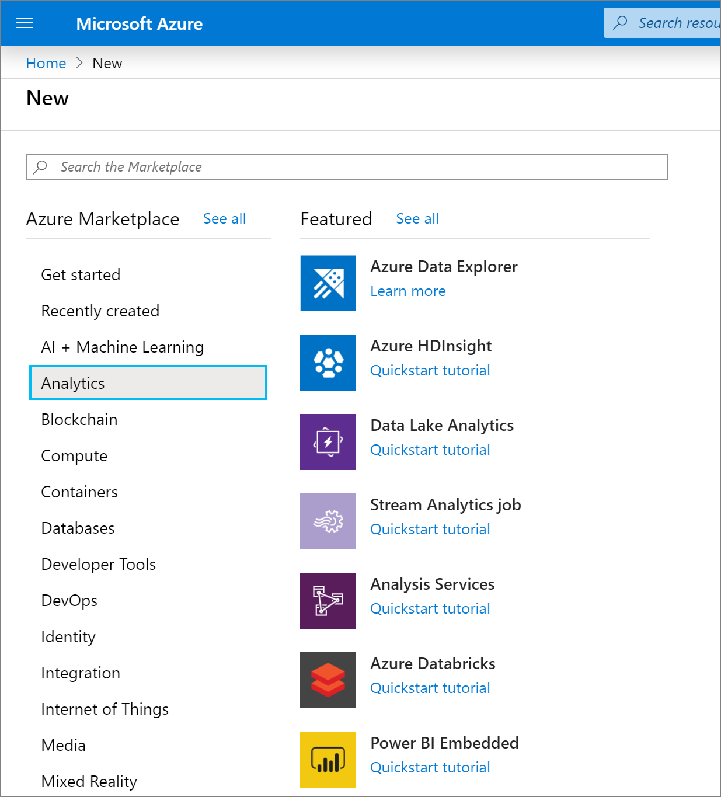

Click "**Quick Create**".

For **“Regional Monitoring Storage Account”** setting, select **“Create new storage account”** and give it any unique name. Azure Stream Analytics will use this account to store monitoring information for all your future jobs.

> [AZURE.NOTE] You should create this storage account only once per region and this storage will be shared across all Stream Analytics jobs created in that region.

Click "**Create Stream Analytics Job**" at the bottom of the page.

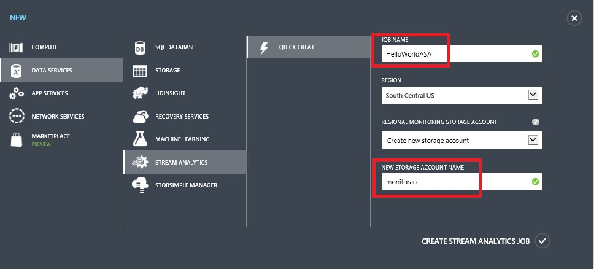

## Azure Stream Analytics query

Click on the Query tab to go to the Query Editor. The Query tab contains a T-SQL query that performs the transformation over the incoming event data.

## Archiving your raw data

The simplest form of query is a pass-through which will archive all input data to its designated output.

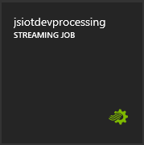

Now download the sample data file from [GitHub](https://github.com/Azure/azure-stream-analytics/tree/master/Samples/GettingStarted) to a location in your computer. Copy and paste the query from the **PassThrough.txt** file. Click on the Test button below and select the data file named **HelloWorldASA-InputStream.json** from your downloaded location.

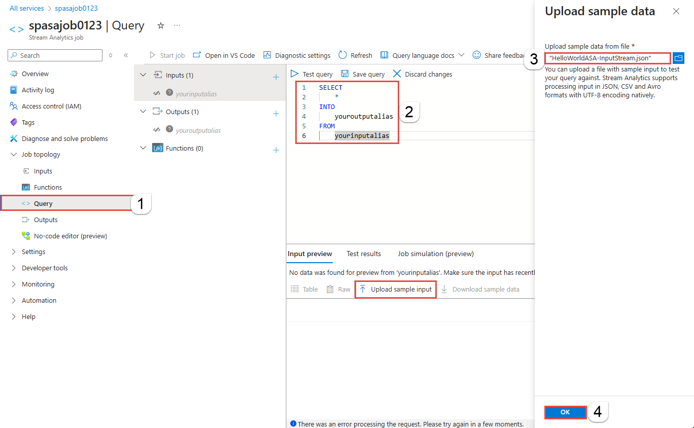

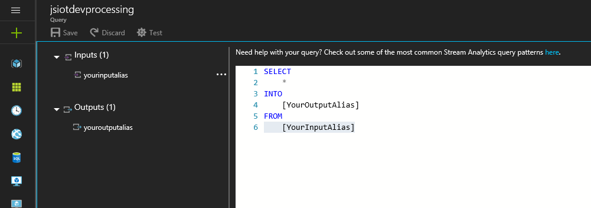

You can see the results of the query in the browser, as shown below.

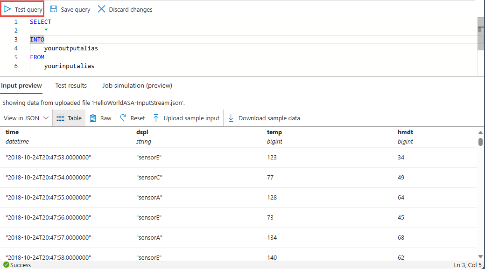

## Filtering the data based on a condition

Let’s try to filter the results based on a condition. We would like to shows results for only those events which are coming from “SensorA”. The query is located in **Filtering.txt** file.

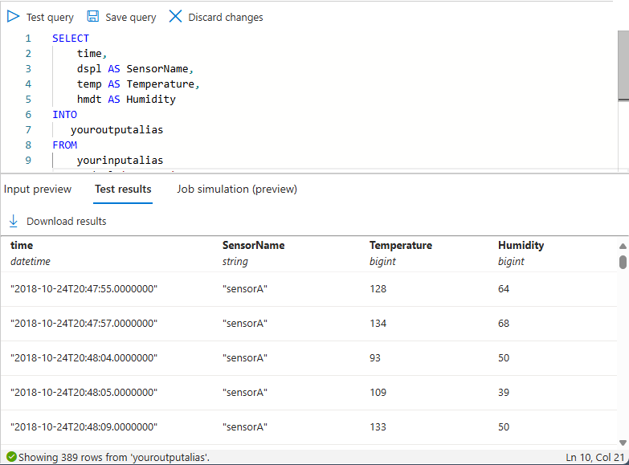

Note that the here we are comparing a string value and it is case-sensitive. Click on the **Rerun** button to execute the query. The query should only return 389 rows out of 1860 events.

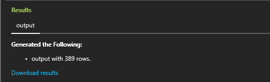

## Alerting to trigger business workflow

Now we will make our query more detailed. For every type of sensor, if we want to monitor average temperature per 30 second window and display results only if the average temperature is above 100 degrees, we will write the query below and then click on **Rerun** to see the results. The query is located in **ThresholdAlerting.txt** file.

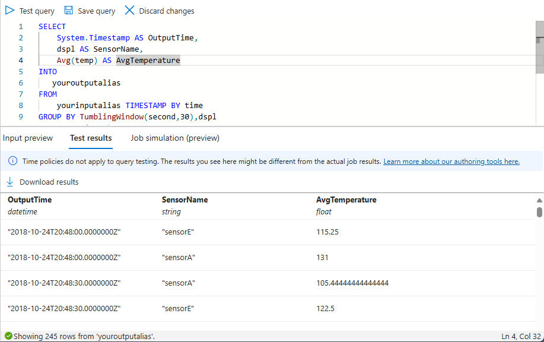

You should now see that the results contain only 245 rows and lists those sensors where the average temperate is greater than 100. In this query we have grouped the stream of events by **dspl**, which is the Sensor Name and over a **Tumbling Window** of 30 seconds. When we do such temporal queries, it is essential to state how we want to time to progress. By using the **TIMESTAMP BY** clause, we have specified the “time” column as a way to progress time for all temporal calculations. For detailed information please read the MSDN topics on [Time Management](https://msdn.microsoft.com/library/azure/mt582045.aspx) and [Windowing functions](https://msdn.microsoft.com/library/azure/dn835019.aspx).

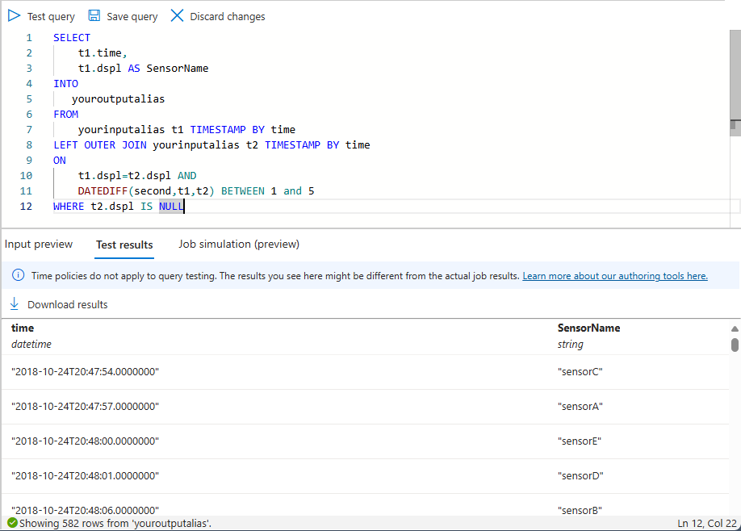

## Detecting lack of event conditions

How can we write a query to find a lack of input events? It is pretty straightforward to do so. Let’s find the last time a Sensor has sent data and then did not send out any events for the next minute. The query is located in **AbsenseOfEvent.txt** file.

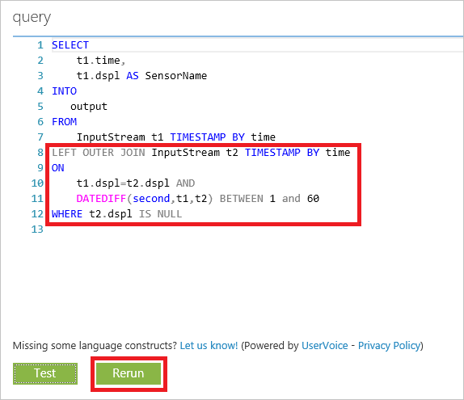

Here we are using a **LEFT OUTER JOIN** on to the same data stream (self-join). For an inner join, a result is only returned when a match is found.  But for a **LEFT OUTER** join, if an event from the left side of the join is unmatched, a row with NULL for all the columns of the right row is returned. This technique is very useful to find an absence of events. Please see our MSDN documentation for more information on [JOIN](https://msdn.microsoft.com/library/azure/dn835026.aspx).

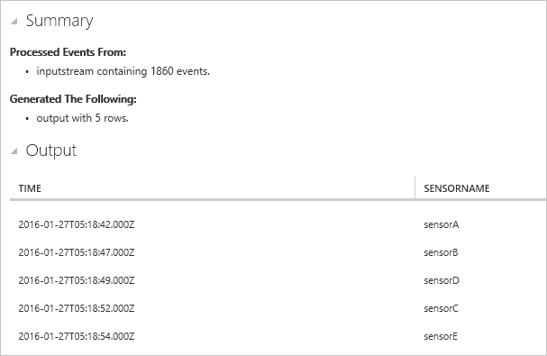

## Conclusion

The purpose of this tutorial is to demonstrate how to write different Stream Analytics query language queries and see results in the browser. However, this is just getting started. There is so much more you can do with Stream Analytics. Stream Analytics supports a variety of inputs and outputs and can even leverage functions in Azure Machine Learning, making it a robust tool for analyzing data streams. You can start exploring more about Stream Analytics using our [Learning Map](https://azure.microsoft.com/documentation/learning-paths/stream-analytics/) and for more information on writing queries, read the article on [Common Query Patterns](./stream-analytics-stream-analytics-query-patterns.md).
