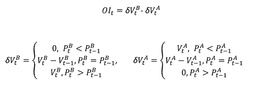
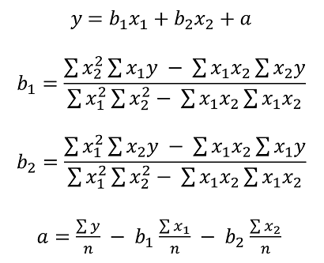

# High-frequency trading simulation with Stream Analytics
The combination of SQL language and JavaScript user-defined functions (UDFs) and user-defined aggregates (UDAs) in Azure Stream Analytics enables users to perform advanced analytics. Advanced analytics might include online machine learning training and scoring, as well as stateful process simulation. This article describes how to perform linear regression in an Azure Stream Analytics job that does continuous training and scoring in a high-frequency trading scenario.

## High-frequency trading
The logical flow of high-frequency trading is about:
1. Getting real-time quotes from a security exchange.
2. Building a predictive model around the quotes, so we can anticipate the price movement.
3. Placing buy or sell orders to make money from the successful prediction of the price movements. 

As a result, we need:
* A real-time quote feed.
* A predictive model that can operate on the real-time quotes.
* A trading simulation that demonstrates the profit or loss of the trading algorithm.

### Real-time quote feed
IEX offers free [real-time bid and ask quotes](https://iextrading.com/developer/docs/#websockets) by using socket.io. A simple console program can be written to receive real-time quotes and push to Azure Event Hubs as a data source. The following code is a skeleton of the program. The code omits error handling for brevity. You also need to include SocketIoClientDotNet and WindowsAzure.ServiceBus NuGet packages in your project.

```csharp
using Quobject.SocketIoClientDotNet.Client;
using Microsoft.ServiceBus.Messaging;
var symbols = "msft,fb,amzn,goog";
var eventHubClient = EventHubClient.CreateFromConnectionString(connectionString, eventHubName);
var socket = IO.Socket("https://ws-api.iextrading.com/1.0/tops");
socket.On(Socket.EVENT_MESSAGE, (message) =>
{
    eventHubClient.Send(new EventData(Encoding.UTF8.GetBytes((string)message)));
});
socket.On(Socket.EVENT_CONNECT, () =>
{
    socket.Emit("subscribe", symbols);
});
```

Here are some generated sample events:

```json
{"symbol":"MSFT","marketPercent":0.03246,"bidSize":100,"bidPrice":74.8,"askSize":300,"askPrice":74.83,volume":70572,"lastSalePrice":74.825,"lastSaleSize":100,"lastSaleTime":1506953355123,lastUpdated":1506953357170,"sector":"softwareservices","securityType":"commonstock"}
{"symbol":"GOOG","marketPercent":0.04825,"bidSize":114,"bidPrice":870,"askSize":0,"askPrice":0,volume":11240,"lastSalePrice":959.47,"lastSaleSize":60,"lastSaleTime":1506953317571,lastUpdated":1506953357633,"sector":"softwareservices","securityType":"commonstock"}
{"symbol":"MSFT","marketPercent":0.03244,"bidSize":100,"bidPrice":74.8,"askSize":100,"askPrice":74.83,volume":70572,"lastSalePrice":74.825,"lastSaleSize":100,"lastSaleTime":1506953355123,lastUpdated":1506953359118,"sector":"softwareservices","securityType":"commonstock"}
{"symbol":"FB","marketPercent":0.01211,"bidSize":100,"bidPrice":169.9,"askSize":100,"askPrice":170.67,volume":39042,"lastSalePrice":170.67,"lastSaleSize":100,"lastSaleTime":1506953351912,lastUpdated":1506953359641,"sector":"softwareservices","securityType":"commonstock"}
{"symbol":"GOOG","marketPercent":0.04795,"bidSize":100,"bidPrice":959.19,"askSize":0,"askPrice":0,volume":11240,"lastSalePrice":959.47,"lastSaleSize":60,"lastSaleTime":1506953317571,lastUpdated":1506953360949,"sector":"softwareservices","securityType":"commonstock"}
{"symbol":"FB","marketPercent":0.0121,"bidSize":100,"bidPrice":169.9,"askSize":100,"askPrice":170.7,volume":39042,"lastSalePrice":170.67,"lastSaleSize":100,"lastSaleTime":1506953351912,lastUpdated":1506953362205,"sector":"softwareservices","securityType":"commonstock"}
{"symbol":"GOOG","marketPercent":0.04795,"bidSize":114,"bidPrice":870,"askSize":0,"askPrice":0,volume":11240,"lastSalePrice":959.47,"lastSaleSize":60,"lastSaleTime":1506953317571,lastUpdated":1506953362629,"sector":"softwareservices","securityType":"commonstock"}
```

>[!NOTE]
>The time stamp of the event is **lastUpdated**, in epoch time.

### Predictive model for high-frequency trading
For the purpose of demonstration, we use a linear model described by Darryl Shen in [his paper](https://docplayer.net/23038840-Order-imbalance-based-strategy-in-high-frequency-trading.html).

Volume order imbalance (VOI) is a function of current bid/ask price and volume, and bid/ask price and volume from the last tick. The paper identifies the correlation between VOI and future price movement. It builds a linear model between the past 5 VOI values and the price change in the next 10 ticks. The model is trained by using previous day's data with linear regression. 

The trained model is then used to make price change predictions on quotes in the current trading day in real time. When a large enough price change is predicted, a trade is executed. Depending on the threshold setting, thousands of trades can be expected for a single stock during a trading day.



Now, let's express the training and prediction operations in an Azure Stream Analytics job.

First, the inputs are cleaned up. Epoch time is converted to datetime via **DATEADD**. **TRY_CAST** is used to coerce data types without failing the query. It's always a good practice to cast input fields to the expected data types, so there is no unexpected behavior in manipulation or comparison of the fields.

```SQL
WITH
typeconvertedquotes AS (
    /* convert all input fields to proper types */
    SELECT
        System.Timestamp AS lastUpdated,
        symbol,
        DATEADD(millisecond, CAST(lastSaleTime as bigint), '1970-01-01T00:00:00Z') AS lastSaleTime,
        TRY_CAST(bidSize as bigint) AS bidSize,
        TRY_CAST(bidPrice as float) AS bidPrice,
        TRY_CAST(askSize as bigint) AS askSize,
        TRY_CAST(askPrice as float) AS askPrice,
        TRY_CAST(volume as bigint) AS volume,
        TRY_CAST(lastSaleSize as bigint) AS lastSaleSize,
        TRY_CAST(lastSalePrice as float) AS lastSalePrice
    FROM quotes TIMESTAMP BY DATEADD(millisecond, CAST(lastUpdated as bigint), '1970-01-01T00:00:00Z')
),
timefilteredquotes AS (
    /* filter between 7am and 1pm PST, 14:00 to 20:00 UTC */
    /* clean up invalid data points */
	SELECT * FROM typeconvertedquotes
	WHERE DATEPART(hour, lastUpdated) >= 14 AND DATEPART(hour, lastUpdated) < 20 AND bidSize > 0 AND askSize > 0 AND bidPrice > 0 AND askPrice > 0
),
```

Next, we use the **LAG** function to get values from the last tick. One hour of **LIMIT DURATION** value is arbitrarily chosen. Given the quote frequency, it's safe to assume that you can find the previous tick by looking back one hour.  

```SQL
shiftedquotes AS (
    /* get previous bid/ask price and size in order to calculate VOI */
	SELECT
		symbol,
		(bidPrice + askPrice)/2 AS midPrice,
		bidPrice,
		bidSize,
		askPrice,
		askSize,
		LAG(bidPrice) OVER (PARTITION BY symbol LIMIT DURATION(hour, 1)) AS bidPricePrev,
		LAG(bidSize) OVER (PARTITION BY symbol LIMIT DURATION(hour, 1)) AS bidSizePrev,
		LAG(askPrice) OVER (PARTITION BY symbol LIMIT DURATION(hour, 1)) AS askPricePrev,
		LAG(askSize) OVER (PARTITION BY symbol LIMIT DURATION(hour, 1)) AS askSizePrev
	FROM timefilteredquotes
),
```

We can then compute VOI value. We filter out the null values if the previous tick doesn't exist, just in case.

```SQL
currentPriceAndVOI AS (
    /* calculate VOI */
	SELECT
		symbol,
		midPrice,
		(CASE WHEN (bidPrice < bidPricePrev) THEN 0
            ELSE (CASE WHEN (bidPrice = bidPricePrev) THEN (bidSize - bidSizePrev) ELSE bidSize END)
         END) -
        (CASE WHEN (askPrice < askPricePrev) THEN askSize
            ELSE (CASE WHEN (askPrice = askPricePrev) THEN (askSize - askSizePrev) ELSE 0 END)
         END) AS VOI
	FROM shiftedquotes
	WHERE
		bidPrice IS NOT NULL AND
		bidSize IS NOT NULL AND
		askPrice IS NOT NULL AND
		askSize IS NOT NULL AND
		bidPricePrev IS NOT NULL AND
		bidSizePrev IS NOT NULL AND
		askPricePrev IS NOT NULL AND
		askSizePrev IS NOT NULL
),
```

Now, we use **LAG** again to create a sequence with 2 consecutive VOI values, followed by 10 consecutive mid-price values.

```SQL
shiftedPriceAndShiftedVOI AS (
    /* get 10 future prices and 2 previous VOIs */
    SELECT
		symbol,
		midPrice AS midPrice10,
		LAG(midPrice, 1) OVER (PARTITION BY symbol LIMIT DURATION(hour, 1)) AS midPrice9,
		LAG(midPrice, 2) OVER (PARTITION BY symbol LIMIT DURATION(hour, 1)) AS midPrice8,
		LAG(midPrice, 3) OVER (PARTITION BY symbol LIMIT DURATION(hour, 1)) AS midPrice7,
		LAG(midPrice, 4) OVER (PARTITION BY symbol LIMIT DURATION(hour, 1)) AS midPrice6,
		LAG(midPrice, 5) OVER (PARTITION BY symbol LIMIT DURATION(hour, 1)) AS midPrice5,
		LAG(midPrice, 6) OVER (PARTITION BY symbol LIMIT DURATION(hour, 1)) AS midPrice4,
		LAG(midPrice, 7) OVER (PARTITION BY symbol LIMIT DURATION(hour, 1)) AS midPrice3,
		LAG(midPrice, 8) OVER (PARTITION BY symbol LIMIT DURATION(hour, 1)) AS midPrice2,
		LAG(midPrice, 9) OVER (PARTITION BY symbol LIMIT DURATION(hour, 1)) AS midPrice1,
		LAG(midPrice, 10) OVER (PARTITION BY symbol LIMIT DURATION(hour, 1)) AS midPrice,
		LAG(VOI, 10) OVER (PARTITION BY symbol LIMIT DURATION(hour, 1)) AS VOI1,
		LAG(VOI, 11) OVER (PARTITION BY symbol LIMIT DURATION(hour, 1)) AS VOI2
	FROM currentPriceAndVOI
),
```

We then reshape the data into inputs for a two-variable linear model. Again, we filter out the events where we don't have all the data.

```SQL
modelInput AS (
    /* create feature vector, x being VOI, y being delta price */
	SELECT
		symbol,
		(midPrice1 + midPrice2 + midPrice3 + midPrice4 + midPrice5 + midPrice6 + midPrice7 + midPrice8 + midPrice9 + midPrice10)/10.0 - midPrice AS y,
		VOI1 AS x1,
		VOI2 AS x2
	FROM shiftedPriceAndShiftedVOI
	WHERE
		midPrice1 IS NOT NULL AND
		midPrice2 IS NOT NULL AND
		midPrice3 IS NOT NULL AND
		midPrice4 IS NOT NULL AND
		midPrice5 IS NOT NULL AND
		midPrice6 IS NOT NULL AND
		midPrice7 IS NOT NULL AND
		midPrice8 IS NOT NULL AND
		midPrice9 IS NOT NULL AND
		midPrice10 IS NOT NULL AND
		midPrice IS NOT NULL AND
		VOI1 IS NOT NULL AND
		VOI2 IS NOT NULL
),
```

Because Azure Stream Analytics doesn't have a built-in linear regression function, we use **SUM** and **AVG** aggregates to compute the coefficients for the linear model.



```SQL
modelagg AS (
    /* get aggregates for linear regression calculation,
     http://faculty.cas.usf.edu/mbrannick/regression/Reg2IV.html */
	SELECT
		symbol,
		SUM(x1 * x1) AS x1x1,
		SUM(x2 * x2) AS x2x2,
		SUM(x1 * y) AS x1y,
		SUM(x2 * y) AS x2y,
		SUM(x1 * x2) AS x1x2,
		AVG(y) AS avgy,
		AVG(x1) AS avgx1,
		AVG(x2) AS avgx2
	FROM modelInput
	GROUP BY symbol, TumblingWindow(hour, 24, -4)
),
modelparambs AS (
    /* calculate b1 and b2 for the linear model */
	SELECT
		symbol,
		(x2x2 * x1y - x1x2 * x2y)/(x1x1 * x2x2 - x1x2 * x1x2) AS b1,
		(x1x1 * x2y - x1x2 * x1y)/(x1x1 * x2x2 - x1x2 * x1x2) AS b2,
		avgy,
		avgx1,
		avgx2
	FROM modelagg
),
model AS (
    /* calculate a for the linear model */
	SELECT
		symbol,
		avgy - b1 * avgx1 - b2 * avgx2 AS a,
		b1,
		b2
	FROM modelparambs
),
```

To use the previous day's model for current event's scoring, we want to join the quotes with the model. But instead of using **JOIN**, we **UNION** the model events and quote events. Then we use **LAG** to pair the events with previous day's model, so we can get exactly one match. Because of the weekend, we have to look back three days. If we used a straightforward **JOIN**, we would get three models for every quote event.

```SQL
shiftedVOI AS (
    /* get two consecutive VOIs */
	SELECT
		symbol,
		midPrice,
		VOI AS VOI1,		
		LAG(VOI, 1) OVER (PARTITION BY symbol LIMIT DURATION(hour, 1)) AS VOI2
	FROM currentPriceAndVOI
),
VOIAndModel AS (
    /* combine VOIs and models */
	SELECT
		'voi' AS type,
		symbol,
		midPrice,
		VOI1,
		VOI2,
        0.0 AS a,
        0.0 AS b1,
        0.0 AS b2
	FROM shiftedVOI
	UNION
	SELECT
		'model' AS type,
		symbol,
        0.0 AS midPrice,
        0 AS VOI1,
        0 AS VOI2,
		a,
		b1,
		b2
	FROM model
),
VOIANDModelJoined AS (
    /* match VOIs with the latest model within 3 days (72 hours, to take the weekend into account) */
	SELECT
		symbol,
		midPrice,
		VOI1 as x1,
		VOI2 as x2,
		LAG(a, 1) OVER (PARTITION BY symbol LIMIT DURATION(hour, 72) WHEN type = 'model') AS a,
		LAG(b1, 1) OVER (PARTITION BY symbol LIMIT DURATION(hour, 72) WHEN type = 'model') AS b1,
		LAG(b2, 1) OVER (PARTITION BY symbol LIMIT DURATION(hour, 72) WHEN type = 'model') AS b2
	FROM VOIAndModel
	WHERE type = 'voi'
),
```

Now, we can make predictions and generate buy/sell signals based on the model, with a 0.02 threshold value. A trade value of 10 is buy. A trade value of -10 is sell.

``` SQL
prediction AS (
    /* make prediction if there is a model */
	SELECT
		symbol,
		midPrice,
		a + b1 * x1 + b2 * x2 AS efpc
	FROM VOIANDModelJoined
	WHERE
		a IS NOT NULL AND
		b1 IS NOT NULL AND
		b2 IS NOT NULL AND
        x1 IS NOT NULL AND
        x2 IS NOT NULL
),
tradeSignal AS (
    /* generate buy/sell signals */
	SELECT
        DateAdd(hour, -7, System.Timestamp) AS time,
		symbol,		
		midPrice,
        efpc,
		CASE WHEN (efpc > 0.02) THEN 10 ELSE (CASE WHEN (efpc < -0.02) THEN -10 ELSE 0 END) END AS trade,
		DATETIMEFROMPARTS(DATEPART(year, System.Timestamp), DATEPART(month, System.Timestamp), DATEPART(day, System.Timestamp), 0, 0, 0, 0) as date
	FROM prediction
),
```

### Trading simulation
After we have the trading signals, we want to test how effective the trading strategy is, without trading for real. 

We achieve this test by using a UDA, with a hopping window, hopping every one minute. The additional grouping on date and the having clause allow the window only accounts for events that belong to the same day. For a hopping window across two days, the **GROUP BY** date separates the grouping into previous day and current day. The **HAVING** clause filters out the windows that are ending on the current day but grouping on the previous day.

```SQL
simulation AS
(
    /* perform trade simulation for the past 7 hours to cover an entire trading day, and generate output every minute */
	SELECT
        DateAdd(hour, -7, System.Timestamp) AS time,
		symbol,
		date,
		uda.TradeSimulation(tradeSignal) AS s
	FROM tradeSignal
	GROUP BY HoppingWindow(minute, 420, 1), symbol, date
	Having DateDiff(day, date, time) < 1 AND DATEPART(hour, time) < 13
)
```

The JavaScript UDA initializes all accumulators in the `init` function, computes the state transition with every event added to the window, and returns the simulation results at the end of the window. The general trading process is to:

- Buy stock when a buy signal is received and there is no stocking holding.
- Sell stock when a sell signal is received and there is stock holding.
- Short if there is no stock holding. 

If there's a short position, and a buy signal is received, we buy to cover. We never hold or short 10 shares of a stock in this simulation. The transaction cost is a flat $8.

```javascript
function main() {
	var TRADE_COST = 8.0;
	var SHARES = 10;
	this.init = function () {
		this.own = false;
		this.pos = 0;
		this.pnl = 0.0;
		this.tradeCosts = 0.0;
		this.buyPrice = 0.0;
		this.sellPrice = 0.0;
		this.buySize = 0;
		this.sellSize = 0;
		this.buyTotal = 0.0;
		this.sellTotal = 0.0;
	}
	this.accumulate = function (tradeSignal, timestamp) {
		if(!this.own && tradeSignal.trade == 10) {
		  // Buy to open
		  this.own = true;
		  this.pos = 1;
		  this.buyPrice = tradeSignal.midprice;
		  this.tradeCosts += TRADE_COST;
		  this.buySize += SHARES;
		  this.buyTotal += SHARES * tradeSignal.midprice;
		} else if(!this.own && tradeSignal.trade == -10) {
		  // Sell to open
		  this.own = true;
		  this.pos = -1
		  this.sellPrice = tradeSignal.midprice;
		  this.tradeCosts += TRADE_COST;
		  this.sellSize += SHARES;
		  this.sellTotal += SHARES * tradeSignal.midprice;
		} else if(this.own && this.pos == 1 && tradeSignal.trade == -10) {
		  // Sell to close
		  this.own = false;
		  this.pos = 0;
		  this.sellPrice = tradeSignal.midprice;
		  this.tradeCosts += TRADE_COST;
		  this.pnl += (this.sellPrice - this.buyPrice)*SHARES - 2*TRADE_COST;
		  this.sellSize += SHARES;
		  this.sellTotal += SHARES * tradeSignal.midprice;
		  // Sell to open
		  this.own = true;
		  this.pos = -1;
		  this.sellPrice = tradeSignal.midprice;
		  this.tradeCosts += TRADE_COST;
		  this.sellSize += SHARES;		  
		  this.sellTotal += SHARES * tradeSignal.midprice;
		} else if(this.own && this.pos == -1 && tradeSignal.trade == 10) {
		  // Buy to close
		  this.own = false;
		  this.pos = 0;
		  this.buyPrice = tradeSignal.midprice;
		  this.tradeCosts += TRADE_COST;
		  this.pnl += (this.sellPrice - this.buyPrice)*SHARES - 2*TRADE_COST;
		  this.buySize += SHARES;
		  this.buyTotal += SHARES * tradeSignal.midprice;
		  // Buy to open
		  this.own = true;
		  this.pos = 1;
		  this.buyPrice = tradeSignal.midprice;
		  this.tradeCosts += TRADE_COST;
		  this.buySize += SHARES;		  
		  this.buyTotal += SHARES * tradeSignal.midprice;
		}
	}
	this.computeResult = function () {
		var result = {
			"pnl": this.pnl,
			"buySize": this.buySize,
			"sellSize": this.sellSize,
			"buyTotal": this.buyTotal,
			"sellTotal": this.sellTotal,
			"tradeCost": this.tradeCost
			};
		return result;
	}
}
```

Finally, we output to the Power BI dashboard for visualization.

```SQL
SELECT * INTO tradeSignalDashboard FROM tradeSignal /* output tradeSignal to PBI */
SELECT
    symbol,
    time,
    date,
    TRY_CAST(s.pnl as float) AS pnl,
    TRY_CAST(s.buySize as bigint) AS buySize,
    TRY_CAST(s.sellSize as bigint) AS sellSize,
    TRY_CAST(s.buyTotal as float) AS buyTotal,
    TRY_CAST(s.sellTotal as float) AS sellTotal
    INTO pnlDashboard
FROM simulation /* output trade simulation to PBI */
```


## Summary
We can implement a realistic high-frequency trading model with a moderately complex query in Azure Stream Analytics. We have to simplify the model from five input variables to two, because of the lack of a built-in linear regression function. But for a determined user, algorithms with higher dimensions and sophistication can possibly be implemented as JavaScript UDA as well. 

It's worth noting that most of the query, other than the JavaScript UDA, can be tested and debugged in Visual Studio through [Azure Stream Analytics tools for Visual Studio](stream-analytics-tools-for-visual-studio-install.md). After the initial query was written, the author spent less than 30 minutes testing and debugging the query in Visual Studio. 

Currently, the UDA cannot be debugged in Visual Studio. We are working on enabling that with the ability to step through JavaScript code. In addition, note that the fields reaching the UDA have lowercase names. This was not an obvious behavior during query testing. But with Azure Stream Analytics compatibility level 1.1, we preserve the field name casing so the behavior is more natural.

I hope this article serves as an inspiration for all Azure Stream Analytics users, who can use our service to perform advanced analytics in near real time, continuously. Let us know any feedback you have to make it easier to implement queries for advanced analytics scenarios.
