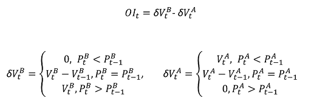
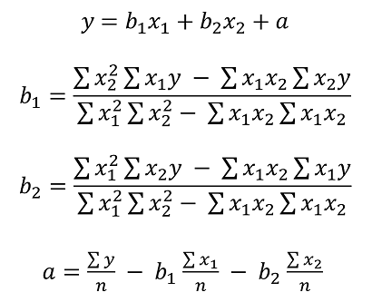
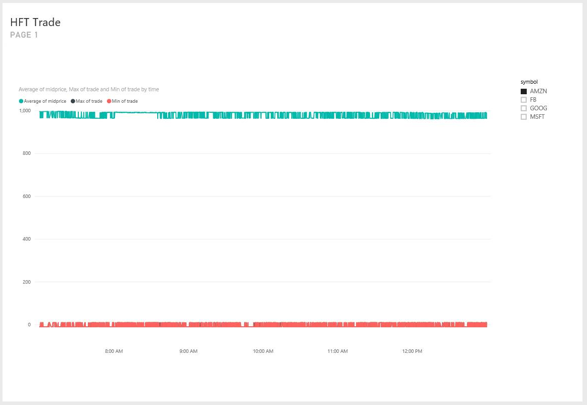
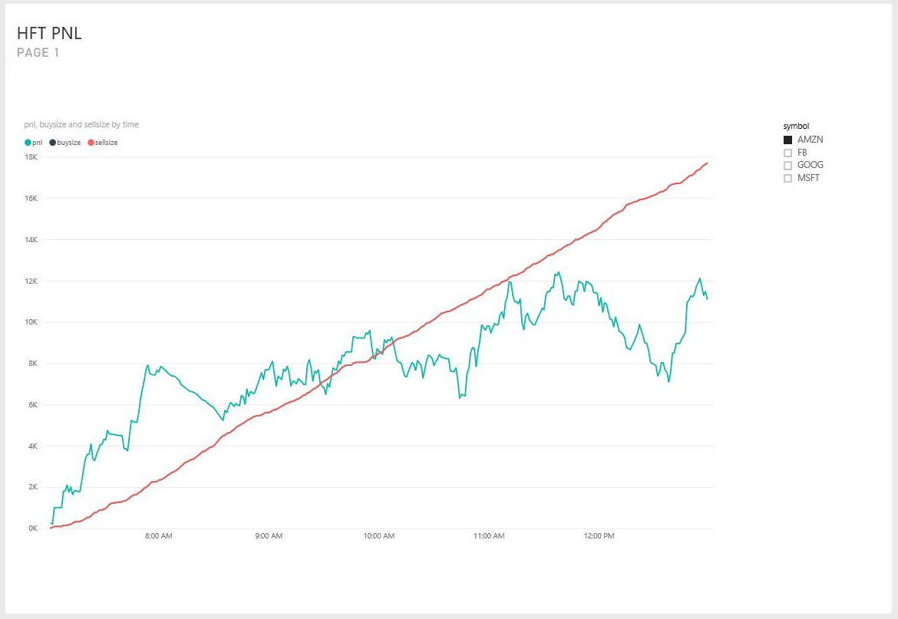

# High-frequency trading simulation with Stream Analytics

Azure Stream Analytics supports advanced analytics through the combination of SQL language, JavaScript user-defined functions (UDFs), and user-defined aggregates (UDAs). Advanced analytics include online machine learning training and scoring, and stateful process simulation. This article describes how to perform linear regression in an Azure Stream Analytics job that does continuous training and scoring in a high-frequency trading scenario.

## Prerequisites

- An Azure subscription. If you don't have one, create a [free account](https://azure.microsoft.com/free/).
- An [Azure Stream Analytics job](stream-analytics-quick-create-portal.md).
- An [Azure Event Hubs namespace and event hub](/azure/event-hubs/event-hubs-create).
- Familiarity with [Stream Analytics Query Language](/stream-analytics-query/stream-analytics-query-language-reference).
- (Optional) A Power BI account if you want to visualize the output.

## High-frequency trading workflow

The logical flow of high-frequency trading is:
1. Getting real-time quotes from a security exchange.
1. Building a predictive model around the quotes to anticipate the price movement.
1. Placing buy or sell orders to make money from the successful prediction of the price movements.

This scenario requires:
* A real-time quote feed.
* A predictive model that can operate on the real-time quotes.
* A trading simulation that demonstrates the profit or loss of the trading algorithm.

### Real-time quote feed

> [!IMPORTANT]
> The IEX trading WebSocket API (`iextrading.com`) referenced in this section has been retired. IEX Cloud now provides market data through [IEX Cloud](https://iexcloud.io/) with different authentication and endpoints. Update the URL and authentication in your implementation accordingly.

> [!IMPORTANT]
> The `SocketIoClientDotNet` and `WindowsAzure.ServiceBus` NuGet packages used in this sample are deprecated. For new projects, use a current Socket.IO client library and the [`Azure.Messaging.EventHubs`](/dotnet/api/overview/azure/messaging.eventhubs-readme) package with `EventHubProducerClient` instead of the legacy `EventHubClient`.

Investors Exchange (IEX) formerly offered free [real-time bid and ask quotes](https://iextrading.com/developer/docs/#websockets) by using socket.io. You can write a simple console program to receive real-time quotes and push them to Azure Event Hubs as a data source. The following code is a skeleton of the program. The code omits error handling for brevity. You also need to include the `SocketIoClientDotNet` and `WindowsAzure.ServiceBus` NuGet packages in your project.

```csharp
using Quobject.SocketIoClientDotNet.Client;
using Microsoft.ServiceBus.Messaging;
var symbols = "msft,fb,amzn,goog";
var eventHubClient = EventHubClient.CreateFromConnectionString(connectionString, eventHubName);
var socket = IO.Socket("https://ws-api.iextrading.com/1.0/tops");
socket.On(Socket.EVENT_MESSAGE, (message) =>
{
    eventHubClient.Send(new EventData(Encoding.UTF8.GetBytes((string)message)));
});
socket.On(Socket.EVENT_CONNECT, () =>
{
    socket.Emit("subscribe", symbols);
});
```

> [!CAUTION]
> This code sample is for illustration only. The IEX WebSocket API endpoint and the NuGet packages used here are no longer available. Don't use this code in production. See the IMPORTANT notes earlier in this section for current alternatives.

Here are some generated sample events:

```json
{"symbol":"MSFT","marketPercent":0.03246,"bidSize":100,"bidPrice":74.8,"askSize":300,"askPrice":74.83,"volume":70572,"lastSalePrice":74.825,"lastSaleSize":100,"lastSaleTime":1506953355123,"lastUpdated":1506953357170,"sector":"softwareservices","securityType":"commonstock"}
{"symbol":"GOOG","marketPercent":0.04825,"bidSize":114,"bidPrice":870,"askSize":0,"askPrice":0,"volume":11240,"lastSalePrice":959.47,"lastSaleSize":60,"lastSaleTime":1506953317571,"lastUpdated":1506953357633,"sector":"softwareservices","securityType":"commonstock"}
{"symbol":"MSFT","marketPercent":0.03244,"bidSize":100,"bidPrice":74.8,"askSize":100,"askPrice":74.83,"volume":70572,"lastSalePrice":74.825,"lastSaleSize":100,"lastSaleTime":1506953355123,"lastUpdated":1506953359118,"sector":"softwareservices","securityType":"commonstock"}
{"symbol":"FB","marketPercent":0.01211,"bidSize":100,"bidPrice":169.9,"askSize":100,"askPrice":170.67,"volume":39042,"lastSalePrice":170.67,"lastSaleSize":100,"lastSaleTime":1506953351912,"lastUpdated":1506953359641,"sector":"softwareservices","securityType":"commonstock"}
{"symbol":"GOOG","marketPercent":0.04795,"bidSize":100,"bidPrice":959.19,"askSize":0,"askPrice":0,"volume":11240,"lastSalePrice":959.47,"lastSaleSize":60,"lastSaleTime":1506953317571,"lastUpdated":1506953360949,"sector":"softwareservices","securityType":"commonstock"}
{"symbol":"FB","marketPercent":0.0121,"bidSize":100,"bidPrice":169.9,"askSize":100,"askPrice":170.7,"volume":39042,"lastSalePrice":170.67,"lastSaleSize":100,"lastSaleTime":1506953351912,"lastUpdated":1506953362205,"sector":"softwareservices","securityType":"commonstock"}
{"symbol":"GOOG","marketPercent":0.04795,"bidSize":114,"bidPrice":870,"askSize":0,"askPrice":0,"volume":11240,"lastSalePrice":959.47,"lastSaleSize":60,"lastSaleTime":1506953317571,"lastUpdated":1506953362629,"sector":"softwareservices","securityType":"commonstock"}
```

> [!NOTE]
> The time stamp of the event is **lastUpdated**, in epoch time.

### Predictive model for high-frequency trading
For this demonstration, the sample uses a linear model described in [Order Imbalance Based Strategy in High Frequency Algorithmic Trading](https://www.academia.edu/73231992/Order_Imbalance_Based_Strategy_in_High_Frequency_Algorithmic_Trading).

Volume order imbalance (VOI) is a function of current bid/ask price and volume, and bid/ask price and volume from the last tick. The paper identifies the correlation between VOI and future price movement. It builds a linear model between the past five VOI values and the price change in the next 10 ticks. The model trains on the previous day's data with linear regression. 

The trained model then makes price change predictions on quotes in the current trading day in real time. When the model predicts a large enough price change, it executes a trade. Depending on the threshold setting, a single stock might generate thousands of trades during a trading day.



The following sections show how to express the training and prediction operations in an Azure Stream Analytics job. The complete query is a single `WITH` statement composed of common table expressions (CTEs) that form a pipeline:

| CTE stage | Purpose |
|---|---|
| `typeconvertedquotes` | Convert raw input fields to proper SQL types |
| `timefilteredquotes` | Filter quotes to trading hours and remove invalid data |
| `shiftedquotes` | Use **LAG** to retrieve the previous tick's bid/ask values |
| `currentPriceAndVOI` | Calculate volume order imbalance (VOI) from current and previous tick |
| `shiftedPriceAndShiftedVOI` | Build sequences of 10 consecutive mid-prices and 2 consecutive VOI values |
| `modelInput` | Reshape data into feature vectors (VOI as x, price delta as y) |
| `modelagg` / `modelparambs` / `model` | Train a two-variable linear regression model using **SUM** and **AVG** aggregates |
| `shiftedVOI` / `VOIAndModel` / `VOIANDModelJoined` | Join current VOI values with the previous day's trained model |
| `prediction` | Calculate expected future price change (efpc) from the model |
| `tradeSignal` | Generate buy/sell signals when efpc exceeds the ±0.02 threshold |

> [!NOTE]
> This query requires Azure Stream Analytics compatibility level 1.1 or later, which preserves field name casing for predictable behavior with UDAs.

#### Clean up and convert quote input fields

The first CTE in the Azure Stream Analytics query converts the raw quote data from Event Hubs into properly typed SQL columns. **DATEADD** converts epoch time (Unix milliseconds) to datetime. **TRY_CAST** coerces data types without failing the query. Cast input fields to the expected data types to avoid unexpected behavior in manipulation or comparison of the fields.

```SQL
WITH
typeconvertedquotes AS (
    /* convert all input fields to proper types */
    SELECT
        System.Timestamp AS lastUpdated,
        symbol,
        DATEADD(millisecond, CAST(lastSaleTime as bigint), '1970-01-01T00:00:00Z') AS lastSaleTime,
        TRY_CAST(bidSize as bigint) AS bidSize,
        TRY_CAST(bidPrice as float) AS bidPrice,
        TRY_CAST(askSize as bigint) AS askSize,
        TRY_CAST(askPrice as float) AS askPrice,
        TRY_CAST(volume as bigint) AS volume,
        TRY_CAST(lastSaleSize as bigint) AS lastSaleSize,
        TRY_CAST(lastSalePrice as float) AS lastSalePrice
    FROM quotes TIMESTAMP BY DATEADD(millisecond, CAST(lastUpdated as bigint), '1970-01-01T00:00:00Z')
),
timefilteredquotes AS (
    /* filter between 7am and 1pm PST, 14:00 to 20:00 UTC */
    /* clean up invalid data points */
	SELECT * FROM typeconvertedquotes
	WHERE DATEPART(hour, lastUpdated) >= 14 AND DATEPART(hour, lastUpdated) < 20 AND bidSize > 0 AND askSize > 0 AND bidPrice > 0 AND askPrice > 0
),
```

#### Retrieve previous tick values with LAG

The next CTE in the Azure Stream Analytics query uses the **LAG** function to get the bid/ask price and size from the previous tick for each stock symbol. One hour of **LIMIT DURATION** value is arbitrarily chosen. Given the quote frequency, you can find the previous tick by looking back one hour.

```SQL
shiftedquotes AS (
    /* get previous bid/ask price and size in order to calculate VOI */
	SELECT
		symbol,
		(bidPrice + askPrice)/2 AS midPrice,
		bidPrice,
		bidSize,
		askPrice,
		askSize,
		LAG(bidPrice) OVER (PARTITION BY symbol LIMIT DURATION(hour, 1)) AS bidPricePrev,
		LAG(bidSize) OVER (PARTITION BY symbol LIMIT DURATION(hour, 1)) AS bidSizePrev,
		LAG(askPrice) OVER (PARTITION BY symbol LIMIT DURATION(hour, 1)) AS askPricePrev,
		LAG(askSize) OVER (PARTITION BY symbol LIMIT DURATION(hour, 1)) AS askSizePrev
	FROM timefilteredquotes
),
```

#### Calculate volume order imbalance (VOI)

The next CTE computes the VOI value from the current and previous tick's bid/ask data. The query filters out null values for cases where no previous tick exists.

```SQL
currentPriceAndVOI AS (
    /* calculate VOI */
	SELECT
		symbol,
		midPrice,
		(CASE WHEN (bidPrice < bidPricePrev) THEN 0
            ELSE (CASE WHEN (bidPrice = bidPricePrev) THEN (bidSize - bidSizePrev) ELSE bidSize END)
         END) -
        (CASE WHEN (askPrice < askPricePrev) THEN askSize
            ELSE (CASE WHEN (askPrice = askPricePrev) THEN (askSize - askSizePrev) ELSE 0 END)
         END) AS VOI
	FROM shiftedquotes
	WHERE
		bidPrice IS NOT NULL AND
		bidSize IS NOT NULL AND
		askPrice IS NOT NULL AND
		askSize IS NOT NULL AND
		bidPricePrev IS NOT NULL AND
		bidSizePrev IS NOT NULL AND
		askPricePrev IS NOT NULL AND
		askSizePrev IS NOT NULL
),
```

#### Build feature sequences for model training

The next CTE uses **LAG** again to create a sequence with 2 consecutive VOI values, followed by 10 consecutive mid-price values. These sequences form the training data for the linear regression model.

```SQL
shiftedPriceAndShiftedVOI AS (
    /* get 10 future prices and 2 previous VOIs */
    SELECT
		symbol,
		midPrice AS midPrice10,
		LAG(midPrice, 1) OVER (PARTITION BY symbol LIMIT DURATION(hour, 1)) AS midPrice9,
		LAG(midPrice, 2) OVER (PARTITION BY symbol LIMIT DURATION(hour, 1)) AS midPrice8,
		LAG(midPrice, 3) OVER (PARTITION BY symbol LIMIT DURATION(hour, 1)) AS midPrice7,
		LAG(midPrice, 4) OVER (PARTITION BY symbol LIMIT DURATION(hour, 1)) AS midPrice6,
		LAG(midPrice, 5) OVER (PARTITION BY symbol LIMIT DURATION(hour, 1)) AS midPrice5,
		LAG(midPrice, 6) OVER (PARTITION BY symbol LIMIT DURATION(hour, 1)) AS midPrice4,
		LAG(midPrice, 7) OVER (PARTITION BY symbol LIMIT DURATION(hour, 1)) AS midPrice3,
		LAG(midPrice, 8) OVER (PARTITION BY symbol LIMIT DURATION(hour, 1)) AS midPrice2,
		LAG(midPrice, 9) OVER (PARTITION BY symbol LIMIT DURATION(hour, 1)) AS midPrice1,
		LAG(midPrice, 10) OVER (PARTITION BY symbol LIMIT DURATION(hour, 1)) AS midPrice,
		LAG(VOI, 10) OVER (PARTITION BY symbol LIMIT DURATION(hour, 1)) AS VOI1,
		LAG(VOI, 11) OVER (PARTITION BY symbol LIMIT DURATION(hour, 1)) AS VOI2
	FROM currentPriceAndVOI
),
```

#### Reshape data into feature vectors

The next CTE reshapes the price and VOI sequences into feature vectors for a two-variable linear model, where VOI values are the independent variables (x1, x2) and the average future price change is the dependent variable (y). Events with incomplete data are filtered out.

```SQL
modelInput AS (
    /* create feature vector, x being VOI, y being delta price */
	SELECT
		symbol,
		(midPrice1 + midPrice2 + midPrice3 + midPrice4 + midPrice5 + midPrice6 + midPrice7 + midPrice8 + midPrice9 + midPrice10)/10.0 - midPrice AS y,
		VOI1 AS x1,
		VOI2 AS x2
	FROM shiftedPriceAndShiftedVOI
	WHERE
		midPrice1 IS NOT NULL AND
		midPrice2 IS NOT NULL AND
		midPrice3 IS NOT NULL AND
		midPrice4 IS NOT NULL AND
		midPrice5 IS NOT NULL AND
		midPrice6 IS NOT NULL AND
		midPrice7 IS NOT NULL AND
		midPrice8 IS NOT NULL AND
		midPrice9 IS NOT NULL AND
		midPrice10 IS NOT NULL AND
		midPrice IS NOT NULL AND
		VOI1 IS NOT NULL AND
		VOI2 IS NOT NULL
),
```

#### Train the linear regression model with SUM and AVG

Because Azure Stream Analytics doesn't have a built-in linear regression function, the query uses **SUM** and **AVG** aggregates to compute the coefficients (a, b1, b2) for the two-variable linear regression model. The model retrains daily using a 24-hour tumbling window.



```SQL
modelagg AS (
    /* get aggregates for linear regression calculation,
     http://faculty.cas.usf.edu/mbrannick/regression/Reg2IV.html */
	SELECT
		symbol,
		SUM(x1 * x1) AS x1x1,
		SUM(x2 * x2) AS x2x2,
		SUM(x1 * y) AS x1y,
		SUM(x2 * y) AS x2y,
		SUM(x1 * x2) AS x1x2,
		AVG(y) AS avgy,
		AVG(x1) AS avgx1,
		AVG(x2) AS avgx2
	FROM modelInput
	GROUP BY symbol, TumblingWindow(hour, 24, -4)
),
modelparambs AS (
    /* calculate b1 and b2 for the linear model */
	SELECT
		symbol,
		(x2x2 * x1y - x1x2 * x2y)/(x1x1 * x2x2 - x1x2 * x1x2) AS b1,
		(x1x1 * x2y - x1x2 * x1y)/(x1x1 * x2x2 - x1x2 * x1x2) AS b2,
		avgy,
		avgx1,
		avgx2
	FROM modelagg
),
model AS (
    /* calculate a for the linear model */
	SELECT
		symbol,
		avgy - b1 * avgx1 - b2 * avgx2 AS a,
		b1,
		b2
	FROM modelparambs
),
```

#### Score current quotes with the previous day's model

To use the previous day's trained linear regression model for scoring the current event, the query joins the quotes with the model coefficients. Instead of using **JOIN**, the query uses **UNION** to combine model events and quote events into a single stream. Then it uses **LAG** to pair the events with the previous day's model, so you get exactly one match. Because of the weekend, the query looks back three days (72 hours). If a straightforward **JOIN** were used, you would get three models for every quote event.

```SQL
shiftedVOI AS (
    /* get two consecutive VOIs */
	SELECT
		symbol,
		midPrice,
		VOI AS VOI1,		
		LAG(VOI, 1) OVER (PARTITION BY symbol LIMIT DURATION(hour, 1)) AS VOI2
	FROM currentPriceAndVOI
),
VOIAndModel AS (
    /* combine VOIs and models */
	SELECT
		'voi' AS type,
		symbol,
		midPrice,
		VOI1,
		VOI2,
        0.0 AS a,
        0.0 AS b1,
        0.0 AS b2
	FROM shiftedVOI
	UNION
	SELECT
		'model' AS type,
		symbol,
        0.0 AS midPrice,
        0 AS VOI1,
        0 AS VOI2,
		a,
		b1,
		b2
	FROM model
),
VOIANDModelJoined AS (
    /* match VOIs with the latest model within 3 days (72 hours, to take the weekend into account) */
	SELECT
		symbol,
		midPrice,
		VOI1 as x1,
		VOI2 as x2,
		LAG(a, 1) OVER (PARTITION BY symbol LIMIT DURATION(hour, 72) WHEN type = 'model') AS a,
		LAG(b1, 1) OVER (PARTITION BY symbol LIMIT DURATION(hour, 72) WHEN type = 'model') AS b1,
		LAG(b2, 1) OVER (PARTITION BY symbol LIMIT DURATION(hour, 72) WHEN type = 'model') AS b2
	FROM VOIAndModel
	WHERE type = 'voi'
),
```

#### Generate trade signals from predictions

The final CTEs calculate the expected future price change (efpc) by applying the linear regression formula (`a + b1 * x1 + b2 * x2`) and then generate buy/sell signals based on a ±0.02 threshold. A trade value of 10 is buy. A trade value of -10 is sell.

```SQL
prediction AS (
    /* make prediction if there is a model */
	SELECT
		symbol,
		midPrice,
		a + b1 * x1 + b2 * x2 AS efpc
	FROM VOIANDModelJoined
	WHERE
		a IS NOT NULL AND
		b1 IS NOT NULL AND
		b2 IS NOT NULL AND
        x1 IS NOT NULL AND
        x2 IS NOT NULL
),
tradeSignal AS (
    /* generate buy/sell signals */
	SELECT
        DateAdd(hour, -7, System.Timestamp) AS time,
		symbol,		
		midPrice,
        efpc,
		CASE WHEN (efpc > 0.02) THEN 10 ELSE (CASE WHEN (efpc < -0.02) THEN -10 ELSE 0 END) END AS trade,
		DATETIMEFROMPARTS(DATEPART(year, System.Timestamp), DATEPART(month, System.Timestamp), DATEPART(day, System.Timestamp), 0, 0, 0, 0) as date
	FROM prediction
),
```

### Test the trading strategy with a simulation

After generating the trading signals, test how effective the trading strategy is without trading for real.

This test uses a UDA with a hopping window that hops every one minute. The grouping on date and the **HAVING** clause ensure the window only accounts for events that belong to the same day. For a hopping window across two days, the **GROUP BY** date separates the grouping into previous day and current day. The **HAVING** clause filters out the windows that end on the current day but group on the previous day.

```SQL
simulation AS
(
    /* perform trade simulation for the past 7 hours to cover an entire trading day, and generate output every minute */
	SELECT
        DateAdd(hour, -7, System.Timestamp) AS time,
		symbol,
		date,
		uda.TradeSimulation(tradeSignal) AS s
	FROM tradeSignal
	GROUP BY HoppingWindow(minute, 420, 1), symbol, date
	Having DateDiff(day, date, time) < 1 AND DATEPART(hour, time) < 13
)
```

The JavaScript UDA initializes all accumulators in the `init` function, computes the state transition with every event added to the window, and returns the simulation results at the end of the window. The simulation holds or shorts 10 shares of a stock per trade. The transaction cost is a flat `$8`. The following table shows the four trading actions the UDA performs:

| Condition | Signal | Action | Position after |
|---|---|---|---|
| No current holding | Buy (10) | Buy to open | Long |
| No current holding | Sell (-10) | Sell to open (short) | Short |
| Long position | Sell (-10) | Sell to close, then sell to open (short) | Short |
| Short position | Buy (10) | Buy to close, then buy to open | Long |

```javascript
function main() {
	var TRADE_COST = 8.0;
	var SHARES = 10;
	this.init = function () {
		this.own = false;
		this.pos = 0;
		this.pnl = 0.0;
		this.tradeCosts = 0.0;
		this.buyPrice = 0.0;
		this.sellPrice = 0.0;
		this.buySize = 0;
		this.sellSize = 0;
		this.buyTotal = 0.0;
		this.sellTotal = 0.0;
	}
	this.accumulate = function (tradeSignal, timestamp) {
		if(!this.own && tradeSignal.trade == 10) {
		  // Buy to open
		  this.own = true;
		  this.pos = 1;
		  this.buyPrice = tradeSignal.midprice;
		  this.tradeCosts += TRADE_COST;
		  this.buySize += SHARES;
		  this.buyTotal += SHARES * tradeSignal.midprice;
		} else if(!this.own && tradeSignal.trade == -10) {
		  // Sell to open
		  this.own = true;
		  this.pos = -1
		  this.sellPrice = tradeSignal.midprice;
		  this.tradeCosts += TRADE_COST;
		  this.sellSize += SHARES;
		  this.sellTotal += SHARES * tradeSignal.midprice;
		} else if(this.own && this.pos == 1 && tradeSignal.trade == -10) {
		  // Sell to close
		  this.own = false;
		  this.pos = 0;
		  this.sellPrice = tradeSignal.midprice;
		  this.tradeCosts += TRADE_COST;
		  this.pnl += (this.sellPrice - this.buyPrice)*SHARES - 2*TRADE_COST;
		  this.sellSize += SHARES;
		  this.sellTotal += SHARES * tradeSignal.midprice;
		  // Sell to open
		  this.own = true;
		  this.pos = -1;
		  this.sellPrice = tradeSignal.midprice;
		  this.tradeCosts += TRADE_COST;
		  this.sellSize += SHARES;		  
		  this.sellTotal += SHARES * tradeSignal.midprice;
		} else if(this.own && this.pos == -1 && tradeSignal.trade == 10) {
		  // Buy to close
		  this.own = false;
		  this.pos = 0;
		  this.buyPrice = tradeSignal.midprice;
		  this.tradeCosts += TRADE_COST;
		  this.pnl += (this.sellPrice - this.buyPrice)*SHARES - 2*TRADE_COST;
		  this.buySize += SHARES;
		  this.buyTotal += SHARES * tradeSignal.midprice;
		  // Buy to open
		  this.own = true;
		  this.pos = 1;
		  this.buyPrice = tradeSignal.midprice;
		  this.tradeCosts += TRADE_COST;
		  this.buySize += SHARES;		  
		  this.buyTotal += SHARES * tradeSignal.midprice;
		}
	}
	this.computeResult = function () {
		var result = {
			"pnl": this.pnl,
			"buySize": this.buySize,
			"sellSize": this.sellSize,
			"buyTotal": this.buyTotal,
			"sellTotal": this.sellTotal,
			"tradeCost": this.tradeCost
			};
		return result;
	}
}
```

> [!NOTE]
> The Power BI output connector for Azure Stream Analytics is scheduled for retirement. Consider using alternative output destinations such as Azure Data Explorer, Azure Synapse Analytics, or a data store that Power BI can connect to via DirectQuery or import. For more information, see [Azure Stream Analytics output to Power BI](power-bi-output.md).

Finally, output to the Power BI dashboard for visualization.

```SQL
SELECT * INTO tradeSignalDashboard FROM tradeSignal /* output tradeSignal to PBI */
SELECT
    symbol,
    time,
    date,
    TRY_CAST(s.pnl as float) AS pnl,
    TRY_CAST(s.buySize as bigint) AS buySize,
    TRY_CAST(s.sellSize as bigint) AS sellSize,
    TRY_CAST(s.buyTotal as float) AS buyTotal,
    TRY_CAST(s.sellTotal as float) AS sellTotal
    INTO pnlDashboard
FROM simulation /* output trade simulation to PBI */
```






## Summary

This article shows how to implement a realistic high-frequency trading model with a moderately complex query in Azure Stream Analytics. The model uses two input variables instead of five because Azure Stream Analytics doesn't include a built-in linear regression function. However, you can also implement more sophisticated algorithms with higher dimensions as JavaScript UDAs.

You can test and debug most of the query, other than the JavaScript UDA, by using [Azure Stream Analytics tools for Visual Studio Code](https://marketplace.visualstudio.com/items?itemName=ms-bigdatatools.vscode-asa) for query development, testing, and debugging.

## Related content

- [Azure Stream Analytics overview](stream-analytics-introduction.md)
- [Azure Stream Analytics Query Language reference](/stream-analytics-query/stream-analytics-query-language-reference)
- [JavaScript user-defined aggregates in Azure Stream Analytics](stream-analytics-javascript-user-defined-aggregates.md)
- [Azure Stream Analytics output to Power BI](power-bi-output.md)
