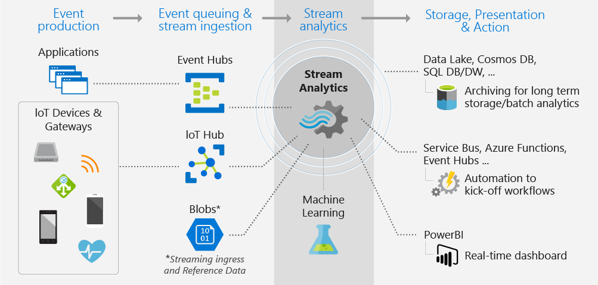

# What is Azure Stream Analytics?

Azure Stream Analytics is an event-processing engine that allows you to examine high volumes of data streaming from devices. Incoming data can be from devices, sensors, web sites, social media feeds, applications, and more. It also supports extracting information from data streams, identifying patterns, and relationships. You can then use these patterns to trigger other actions downstream, such as create alerts, feed information to a reporting tool, or store it for later use.

Following are some examples where Azure Stream Analytics can be used: 

* Internet of Things(IoT) Sensor fusion and real-time analytics on device telemetry
* Web logs/clickstream analytics
* Geospatial analytics for fleet management and driverless vehicles
* Remote monitoring and predictive maintenance of hi-value assets
* Real-time analytics on Point of Sale data for inventory control and anomaly detection

## How does Stream Analytics work?

Azure Stream Analytics starts with a source of streaming data that is ingested into Azure Event Hub, Azure IoT Hub or from a data store like Azure Blob Storage. To examine the streams, you create a Stream Analytics job that specifies the input source that streams data. The job also specifies a transformation query that defines how to look for data, patterns, or relationships. The transformation query uses SQL query language to easily filter, sort, aggregate, and join streaming data over a period of time. When executing the job, you can adjust the event ordering options, and duration of time windows when performing aggregation operations.

After analyzing the incoming data, you specify an output for the transformed data, and you can control what to do in response to the information you've analyzed. For example, you can take actions like:

* Send data to a monitored queue to trigger alerts or custom workflows downstream.
* Send data to Power BI dashboard for real-time visualization.
* Store data to other Azure storage services, so you can train a machine learning model based on historical data or perform batch analytics.

The following image illustrates the Stream Analytics pipeline, Your Stream Analytics job can use all or a selected set of inputs and outputs. This image shows how data is sent to Stream Analytics, analyzed, and sent for other actions like storage, or presentation:

## Key capabilities and benefits

Azure Stream Analytics is designed to be easy to use, flexible, reliable, and scalable to any job size. It is available across multiple Azure regions. Following image illustrates the key capabilities of Azure Stream Analytics:

## Ease of getting started

Azure Stream Analytics is easy to get started. It only takes few clicks to connect to multiple sources, sinks and to create an end to end pipeline. Stream Analytics can connect to [Azure Event Hubs](/azure/event-hubs/), [Azure IoT Hub](/azure/iot-hub/) for streaming data ingestion. It can also connect to [Azure Blob storage](/azure/storage/storage-introduction) service to ingest historical data. It can combine data from event hubs with other data sources and processing engines. Job input can also include reference data that is static or slow-changing data and you can join streaming data to this reference data to perform lookup operations.

Stream Analytics can route job output to many storage systems such as [Azure Blob](/azure/storage/storage-introduction), [Azure SQL Database](/azure/sql-database/), [Azure Data Lake Stores](/azure/data-lake-store/), or [Azure Cosmos DB](/azure/cosmos-db/introduction). After storing, you can run batch analytics with Azure HDInsight or send the output to another service such as event hubs for consumption or to [Power BI](https://docs.microsoft.com/power-bi/) for real-time visualization by using Power BI streaming API.

## Programmer Productivity

Azure Stream Analytics uses a simple SQL based query language that has been augmented with powerful temporal constraints to analyze data in motion. To define job transformations, you use a simple, declarative [Stream Analytics query language](https://msdn.microsoft.com/library/azure/dn834998.aspx) that lets you author complex temporal queries and analytics using simple SQL constructs. Stream Analytics query language is consistent to the SQL language, familiarity with SQL language is sufficient to get started with creating jobs. You can also create jobs by using developer tools like Azure PowerShell, [Stream Analytics Visual Studio tools](stream-analytics-tools-for-visual-studio-install.md), or Azure Resource Manager templates. Using developer tools allow you to develop transformation queries offline and use the [CI/CD pipeline](stream-analytics-tools-for-visual-studio-cicd.md) to submit jobs to Azure. 

The Stream Analytics query language offers a wide array of functions for analyzing and processing the streaming data. This query language supports simple data manipulation, aggregation functions to complex geo-spatial functions. You can edit queries in the portal, and test them using sample data that is extracted from the live stream.

You can extend the capabilities of the query language by defining and invoking additional functions. You can define function calls in the Azure Machine Learning service to take advantage of Azure Machine Learning solutions and integrate JavaScript user-defined functions (UDFs) or user-defined aggregates to perform complex calculations as part a Stream Analytics query.

## Fully managed 

Azure Stream Analytics is a fully managed serverless (PaaS) offering on Azure. Which means you don’t have to provision any hardware or manage clusters to run your jobs. Azure Stream Analytics fully manages your job, by taking care of setting up complex compute clusters in the cloud and the performance tuning necessary to run the job. Integration with Azure Event Hubs and Azure IoT Hub allows jobs to ingest millions of events per second coming from connected devices, clickstreams, and log files, to name a few. Using the partitioning feature of event hubs, you can partition computations into logical steps, each with the ability to be further partitioned to increase scalability.

## Run in the cloud on in the intelligent edge

Azure Stream Analytics can run in the cloud, for large-scale analytics, or run on the intelligent edge for ultra-low latency analytics.
Azure Stream Analytics uses the same query language on both cloud and intelligent edge, enabling developers to build truly hybrid architectures for stream processing.

## Low Total Cost of Ownership

As a cloud service, Stream Analytics is optimized for cost. There are no upfront costs involved, you only pay for the [streaming units you consume](stream-analytics-streaming-unit-consumption.md), and the amount of data processed. There is no commitment or cluster provisioning required. You can scale the job up or down your steaming jobs based on your business needs. 

## Mission-critical ready
Azure Stream Analytics is available across multiple regions worldwide and is designed to run mission-critical workloads by supporting reliability, security and compliance requirements.
### Reliability
Azure Stream Analytics guarantees exactly-once event processing and at-least-once delivery of events, so events are never lost. Exactly-once processing is guaranteed with selected output as described in [Event Delivery Guarantees](/stream-analytics-query/event-delivery-guarantees-azure-stream-analytics).
Azure Stream Analytics has built-in recovery capabilities in case the delivery of an event fails. Also, Stream Analytics provides built-in checkpointing to maintain the state of your job and provides repeatable results.

As a managed service, Stream Analytics guarantees event processing with a 99.9% availability at the minute level. For more information, see  the [Stream Analytics SLA](https://azure.microsoft.com/support/legal/sla/stream-analytics/v1_0/) page for more details. 

### Security
In terms of security, Azure Stream Analytics encrypts all incoming and outgoing communications and supports TLS 1.2. Built-in checkpoints are also encrypted. Stream Analytics doesn't store the incoming data since all processing is done in-memory. 

### Compliance
Azure Stream Analytics follows multiple compliance certifications as described in the [overview of Azure compliance](https://gallery.technet.microsoft.com/Overview-of-Azure-c1be3942). 

## Performance

Stream Analytics can process millions of events every second and it can deliver results with low latency.
It allows you to scale-up and scale-out to handle large real-time and complex event processing applications. Stream Analytics supports performance by partitioning, allowing complex queries to  be parallelized and executed on multiple streaming nodes.
Azure Stream Analytics is built on [Trill](https://github.com/Microsoft/Trill), a high-performance in-memory streaming analytics engine developed in collaboration with Microsoft Research. 

## Next steps

You now have an overview of Azure Stream Analytics. Next, you can dive deep and create your first Stream Analytics job:

* [Create a Stream Analytics job by using the Azure portal](stream-analytics-quick-create-portal.md).
* [Create a Stream Analytics job by using Azure PowerShell](stream-analytics-quick-create-powershell.md).
* [Create a Stream Analytics job by using Visual Studio](stream-analytics-quick-create-vs.md).

