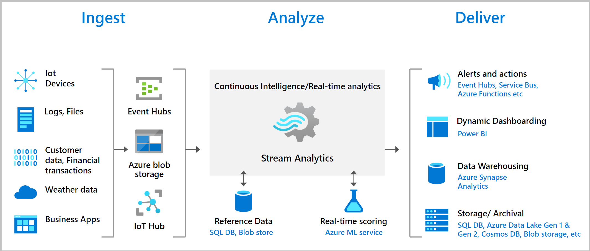
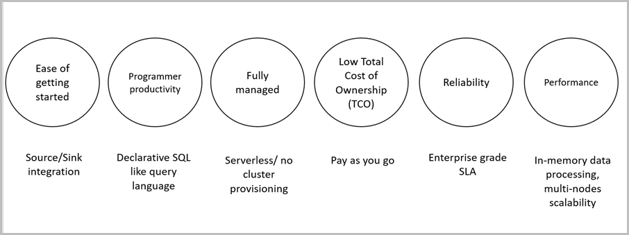

# What is Azure Stream Analytics?

Azure Stream Analytics is a real-time analytics and complex event-processing engine that is designed to analyze and process high volumes of fast streaming data from multiple sources simultaneously. Patterns and relationships can be identified in information extracted from a number of input sources including devices, sensors, clickstreams, social media feeds, and applications. These patterns can be used to trigger actions and initiate workflows such as creating alerts, feeding information to a reporting tool, or storing transformed data for later use. Also, Stream Analytics is available on Azure IoT Edge runtime, and supports the same exact language or syntax as cloud. 

The following scenarios are examples of when you can use Azure Stream Analytics:

* Analyze real-time telemetry streams from IoT devices
* Web logs/clickstream analytics
* Geospatial analytics for fleet management and driverless vehicles
* Remote monitoring and predictive maintenance of high value assets
* Real-time analytics on Point of Sale data for inventory control and anomaly detection

## How does Stream Analytics work?

An Azure Stream Analytics job consists of an input, query, and an output. Stream Analytics ingests data from Azure Event Hubs, Azure IoT Hub, or Azure Blob Storage. The query, which is based on SQL query language, can be used to easily filter, sort, aggregate, and join streaming data over a period of time. You can also extend this SQL language with JavaScript and C# user defined functions (UDFs). You can easily adjust the event ordering options and duration of time windows when preforming aggregation operations through simple language constructs and/or configurations.

Each job has an output for the transformed data, and you can control what happens in response to the information you've analyzed. For example, you can:

* Send data to services such as Azure Functions, Service Bus Topics or Queues to trigger communications or custom workflows downstream.
* Send data to a Power BI dashboard for real-time dashboarding.
* Store data in other Azure storage services to train a machine learning model based on historical data or perform batch analytics.

The following image shows how data is sent to Stream Analytics, analyzed, and sent for other actions like storage or presentation:

## Key capabilities and benefits

Azure Stream Analytics is designed to be easy to use, flexible, reliable, and scalable to any job size. It is available across multiple Azure regions. The following image illustrates the key capabilities of Azure Stream Analytics:

## Ease of getting started

Azure Stream Analytics is easy to start. It only takes a few clicks to connect to multiple sources and sinks, creating an end-to-end pipeline. Stream Analytics can connect to [Azure Event Hubs](/azure/event-hubs/) and [Azure IoT Hub](/azure/iot-hub/) for streaming data ingestion, as well as [Azure Blob storage](/azure/storage/common/storage-introduction) to ingest historical data. Job input can also include static or slow-changing reference data from Azure Blob storage or [SQL Database](stream-analytics-use-reference-data.md#azure-sql-database) that you can join to streaming data to perform lookup operations.

Stream Analytics can route job output to many storage systems such as [Azure Blob storage](/azure/storage/common/storage-introduction), [Azure SQL Database](/azure/sql-database/), [Azure Data Lake Store](/azure/data-lake-store/), and [Azure CosmosDB](/azure/cosmos-db/introduction). You can run batch analytics on stored output with Azure HDInsight, or you can send the output to another service, like Event Hubs for consumption or [Power BI](https://docs.microsoft.com/power-bi/) for real-time visualization.

For the entire list of Stream Analytics outputs, see [Understand outputs from Azure Stream Analytics](stream-analytics-define-outputs.md).

## Programmer productivity

Azure Stream Analytics uses a simple SQL-based query language that has been augmented with powerful temporal constraints to analyze data in motion. To define job transformations, you use a simple, declarative [Stream Analytics query language](https://docs.microsoft.com/stream-analytics-query/stream-analytics-query-language-reference) that lets you author complex temporal queries and analytics using simple SQL constructs. Because Stream Analytics query language is consistent to the SQL language, familiarity with SQL is sufficient to start creating jobs. You can also create jobs by using developer tools like Azure PowerShell, [Stream Analytics Visual Studio tools](stream-analytics-tools-for-visual-studio-install.md), the [Stream Analytics Visual Studio Code extension](quick-create-vs-code.md), or Azure Resource Manager templates. Using developer tools allow you to develop transformation queries offline and use the [CI/CD pipeline](stream-analytics-tools-for-visual-studio-cicd.md) to submit jobs to Azure.

The Stream Analytics query language offers a wide array of functions for analyzing and processing streaming data. This query language supports simple data manipulation, aggregation functions, and complex geospatial functions. You can edit queries in the portal and test them using sample data that is extracted from a live stream.

You can extend the capabilities of the query language by defining and invoking additional functions. You can define function calls in the Azure Machine Learning to take advantage of Azure Machine Learning solutions, and integrate JavaScript or C# user-defined functions (UDFs) or user-defined aggregates to perform complex calculations as part a Stream Analytics query.

## Fully managed

Azure Stream Analytics is a fully managed serverless (PaaS) offering on Azure. You don't have to provision any hardware or manage clusters to run your jobs. Azure Stream Analytics fully manages your job by setting up complex compute clusters in the cloud and taking care of the performance tuning necessary to run the job. Integration with Azure Event Hubs and Azure IoT Hub allows your job to ingest millions of events per second coming from a number of sources, to include connected devices, clickstreams, and log files. Using the partitioning feature of Event Hubs, you can partition computations into logical steps, each with the ability to be further partitioned to increase scalability.

## Run in the cloud or on the intelligent edge

Azure Stream Analytics can run in the cloud, for large-scale analytics, or run on IoT Edge for ultra-low latency analytics. Azure Stream Analytics uses the same query language on both cloud and the edge, enabling developers to build truly hybrid architectures for stream processing. 

## Low total cost of ownership

As a cloud service, Stream Analytics is optimized for cost. There are no upfront costs involved - you only pay for the [streaming units you consume](stream-analytics-streaming-unit-consumption.md), and the amount of data processed. There is no commitment or cluster provisioning required, and you can scale the job up or down based on your business needs.

## Mission-critical ready

Azure Stream Analytics is available across multiple regions worldwide and is designed to run mission-critical workloads by supporting reliability, security and compliance requirements.

### Reliability

Azure Stream Analytics guarantees exactly-once event processing and at-least-once delivery of events, so events are never lost. Exactly-once processing is guaranteed with selected output as described in [Event Delivery Guarantees](/stream-analytics-query/event-delivery-guarantees-azure-stream-analytics).

Azure Stream Analytics has built-in recovery capabilities in case the delivery of an event fails. Stream Analytics also provides built-in checkpoints to maintain the state of your job and provides repeatable results.

As a managed service, Stream Analytics guarantees event processing with a 99.9% availability at a minute level of granularity. For more information, see the [Stream Analytics SLA](https://azure.microsoft.com/support/legal/sla/stream-analytics/v1_0/) page. 

### Security

In terms of security, Azure Stream Analytics encrypts all incoming and outgoing communications and supports TLS 1.2. Built-in checkpoints are also encrypted. Stream Analytics doesn't store the incoming data since all processing is done in-memory.

### Compliance

Azure Stream Analytics follows multiple compliance certifications as described in the [overview of Azure compliance](https://gallery.technet.microsoft.com/Overview-of-Azure-c1be3942). 

## Performance

Stream Analytics can process millions of events every second and it can deliver results with ultra low latencies. It allows you to scale-up and scale-out to handle large real-time and complex event processing applications. Stream Analytics supports higher performance by partitioning, allowing complex queries to be parallelized and executed on multiple streaming nodes. Azure Stream Analytics is built on [Trill](https://github.com/Microsoft/Trill), a high-performance in-memory streaming analytics engine developed in collaboration with Microsoft Research.

## Next steps

You now have an overview of Azure Stream Analytics. Next, you can dive deep and create your first Stream Analytics job:

* [Create a Stream Analytics job by using the Azure portal](stream-analytics-quick-create-portal.md).
* [Create a Stream Analytics job by using Azure PowerShell](stream-analytics-quick-create-powershell.md).
* [Create a Stream Analytics job by using Visual Studio](stream-analytics-quick-create-vs.md).
* [Create a Stream Analytics job by using Visual Studio Code](quick-create-vs-code.md).
