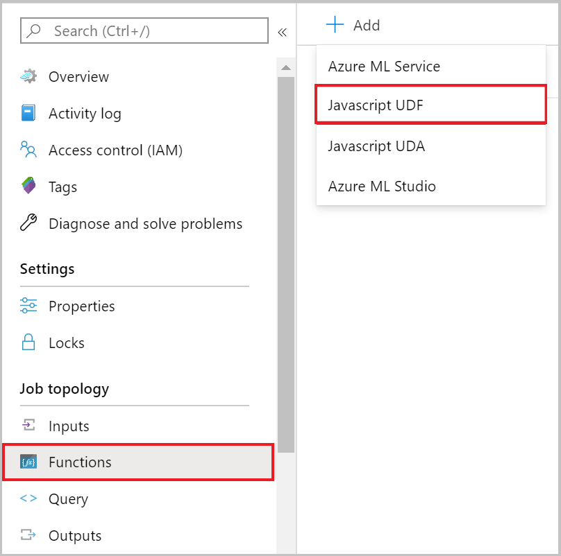

# JavaScript user-defined functions in Azure Stream Analytics
 
Azure Stream Analytics supports user-defined functions written in JavaScript. By using the rich set of **String**, **RegExp**, **Math**, **Array**, and **Date** methods that JavaScript provides, you can create complex data transformations in Stream Analytics jobs. JavaScript user-defined functions support stateless, compute-only scalar functions that don't require external connectivity. The return value of a function can only be a scalar (single) value. After you add a JavaScript user-defined function to a job, you can use the function anywhere in the query, like a built-in scalar function.

This article describes when to use JavaScript user-defined functions and how to define and call them in your Stream Analytics jobs.

## When to use a JavaScript user-defined function

Here are some scenarios where you might find JavaScript user-defined functions useful:
* Parsing and manipulating strings by using regular expression functions, for example, **Regexp_Replace()** and **Regexp_Extract()**
* Decoding and encoding data, for example, binary-to-hex conversion
* Doing mathematical computations by using JavaScript **Math** functions
* Doing array operations like sort, join, find, and fill

Here are some things that you can't do by using a JavaScript user-defined function in Stream Analytics:
* Call external REST endpoints, for example, doing reverse IP lookup or pulling reference data from an external source
* Perform custom event format serialization or deserialization on inputs or outputs
* Create custom aggregates

Although functions like **Date.GetDate()** or **Math.random()** aren't blocked in the functions definition, avoid using them. These functions **don't** return the same result every time you call them, and the Azure Stream Analytics service doesn't keep a journal of function invocations and returned results. If a function returns a different result on the same events, repeatability isn't guaranteed when you or the Stream Analytics service restart the job.

## Define a JavaScript user-defined function in the Azure portal

For a Stream Analytics job that runs in the cloud, add a JavaScript user-defined function from the **Functions** page under **Job Topology**, where the **+Add** menu includes a **JavaScript UDF** option.

> [!NOTE]
> This experience applies to Stream Analytics jobs configured to run in the cloud. If your Stream Analytics job is configured to run on Azure IoT Edge, instead use Visual Studio and [write the user-defined function using C#](stream-analytics-edge-csharp-udf.md).



A function definition consists of the following properties:

|Property|Description|
|--------|-----------|
|Function alias|The name that invokes the function in your query.|
|Output type|The type that the JavaScript user-defined function returns to your Stream Analytics query.|
|Function definition|The implementation of your JavaScript function that runs each time the UDF is invoked from your query.|

## Test and troubleshoot JavaScript UDF logic

Because the Stream Analytics portal doesn't support debugging and testing the logic of these user-defined functions, you can test and debug your JavaScript UDF logic in any browser. When the function works as expected, it's ready to add to the Stream Analytics job and invoke directly from your query. You can also test your query logic with a JavaScript UDF by using the [Stream Analytics tools for Visual Studio](./stream-analytics-tools-for-visual-studio-install.md).

Stream Analytics treats JavaScript runtime errors as fatal and surfaces them through the Activity log. The log is available in the Azure portal from your job's **Activity log** page.

## Call a JavaScript user-defined function in a query

To invoke your JavaScript function in your query, use the function alias prefixed with **udf**. The following example shows a JavaScript UDF that converts hexadecimal values to an integer in a Stream Analytics query.

```sql
    SELECT
        time,
        UDF.hex2Int(offset) AS IntOffset
    INTO
        output
    FROM
        InputStream
```

## Supported JavaScript objects

Azure Stream Analytics JavaScript user-defined functions support the standard, built-in JavaScript objects. These objects give your functions access to common string, math, array, and date operations without any extra configuration. For a complete list of the available objects, see [Global Objects](https://developer.mozilla.org/docs/Web/JavaScript/Reference/Global_Objects). Because the Stream Analytics query language and JavaScript don't share the same type system, Stream Analytics converts values as they pass between the two.

### Stream Analytics and JavaScript type conversion

The Stream Analytics query language and JavaScript support different types. This table lists the conversion mappings between the two:

| Stream Analytics | JavaScript |
| --- | --- |
| bigint | Number (JavaScript can only represent integers up to precisely 2^53) |
| DateTime | Date (JavaScript only supports milliseconds) |
| double | Number |
| nvarchar(MAX) | String |
| Record | Object |
| Array | Array |
| NULL | Null |

Here are JavaScript-to-Stream Analytics conversions:

| JavaScript | Stream Analytics |
| --- | --- |
| Number | Bigint (if the number is round and between long.MinValue and long.MaxValue; otherwise, it's double) |
| Date | DateTime |
| String | nvarchar(MAX) |
| Object | Record |
| Array | Array |
| Null, Undefined | NULL |
| Any other type (for example, a function or error) | Not supported (results in runtime error) |

JavaScript is case-sensitive, and the casing of the object fields in JavaScript code must match the casing of the fields in the incoming data. Jobs with compatibility level 1.0 convert fields from the SQL SELECT statement to lowercase. Under compatibility level 1.1 and higher, fields from the SELECT statement have the same casing as specified in the SQL query.

## Common function patterns

The following patterns show common ways to use JavaScript user-defined functions to transform data in your Stream Analytics queries. Each pattern includes a function definition and a sample query that invokes it.

### Write nested JSON to output

If you have a follow-up processing step that uses a Stream Analytics job output as input, and it requires a JSON format, you can write a JSON string to output. The following function definition calls the **JSON.stringify()** function to pack all name/value pairs of the input and then write them as a single string value in output.

```javascript
function main(x) {
return JSON.stringify(x);
}
```

A Stream Analytics query invokes the function as shown in the following example.

```sql
SELECT
    DataString,
    DataValue,
    HexValue,
    UDF.jsonstringify(input) As InputEvent
INTO
    output
FROM
    input PARTITION BY PARTITIONID
```

### Cast string to JSON object to process

If you have a string field that is JSON and want to convert it to a JSON object for processing in a JavaScript UDF, you can use the **JSON.parse()** function to create a JSON object that you can then use. The following function definition parses the string and returns a property from the resulting object.

```javascript
function main(x) {
var person = JSON.parse(x);  
return person.name;
}
```

A Stream Analytics query invokes the function as shown in the following example.

```sql
SELECT
    UDF.getName(input) AS Name
INTO
    output
FROM
    input
```

### Use try/catch for error handling

Try/catch blocks can help you identify problems with malformed input data that you pass into a JavaScript UDF. The following function definition uses a try/catch block to handle parsing errors.

```javascript
function main(input, x) {
    var obj = null;

    try{
        obj = JSON.parse(x);
    }catch(error){
        throw input;
    }
    
    return obj.Value;
}
```

In the following sample query, you pass the entire record as the first parameter so that the function can return it if there's an error.

```sql
SELECT
    A.context.company AS Company,
    udf.getValue(A, A.context.value) as Value
INTO
    output
FROM
    input A
```

### toLocaleString()

The **toLocaleString** method in JavaScript returns a language-sensitive string that represents the date-time data from where you call the method. Even though Azure Stream Analytics only accepts UTC date-time as the system timestamp, you can use this method to convert the system timestamp to another locale and time zone. This method follows the same implementation behavior as the one available in Internet Explorer. The following function definition converts the input datetime to the **de-DE** locale.

```javascript
function main(datetime){
    const options = { weekday: 'long', year: 'numeric', month: 'long', day: 'numeric' };
    return datetime.toLocaleDateString('de-DE', options);
}
```

In the following sample query, a datetime is passed as the input value.

```sql
SELECT
    udf.toLocaleString(input.datetime) as localeString
INTO
    output
FROM
    input
```

The output of this query is the input datetime in **de-DE** with the options provided.

```output
Samstag, 28. December 2019
```

## User logging

Logging is the mechanism that Azure Stream Analytics uses to capture custom information from a JavaScript user-defined function while a job runs. Because a running job is otherwise opaque, log data gives you visibility into the behavior and correctness of your custom code in real time. Every log message carries an event level that indicates how significant the message is and whether the job can keep running.

Informational messages come from the **console.info()** method, such as `console.info('my info message');`. This level records general information during execution and doesn't interrupt computation. Warning messages come from the **console.warn()** method, such as `console.warn('my warning message');`. This level records data that might be unexpected but is still acceptable for computation, so the job continues to run. Error messages come from the **console.error()** and **console.log()** methods, such as `console.error('my error message');`. These methods apply only to cases where the code can't continue, so they throw an exception with the supplied error information and stop the job.

You can access log messages through the [diagnostic logs](data-errors.md).

## atob() and btoa()

Stream Analytics supports two methods for Base64 conversion, which is a common way to encode binary data as text. The **btoa()** method encodes an ASCII string into Base64, and the **atob()** method decodes a string of Base64-encoded data back into an ASCII string. In the following example, `btoa()` encodes an ASCII string, and `atob()` then decodes the result back into the original string.

```javascript
var myAsciiString = 'ascii string';
var encodedString = btoa(myAsciiString);
var decodedString = atob(encodedString);
```

## Related content

* [Machine learning UDF](./machine-learning-udf.md)
* [C# user-defined functions](./stream-analytics-edge-csharp-udf-methods.md)
