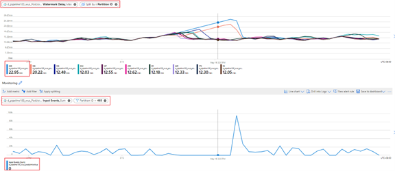
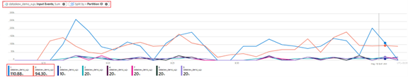
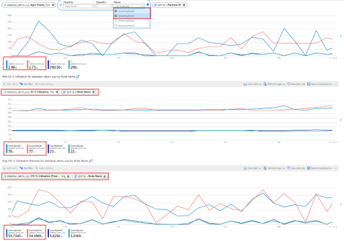
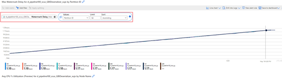
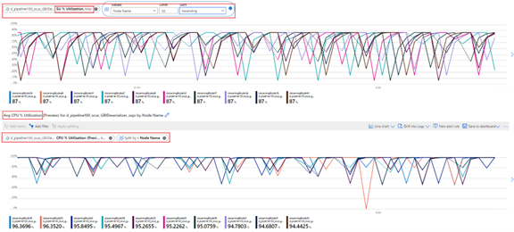

# Analyze Stream Analytics job with metrics dimensions

To understand the Stream Analytics job’s health, it is important to know how to utilize the job’s metrics and dimensions. You can use Azure portal or VS code ASA extension or SDK to get and view the metrics and dimensions which you are interested in. 

This section demonstrates how to use Stream Analytics job metrics and dimensions to analyze the job’s performance through Azure portal monitoring.

Normally, watermark delay metric data   is the main data to measure the Streaming analytics job performance as well as backlogged input events. If a job’s watermark delay is increasing, there definitely is some problem in this job. Let’s look at several job examples to analyze the job’s performance through the watermark delay metric data as a starting point.

## No input for certain partition causes job watermark delay increasing

If your embarrassingly parallel job’s watermark delay is steadily increased, you can follow these steps to find out if the root cause is no input in some partitions.
-	First, we can check this job’s watermark delay metrics splitting with the “Partition ID” dimension to see which partition has the watermark delay increasing. For example: we split the whole job watermark delay with “Partition ID” dimension, then we identified that the partition#465 has high watermark delay.

-	Then, let’s check if there is any data missing for this partition. Then, we can filter this partition in the “Input Events” metric to check. See the screenshot below.  

What action would you take further?

-	As you can see, during this partition watermark delay increasing, there is no input event to this partition. If the late arrival window is set quite big (says several hours or even more than 1 day) in your job and the watermark delay is increasing within this window period, the root cause of the watermark delay increasing is “no input”. Then, you will need to check its corresponding input source, for example, your upstreaming job’s output

## Input data-skew causes high watermark delay

As mentioned in the above case, when you see your embarrassingly parallel job having high watermark delay, the first thing to do is to check the watermark delay splitting by “Partition ID” dimension to identify if all the partitions have high watermark delay or just a few of them. 

For this case, we see the watermark delay splitting by “Partition ID” as below for example:

As we can see, partition#0 and partition#1 have higher watermark delay (20 ~30s) than other 8 partitions. The other partitions’ watermark delays are always steady at 8~10s. Then, let’s check what the input data looks like for all these partitions with the metric “Input Events” splitting by “Partition ID”:

What action would you take further?

As shown in above screenshot, the partition#0 and partition#1   having high watermark delay has much more amount of data than other partitions. We call it “data-skew”. This means that the streaming nodes processing the partitions with data-skew need to consume more resources (CPU and memory) than others as shown below. 

Streaming nodes that process partitions with higher data skew will exhibit higher CPU and/or SU (memory) utilization which will impact job's performance and result in increasing watermark delay. To mitigate this, you will need to repartition your input data more evenly.

## Overloaded CPU/memory causes watermark delay increasing

When a fully-parallel job has watermark delay increasing, it may not just happen on one or several partitions, but all of the partitions. How to confirm my job is falling into this case? 
-	First, split the watermark delay with “Partition ID” dimension, same as the case above. For example, the below job:

-	Split the “Input Events” metric with “Partition IDs” to confirm if there is data-skew in input data per partitions.
-	Then, check the CPU and SU utilization to see if the utilization in all streaming nodes is too high.

-	If the utilization of CPU and SU is too high (>80%) in all streaming nodes, we could conclude that this job has a large amount of data being processed within each streaming node. Let’s further check how many partitions are allocated to one streaming node by checking the “Input Events” metrics with “filter by a Streaming node” and “Splitting by Partition ID”. See the screenshot below:

-	From the above screenshot, we can see there are 4 partitions allocated to one streaming node which occupied nearly 90% ~ 100% of the streaming node resource.   You can use the similar approach to check the rest streaming nodes to confirm if they are also processing 4 partitions data.

What action would you take further?

-	Naturally, we’d think to reduce the partition count for each streaming node to reduce the input data for each streaming node. To achieve this, you can double the SUs to have each streaming node to handle two partitions data or 4 times the SUs to have each streaming node to handle one partition data. Refer to “Fully-Parallel” job section for the relationship between SUs assignment and streaming node count.
-	What should I do if the watermark delay is still increasing when one streaming node is handling one partition data? Repartition your input with more partitions to reduce the amount of data in each partition. Refer to this document for details: [Use repartitioning to optimize Azure Stream Analytics jobs](./repartition.md)

## Next steps

* [Understand job monitoring in Azure Stream Analytics](./stream-analytics-monitoring.md)
* [Azure Stream Analytics metrics dimensions](./stream-analytics-job-metrics-dimensions.md)
* [Stream Analytics streaming unit and streaming node](./stream-analytics-streamingunit-and-streamingnode.md)