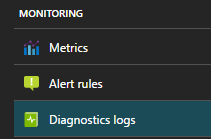
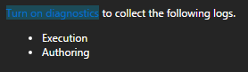

# Troubleshoot Azure Stream Analytics by using diagnostics logs

Occasionally, an Azure Stream Analytics job unexpectedly stops processing. It's important to be able to troubleshoot this kind of event. The event might be caused by an unexpected query result, by connectivity to devices, or by an unexpected service outage. The diagnostics logs in Stream Analytics can help you identify the cause of issues when they occur, and reduce recovery time.

## Log types

Stream Analytics offers two types of logs: 
* [Activity logs](https://docs.microsoft.com/azure/monitoring-and-diagnostics/monitoring-overview-activity-logs) (always on). Activity logs give insights into operations performed on jobs.
* [Diagnostics logs](https://docs.microsoft.com/azure/monitoring-and-diagnostics/monitoring-overview-of-diagnostic-logs) (configurable). Diagnostics logs provide richer insights into everything that happens with a job. Diagnostics logs start when the job is created, and end when the job is deleted. They cover events when the job is updated and while it’s running.

> [!NOTE]
> You can use services like Azure Storage, Azure Event Hubs, and Azure Log Analytics to analyze nonconforming data. You are charged based on the pricing model for those services.
>

## Turn on diagnostics logs

Diagnostics logs are **off** by default. To turn on diagnostics logs, complete these steps:

1.  Sign in to the Azure portal, and go to the streaming job blade. Under **Monitoring**, select **Diagnostics logs**.

      

2.  Select **Turn on diagnostics**.

    

3.  On the **Diagnostics settings** page, for **Status**, select **On**.

    

4.  Set up the archival target (storage account, event hub, Log Analytics) that you want. Then, select the categories of logs that you want to collect (Execution, Authoring). 

5.  Save the new diagnostics configuration.

The diagnostics configuration takes about 10 minutes to take effect. After that, the logs start appearing in the configured archival target (you can see these on the **Diagnostics logs** page):

For more information about configuring diagnostics, see [Collect and consume diagnostics data from your Azure resources](https://docs.microsoft.com/azure/monitoring-and-diagnostics/monitoring-overview-of-diagnostic-logs).

## Diagnostics log categories

Currently, we capture two categories of diagnostics logs:

* **Authoring**. Captures log events that are related to job authoring operations: job creation, adding and deleting inputs and outputs, adding and updating the query, starting and stopping the job.
* **Execution**. Captures events that occur during job execution:
    * Connectivity errors
    * Data processing errors, including:
        * Events that don’t conform to the query definition (mismatched field types and values, missing fields, and so on)
        * Expression evaluation errors
    * Other events and errors

## Diagnostics logs schema

All logs are stored in JSON format. Each entry has the following common string fields:

Name | Description
------- | -------
time | Timestamp (in UTC) of the log.
resourceId | ID of the resource that the operation took place on, in upper case. It includes the subscription ID, the resource group, and the job name. For example, **/SUBSCRIPTIONS/6503D296-DAC1-4449-9B03-609A1F4A1C87/RESOURCEGROUPS/MY-RESOURCE-GROUP/PROVIDERS/MICROSOFT.STREAMANALYTICS/STREAMINGJOBS/MYSTREAMINGJOB**.
category | Log category, either **Execution** or **Authoring**.
operationName | Name of the operation that is logged. For example, **Send Events: SQL Output write failure to mysqloutput**.
status | Status of the operation. For example, **Failed** or **Succeeded**.
level | Log level. For example, **Error**, **Warning**, or **Informational**.
properties | Log entry-specific detail, serialized as a JSON string. For more information, see the following sections.

### Execution log properties schema

Execution logs have information about events that happened during Stream Analytics job execution. The schema of properties varies, depending on the type of event. Currently, we have the following types of execution logs:

### Data errors

Any error that occurs while the job is processing data is in this category of logs. These logs most often are created during data read, serialization, and write operations. These logs do not include connectivity errors. Connectivity errors are treated as generic events.

Name | Description
------- | -------
Source | Name of the job input or output where the error occurred.
Message | Message associated with the error.
Type | Type of error. For example, **DataConversionError**, **CsvParserError**, or **ServiceBusPropertyColumnMissingError**.
Data | Contains data that is useful to accurately locate the source of the error. Subject to truncation, depending on size.

Depending on the **operationName** value, data errors have the following schema:
* **Serialize events**. Serialize events occur during event read operations. They occur when the data at the input does not satisfy the query schema for one of these reasons:
    * *Type mismatch during event (de)serialize*: Identifies the field that's causing the error.
    * *Cannot read an event, invalid serialization*: Lists information about the location in the input data where the error occurred. Includes blob name for blob input, offset, and a sample of the data.
* **Send events**. Send events occur during write operations. They identify the streaming event that caused the error.

### Generic events

Generic events cover everything else.

Name | Description
-------- | --------
Error | (optional) Error information. Usually, this is exception information, if it's available.
Message| Log message.
Type | Type of message. Maps to internal categorization of errors. For example, **JobValidationError** or **BlobOutputAdapterInitializationFailure**.
Correlation ID | [GUID](https://en.wikipedia.org/wiki/Universally_unique_identifier) that uniquely identifies the job execution. All execution log entries from the time the job starts until the job stops have the same **Correlation ID** value.

## Next steps

* [Introduction to Stream Analytics](stream-analytics-introduction.md)
* [Get started with Stream Analytics](stream-analytics-get-started.md)
* [Scale Stream Analytics jobs](stream-analytics-scale-jobs.md)
* [Stream Analytics query language reference](https://msdn.microsoft.com/library/azure/dn834998.aspx)
* [Stream Analytics management REST API reference](https://msdn.microsoft.com/library/azure/dn835031.aspx)
