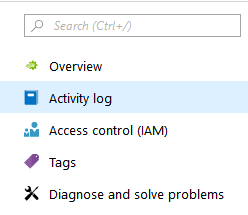
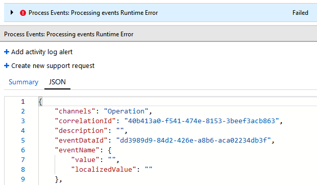
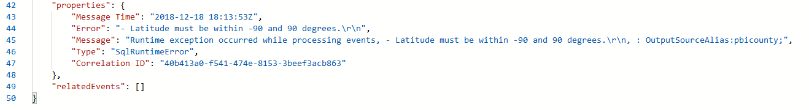
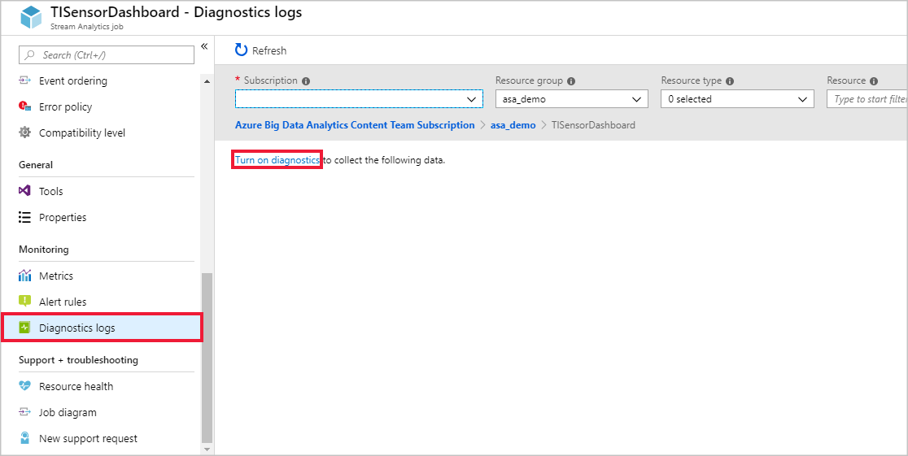
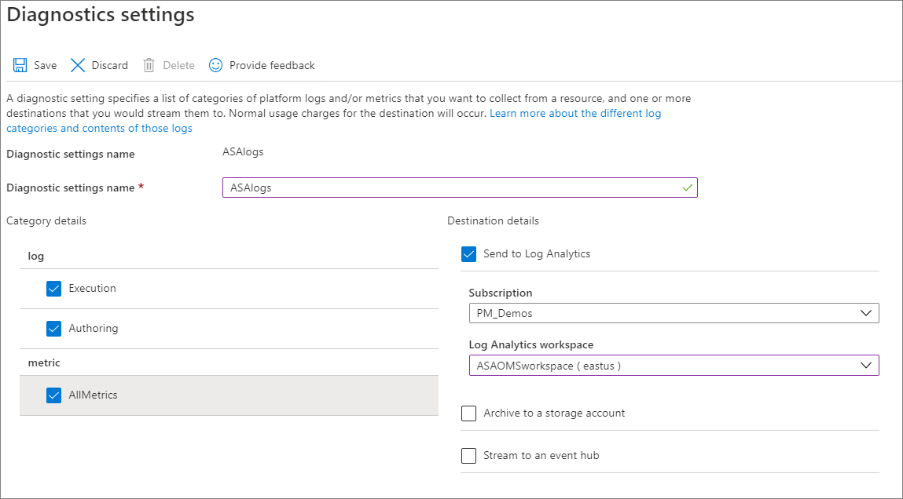
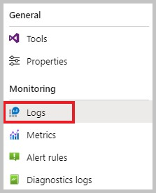
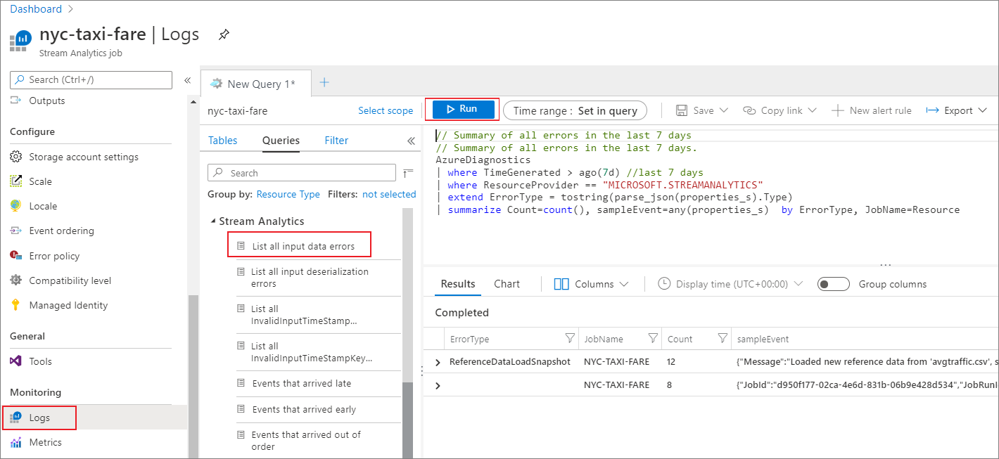

# Troubleshoot Azure Stream Analytics by using resource logs

Occasionally, an Azure Stream Analytics job unexpectedly stops processing. It's important to be able to troubleshoot this kind of event. Failures can be caused by an unexpected query result, by connectivity to devices, or by an unexpected service outage. The resource logs in Stream Analytics can help you identify the cause of issues when they occur and reduce recovery time.

It's highly recommended to enable resource logs for all jobs as it will greatly help with debugging and monitoring.

## Log types

Stream Analytics offers two types of logs:

* [Activity logs](../azure-monitor/essentials/platform-logs-overview.md) (always on), which give insights into operations performed on jobs.

* [Resource logs](../azure-monitor/essentials/platform-logs-overview.md) (configurable), which provide richer insights into everything that happens with a job. Resource logs start when the job is created and end when the job is deleted. They cover events when the job is updated and while it’s running.

> [!NOTE]
> You can use services like Azure Storage, Azure Event Hubs, and Azure Monitor logs to analyze nonconforming data. You are charged based on the pricing model for those services.

[!INCLUDE [azure-monitor-log-analytics-rebrand](../../includes/azure-monitor-log-analytics-rebrand.md)]

## Debugging using activity logs

Activity logs are on by default and give high-level insights into operations performed by your Stream Analytics job. Information present in activity logs may help find the root cause of the issues impacting your job. Do the following steps to use activity logs in Stream Analytics:

1. Sign in to the Azure portal and select **Activity log** under **Overview**.

   

2. You can see a list of operations that have been performed. Any operation that caused your job to fail has a red info bubble.

3. Select an operation to see its summary view. Information here's often limited. To learn more details about the operation, select **JSON**.

   

4. Scroll down to the **Properties** section of the JSON, which provides details of the error that caused the failed operation. In this example, the failure was due to a runtime error from out of bound latitude values. Discrepancy in the data that is processed by a Stream Analytics job causes a data error. You can learn about different [input and output data errors and why they occur](./data-errors.md).

   

5. You can take corrective actions based on the error message in JSON. In this example, checks to ensure latitude value is between -90 degrees and 90 degrees need to be added to the query.

6. If the error message in the Activity logs isn’t helpful in identifying root cause, enable resource logs and use Azure Monitor logs.

## Send diagnostics to Azure Monitor logs

Turning on resource logs and sending them to Azure Monitor logs is highly recommended. They're **off** by default. To turn them on, complete these steps:

1.  Create a Log Analytics workspace if you don't already have one. It's recommended to have your Log Analytics workspace in the same region as your Stream Analytics job.

2.  Sign in to the Azure portal, and navigate to your Stream Analytics job. Under **Monitoring**, select **Diagnostics logs**. Then select **Turn on diagnostics**.

      

2.  Provide a **Name** in **Diagnostic settings name** and check the boxes for **Execution** and **Authoring** under **log**, and **AllMetrics** under **metric**. Then select **Send to Log Analytics** and choose your workspace. Select **Save**.

    

3. When your Stream Analytics job starts, resource logs are routed to your Log Analytics workspace. To view resource logs for your job, select **Logs** under the **Monitoring** section.

   

4. Stream Analytics provides predefined queries that allow you to easily search for the logs that you're interested in. You can select any predefined queries on the left pane and then select **Run**. You'll see the results of the query in the bottom pane. 

   

## Resource log categories

[!INCLUDE [resource-logs](./includes/resource-logs.md)]

## Resource logs schema

[!INCLUDE [resource-logs-schema](./includes/resource-logs-schema.md)]

## Next steps

* [Stream Analytics data errors](./data-errors.md)
* [Stream Analytics query language reference](/stream-analytics-query/stream-analytics-query-language-reference)