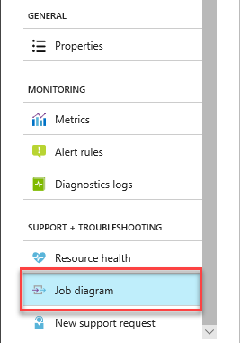
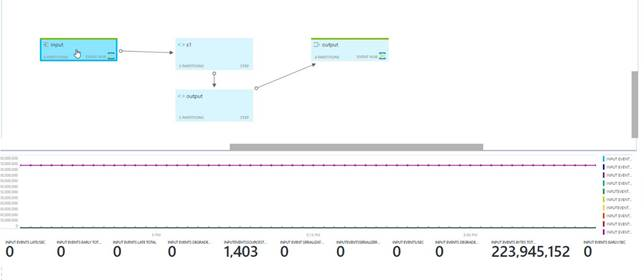
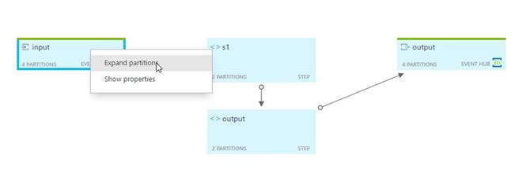
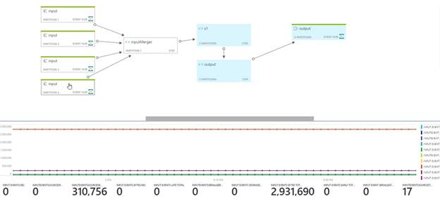
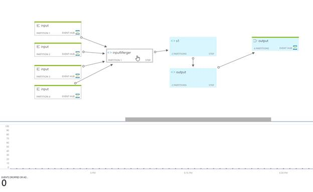
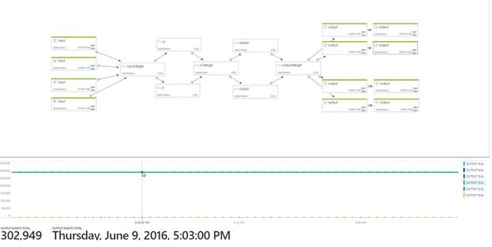

# Data-driven debugging by using the job diagram

The job diagram on the **Monitoring** blade in the Azure portal can help you visualize your job pipeline. It shows inputs, outputs, and query steps. You can use the job diagram to examine the metrics for each step, to more quickly isolate the source of a problem when you troubleshoot issues.

## Using the job diagram

In the Azure portal, while in a Stream Analytics job, under **SUPPORT + TROUBLESHOOTING**, select **Job diagram**:

Select each query step to see the corresponding section in a query editing pane. A metric chart for the step is displayed in a lower pane on the page.

To see the partitions of the Azure Event Hubs input, select **. . .** A context menu appears. You also can see the input merger.

To see the metric chart for only a single partition, select the partition node. The metrics are shown at the bottom of the page.

To see the metrics chart for a merger, select the merger node. The following chart shows that no events were dropped or adjusted.

To see the details of the metric value and time, point to the chart.

## Troubleshoot by using metrics

The **QueryLastProcessedTime** metric indicates when a specific step received data. By looking at the topology, you can work backward from the output processor to see which step is not receiving data. If a step is not getting data, go to the query step just before it. Check whether the preceding query step has a time window, and if enough time has passed for it to output data. (Note that time windows are snapped to the hour.)
 
If the preceding query step is an input processor, use the input metrics to help answer the following targeted questions. They can help you determine whether a job is getting data from its input sources. If the query is partitioned, examine each partition.
 
### How much data is being read?

*   **InputEventsSourcesTotal** is the number of data units read. For example, the number of blobs.
*   **InputEventsTotal** is the number of events read. This metric is available per partition.
*   **InputEventsInBytesTotal** is the number of bytes read.
*   **InputEventsLastArrivalTime** is updated with every received event's enqueued time.
 
### Is time moving forward? If actual events are read, punctuation might not be issued.

*   **InputEventsLastPunctuationTime** indicates when a punctuation was issued to keep time moving forward. If punctuation is not issued, data flow can get blocked.
 
### Are there any errors in the input?

*   **InputEventsEventDataNullTotal** is a count of events that have null data.
*   **InputEventsSerializerErrorsTotal** is a count of events that could not be deserialized correctly.
*   **InputEventsDegradedTotal** is a count of events that had an issue other than with deserialization.
 
### Are events being dropped or adjusted?

*   **InputEventsEarlyTotal** is the number of events that have an application timestamp before the high watermark.
*   **InputEventsLateTotal** is the number of events that have an application timestamp after the high watermark.
*   **InputEventsDroppedBeforeApplicationStartTimeTotal** is the number events dropped before the job start time.
 
### Are we falling behind in reading data?

*   **Input Events Backlogged (Total)** tells you how many more messages need to be read for Event Hubs and Azure IoT Hub inputs. When this number is greater than 0, it means your job can't process the data as fast as it is coming in. In this case you may need to increase the number of Streaming Units and/or make sure your job can be parallelized. You can see more info on this on the  [query parallelization page](./stream-analytics-parallelization.md). 

## Get help
For additional assistance, try our [Microsoft Q&A question page for  Azure Stream Analytics](/answers/topics/azure-stream-analytics.html). 

## Next steps
* [Introduction to Stream Analytics](stream-analytics-introduction.md)
* [Get started with Stream Analytics](stream-analytics-real-time-fraud-detection.md)
* [Scale Stream Analytics jobs](stream-analytics-scale-jobs.md)
* [Stream Analytics query language reference](/stream-analytics-query/stream-analytics-query-language-reference)
* [Stream Analytics management REST API reference](/rest/api/streamanalytics/)
