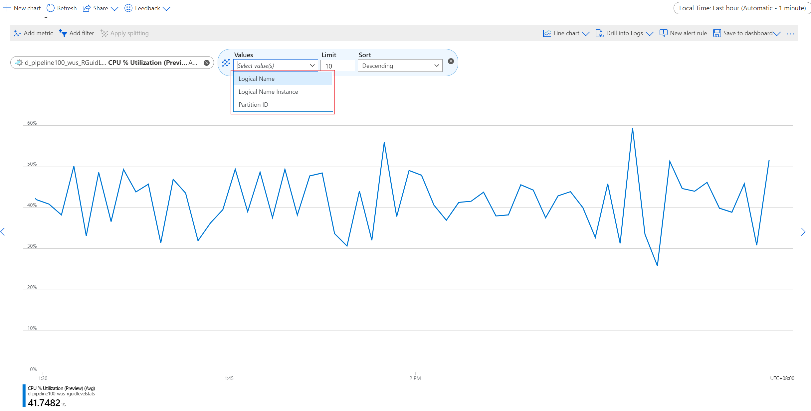

# Analyze Azure Stream Analytics job by using metric dimension

When an Azure Stream Analytics job is running in cloud, it is important to analyze the job's metrics to understand if your job is running in good shape. Azure Steam Analytics provides many metrics with several dimensions in these metrics. You can check the each metrics and dimension in [Stream Analytics Monitoring](stream-analytics-monitoring.md). With the dimension, you are able to drill down to the specific partition, input, or streaming node to check the corresponding metric in order to determine the next step to take for your job optimization if needed.

## CPU usage metric splitting with dimension: Node name

Previously, **CPU % Utilization (preview)** metric can only show the whole jobs' CPU usage. As you know, stream analytics service is a distributed system which means the job is running on many stream node behind. When we saw the CPU usage is quite high, there is no way to know if the high CPU usage is happening on all stream nodes or just some of them. Then, it is impossible to determine what the next step is to take to solve the high CPU usage problem.

With the new dimension **Node name** added to the portal recently, you are able to split your job's metrics with this dimension in order to understand the specific metric (here is the **CPU % Utilization (preview)** ) in streaming node level. Then, you can identify the high CPU usage streaming node specifically. 

>*screenshot with node name splitting for CPU usage*

After the high CPU usage streaming node is identified, you can use **filter** operation to fetch the corresponding streaming node. Then, you will see which partitions' data is computed on this streaming node by **Split** operation. With this approach, you can determine if the high CPU usage is related to the specific partition data (e.g., data skew or other data problem).

>*screenshot with specific streaming node by "partition ID" splitting for CPU usage*

## Other metrics splitting with dimension: Node name

Similarly, you can split other metrics like **SU % Utilization**, **Input Events**, **Output Events**, etc. with this dimension as well.

>*screenshot with node name splitting for SU*

## Next steps

* [Stream Analytics data errors](./data-errors.md)
* [Stream Analytics query language reference](/stream-analytics-query/stream-analytics-query-language-reference)