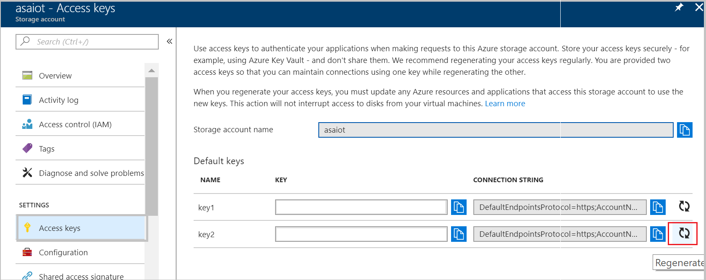
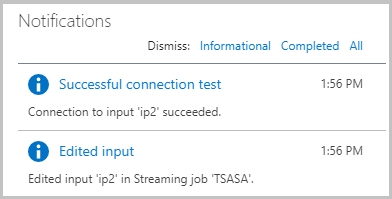
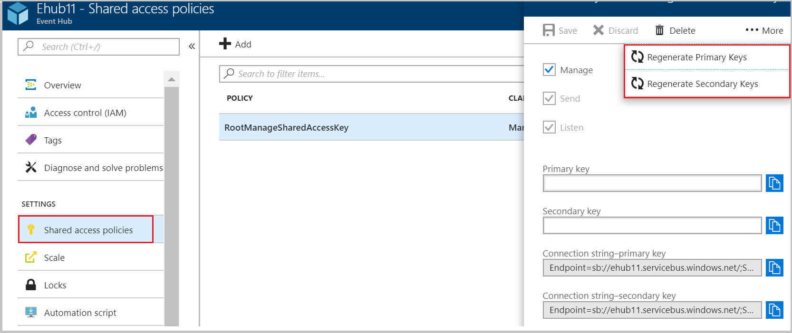
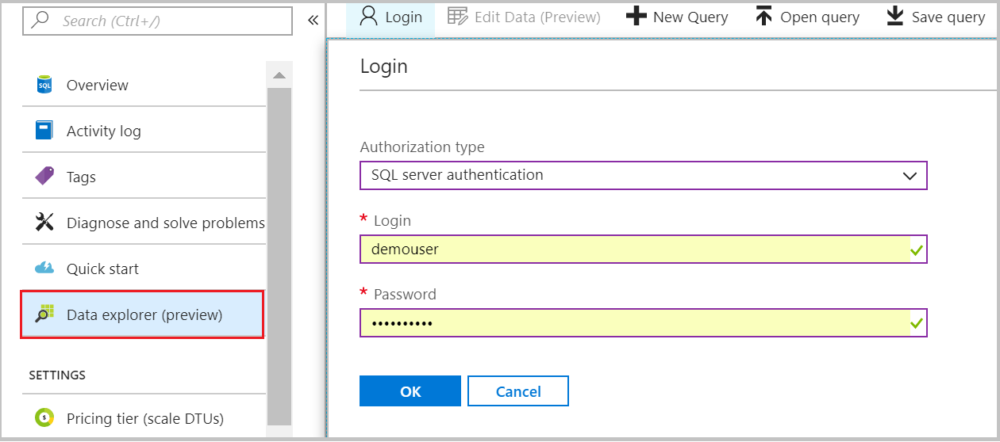
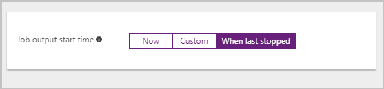

# Rotate login credentials for inputs and outputs of a Stream Analytics Job

Whenever you regenerate credentials for an input or output of a Stream Analytics job, you should update the job with new credentials. You must stop the job before updating the credentials, you can’t replace the credentials while the job is running. To reduce the lag between stopping and restarting the job, Stream Analytics supports resuming a job from its last output. This topic describes the process of rotating the login credentials and restarting the job with new credentials.

## Regenerate new credentials and update your job with the new credentials 

In this section, we will walk you through regenerating credentials for Blob Storage, Event Hubs, SQL Database, and Table Storage. 

### Blob storage/Table storage
1. Sign in to the Azure portal > browse the storage account that you used as input/output for the Stream Analytics job.    
2. From the settings section, open **Access keys**. Between the two default keys (key1, key2), pick the one that is not used by your job and regenerate it:  
   
3. Copy the newly generated key.    
4. From the Azure portal, browse your Stream Analytics job > select **Stop** and wait for the job to stop.    
5. Locate the Blob/Table storage input/output for which you want to update credentials.    
6. Find the **Storage Account Key** field and paste your newly generated key > click **Save**.    
7. A connection test will automatically start when you save your changes, you can view it from the notifications tab. There are two notifications- one corresponds to saving the update and other corresponds to testing the connection:  
   
8. Proceed to [start your job from the last stopped time](#start-your-job-from-the-last-stopped-time) section.

### Event hubs

1. Sign in to the Azure portal > browse the Event Hub that you used as input/output for the Stream Analytics job.    
2. From the settings section, open **Shared access policies** and select the required access policy. Between the **Primary Key** and **Secondary Key**, pick the one that is not used by your job and regenerate it:  
   
3. Copy the newly generated key.    
4. From the Azure portal, browse your Stream Analytics job > select **Stop** and wait for the job to stop.    
5. Locate the Event hubs input/output for which you want to update credentials.    
6. Find the **Event Hub Policy Key** field and paste your newly generated key > click **Save**.    
7. A connection test will automatically start when you save your changes, make sure that it has successfully passed.    
8. Proceed to [start your job from the last stopped time](#start-your-job-from-the-last-stopped-time) section.

### SQL Database

You need to connect to SQL Database to update the login credentials of an existing user. You can update credentials by using Azure portal or a client-side tool such as SQL Server Management Studio. This section demonstrates the process of updating credentials by using Azure portal.

1. Sign in to the Azure portal > browse the SQL database that you used as output for the Stream Analytics job.    
2. From **Data explorer**, login/connect to your database > select Authorization type as **SQL server authentication** > type in your **Login** and **Password** details > Select **Ok**.  
   

3. In the query tab, alter the password for one of your user's by running the following query (make sure to replace `<user_name>` with your username and `<new_password>` with your new password):  

   ```SQL
   Alter user `<user_name>` WITH PASSWORD = '<new_password>'
   Alter role db_owner Add member `<user_name>`
   ```

4. Make a note of the new password.    
5. From the Azure portal, browse your Stream Analytics job > select **Stop** and wait for the job to stop.    
6. Locate the SQL Database output for which you want to rotate credentials. Update the password and save changes.    
7. A connection test will automatically start when you save your changes, make sure that it has successfully passed.    
8. Proceed to [start your job from the last stopped time](#start-your-job-from-the-last-stopped-time) section.

### Power BI
1. Sign in to the Azure portal > browse your Stream Analytics job > select **Stop** and wait for the job to stop.    
2. Locate the Power BI output for which you want to renew credentials > click the **Renew authorization** (you should see a success message) > **Save** the changes.    
3. A connection test will automatically start when you save your changes, make sure it has successfully passed.    
4. Proceed to [start your job from the last stopped time](#start-your-job-from-the-last-stopped-time) section.

## Start your job from the last stopped time

1. Navigate to the job's **Overview** pane > select **Start** to start the job.    
2. Select **When last stopped** > click **Start**. Note that the "When last stopped" option only appears if you previously ran the job and had some output generated. The job is restarted based on the last output value's time.
   

## Next steps
* [Introduction to Azure Stream Analytics](stream-analytics-introduction.md)
* [Get started using Azure Stream Analytics](stream-analytics-real-time-fraud-detection.md)
* [Scale Azure Stream Analytics jobs](stream-analytics-scale-jobs.md)
* [Azure Stream Analytics Query Language Reference](/stream-analytics-query/stream-analytics-query-language-reference)
* [Azure Stream Analytics Management REST API Reference](/rest/api/streamanalytics/)