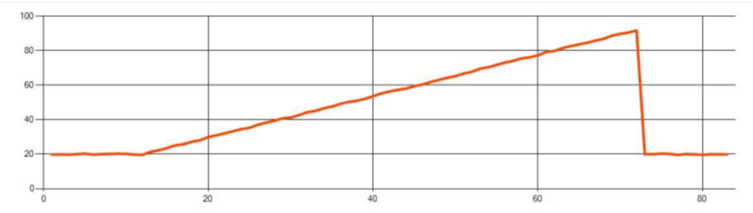

# Anomaly detection in Azure Stream Analytics

Available in both the cloud and Azure IoT Edge, Azure Stream Analytics offers built-in machine learning based anomaly detection capabilities that can be used to monitor the two most commonly occurring anomalies: temporary and persistent. With the **AnomalyDetection_SpikeAndDip** and **AnomalyDetection_ChangePoint** functions, you can perform anomaly detection directly in your Stream Analytics job.

The machine learning models assume a uniformly sampled time series. If the time series is not uniform, you may insert an aggregation step with a tumbling window prior to calling anomaly detection.

The machine learning operations do not support seasonality trends or multi-variate correlations at this time.

## Anomaly detection using machine learning in Azure Stream Analytics

The following video demonstrates how to detect an anomaly in real time using machine learning functions in Azure Stream Analytics. 

> [!VIDEO https://channel9.msdn.com/Shows/Internet-of-Things-Show/Real-Time-ML-Based-Anomaly-Detection-In-Azure-Stream-Analytics/player]

## Model behavior

Generally, the model's accuracy improves with more data in the sliding window. The data in the specified sliding window is treated as part of its normal range of values for that time frame. The model only considers event history over the sliding window to check if the current event is anomalous. As the sliding window moves, old values are evicted from the model’s training.

The functions operate by establishing a certain normal based on what they have seen so far. Outliers are identified by comparing against the established normal, within the confidence level. The window size should be based on the minimum events required to train the model for normal behavior so that when an anomaly occurs, it would be able to recognize it.

The model's response time increases with history size because it needs to compare against a higher number of past events. It is recommended to only include the necessary number of events for better performance.

Gaps in the time series can be a result of the model not receiving events at certain points in time. This situation is handled by Stream Analytics using imputation logic. The history size, as well as a time duration, for the same sliding window is used to calculate the average rate at which events are expected to arrive.

An anomaly generator available [here](https://aka.ms/asaanomalygenerator) can be used to feed an Iot Hub with data with different anomaly patterns. An ASA job can be set up with these anomaly detection functions to read from this Iot Hub and detect anomalies.

## Spike and dip

Temporary anomalies in a time series event stream are known as spikes and dips. Spikes and dips can be monitored using the Machine Learning based operator, [AnomalyDetection_SpikeAndDip](https://docs.microsoft.com/stream-analytics-query/anomalydetection-spikeanddip-azure-stream-analytics
).


In the same sliding window, if a second spike is smaller than the first one, the computed score for the smaller spike is probably not significant enough compared to the score for the first spike within the confidence level specified. You can try decreasing the model's confidence level to detect such anomalies. However, if you start to get too many alerts, you can use a higher confidence interval.

The following example query assumes a uniform input rate of one event per second in a 2-minute sliding window with a history of 120 events. The final SELECT statement extracts and outputs the score and anomaly status with a confidence level of 95%.

```SQL
WITH AnomalyDetectionStep AS
(
    SELECT
        EVENTENQUEUEDUTCTIME AS time,
        CAST(temperature AS float) AS temp,
        AnomalyDetection_SpikeAndDip(CAST(temperature AS float), 95, 120, 'spikesanddips')
            OVER(LIMIT DURATION(second, 120)) AS SpikeAndDipScores
    FROM input
)
SELECT
    time,
    temp,
    CAST(GetRecordPropertyValue(SpikeAndDipScores, 'Score') AS float) AS
    SpikeAndDipScore,
    CAST(GetRecordPropertyValue(SpikeAndDipScores, 'IsAnomaly') AS bigint) AS
    IsSpikeAndDipAnomaly
INTO output
FROM AnomalyDetectionStep
```

## Change point

Persistent anomalies in a time series event stream are changes in the distribution of values in the event stream, like level changes and trends. In Stream Analytics, such anomalies are detected using the Machine Learning based [AnomalyDetection_ChangePoint](https://docs.microsoft.com/stream-analytics-query/anomalydetection-changepoint-azure-stream-analytics) operator.

Persistent changes last much longer than spikes and dips and could indicate catastrophic event(s). Persistent changes are not usually visible to the naked eye, but can be detected with the **AnomalyDetection_ChangePoint** operator.

The following image is an example of a level change:


The following image is an example of a trend change:



The following example query assumes a uniform input rate of one event per second in a 20-minute sliding window with a history size of 1200 events. The final SELECT statement extracts and outputs the score and anomaly status with a confidence level of 80%.

```SQL
WITH AnomalyDetectionStep AS
(
    SELECT
        EVENTENQUEUEDUTCTIME AS time,
        CAST(temperature AS float) AS temp,
        AnomalyDetection_ChangePoint(CAST(temperature AS float), 80, 1200) 
        OVER(LIMIT DURATION(minute, 20)) AS ChangePointScores
    FROM input
)
SELECT
    time,
    temp,
    CAST(GetRecordPropertyValue(ChangePointScores, 'Score') AS float) AS
    ChangePointScore,
    CAST(GetRecordPropertyValue(ChangePointScores, 'IsAnomaly') AS bigint) AS
    IsChangePointAnomaly
INTO output
FROM AnomalyDetectionStep

```

## Performance characteristics

The performance of these models depends on the history size, window duration, event load, and whether function level partitioning is used. This section discusses these configurations and provides samples for how to sustain ingestion rates of 1K, 5K and 10K events per second.

* **History size** - These models perform linearly with **history size**. The longer the history size, the longer the models take to score a new event. This is because the models compare the new event with each of the past events in the history buffer.
* **Window duration** - The **Window duration** should reflect how long it takes to receive as many events as specified by the history size. Without that many events in the window, Azure Stream Analytics would impute missing values. Hence, CPU consumption is a function of the history size.
* **Event load** - The greater the **event load**, the more work that is performed by the models, which impacts CPU consumption. The job can be scaled out by making it embarrassingly parallel, assuming it makes sense for business logic to use more input partitions.
* **Function level partitioning** - **Function level partitioning** is done by using ```PARTITION BY``` within the anomaly detection function call. This type of partitioning adds an overhead, as state needs to be maintained for multiple models at the same time. Function level partitioning is used in scenarios like device level partitioning.

### Relationship
The history size, window duration, and total event load are related in the following way:

windowDuration (in ms) = 1000 * historySize / (Total Input Events Per Sec / Input Partition Count)

When partitioning the function by deviceId, add “PARTITION BY deviceId” to the anomaly detection function call.

### Observations
The following table includes the throughput observations for a single node (6 SU) for the non-partitioned case:

| History size (events)	| Window duration (ms) | Total input events per sec |
| --------------------- | -------------------- | -------------------------- |
| 60 | 55 | 2,200 |
| 600 | 728 | 1,650 |
| 6,000 | 10,910 | 1,100 |

The following table includes the throughput observations for a single node (6 SU) for the partitioned case:

| History size (events) | Window duration (ms) | Total input events per sec | Device count |
| --------------------- | -------------------- | -------------------------- | ------------ |
| 60 | 1,091 | 1,100 | 10 |
| 600 | 10,910 | 1,100 | 10 |
| 6,000 | 218,182 | <550 | 10 |
| 60 | 21,819 | 550 | 100 |
| 600 | 218,182 | 550 | 100 |
| 6,000 | 2,181,819 | <550 | 100 |

Sample code to run the non-partitioned configurations above is located in the [Streaming At Scale repo](https://github.com/Azure-Samples/streaming-at-scale/blob/f3e66fa9d8c344df77a222812f89a99b7c27ef22/eventhubs-streamanalytics-eventhubs/anomalydetection/create-solution.sh) of Azure Samples. The code creates a stream analytics job with no function level partitioning, which uses Event Hub as input and output. The input load is generated using test clients. Each input event is a 1KB json document. Events simulate an IoT device sending JSON data (for up to 1K devices). The history size, window duration, and total event load are varied over 2 input partitions.

> [!Note]
> For a more accurate estimate, customize the samples to fit your scenario.

### Identifying bottlenecks
Use the Metrics pane in your Azure Stream Analytics job to identify bottlenecks in your pipeline. Review **Input/Output Events** for throughput and ["Watermark Delay"](https://azure.microsoft.com/blog/new-metric-in-azure-stream-analytics-tracks-latency-of-your-streaming-pipeline/) or **Backlogged Events** to see if the job is keeping up with the input rate. For Event Hub metrics, look for **Throttled Requests** and adjust the Threshold Units accordingly. For Cosmos DB metrics, review **Max consumed RU/s per partition key range** under Throughput to ensure your partition key ranges are uniformly consumed. For Azure SQL DB, monitor **Log IO** and **CPU**.

## Next steps

* [Introduction to Azure Stream Analytics](stream-analytics-introduction.md)
* [Get started using Azure Stream Analytics](stream-analytics-real-time-fraud-detection.md)
* [Scale Azure Stream Analytics jobs](stream-analytics-scale-jobs.md)
* [Azure Stream Analytics Query Language Reference](https://docs.microsoft.com/stream-analytics-query/stream-analytics-query-language-reference)
* [Azure Stream Analytics Management REST API Reference](https://msdn.microsoft.com/library/azure/dn835031.aspx)

