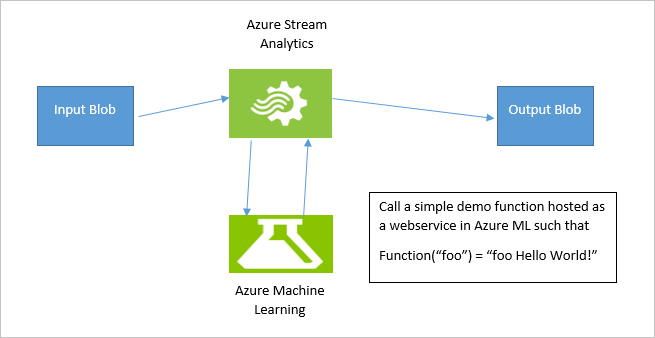
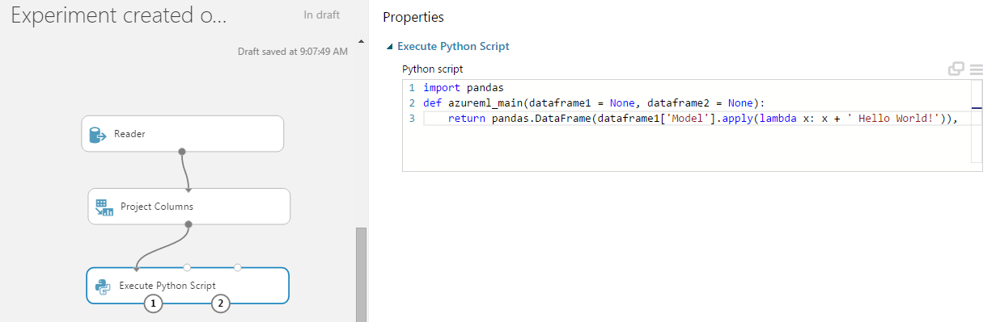
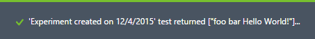
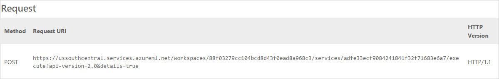
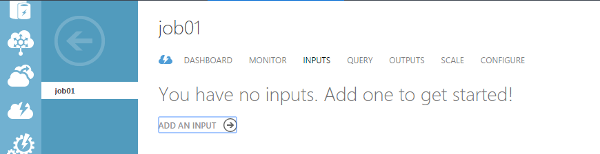
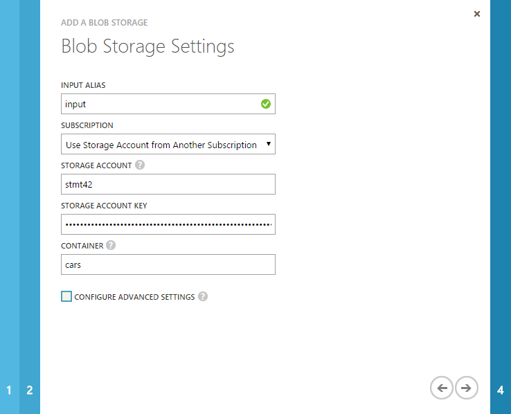
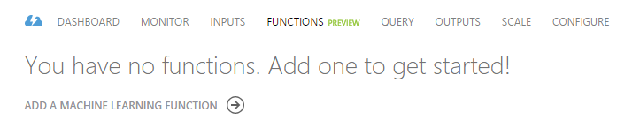
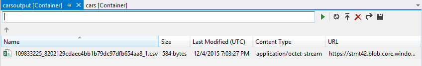

<properties 
	pageTitle="Tutorial: Azure Stream Analytics and Azure Machine Learning Integration | Microsoft Azure" 
	description="How to leverage UDF and machine learning in stream analytics jobs"
	keywords=""
	documentationCenter=""
	services="stream-analytics"
	authors="jeffstokes72" 
	manager="paulettm" 
	editor="cgronlun"
/>

<tags 
	ms.service="stream-analytics" 
	ms.devlang="na" 
	ms.topic="article" 
	ms.tgt_pltfrm="na" 
	ms.workload="data-services" 
	ms.date="12/10/2015" 
	ms.author="jeffstok"
/>

# Tutorial: Introduction to Stream Analytics and Machine Learning integration #

This tutorial is designed to help you quickly setup a simple Stream Analytics job with Machine Learning integration. We will leverage a Sentiment Analytics Machine Learning Model from Cortana Analytics Gallery to analyze streaming text data and get determine the sentiment score in real time. This is a good representative example for scenarios like real time sentiment analytics on streaming twitter data, customer chat with your support staff, comments on your forums/ blogs/videos and many real time predictive scoring scenarios like these.
  
  

In this tutorial a sample csv file with text (as shown in figure 1 below) is provided as input in the Azure Blob Store. The job will apply the Sentiment Analytics model as a user-defined function (UDF) on the sample text data from the blob store. The end result will place placed within the same Azure Blob Store in another csv file. Adiagram of this configuration is provided in figure 2 below). For a more realistic scenario this blob store input may be replaced with streaming twitter data from an Azure Event Hub input. Additionally a Power BI real-time visualization of the aggregate sentiment could be built. Future iterations of this article will include such extensions.

## Prerequisites

The prerequisites for this article are as follows:

1.	An active Azure subscription
2.	A CSV file with some data in it. The one in Figure 2 is provided here for download, or you may create your own. This tutorial is written with the assumption that the one provided for download is used.

At a high level, the following steps will be performed:

1.	Upload the CSV input file into Blob Storage
2.	Add a Sentiment Analytics model from Cortana Analytics Gallery to your Machine Learning workspace
3.	Deploy this model as a web service within the Azure Machine Learning workspace
4.	Create a Stream Analytics job which calls this web service as a function to determine sentiment for the text input
5.	Start the Stream Analytics job and observe the output 

## Upload the CSV input file to Blob Storage

For this step you can use any CSV file including the one specified in the introduction. To upload the file, [Azure Storage Explorer](http://storageexplorer.com/ "Azure Storage Explorer") or Visual Studio may be used as well as custom code. For this tutorial examples are provided for Visual Studio.

1.	Expand Azure and right click on the **Storage**. Choose **Attach External Storage** and provide **Account Name** and **Account Key**.  

      

2.	Expand the storage you just attached and choose **Create Blob Container** and provide a logical name. Once created, double click on the container to view its contents (which will be empty at this point).  

      

3.	Upload the CSV file by clicking the **Upload Blob** icon and then choose **file from the local disk**.  

      

## Add the Sentiment Analytics Model from Cortana Analytics Gallery

1.	Download the [predictive sentiment analytics model](https://gallery.cortanaanalytics.com/Experiment/Predictive-Mini-Twitter-sentiment-analysis-Experiment-1) in Cortana Analytics Gallery.  
2.	Click **Open** in the Studio:  

      

3.	Sign in to be taken to the workspace. Choose the location that best suits your location.
4.	Now click on **Run** at the bottom of the Studio  
5.	Once it runs successfully, click on **Deploy Web Service**.
6.	Now the sentiment analytics model is ready for use. To validate, click the **test** button and providing text input such as “I love Microsoft” and the test should return a similar result as shown below:

`'Predictive Mini Twitter sentiment analysis Experiment' test returned ["4","0.715057671070099"]...`  

      

Click on the **Excel 2010 or earlier** workbook link to get your API key and the URL that you’ll need later for setting up the Stream Analytics job. (This step is only required to leverage a machine learning model from another Azure account's workspace. This tutoraial assumes this is the case to address this scenario)  

      

Take note of the web service url and access key from the downloaded excel as shown below:  

      

## Create an Stream Analytics job which uses the machine learning model

1.	Navigate to the [Azure Management Portal](https://manage.windowsazure.com).  
2.	Click **New**, **Data Services**, **Stream Analytics** and **Quick Create**. Provide the **Job Name**, appropriate **Region** for the job and choose a **Regional Monitoring Storage Account**.  
3.	Once the job is created, navigate to the **Inputs** tab and click **Add Input**.  

      

4.	On the first page of Add Input wizard window select **Data stream** and click next. On the second page select **Blob Storage** as the input and click **next**.  
5.	On the left pane, select Data Transformation, Manipulation, Project Columns node and drag it onto the canvas. Connect Reader node with the Project Columns node.    

      

5.	Select Project Columns node to see its Properties on the right pane. Click Launch column selector button. You should see the dialog box shown below. Provide a single name of the column and click the OK button. In my case I chose the “Model” column from my CSV file.  

      

6.	On the left pane, expand Python Language Modules and drag Execute Python Script node to the canvas. Connect Project Columns node with Execute Python Script node.  
    Notice here that I connected Project Columns node to the first port of the three available input ports on the Execute Python Script.  

      

7.	Select newly placed Execute Python Script node to see its Properties on the right pane. Modify Python Script section as follows:  
    a.	Write import pandas right before the definition of the function  
    b.  Delete the body of the function completely and replace it with  
 		
		`return pandas.DataFrame(dataframe1['Model'].apply(lambda x: x + ' Hello World!')),`    
		
	The only thing you need to change here is the name of the column which we select from dataframe1. In this case I selected the “Model” column. Also, please pay attention of the indentation of the return statement.  

	c.	In the end this is how the script looks. 

      

8.	On the left pane, expand **Web Service** and drag the **Input node** on the canvas. Connect the **Input node** with the **Execute Python Script** node.  

      

9.	On the left pane, expand **Web Service** and drag **Output** on the canvas. Connect the **Output node** with **Execute Python Script** node.  

      

10.	Click Run button at the bottom  
	It might take up to a minute to run the entire model. You will see how individual nodes are run one after another.  
11.	Click Deploy Web Service button the bottom  
12.	Once the service is deployed you will be navigated to the Web Services tab where you should see the Test button. This step is optional is only needed to make sure that the service which just deployed does what it’s supposed to do. Click on the Test button and a dialog box will prompt you for a sample input. I typed in “foo bar” and pressed OK.  

      

	This is what I got the test run was complete. The result was “foo bar Hello World!”, exactly what we expected.  

      

13.	Before we can move on to creating an ASA job we will need to pieces of information, the endpoint URL of the web service that we just deployed and the API Key which we can use to authenticate requests to that endpoint.  
	a.	On the same page where we tested our endpoint there should be an API key field. Copy that API key and store it somewhere temporarily.  

      

	b.	Click on the Request/Response link.  

      

	You will be navigated to a helper page of you web service. Copy the Request URI property and store it temporarily.  

      

## Create an Stream Analytics job which uses the Machine Learning model

1.	Navigate to Azure Management Portal [https://manage.windowsazure.com](https://manage.windowsazure.com).
2.	Click **New**, **Data Services**, **Stream Analytics**, **Quick Create**. Provide **Job Name**, **Region** in which the job should be created and choose a **Regional Monitoring Storage Account**.
3.	Once the job is created, navigate to the **Inputs** tab and click **Add Input**.  

      

4.	On the first page of **Add Input** wizard window select **Data stream** and click next. On the second page select **Blob Storage** as an input and click next.
5.	On the **Blob Storage Settings** page of the wizard provide the same information we used when we were configuring the **Reader** in Machine Learning module. Click **next**.  

      

6.	Choose CSV as **Event Serialization Format**. Take the defaults for the rest of the **Serialization settings**. Click **OK**.
7.	Navigate to the **Outputs** tab and click **Add an Output**.  

      

8.	As with Output, choose **Blob Storage** and provide the same parameters with the exception of the container. In my case for example, my Input was configured to read from container called “cars”, that’s where I uploaded my CSV. For the Output I chose “carsoutput”.  

      

9.	Click **Next** to configure output’s **Serialization settings**. As with Input, choose **CSV** and click **OK**.
10.	Navigate to the **Functions** tab and click **Add a Machine Learning Function**.  

      

11.	On the **Machine Learning Web Service Settings** page, you should be able to find your Machine Learning workspace, web service and the default endpoint. However, you can always choose to provide settings manually and supply the endpoint **URL** and **API key** which was saved at the end of the **Create and Deploy Machine Learning Model** section. Once all the information has been provided, click **OK**.  

      

12.	Navigate to the **Query** tab and modify the query ash shown below:  
	`select Model, helloworld(Model) from input`  
	The query selects the first column to be the unmodified column from the **input**. The second column is modified by invoking the Machine Learning **model**. The value from the **input**, say “Toyota”, will be passed to the Machine Learning model and will return “Toyota Hello World!”. This process will continue for every record of the **input**.  
	Click *Save* to save the query.  

## Start the ASA Job and observe the output

1.	Click **Start** at the bottom of the job. 
2.	On the **Start Query Dialog**, choose **Custom Time** and select a time prior to when the CSV was uploaded to Blob Storage. Click **OK**.  

      

3.	Navigate to the Blob Storage using the tool used when the CSV file was uploaded. This tutorial used Visual Studio.
4.	In few minutes after the job is started, the output container is created and a CSV file uploaded into it. In our example, it was “carscontainer”.  

      

5.	Double clicking on the file will open the default CSV editor and should show something as below:  
	This step finalizes the exercise described in this article. 

      

## Conclusion

In this tutorial, an exercise of using a Machine Learning module was demonstrated as a function inside a Stream Analytics job. The processing power of Stream Analytics was extended by Machine Learning modules. Data was read from a Blob Storage, processed using a Machine Learning module, and outputted the result back into the same Blob Storage. 

Note:  
1.	The choice of the **Input** and **Output** was fairly basic. The **input** could have been Event Hub and the **output** Power BI as an example. Conceptually, there is no difference.  
2.	The same CSV was used as the **input** for a Stream Analytics job and as an **input** for a Machine Learning model. Again this is basic and chosen to demonstrate the concepts covered rather than a true "real world" scenario. The CSV in the Machine Learning module was only needed to define the model and to define the signature of the function. During the runtime of AML Web Service that CSV file and all the transformations that we performed (such as Project Columns) were not used. Hence, to define the AML model, a completely different CSV file with different schema and values could have been leveraged in a more advanced example.  

