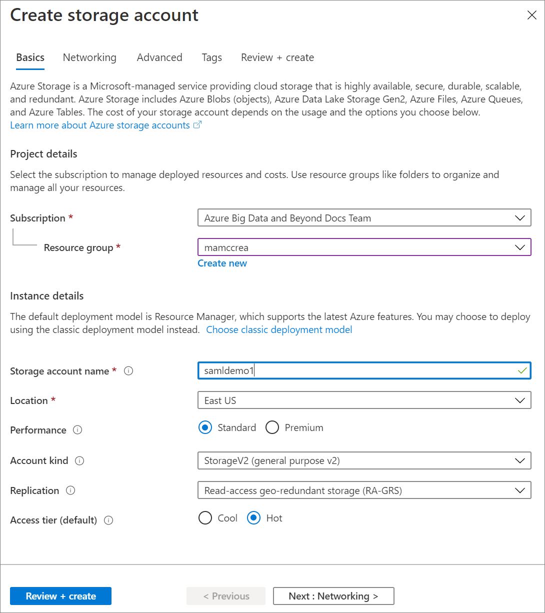
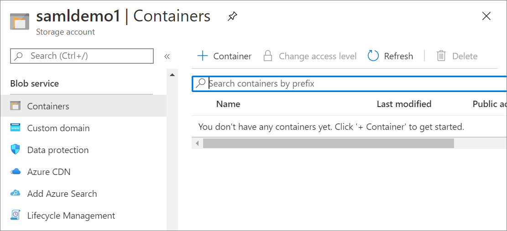
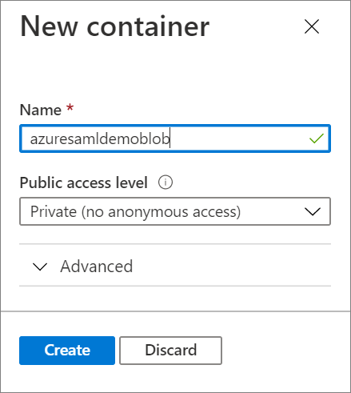
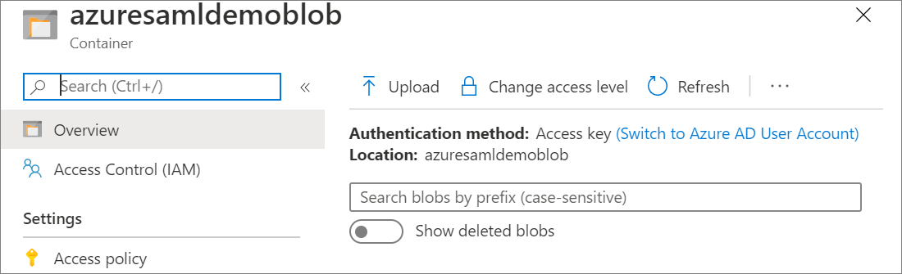
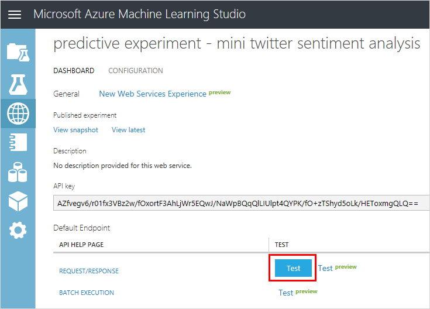
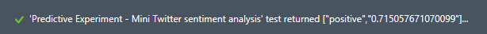
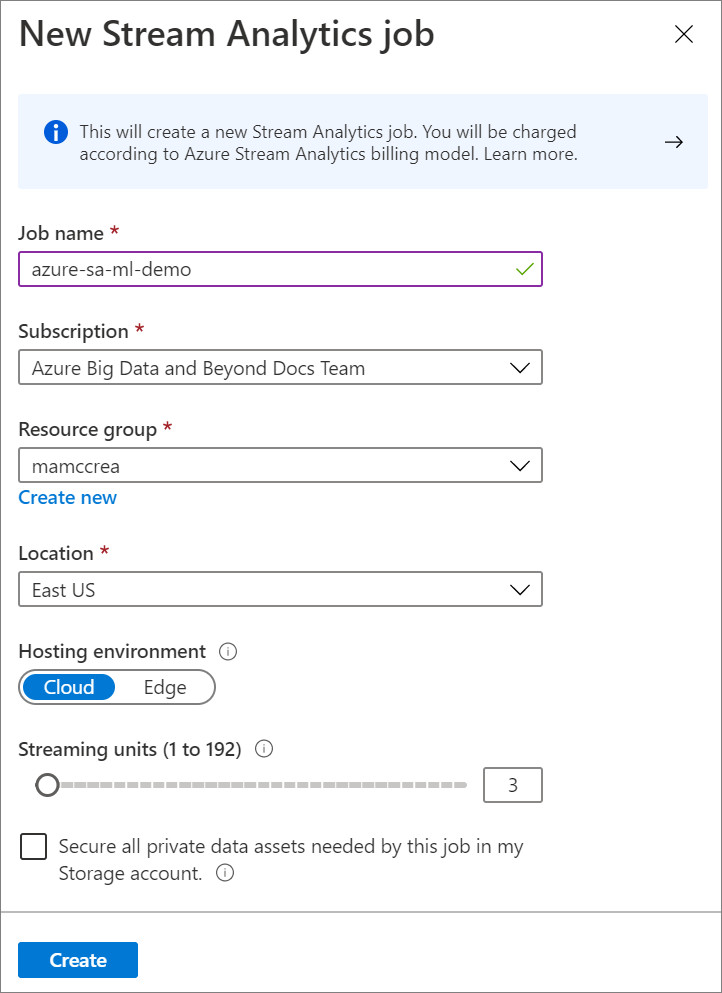
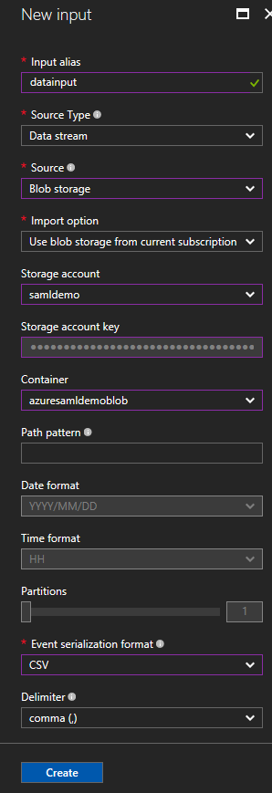
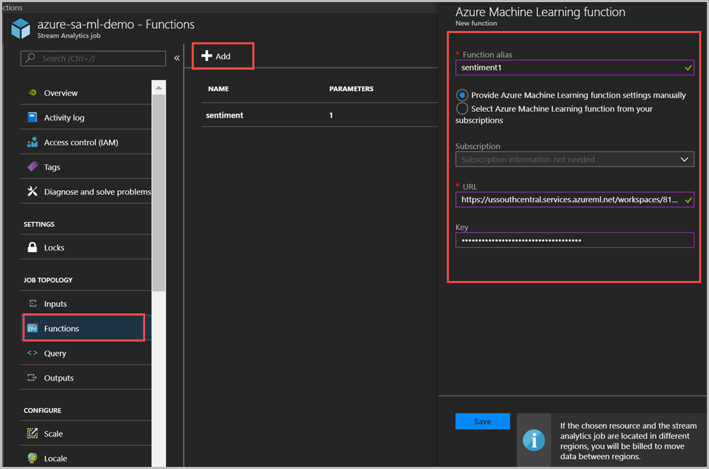
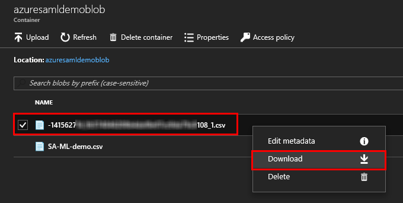

# Perform sentiment analysis with Azure Stream Analytics and Azure Machine Learning Studio (classic)

This article describes how to quickly set up a simple Azure Stream Analytics job that integrates Azure Machine Learning Studio (classic). You use a Machine Learning sentiment analytics model from the Cortana Intelligence Gallery to analyze streaming text data and determine the sentiment score in real time. Using the Cortana Intelligence Suite lets you accomplish this task without worrying about the intricacies of building a sentiment analytics model.

> [!TIP]
> It is highly recommended to use [Azure Machine Learning UDFs](machine-learning-udf.md) instead of Azure Machine Learning Studio (classic) UDF for improved performance and reliability.

You can apply what you learn from this article to scenarios such as these:

* Analyzing real-time sentiment on streaming Twitter data.
* Analyzing records of customer chats with support staff.
* Evaluating comments on forums, blogs, and videos. 
* Many other real-time, predictive scoring scenarios.

In a real-world scenario, you would get the data directly from a Twitter data stream. To simplify the tutorial, it's written so that the Streaming Analytics job gets tweets from a CSV file in Azure Blob storage. You can create your own CSV file, or you can use a sample CSV file, as shown in the following image:

  

The Streaming Analytics job that you create applies the sentiment analytics model as a user-defined function (UDF) on the sample text data from the blob store. The output (the result of the sentiment analysis) is written to the same blob store in a different CSV file. 

The following figure demonstrates this configuration. As noted, for a more realistic scenario, you can replace blob storage with streaming Twitter data from an Azure Event Hubs input. Additionally, you could build a [Microsoft Power BI](https://powerbi.microsoft.com/) real-time visualization of the aggregate sentiment.    

  

## Prerequisites
Before you start, make sure you have the following:

* An active Azure subscription.
* A CSV file with some data in it. You can download the file shown earlier from [GitHub](https://github.com/Azure/azure-stream-analytics/blob/master/Sample%20Data/sampleinput.csv), or you can create your own file. For this article, it is assumed that you're using the file from GitHub.

At a high level, to complete the tasks demonstrated in this article, you do the following:

1. Create an Azure storage account and a blob storage container, and upload a CSV-formatted input file to the container.
3. Add a sentiment analytics model from the Cortana Intelligence Gallery to your Azure Machine Learning Studio (classic) workspace and deploy this model as a web service in the Machine Learning workspace.
5. Create a Stream Analytics job that calls this web service as a function in order to determine sentiment for the text input.
6. Start the Stream Analytics job and check the output.

## Create a storage container and upload the CSV input file
For this step, you can use any CSV file, such as the one available from GitHub.

1. In the Azure portal, click **Create a resource** > **Storage** > **Storage account**.

2. Provide a name (`samldemo` in the example). The name can use only lowercase letters and numbers, and it must be unique across Azure. 

3. Specify an existing resource group and specify a location. For location, we recommend that all the resources created in this tutorial use the same location.

    

4. In the Azure portal, select the storage account. In the storage account blade, click **Containers** and then click **+&nbsp;Container** to create blob storage.

    

5. Provide a name for the container (`azuresamldemoblob` in the example) and verify that **Access type** is set to **Blob**. When you're done, click **OK**.

    

6. In the **Containers** blade, select the new container, which opens the blade for that container.

7. Click **Upload**.

    

8. In the **Upload blob** blade, upload the **sampleinput.csv** file that you downloaded earlier. For **Blob type**, select **Block blob** and set the block size to 4 MB, which is sufficient for this tutorial.

9. Click the **Upload** button at the bottom of the blade.

## Add the sentiment analytics model from the Cortana Intelligence Gallery

Now that the sample data is in a blob, you can enable the sentiment analysis model in Cortana Intelligence Gallery.

1. Go to the [predictive sentiment analytics model](https://gallery.cortanaintelligence.com/Experiment/Predictive-Mini-Twitter-sentiment-analysis-Experiment-1) page in the Cortana Intelligence Gallery.  

2. Click **Open in Studio**.  
   
     

3. Sign in to go to the workspace. Select a location.

4. Click **Run** at the bottom of the page. The process runs, which takes about a minute.

     

5. After the process has run successfully, select **Deploy Web Service** at the bottom of the page.

     

6. To validate that the sentiment analytics model is ready to use, click the **Test** button. Provide text input such as "I love Microsoft". 

     

    If the test works, you see a result similar to the following example:

     

7. In the **Apps** column, click the **Excel 2010 or earlier workbook** link to download an Excel workbook. The workbook contains the API key and the URL that you need later to set up the Stream Analytics job.

      


## Create a Stream Analytics job that uses the Machine Learning model

You can now create a Stream Analytics job that reads the sample tweets from the CSV file in blob storage. 

### Create the job

1. Go to the [Azure portal](https://portal.azure.com).  

2. Click **Create a resource** > **Internet of Things** > **Stream Analytics job**. 

3. Name the job `azure-sa-ml-demo`, specify a subscription, specify an existing resource group or create a new one, and select the location for the job.

   
   

### Configure the job input
The job gets its input from the CSV file that you uploaded earlier to blob storage.

1. After the job has been created, under **Job Topology** in the job blade, click the **Inputs** option.    

2. In the **Inputs** blade, click **Add Stream Input** >**Blob storage**

3. Fill out the **Blob Storage** blade with these values:

   
   |Field  |Value  |
   |---------|---------|
   |**Input alias** | Use the name `datainput` and select **Select blob storage from your subscription**       |
   |**Storage account**  |  Select the storage account you created earlier.  |
   |**Container**  | Select the container you created earlier (`azuresamldemoblob`)        |
   |**Event serialization format**  |  Select **CSV**       |

   

1. Click **Save**.

### Configure the job output
The job sends results to the same blob storage where it gets input. 

1. Under **Job Topology** in the job blade, click the **Outputs** option.  

2. In the **Outputs** blade, click **Add** >**Blob storage**, and then add an output with the alias `datamloutput`. 

3. Fill out the **Blob Storage** blade with these values:

   |Field  |Value  |
   |---------|---------|
   |**Output alias** | Use the name `datamloutput` and select **Select blob storage from your subscription**       |
   |**Storage account**  |  Select the storage account you created earlier.  |
   |**Container**  | Select the container you created earlier (`azuresamldemoblob`)        |
   |**Event serialization format**  |  Select **CSV**       |

    

4. Click **Save**.   


### Add the Machine Learning function 
Earlier you published a Machine Learning model to a web service. In this scenario, when the Stream Analysis job runs, it sends each sample tweet from the input to the web service for sentiment analysis. The Machine Learning web service returns a sentiment (`positive`, `neutral`, or `negative`) and a probability of the tweet being positive. 

In this section of the tutorial, you define a function in the Stream Analysis job. The function can be invoked to send a tweet to the web service and get the response back. 

1. Make sure you have the web service URL and API key that you downloaded earlier in the Excel workbook.

2. Navigate to your job blade > **Functions** > **+ Add** > **AzureML**

3. Fill out the **Azure Machine Learning function** blade with these values:

   |Field  |Value  |
   |---------|---------|
   | **Function alias** | Use the name `sentiment` and select **Provide Azure Machine Learning function settings manually** which gives you an option to enter the URL and key.      |
   | **URL**| Paste the web service URL.|
   |**Key** | Paste the API key. |
  
     
    
4. Click **Save**.

### Create a query to transform the data

Stream Analytics uses a declarative, SQL-based query to examine the input and process it. In this section, you create a query that reads each tweet from input and then invokes the Machine Learning function to perform sentiment analysis. The query then sends the result to the output that you defined (blob storage).

1. Return to the job overview blade.

2.  Under **Job Topology**, click the **Query** box.

3. Enter the following query:

    ```SQL
    WITH sentiment AS (  
    SELECT text, sentiment1(text) as result 
    FROM datainput  
    )  

    SELECT text, result.[Score]  
    INTO datamloutput
    FROM sentiment  
    ```    

    The query invokes the function you created earlier (`sentiment`) in order to perform sentiment analysis on each tweet in the input. 

4. Click **Save** to save the query.


## Start the Stream Analytics job and check the output

You can now start the Stream Analytics job.

### Start the job
1. Return to the job overview blade.

2. Click **Start** at the top of the blade.

3. In the **Start job**, select **Custom**, and then select one day prior to when you uploaded the CSV file to blob storage. When you're done, click **Start**.  


### Check the output
1. Let the job run for a few minutes until you see activity in the **Monitoring** box. 

2. If you have a tool that you normally use to examine the contents of blob storage, use that tool to examine the `azuresamldemoblob` container. Alternatively, do the following steps in the Azure portal:

    1. In the portal, find the `samldemo` storage account, and within the account, find the `azuresamldemoblob` container. You see two files in the container: the file that contains the sample tweets and a CSV file generated by the Stream Analytics job.
    2. Right-click the generated file and then select **Download**. 

     

3. Open the generated CSV file. You see something like the following example:  
   
     


### View metrics
You also can view Azure Machine Learning function-related metrics. The following function-related metrics are displayed in the **Monitoring** box in the job blade:

* **Function Requests** indicates the number of requests sent to a Machine Learning web service.  
* **Function Events** indicates the number of events in the request. By default, each request to a Machine Learning web service contains up to 1,000 events.  


## Next steps

* [Introduction to Azure Stream Analytics](stream-analytics-introduction.md)
* [Azure Stream Analytics Query Language Reference](https://docs.microsoft.com/stream-analytics-query/stream-analytics-query-language-reference)
* [Integrate REST API and Machine Learning](stream-analytics-how-to-configure-azure-machine-learning-endpoints-in-stream-analytics.md)
* [Azure Stream Analytics Management REST API Reference](https://msdn.microsoft.com/library/azure/dn835031.aspx)


