<properties 
	pageTitle="Tutorial: Sentiment Analysis Using Azure Stream Analytics and Azure Machine Learning | Microsoft Azure" 
	description="How to leverage UDF and machine learning in stream analytics jobs"
	keywords=""
	documentationCenter=""
	services="stream-analytics"
	authors="jeffstokes72" 
	manager="paulettm" 
	editor="cgronlun"
/>

<tags 
	ms.service="stream-analytics" 
	ms.devlang="na" 
	ms.topic="article" 
	ms.tgt_pltfrm="na" 
	ms.workload="data-services" 
	ms.date="07/27/2016" 
	ms.author="jeffstok"
/> 

# Tutorial: Perform sentiment analysis using Stream Analytics and Machine Learning #

This tutorial is designed to help you quickly setup a simple Stream Analytics job with Machine Learning integration. We will leverage a Sentiment Analytics Machine Learning Model from Cortana Intelligence Gallery to analyze streaming text data and get determine the sentiment score in real time. This is a good tutorial to understand scenarios such as real time sentiment analytics on streaming twitter data, customer chat record analysis with support staff, comments on forums/blogs/videos and many other real-time predictive scoring scenarios.
  
In this tutorial a sample CSV file with text (as shown in figure 1 below) is provided as input in the Azure Blob Store. The job will apply the Sentiment Analytics model as a user-defined function (UDF) on the sample text data from the blob store. The end result will place placed within the same Azure Blob Store in another CSV file. A diagram of this configuration is provided in figure 2 below). For a more realistic scenario this blob store input may be replaced with streaming twitter data from an Azure Event Hub input. Additionally a [Power BI](https://powerbi.microsoft.com/) real-time visualization of the aggregate sentiment could be built. Future iterations of this article will include such extensions.

Figure 1:  

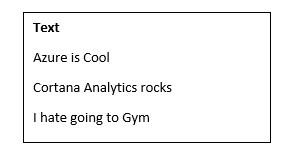  

Figure 2:    

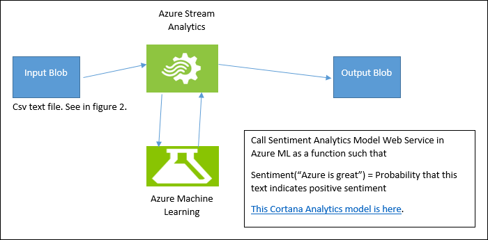  

## Prerequisites

The prerequisites for this article are as follows:

1.	An active Azure subscription
2.	A CSV file with some data in it. The one in Figure 2 is provided [in GitHub](https://github.com/jeffstokes72/azure-stream-analytics-repository/blob/master/sampleinputs.csv) for download, or you may create your own. This tutorial is written with the assumption that the one provided for download is used.

At a high level, the following steps will be performed:

1.	Upload the CSV input file into Blob Storage
2.	Add a Sentiment Analytics model from Cortana Intelligence Gallery to your Machine Learning workspace
3.	Deploy this model as a web service within the Azure Machine Learning workspace
4.	Create a Stream Analytics job which calls this web service as a function to determine sentiment for the text input
5.	Start the Stream Analytics job and observe the output 


## Upload the CSV input file to Blob Storage

For this step you can use any CSV file including the one specified in the introduction. To upload the file, [Azure Storage Explorer](http://storageexplorer.com/) or Visual Studio may be used as well as custom code. For this tutorial examples are provided for Visual Studio.

1.	Expand Azure and right click on the **Storage**. Choose **Attach External Storage** and provide **Account Name** and **Account Key**.  

    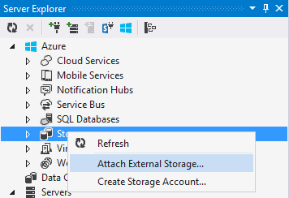  

2.	Expand the storage you just attached and choose **Create Blob Container** and provide a logical name. Once created, double click on the container to view its contents (which will be empty at this point).  

    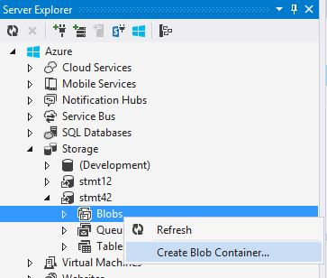  

3.	Upload the CSV file by clicking the **Upload Blob** icon and then choose **file from the local disk**.  

## Add the Sentiment Analytics Model from Cortana Intelligence Gallery

1.	Download the [predictive sentiment analytics model](https://gallery.cortanaintelligence.com/Experiment/Predictive-Mini-Twitter-sentiment-analysis-Experiment-1) in Cortana Intelligence Gallery.  
2.	Click **Open** in the Studio:  

    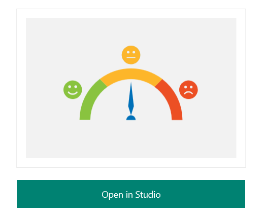  

3.	Sign in to be taken to the workspace. Choose the location that best suits your location.
4.	Now click on **Run** at the bottom of the Studio  
5.	Once it runs successfully, click on **Deploy Web Service**.
6.	Now the sentiment analytics model is ready for use. To validate, click the **test** button and providing text input such as “I love Microsoft” and the test should return a similar result as shown below:

`'Predictive Mini Twitter sentiment analysis Experiment' test returned ["4","0.715057671070099"]...`  

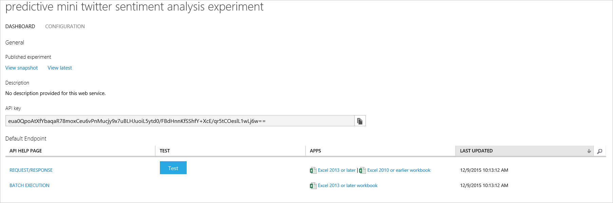  

Click on the **Excel 2010 or earlier** workbook link to get your API key and the URL that you’ll need later for setting up the Stream Analytics job. (This step is only required to leverage a machine learning model from another Azure account's workspace. This tutorial assumes this is the case to address this scenario)  

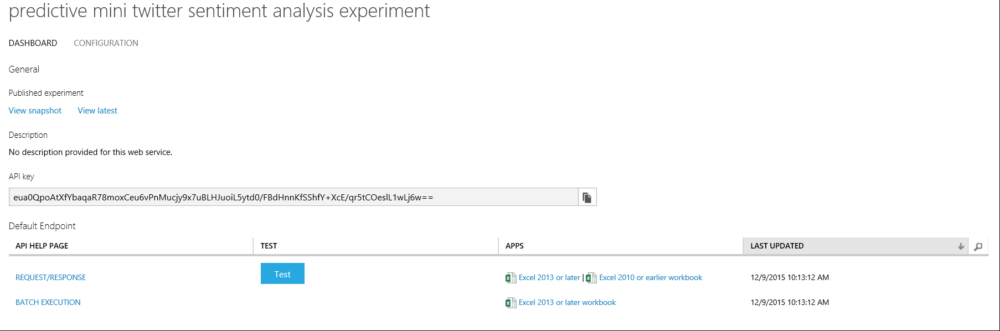  

Take note of the web service URL and access key from the downloaded excel as shown below:  

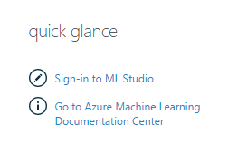  

## Create an Stream Analytics job which uses the machine learning model

1.	Navigate to the [Azure Management Portal](https://manage.windowsazure.com).  
2.	Click **New**, **Data Services**, **Stream Analytics** and **Quick Create**. Provide the **Job Name**, appropriate **Region** for the job and choose a **Regional Monitoring Storage Account**.    
3.	Once the job is created, navigate to the **Inputs** tab and click **Add Input**.  

    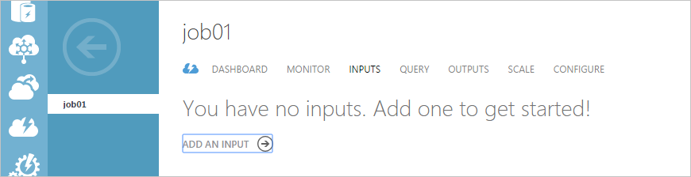  

4.	On the first page of **Add Input** wizard window select **Data stream** and click next. On the second page select **Blob Storage** as the input and click **next**.  
5.	On the **Blob Storage Settings** page of the wizard provide the storage account blob container name defined earlier when the data was uploaded. Click **next**. Choose **CSV** as **Event Serialization Format**. Accept the defaults for the rest of the **Serialization settings**. Click **OK**.  
6.	Navigate to the **Outputs** tab and click **Add an Output**.  

      

7.	Choose **Blob Storage** and provide the same parameters with the exception of the container. The **Input** was configured to read from the container named “test” where the **CSV** file was uploaded. For the **Output**, put “testoutput”. The container names need to be different, and verify this container exists.     
8.	Click **Next** to configure output’s **Serialization settings**. As with Input, choose **CSV** and click the **OK** button.
9.	Navigate to **Functions** tab and click **Add a Machine Learning Function**.  

    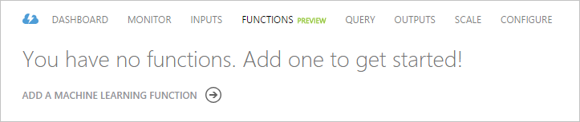  

10.	On the **Machine Learning Web Service Settings** page, locate the Machine Learning workspace, web service and the default endpoint. For this tutorial, apply the settings manually to gain familiarity with configuring a web service for any workspace as long as you know the URL and you have the KEY. Supply the endpoint **URL** and **API key**. Then click **OK**.    

    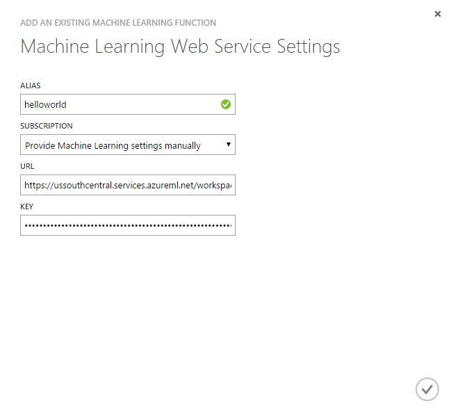    

11.	Navigate to **Query** tab and modify the query as below:    

```
	WITH subquery AS (  
		SELECT text, sentiment(text) as result from input  
	)  
	  
	Select text, result.[Score]  
	Into output  
	From subquery  
```    

Then simply click **Save** to save the query.

## Start the Stream Analytics Job and observe the output

1.	Click **Start** at the bottom of the job. 
2.	On the **Start Query Dialog**, choose **Custom Time** and select a time prior to when the CSV was uploaded to Blob Storage. Click **OK**.  

    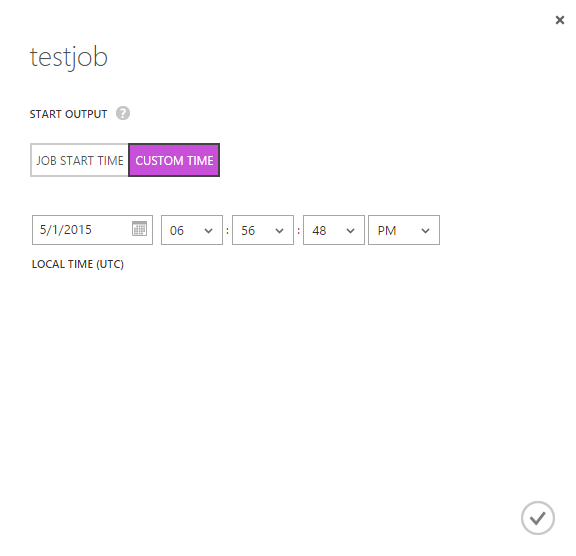  

3.	Navigate to the Blob Storage using the tool used when the CSV file was uploaded. This tutorial used Visual Studio.
4.	In few minutes after the job is started, the output container is created and a CSV file uploaded into it.  
5.	Double clicking on the file will open the default CSV editor and should show something as below:  

    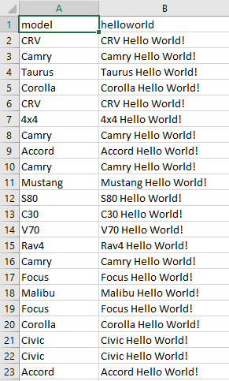  

## Conclusion

In this tutorial, a Stream Analytics job was created that reads streaming text data and applying sentiment analytics on it in real time. You were able to do all this without having to worry about intricacies of building a Sentiment Analytics model. This is one of the advantages of the Cortana Intelligence suite.

The Azure Machine Learning function related metrics are also able to be observed.  Click on the **MONITOR** tab. Three function related metrics are present.  
  
- FUNCTION REQUESTS indicates the number of requests to machine learning web service.  
- FUNCTION EVENTS indicates the number of events in the request – By default, each request to ML web service contains up to 1000 events.  
- FAILED FUNCTION REQUESTS indicates number of failed requests to machine learning web service.  

    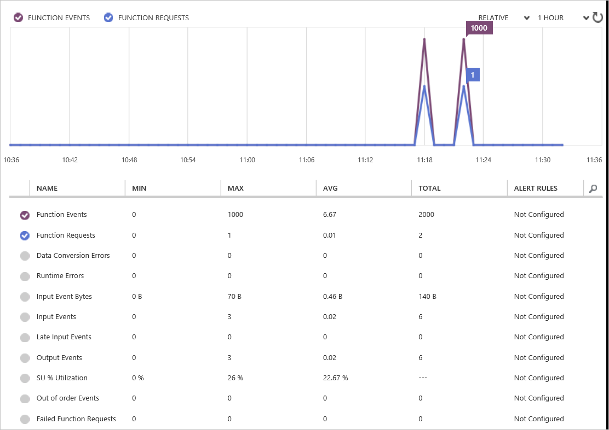  
