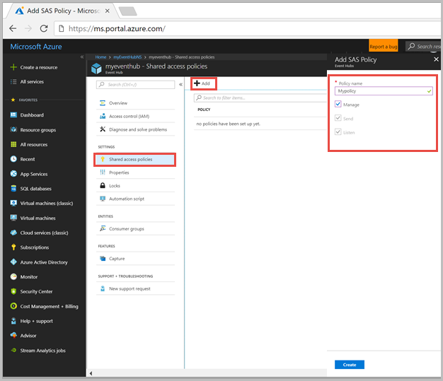
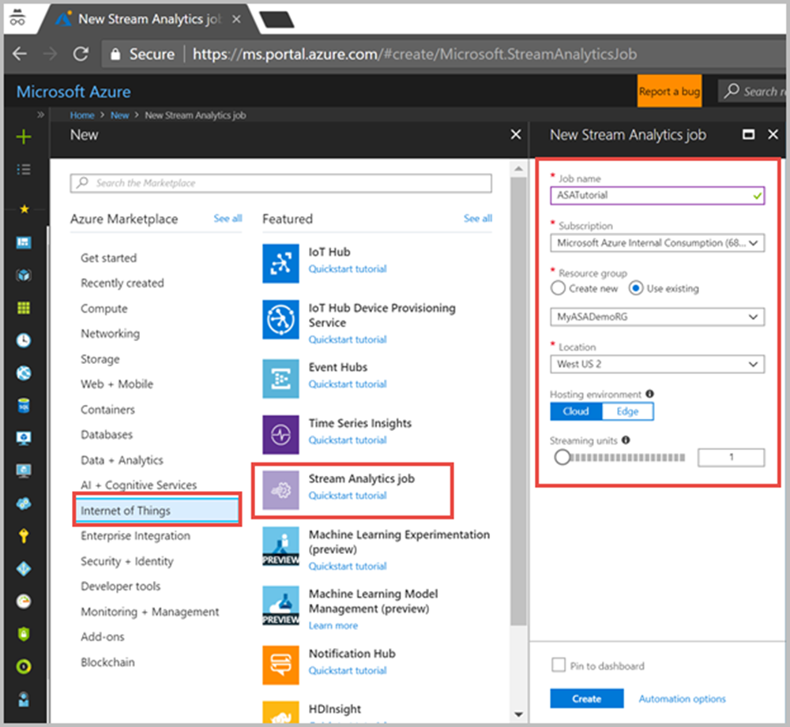
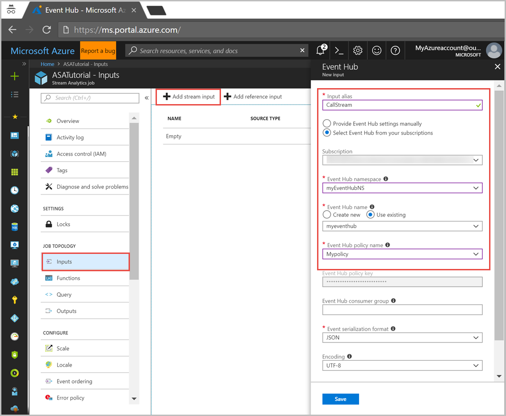
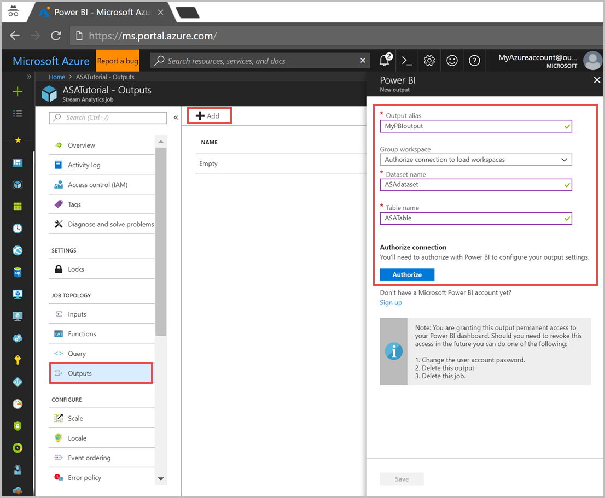
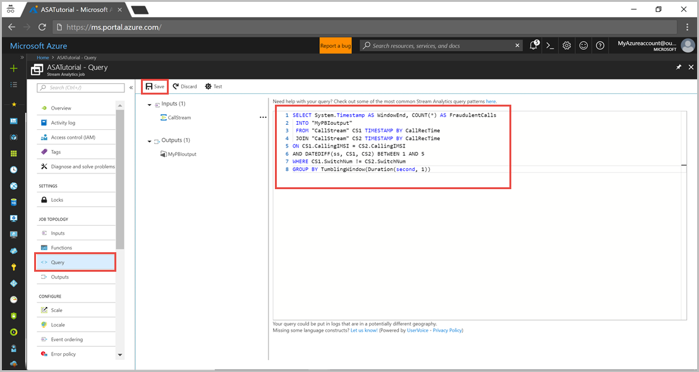
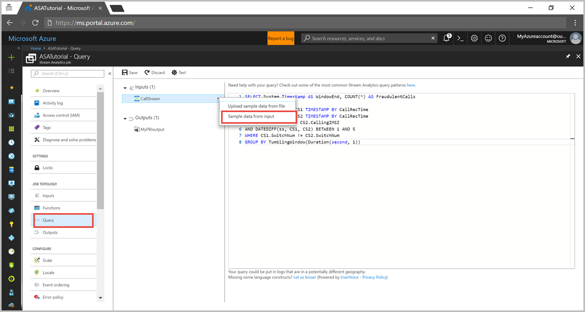
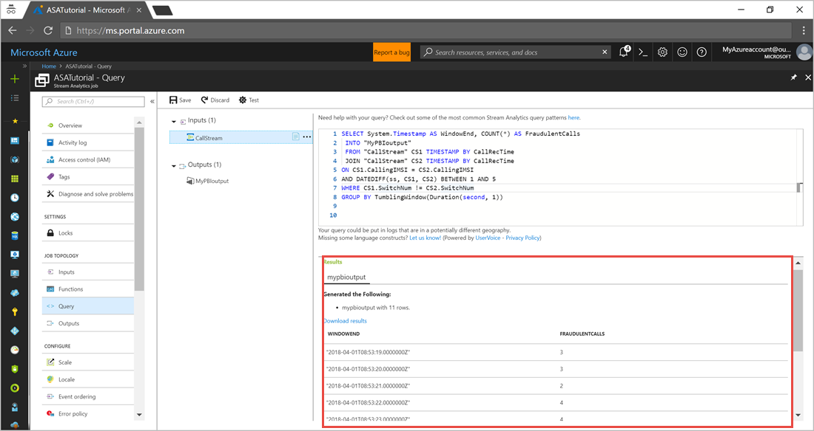

# Create and manage a Stream Analytics job by using Azure portal

This tutorial provides an end-to-end illustration of how to use Azure Stream Analytics. In this tutorial, you will use the example of phone-call data generated by using a client application. Some of the records that the application produces look like fraudulent calls, we will filter such calls by using the Stream Analytics job.

In this tutorial, you learn how to:

In this tutorial, you learn how to:

> [!div class="checklist"]
> * Create an Azure Event Hub  
> * Send phone call data to Azure Event Hub  
> * Create a Stream Analytics job   
> * Configure Event Hub as input 
> * Configure Power BI as output   
> * Define query to filter fraudulent calls  
> * Test the job with sample data  
> * Start the job  
> * Visualize results in Power BI & Embed the them in a web application

## Prerequisites

Before you start, make sure you have the following:

* If you don't have an Azure subscription, create a [free account](https://azure.microsoft.com/free/).  
* Log in to the [Azure portal](https://portal.azure.com/).  
* The call-event generator app [TelcoGenerator.zip](http://download.microsoft.com/download/8/B/D/8BD50991-8D54-4F59-AB83-3354B69C8A7E/TelcoGenerator.zip) file, which you can download from the Microsoft Download Center or you can get the source code from [GitHub](https://aka.ms/azure-stream-analytics-telcogenerator).  

## Create an Azure event hub 

Before Stream Analytics can analyze the fraudulent calls data stream, you should send the data to Azure. You will send data to Azure by using  [Azure Event Hubs](https://docs.microsoft.com/azure/event-hubs/event-hubs-what-is-event-hubs). For this tutorial, you create an event hub and make the event generator app send call data to that event hub. Run the following steps to create an event hub:

1. Log in to the Azure portal and click **Create a resource** > **Internet of Things** > **Event Hub**.  
2. Fill out the **Create namespace** blade with the following values:  

   |**Setting**  |**Suggested value** |**Description**  |
   |---------|---------|---------|
   |Name     | myEventHubNS        |  A unique name to identify the event hub namespace.       |
   |Subscription     |   <Your subscription>      |   Select an Azure subscription where you want to create the event hub.      |
   |Resource group     |   MyASADemoRG      |  Select Create New and enter a new resource-group name for your account.       |
   |Location     |   West US2      |    Location where the event hub namespace can be deployed.     |

3. You can leave other options to their default values and click **Create**.  

   

4. When the namespace has finished deploying, find the event hub namespace in your list of Azure resources.  
5. Click the new namespace, and in the namespace pane, click **Event Hub**.  
6. Name the new event hub “MyEventHub”. You can use a different name. leave other options to their default values and then click **Create**.

### Grant access to the event hub and get a connection string

Before an application can send data to event hub, the event hub must have a policy that allows appropriate access. The access policy produces a connection string that includes authorization information.

1. Navigate to the **Event Hubs** you created in the previous step that is “MyEventHub” > click **Shared access policies** from the event hub pane > click **+Add**.  
2. Set the Policy name to “Mypolicy” > and select **Manage** > click **Create**.  

   

3. After the policy has been deployed > click to open the policy > find the **Connection string–primary key** and click the copy button next to the connection string.  
4. Paste the connection string into a text editor. You need this connection string in the next section.  

   The connection string looks like this:

   `Endpoint=sb://<Your event hub namespace>.servicebus.windows.net/;SharedAccessKeyName=<Your shared access policy name>;SharedAccessKey=<generated key>;EntityPath=<Your event hub name>` 

   Notice that the connection string contains multiple key-value pairs, separated with semicolons: Endpoint, SharedAccessKeyName, SharedAccessKey, and EntityPath.  

5. In the editor where you copied the connection string, make a note of the **EntityPath** value, and then remove the EntityPath pair from the above connection string (don't forget to remove the semicolon that precedes it).

## Start the event generator application

Before you start the TelcoGenerator app, you should configure it to send data to the event hub you created earlier.

1. Extract the contents of [TelcoGenerator.zip](http://download.microsoft.com/download/8/B/D/8BD50991-8D54-4F59-AB83-3354B69C8A7E/TelcoGenerator.zip) file open the `TelcoGenerator\TelcoGenerator\telcodatagen.exe.config` file in a text editor of your choice (There is more than one .config file, so be sure that you open the right one.)  

2. Update the <appSettings> element in the config file with the following details:

   * Set the value of the EventHubName key to the value of the EntityPath in the connection string.  
   * Set the value of the Microsoft.ServiceBus.ConnectionString key to the connection string without the EntityPath value that is the value you got from step 5 in the previous section.

3. Save the file.  
4. Next open a command window and change to the folder where you have is unzipped the TelcoGenerator application and enter the following command:

   `telcodatagen.exe 1000 .2 2`

   This command takes the following parameters:
   * **Number of call data records per hour**.  
   * **Percentage of fraud Probability** - that is how often, the app should simulate a fraudulent call. The value .2 means that about 20% of the call records will look fraudulent.  
   * **Duration in hours** - the number of hours that the app should run. You can also stop the app any time by ending the process (Ctrl+C) at the command line.

After a few seconds, the app starts displaying phone call records on the screen as it sends them to the event hub. The phone call data contains the following fields:


|Record  |Definition  |
|---------|---------|
|CallrecTime    |  The timestamp for the call start time.       |
|SwitchNum     |  The telephone switch used to connect the call. For this example, the switches are strings that represent the country of origin (US, China, UK, Germany, or Australia).       |
|CallingNum     |  The phone number of the caller.       |
|CallingIMSI     |  The International Mobile Subscriber Identity (IMSI). This is the Unique identifier of the caller.       |
|CalledNum     |   The phone number of the call recipient.      |
|CalledIMSI     |  International Mobile Subscriber Identity (IMSI). This is the unique identifier of the call recipient.       |

## Create a Stream Analytics job 

Now that you have a stream of call events, you can create a Stream Analytics job that reads data from the event hub.

1. To create a Stream Analytics job, navigate to the Azure portal > click **Create a resource** > **Internet of Things** > **Stream Analytics job**.  
2. Fill out the **New Stream Analytics job** blade with the following values: 

   |**Setting**  |**Suggested value**  |**Description**  |
   |---------|---------|---------|
   |Job name     |  ASATutorial       |   A unique name to identify the event hub namespace.      |
   |Subscription    |  <Your subscription>       |   Select an Azure subscription where you want to create the job.       |
   |Resource group   |   MyASADemoRG      |   Select Use existing and enter a new resource-group name for your account.      |
   |Location   |    West US2     |   	Location where the job can be deployed. It's recommended to place the job and the event hub in the same region for best performance and so that you don't pay to transfer data between regions.      |
   |Hosting environment    | Cloud        |     Stream Analytics jobs can be deployed to cloud or edge. Cloud allows you to deploy to Azure Cloud, and Edge allows you to deploy to an IoT edge device.    |
   |Streaming units     |    1	     |   	Streaming units represent the computing resources that are required to execute a job. By default, this value is set to 1. To learn about scaling streaming units, refer to [understanding and adjusting streaming units](stream-analytics-streaming-unit-consumption.md) article.      |

      

3. You can leave other options to their default values and click Create.

## Configure job input

1. From the Azure portal open **All resources** pane, find and select the ASATutorial Stream Analytics job.  
2. In the **Job Topology** section of the Stream Analytics job pane, click the **Inputs** option.  
3. Click **+ Add stream input** (Reference input refers to static lookup data, which you won't use in this tutorial) > **Event hub** and then fill out the pane with the following values:  

   |**Setting**  |**Suggested value**  |**Description**  |
   |---------|---------|---------|
   |Input alias     |  CallStream       |  Provide a friendly name to identify your input. Input alias can contain alphanumeric characters, hyphens, and underscores only and must be 3-63 characters long.       |
   |Subscription    |   <Your subscription>      |   Select the Azure subscription where you created the event hub. The event hub can be in same or a different subscription as the Stream Analytics job.       |
   |Event hub namespace    |  MyEventHubNS       |  Select the event hub namespace you created in the previous section. All the event hub namespaces available in your current subscription are listed in the dropdown.       |
   |Event Hub name    |   MyEventHub      |  Select the event hub you created in the previous section. All the event hubs available in your current subscription are listed in the dropdown.       |
   |Event Hub policy name   |  Mypolicy       |  Select the event hub shared access policy you created in the previous section. All the event hubs policies available in your current subscription are listed in the dropdown.       |

    

4. You can leave other options to their default values and click Create.

## Configure job output 

The last step is to define an output sink for the job where it can write the transformed data. For this tutorial, you'll output results to Power BI and visualize the date. Run the following steps to configure output to your job:

1. From the Azure portal open **All resources** pane, find and select the ASATutorial Stream Analytics job.
2. In the **Job Topology** section of the Stream Analytics job pane, click the **Outputs** option.
3. Click **+Add** > **Power BI** and fill the form with the following details and click **Authorize**:


   |**Setting**  |**Suggested value**  |**Description**  |
   |---------|---------|---------|
   |Output alias     |  MyPBIoutput       |    Provide a friendly name to identify your output.     |
   |Dataset name    |   ASAdataset      |    Provide a friendly name to identify the dataset.     |
   |Table name |  ASATable       |    Provide a friendly name to identify the table.     |

    

   After you click on **Authorize**, A pop-up window opens, and you are asked to provide credentials to authenticate to your Power BI account. Once the authorization is successful, **Save** the settings. 

## Define a query to analyze input data

After you have a Stream Analytics job setup to read an incoming data stream, the next step is to create a transformation that analyzes data in real time. You define the transformation query by using [Stream Analytics Query Language](https://msdn.microsoft.com/library/dn834998.aspx). In this tutorial, you define a query that detects fraud calls from the phone data. 

For this example, we consider fraudulent calls are the ones that originate from the same user but in separate locations and the duration between both calls is 5 seconds. For example, the same user can't legitimately make a call from the US and Australia at the same time.

To check for such fraudulent calls, you should self-join the streaming data based on the `CallRecTime` value. You can then look for call records where the `CallingIMSI` value (the originating number) is the same, but the `SwitchNum` value (country of origin) is different. When you use a JOIN operation with streaming data, the join must provide some limits on how far the matching rows can be separated in time. As the streaming data is endless, the time bounds for the relationship are specified within the ONclause of the join, using the [DATEDIFF](https://msdn.microsoft.com/azure/stream-analytics/reference/datediff-azure-stream-analytics) function. To define the transformation query for your Stream Analytics job, run the following steps:

1. From the Azure portal open **All resources** pane, find and select the ASATutorial Stream Analytics job.  
2. In the **Job Topology** section of the Stream Analytics job pane, click the **Query** option. The pop-up window lists the inputs and outputs that are configured for the job, and lets you create a query to transform the input stream.  
3. Next replace the existing query in the editor with the following data, this query performs a self-join on a 5-second interval worth of call data:

```sql
    SELECT System.Timestamp AS WindowEnd, COUNT(*) AS FraudulentCalls
    INTO "MyPBIoutput"
    FROM "CallStream" CS1 TIMESTAMP BY CallRecTime
    JOIN "CallStream" CS2 TIMESTAMP BY CallRecTime
    ON CS1.CallingIMSI = CS2.CallingIMSI
    AND DATEDIFF(ss, CS1, CS2) BETWEEN 1 AND 5
    WHERE CS1.SwitchNum != CS2.SwitchNum
    GROUP BY TumblingWindow(Duration(second, 1))
 ```
    This query is just like a normal SQL join except for the DATEDIFF function. The DATEDIFF function used in this query is specific to Streaming Analytics, and it must appear within the `ON...BETWEEN` clause.  
4. Save the query. 
    

## Test your query

You can test a query from the query editor and you need sample data to test a query. For this walkthrough, you'll extract sample data from the phone call stream that's coming into the event hub. Run the following steps to test the query:

1. Make sure that the TelcoGenerator app is running and producing phone call records.  
2. In the **Query** pane, click the dots next to the CallStream input and then select **Sample data from input**. This opens a pane that lets you specify how much sample data to read from the input stream.  
   

3. Set **Minutes to 3** and click **OK**. 3 minutes’ worth of data is sampled from the input stream and notifies you when the sample data is ready. You can view the status of sampling from the notification bar. 
The sample data is stored temporarily and is available while you have the query window open. If you close the query window, the sample data is discarded, and you'll have to create a new set of sample data. As an alternative, you can get a .json file that has sample data in it from [GitHub](https://github.com/Azure/azure-stream-analytics/blob/master/Sample Data/telco.json), and then upload that .json file to use as sample data for the CallStream input.  
4. Click **Test** to test the query, you should output resulted from the sample data as shown in this screenshot:
   

## Start the job and visualize output

1. To start the job, navigate to the **Overview** pane of your job, and click **Start**. The job starts in few minutes and you can view the status in the notification bar.  
2. Go to [Powerbi.com](https://powerbi.com/) and sign in with your work or school account. If the Stream Analytics job query outputs results, you see that your dataset is already created. Navigate to the **Datasets** tab, you can view a dataset named “ASAdataset”.  
3. From your workspace, click **+Create**. Create a new dashboard and name it Fraudulent Calls. You will add two tiles to this dashboard, where one tile is used to view the count of fraudulent calls at a given instance and the other tile has a line chart visualization.  
4. At the top of the window, click **Add tile** > and select **Custom Streaming Data** > Next > choose the **ASAdataset** > for Visualization type select **Card** > and Fields as fraudulentcalls. Click **Next** > enter a name for the tile click **Apply**.  

   

5. Follow the steps 4 again, with the following options:
   * When you get to Visualization Type, select Line chart.  
   * Add an axis and select **windowend**.  
   * Add a value and select **fraudulentcalls**.  
   * For **Time window to display**, select the last 10 minutes.  
6. Your dashboard looks as following screenshot after both tiles are added. You'll notice that, if your Event Hub sender application and Streaming Analytics application are running, your PowerBI dashboard periodically updates as new data arrives. 
   

## Embedding your PowerBI Dashboard in a Web Application

For this part of the demo, you'll use a sample [ASP.NET](http://asp.net/)  Web application created by the PowerBI team to embed your dashboard. For more information, about embedding dashboards, refer to [embedding with Power BI](https://docs.microsoft.com/power-bi/developer/embedding) topic.

In this tutorial, we'll follow the steps for the User Owns Data application. To setup the application, go to the [PowerBI-Developer-Samples](https://github.com/Microsoft/PowerBI-Developer-Samples)  Github repository and follow the instructions under the **User Owns Data** section (use the redirect and homepage URLs under the **integrate-dashboard-web-app** subsection). Since we are using the Dashboard example, use the integrate-dashboard-web-app sample code (located in `$\User Owns Data\integrate-dashboard-web-app`).
Once you've got the application running in your browser, follow these steps to embed the dashboard you created earlier into the web page:

1. Click **Sign in to Power BI**. This grants the application access to the dashboards in your PowerBI account.  
2. Click the **Get Dashboards** button. This will display your account's Dashboards in a table. Find the name of the dashboard you created earlier (powerbi-embedded-dashboard) and copy the corresponding **EmbedUrl**.  
3. Finally, paste the **EmbedUrl** into the corresponding text field and click **Embed Dashboard**. You can now view the same dashboard embedded within a web application.
