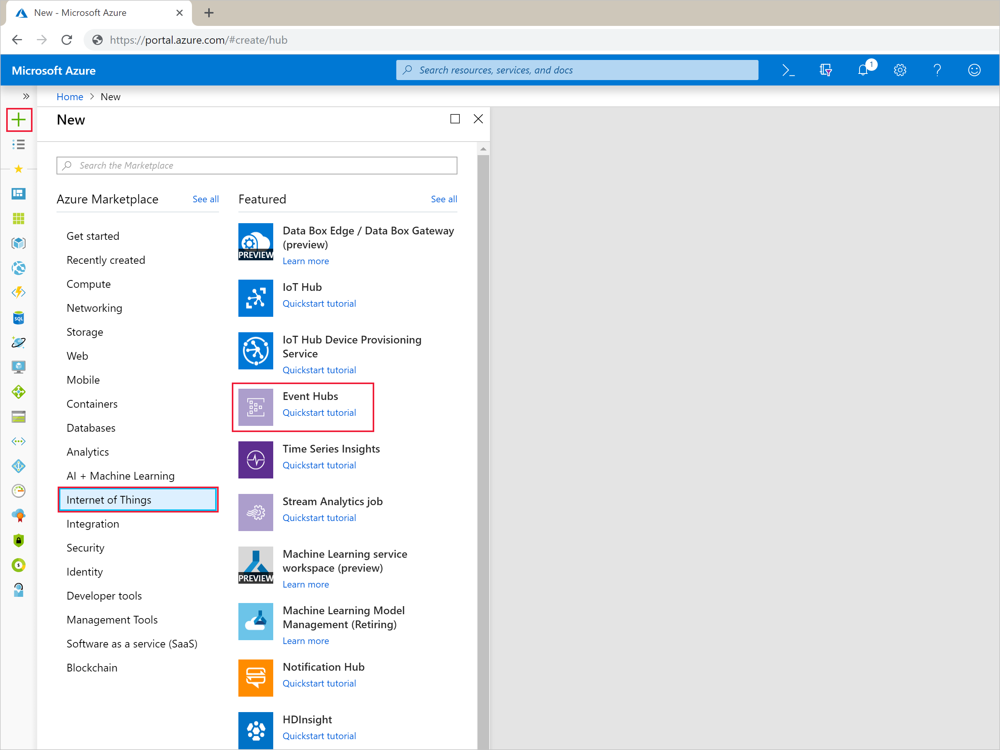
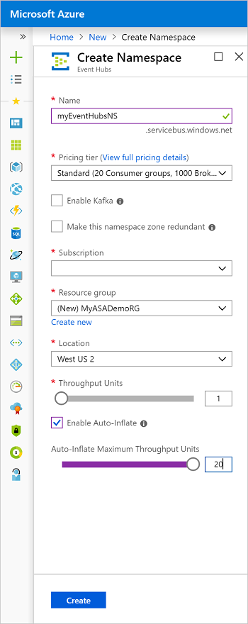
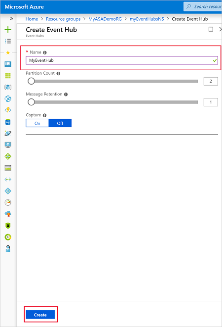
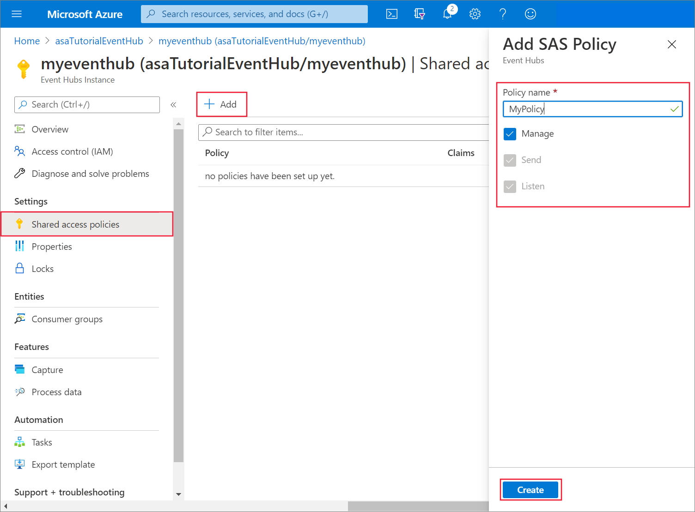
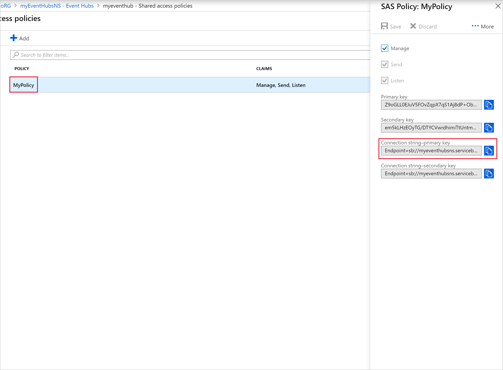
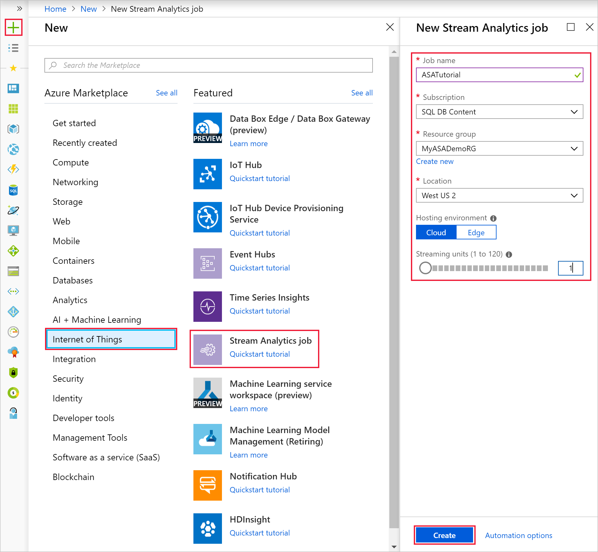
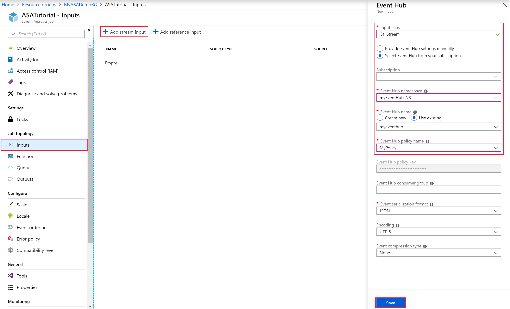
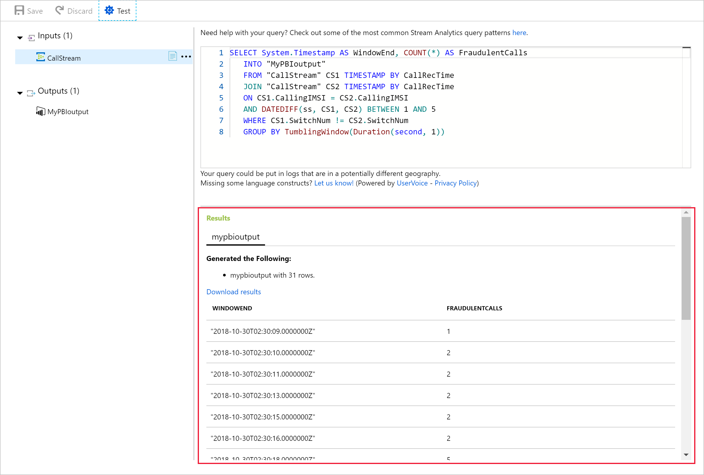
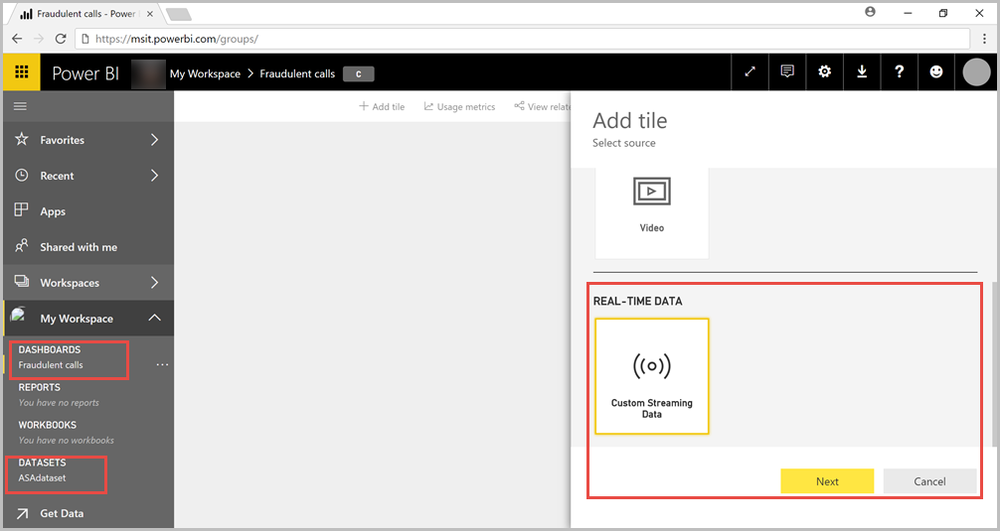

# Analyze phone call data with Stream Analytics and visualize results in Power BI dashboard

This tutorial teaches how to analyze phone call data using Azure Stream Analytics. The phone call data, generated by a client application, contains some fraudulent calls, which will be filtered by the Stream Analytics job.

In this tutorial, you learn how to:

> [!div class="checklist"]
> * Generate sample phone call data and send it to Azure Event Hubs
> * Create a Stream Analytics job
> * Configure job input and output
> * Define a query to filter fraudulent calls
> * Test and start the job
> * Visualize results in Power BI

## Prerequisites

Before you start, do the following actions:

* If you don't have an Azure subscription, create a [free account](https://azure.microsoft.com/free/).
* Sign in to the [Azure portal](https://portal.azure.com/).
* Download the phone call event generator app [TelcoGenerator.zip](https://download.microsoft.com/download/8/B/D/8BD50991-8D54-4F59-AB83-3354B69C8A7E/TelcoGenerator.zip) from the Microsoft Download Center or get the source code from [GitHub](https://aka.ms/azure-stream-analytics-telcogenerator).
* You will need Power BI account.

## Create an Azure Event Hub

Before Stream Analytics can analyze the fraudulent calls data stream, the data needs to be sent to Azure. In this tutorial, you will send data to Azure by using  [Azure Event Hubs](https://docs.microsoft.com/azure/event-hubs/event-hubs-what-is-event-hubs).

Use the following steps to create an Event Hub and send call data to that Event Hub:

1. Sign in to the [Azure portal](https://portal.azure.com/).
2. Select **Create a resource** > **Internet of Things** > **Event Hubs**.

   
3. Fill out the **Create Namespace** pane with the following values:

   |**Setting**  |**Suggested value** |**Description**  |
   |---------|---------|---------|
   |Name     | myEventHubsNS        |  A unique name to identify the event hub namespace.       |
   |Subscription     |   \<Your subscription\>      |   Select an Azure subscription where you want to create the event hub.      |
   |Resource group     |   MyASADemoRG      |  Select **Create New** and enter a new resource-group name for your account.       |
   |Location     |   West US2      |    Location where the event hub namespace can be deployed.     |

4. Use default options on the remaining settings and select **Create**.

   

5. When the namespace has finished deploying, go to **All resources** and find *myEventHubsNS* in the list of Azure resources. Select *myEventHubsNS* to open it.
6. Next select **+Event Hub** and enter the **Name** as *MyEventHub* or a different name of your choice. Use the default options on the remaining settings and select **Create**. Then wait for the deployment to succeed.

   

### Grant access to the event hub and get a connection string

Before an application can send data to Azure Event Hubs, the event hub must have a policy that allows appropriate access. The access policy produces a connection string that includes authorization information.

1. Navigate to the event hub you created in the previous step, MyEventHub*. Select **Shared access policies** under **Settings**, and then select **+ Add**.

2. Name the policy **MyPolicy** and ensure **Manage** is checked. Then select **Create**.

   

3. Once the policy is created, select to open the policy, and find the **Connection string–primary key**. Select the blue **copy** button next to the connection string.

   

4. Paste the connection string into a text editor. You need this connection string in the next section.

   The connection string looks as follows:

   `Endpoint=sb://<Your event hub namespace>.servicebus.windows.net/;SharedAccessKeyName=<Your shared access policy name>;SharedAccessKey=<generated key>;EntityPath=<Your event hub name>`

   Notice that the connection string contains multiple key-value pairs separated with semicolons: **Endpoint**, **SharedAccessKeyName**, **SharedAccessKey**, and **EntityPath**.

## Start the event generator application

Before you start the TelcoGenerator app, you should configure it to send data to the Azure Event Hubs you created earlier.

1. Extract the contents of [TelcoGenerator.zip](https://download.microsoft.com/download/8/B/D/8BD50991-8D54-4F59-AB83-3354B69C8A7E/TelcoGenerator.zip) file.
2. Open the `TelcoGenerator\TelcoGenerator\telcodatagen.exe.config` file in a text editor of your choice (There is more than one .config file, so be sure that you open the right one.)

3. Update the `<appSettings>` element in the config file with the following details:

   * Set the value of the *EventHubName* key to the value of the EntityPath in the connection string.
   * Set the value of the *Microsoft.ServiceBus.ConnectionString* key to the connection string without the EntityPath value (don't forget to remove the semicolon that precedes it).

4. Save the file.
5. Next open a command window and change to the folder where you unzipped the TelcoGenerator application. Then enter the following command:

   ```cmd
   telcodatagen.exe 1000 0.2 2
   ```

   This command takes the following parameters:
   * Number of call data records per hour.
   * Percentage of fraud probability, which is how often the app should simulate a fraudulent call. The value 0.2 means that about 20% of the call records will look fraudulent.
   * Duration in hours, which is the number of hours that the app should run. You can also stop the app at any time by ending the process (**Ctrl+C**) at the command line.

   After a few seconds, the app starts displaying phone call records on the screen as it sends them to the event hub. The phone call data contains the following fields:

   |**Record**  |**Definition**  |
   |---------|---------|
   |CallrecTime    |  The timestamp for the call start time.       |
   |SwitchNum     |  The telephone switch used to connect the call. For this example, the switches are strings that represent the country/region of origin (US, China, UK, Germany, or Australia).       |
   |CallingNum     |  The phone number of the caller.       |
   |CallingIMSI     |  The International Mobile Subscriber Identity (IMSI). It's a unique identifier of the caller.       |
   |CalledNum     |   The phone number of the call recipient.      |
   |CalledIMSI     |  International Mobile Subscriber Identity (IMSI). It's a unique identifier of the call recipient.       |

## Create a Stream Analytics job

Now that you have a stream of call events, you can create a Stream Analytics job that reads data from the event hub.

1. To create a Stream Analytics job, navigate to the [Azure portal](https://portal.azure.com/).

2. Select **Create a resource** > **Internet of Things** > **Stream Analytics job**.

3. Fill out the **New Stream Analytics job** pane with the following values:

   |**Setting**  |**Suggested value**  |**Description**  |
   |---------|---------|---------|
   |Job name     |  ASATutorial       |   A unique name to identify the event hub namespace.      |
   |Subscription    |  \<Your subscription\>   |   Select an Azure subscription where you want to create the job.       |
   |Resource group   |   MyASADemoRG      |   Select **Use existing** and enter a new resource-group name for your account.      |
   |Location   |    West US2     |   	Location where the job can be deployed. It's recommended to place the job and the event hub in the same region for best performance and so that you don't pay to transfer data between regions.      |
   |Hosting environment    | Cloud        |     Stream Analytics jobs can be deployed to cloud or edge. Cloud allows you to deploy to Azure Cloud, and Edge allows you to deploy to an IoT Edge device.    |
   |Streaming units     |    1	     |   	Streaming units represent the computing resources that are required to execute a job. By default, this value is set to 1. To learn about scaling streaming units, see [understanding and adjusting streaming units](stream-analytics-streaming-unit-consumption.md) article.      |

4. Use default options on the remaining settings, select **Create**, and wait for the deployment to succeed.

   

## Configure job input

The next step is to define an input source for the job to read data using the event hub you created in the previous section.

1. From the Azure portal, open the **All resources** pane, and find the *ASATutorial* Stream Analytics job.

2. In the **Job Topology** section of the Stream Analytics job pane, select the **Inputs** option.

3. Select **+ Add stream input** and **Event hub**. Fill out the pane with the following values:

   |**Setting**  |**Suggested value**  |**Description**  |
   |---------|---------|---------|
   |Input alias     |  CallStream       |  Provide a friendly name to identify your input. Input alias can contain alphanumeric characters, hyphens, and underscores only and must be 3-63 characters long.       |
   |Subscription    |   \<Your subscription\>      |   Select the Azure subscription where you created the event hub. The event hub can be in same or a different subscription as the Stream Analytics job.       |
   |Event hub namespace    |  myEventHubsNS       |  Select the event hub namespace you created in the previous section. All the event hub namespaces available in your current subscription are listed in the dropdown.       |
   |Event Hub name    |   MyEventHub      |  Select the event hub you created in the previous section. All the event hubs available in your current subscription are listed in the dropdown.       |
   |Event Hub policy name   |  MyPolicy       |  Select the event hub shared access policy you created in the previous section. All the event hubs policies available in your current subscription are listed in the dropdown.       |

4. Use default options on the remaining settings and select **Save**.

   

## Configure job output

The last step is to define an output sink for the job where it can write the transformed data. In this tutorial, you output and visualize data with Power BI.

1. From the Azure portal open **All resources** pane, and the *ASATutorial* Stream Analytics job.

2. In the **Job Topology** section of the Stream Analytics job pane, select the **Outputs** option.

3. Select **+ Add** > **Power BI**. Then fill the form with the following details and select **Authorize**:

   |**Setting**  |**Suggested value**  |
   |---------|---------|
   |Output alias  |  MyPBIoutput  |
   |Dataset name  |   ASAdataset  |
   |Table name |  ASATable  |

   

4. When you select **Authorize**, a pop-up window opens and you are asked to provide credentials to authenticate to your Power BI account. Once the authorization is successful, **Save** the settings.

## Define a query to analyze input data

The next step is to create a transformation that analyzes data in real time. You define the transformation query by using [Stream Analytics Query Language](https://docs.microsoft.com/stream-analytics-query/stream-analytics-query-language-reference). The query used in this tutorial detects fraudulent calls from the phone data.

In this example, fraudulent calls are made from the same user within five seconds but in separate locations. For example, the same user can't legitimately make a call from the US and Australia at the same time. To define the transformation query for your Stream Analytics job:

1. From the Azure portal, open the **All resources** pane and navigate to the **ASATutorial** Stream Analytics job you created earlier.

2. In the **Job Topology** section of the Stream Analytics job pane, select the **Query** option. The query window lists the inputs and outputs that are configured for the job, and lets you create a query to transform the input stream.

3. Replace the existing query in the editor with the following query, which performs a self-join on a 5-second interval of call data:

   ```sql
   SELECT System.Timestamp AS WindowEnd, COUNT(*) AS FraudulentCalls
   INTO "MyPBIoutput"
   FROM "CallStream" CS1 TIMESTAMP BY CallRecTime
   JOIN "CallStream" CS2 TIMESTAMP BY CallRecTime
   ON CS1.CallingIMSI = CS2.CallingIMSI
   AND DATEDIFF(ss, CS1, CS2) BETWEEN 1 AND 5
   WHERE CS1.SwitchNum != CS2.SwitchNum
   GROUP BY TumblingWindow(Duration(second, 1))
   ```

   To check for fraudulent calls, you can self-join the streaming data based on the `CallRecTime` value. You can then look for call records where the `CallingIMSI` value (the originating number) is the same, but the `SwitchNum` value (country/region of origin) is different. When you use a JOIN operation with streaming data, the join must provide some limits on how far the matching rows can be separated in time. Because the streaming data is endless, the time bounds for the relationship are specified within the **ON** clause of the join using the [DATEDIFF](https://docs.microsoft.com/stream-analytics-query/datediff-azure-stream-analytics) function.

   This query is just like a normal SQL join except for the **DATEDIFF** function. The **DATEDIFF** function used in this query is specific to Stream Analytics, and it must appear within the `ON...BETWEEN` clause.

4. **Save** the query.

   

## Test your query

You can test a query from the query editor using sample data. Run the following steps to test the query:

1. Make sure that the TelcoGenerator app is running and producing phone call records.

2. In the **Query** pane, select the dots next to the *CallStream* input and then select **Sample data from input**.

3. Set **Minutes** to 3 and select **OK**. Three minutes worth of data is then sampled from the input stream and you are notified when the sample data is ready. You can view the status of sampling from the notification bar.

   The sample data is stored temporarily and is available while you have the query window open. If you close the query window, the sample data is discarded, and you'll have to create a new set of sample data if you want to test. Alternatively, you can use a sample data JSON file from [GitHub](https://github.com/Azure/azure-stream-analytics/blob/master/Sample%20Data/telco.json), and then upload that JSON file to use as sample data for the *CallStream* input.

   

4. Select **Test** to test the query. You should see the following results:

   

## Start the job and visualize output

1. To start the job, navigate to the **Overview** pane of your job and select **Start**.

2. Select **Now** for job output start time and select **Start**. You can view the job status in the notification bar.

3. Once the job succeeds, navigate to [Power BI](https://powerbi.com/) and sign in with your work or school account. If the Stream Analytics job query is outputting results, the *ASAdataset* dataset you created exists under the **Datasets** tab.

4. From your Power BI workspace, select **+ Create** to create a new dashboard named *Fraudulent Calls*.

5. At the top of the window, select **Add tile**. Then select **Custom Streaming Data** and **Next**. Choose the **ASAdataset** under **Your Datasets**. Select **Card** from the **Visualization type** dropdown, and add **fraudulent calls** to **Fields**. Select **Next** to enter a name for the tile, and then select **Apply** to create the tile.

   

6. Follow the step 5 again with the following options:
   * When you get to Visualization Type, select Line chart.
   * Add an axis and select **windowend**.
   * Add a value and select **fraudulentcalls**.
   * For **Time window to display**, select the last 10 minutes.

7. Your dashboard should look like the example below once both tiles are added. Notice that, if your event hub sender application and Streaming Analytics application are running, your Power BI dashboard periodically updates as new data arrives.

   

## Embedding your Power BI Dashboard in a Web Application

For this part of the tutorial, you'll use a sample [ASP.NET](https://asp.net/) web application created by the Power BI team to embed your dashboard. For more information about embedding dashboards, see [embedding with Power BI](https://docs.microsoft.com/power-bi/developer/embedding) article.

To set up the application, go to the [PowerBI-Developer-Samples](https://github.com/Microsoft/PowerBI-Developer-Samples) GitHub repository and follow the instructions under the **User Owns Data** section (use the redirect and homepage URLs under the **integrate-dashboard-web-app** subsection). Since we are using the Dashboard example, use the **integrate-dashboard-web-app** sample code located in the [GitHub repository](https://github.com/Microsoft/PowerBI-Developer-Samples/tree/master/User%20Owns%20Data/integrate-dashboard-web-app).
Once you've got the application running in your browser, follow these steps to embed the dashboard you created earlier into the web page:

1. Select **Sign in to Power BI**, which grants the application access to the dashboards in your Power BI account.

2. Select the **Get Dashboards** button, which displays your account's Dashboards in a table. Find the name of the dashboard you created earlier, **powerbi-embedded-dashboard**, and copy the corresponding **EmbedUrl**.

3. Finally, paste the **EmbedUrl** into the corresponding text field and select **Embed Dashboard**. You can now view the same dashboard embedded within a web application.

## Next steps

In this tutorial, you created a simple Stream Analytics job, analyzed the incoming data, and presented results in a Power BI dashboard. To learn more about Stream Analytics jobs, continue to the next tutorial:

> [!div class="nextstepaction"]
> [Run Azure Functions within Stream Analytics jobs](stream-analytics-with-azure-functions.md)
