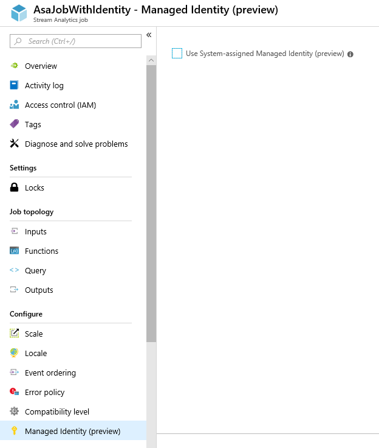
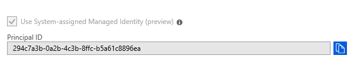
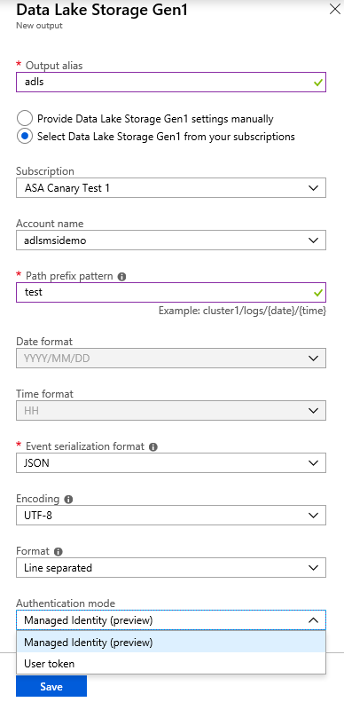
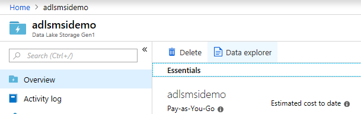
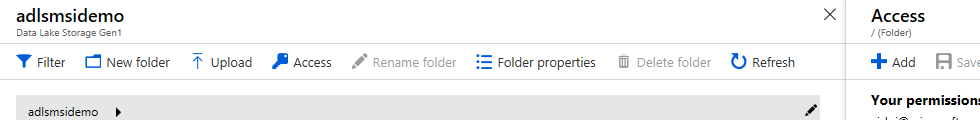
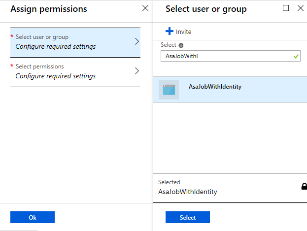
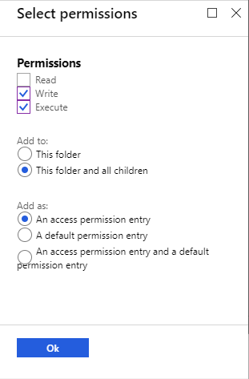
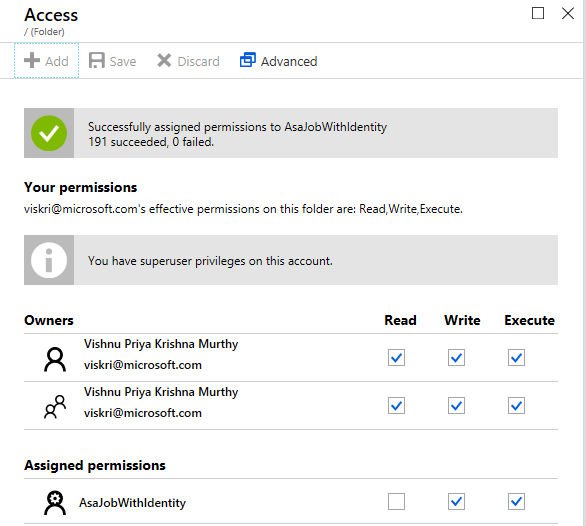
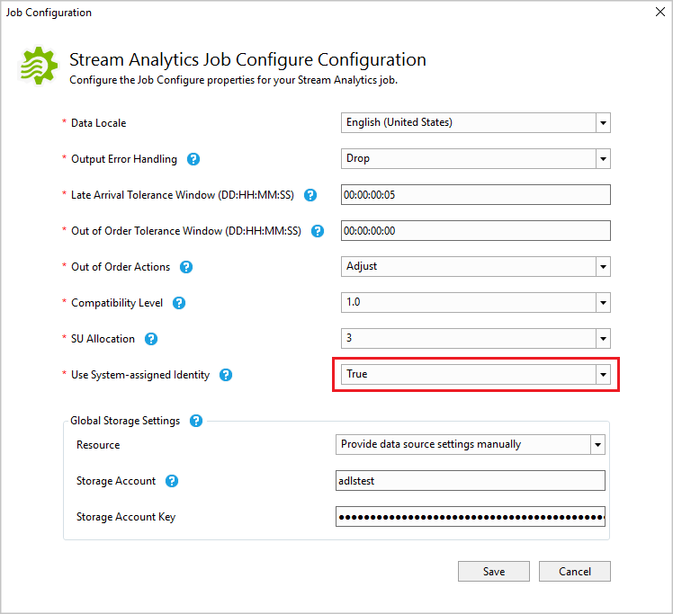
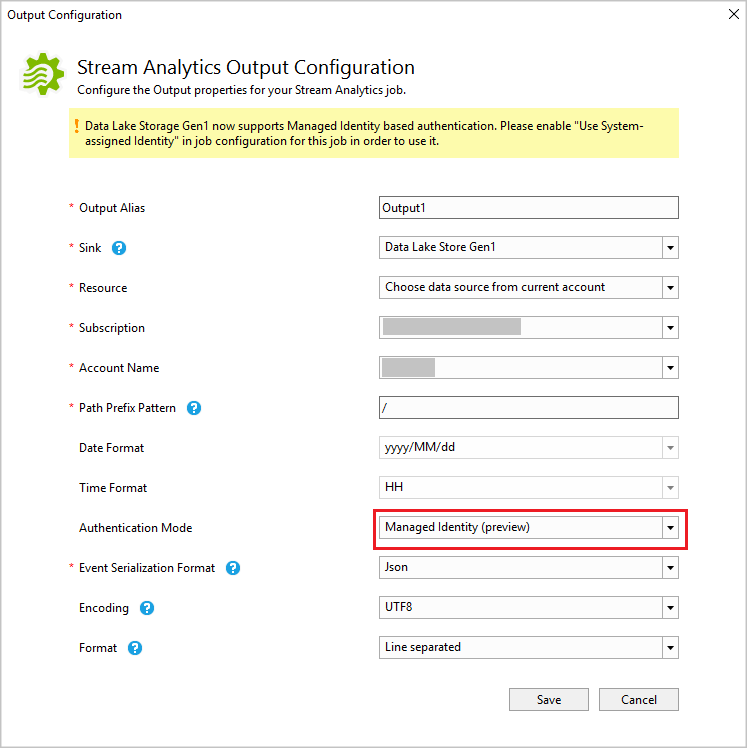

# Authenticate Stream Analytics to Azure Data Lake Storage Gen1 using managed identities

Azure Stream Analytics supports managed identity authentication with Azure Data Lake Storage (ADLS) Gen1 output. The identity is a managed application registered in Azure Active Directory that represents a given Stream Analytics job, and can be used to authenticate to a targeted resource. Managed identities eliminate the limitations of user-based authentication methods, like needing to reauthenticate due to password changes or user token expirations that occur every 90 days. Additionally, managed identities help with the automation of Stream Analytics job deployments that output to Azure Data Lake Storage Gen1.

This article shows you three ways to enable managed identity for an Azure Stream Analytics job that outputs to an Azure Data Lake Storage Gen1 through the Azure portal, Azure Resource Manager template deployment, and Azure Stream Analytics tools for Visual Studio.

[!INCLUDE [updated-for-az](../../includes/updated-for-az.md)]

## Azure portal

1. Start by creating a new Stream Analytics job or by opening an existing job in Azure portal. From the menu bar located on the left side of the screen, select **Managed Identity** located under **Configure**.

   

2. Select **Use System-assigned Managed Identity** from the window that appears on the right. Click **Save** to a service principal for the identity of the Stream Analytics job in Azure Active Directory. The life cycle of the newly created identity will be managed by Azure. When the Stream Analytics job is deleted, the associated identity (that is, the service principal) is automatically deleted by Azure.

   When the configuration is saved, the Object ID (OID) of the service principal is listed as the Principal ID as shown below:

   
 
   The service principal has the same name as the Stream Analytics job. For example, if the name of your job is **MyASAJob**, the name of the service principal created is also **MyASAJob**.

3. In the output properties window of the ADLS Gen1 output sink, click the Authentication mode drop-down and select **Managed Identity **.

4. Fill out the rest of the properties. To learn more about creating an ADLS output, see [Create a Data lake Store output with stream analytics](../data-lake-store/data-lake-store-stream-analytics.md). When you are finished, click **Save**.

   
 
5. Navigate to the Overview page of your ADLS Gen1 and click on **Data explorer**.

   

6. In the Data explorer pane, select **Access** and click **Add** in the Access pane.

   

7. In the text box on the **Select user or group** pane, type the name of the service principal. Remember that the name of the service principal is also the name of the corresponding Stream Analytics job. As you begin typing the principal name, it will appear below the text box. Choose the desired service principal name and click **Select**.

   
 
8. In the **Permissions** pane, check the **Write** and **Execute** permissions and assign it to **This Folder and all children**. Then click **Ok**.

   
 
9. The service principal is listed under **Assigned Permissions** on the **Access** pane as shown below. You can now go back and start your Stream Analytics job.

   

   To learn more about Data Lake Storage Gen1 file system permissions, see [Access Control in Azure Data Lake Storage Gen1](../data-lake-store/data-lake-store-access-control.md).

## Stream Analytics tools for Visual Studio

1. In JobConfig.json, set **Use System-assigned Identity** to **True**.

   

2. In the output properties window of the ADLS Gen1 output sink, click the Authentication mode drop-down and select **Managed Identity **.

   

3. Fill out the rest of the properties, and click **Save**.

4. Click **Submit to Azure** in the query editor.

   When you submit the job, the tools do two things:

   * Automatically creates a service principal for the identity of the Stream Analytics job in Azure Active Directory. The life cycle of the newly created identity will be managed by Azure. When the Stream Analytics job is deleted, the associated identity (that is, the service principal) is automatically deleted by Azure.

   * Automatically set **Write** and **Execute** permissions for the ADLS Gen1 prefix path used in the job and assign it to this folder and all children.

5. You can generate the Resource Manager templates with the following property using [Stream Analytics CI.CD Nuget package](https://www.nuget.org/packages/Microsoft.Azure.StreamAnalytics.CICD/) version 1.5.0 or above on a build machine (outside of Visual Studio). Follow the Resource Manager template deployment steps in the next section to get the service principal and grant access to the service principal via PowerShell.

## Resource Manager template deployment

1. You can create a *Microsoft.StreamAnalytics/streamingjobs* resource with a managed identity by including the following property in the resource section of your Resource Manager template:

    ```json
    "Identity": {
      "Type": "SystemAssigned",
    },
    ```

   This property tells Azure Resource Manager to create and manage the identity for your Azure Stream Analytics job.

   **Sample job**
   
   ```json
   {
     "Name": "AsaJobWithIdentity",
     "Type": "Microsoft.StreamAnalytics/streamingjobs",
     "Location": "West US",
     "Identity": {
       "Type": "SystemAssigned",
     },
     "properties": {
       "sku": {
         "name": "standard"
       },
       "outputs": [
         {
           "name": "string",
           "properties":{
             "datasource": {
               "type": "Microsoft.DataLake/Accounts",
               "properties": {
                 "accountName": "myDataLakeAccountName",
                 "filePathPrefix": "cluster1/logs/{date}/{time}",
                 "dateFormat": "YYYY/MM/DD",
                 "timeFormat": "HH",
                 "authenticationMode": "Msi"
             }
           }
         }
       }
     }
   }
   ```
  
   **Sample job response**

   ```json
   {
    "Name": "mySAJob",
    "Type": "Microsoft.StreamAnalytics/streamingjobs",
    "Location": "West US",
    "Identity": {
      "Type": "SystemAssigned",
        "principalId": "GUID",
        "tenantId": "GUID",
      },
      "properties": {
        "sku": {
          "name": "standard"
        },
     }
   }
   ```

   Take note of the Principal ID from the job response to grant access to the required ADLS resource.

   The **Tenant ID** is the ID of the Azure Active Directory tenant where the service principal is created. The service principal is created in the Azure tenant that is trusted by the subscription.

   The **Type** indicates the type of managed identity as explained in types of managed identities. Only the System Assigned type is supported.

2. Provide Access to the service principal using PowerShell. To give access to the service principal via PowerShell, execute the following command:

   ```powershell
   Set-AzDataLakeStoreItemAclEntry -AccountName <accountName> -Path <Path> -AceType User -Id <PrinicpalId> -Permissions <Permissions>
   ```

   The **PrincipalId** is the Object ID of the service principal and is listed on the portal screen once the service principal is created. If you created the job using a Resource Manager template deployment, the Object ID is listed in the Identity property of the job response.

   **Example**

   ```powershell
   PS > Set-AzDataLakeStoreItemAclEntry -AccountName "adlsmsidemo" -Path / -AceType
   User -Id 14c6fd67-d9f5-4680-a394-cd7df1f9bacf -Permissions WriteExecute
   ```

   To learn more about the above PowerShell command, refer to the [Set-AzDataLakeStoreItemAclEntry](/powershell/module/az.datalakestore/set-azdatalakestoreitemaclentry) documentation.

## Limitations
This feature doesn’t support the following:

1. **Multi-tenant access**: The Service principal created for a given Stream Analytics job will reside on the Azure Active Directory tenant on which the job was created, and cannot be used against a resource that resides on a different Azure Active Directory tenant. Therefore, you can only use MSI on ADLS Gen 1 resources that are within the same Azure Active Directory tenant as your Azure Stream Analytics job. 

2. **[User Assigned Identity](../active-directory/managed-identities-azure-resources/overview.md)**: is not supported. This means the user is not able to enter their own service principal to be used by their Stream Analytics job. The service principal is generated by Azure Stream Analytics.

## Next steps

* [Create a Data lake Store output with stream analytics](../data-lake-store/data-lake-store-stream-analytics.md)
* [Test Stream Analytics queries locally with Visual Studio](stream-analytics-vs-tools-local-run.md)
* [Test live data locally using Azure Stream Analytics tools for Visual Studio](stream-analytics-live-data-local-testing.md) 
