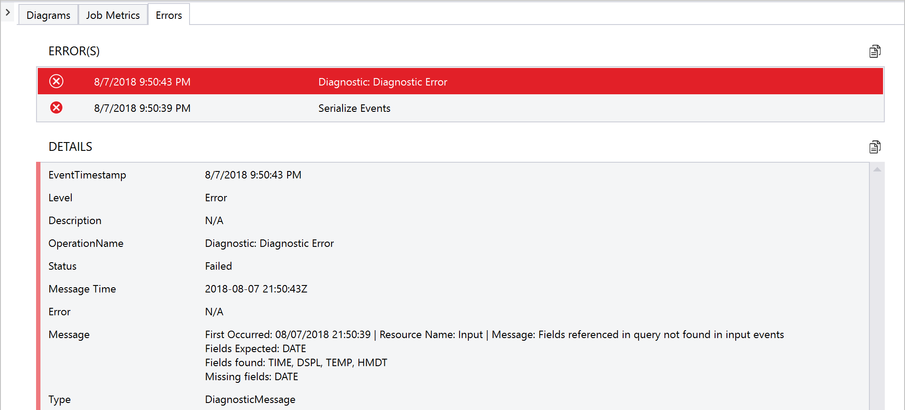

# Monitor and manage Stream Analytics jobs with Visual Studio

This article demonstrates how to monitor your Stream Analytics job in Visual Studio. Azure Stream Analytics tools for Visual Studio provides a monitoring experience similar to Azure portal without having to leave the IDE. You can begin to monitor a job as soon as you **Submit to Azure** from your **Script.asaql**, or you can monitor existing jobs regardless of how they were created. 

## Job summary

The **Job Summary** and **Job Metrics** give a quick snapshot of your job. At a glance, you can determine a job's status and event information.]

 

## Job metrics

You can collapse the **Job Summary** and click the **Job Metrics** tab to view a graph with important metrics. Check and un-check metrics types to add and remove them from the graph.

## Error monitoring

You can also monitor errors by clicking on the **Errors** tab.

## Get support
For further assistance, try our [Microsoft Q&A question page for Azure Stream Analytics](/answers/topics/azure-stream-analytics.html). 

## Next steps
* [Introduction to Azure Stream Analytics](stream-analytics-introduction.md)
* [Create an Azure Stream Analytics job with Visual Studio](stream-analytics-quick-create-vs.md)
* [Install Azure Stream Analytics tools for Visual Studio](stream-analytics-tools-for-visual-studio-install.md)