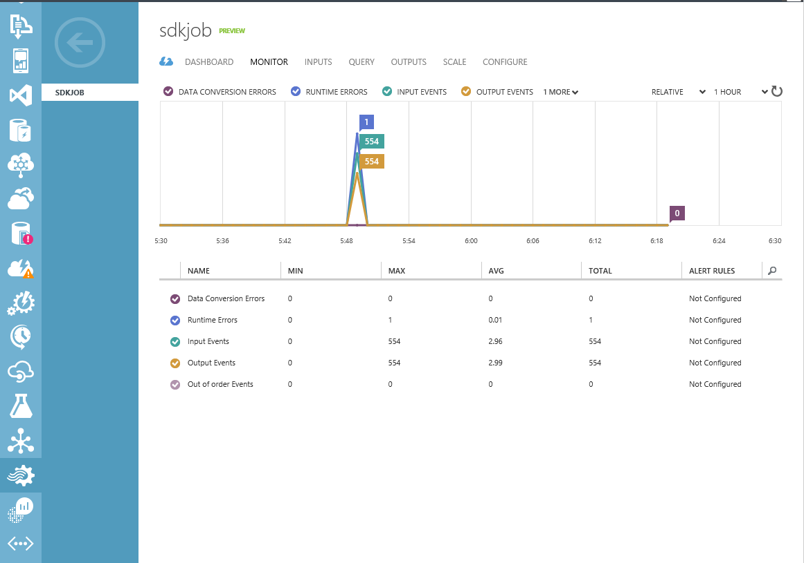

<properties 
	pageTitle="programmatically Monitor jobs on Stream Analytics | Microsoft Azure" 
	description="Learn how to programmatically monitor Stream Analytics jobs created via REST APIs, Azure SDK, or Powershell."
	keywords=".net monitor, job monitor, monitoring app"
	services="stream-analytics" 
	documentationCenter="" 
	authors="jeffstokes72" 
	manager="paulettm" 
	editor="cgronlun"/>

<tags 
	ms.service="stream-analytics" 
	ms.devlang="na" 
	ms.topic="article" 
	ms.tgt_pltfrm="na" 
	ms.workload="data-services" 
	ms.date="07/27/2016" 
	ms.author="jeffstok"/>


# Programmatically create a Stream Analytics job monitor
 This article demonstrates how to enable monitoring for a Stream Analytics job. Stream Analytics jobs created via REST APIs, Azure SDK, or Powershell do not have monitoring enabled by default.  You can manually enable this in the Azure Portal by navigating to the job’s Monitor page and clicking the Enable button or you can automate this process by following the steps in this article. The monitoring data will show up in the “Monitor” tab in the Azure Portal for your Stream Analytics job.



## Prerequisites
Before you begin this article, you must have the following:

- Visual Studio 2012 or 2013.
- Download and install [Azure .NET SDK](https://azure.microsoft.com/downloads/).
- An existing Stream Analytics job that needs monitoring enabled.

## Setup a project

1.	Create a Visual Studio C# .Net console application.
2.	In the Package Manager Console, run the following commands to install the NuGet packages. The first one is the Azure Stream Analytics Management .NET SDK. The second one is the Azure Insights SDK which will be used to enable monitoring. The last one is the Azure Active Directory client that will be used for authentication.

    ```
    Install-Package Microsoft.Azure.Management.StreamAnalytics
    Install-Package Microsoft.Azure.Insights -Pre
    Install-Package Microsoft.IdentityModel.Clients.ActiveDirectory
    ```

3.	Add the following appSettings section to the App.config file.

    ```
    <appSettings>
    	<!--CSM Prod related values-->
    	<add key="ResourceGroupName" value="RESOURCE GROUP NAME" />
    	<add key="JobName" value="YOUR JOB NAME" />
    	<add key="StorageAccountName" value="YOUR STORAGE ACCOUNT"/>
    	<add key="ActiveDirectoryEndpoint" value="https://login.windows.net/" />
    	<add key="ResourceManagerEndpoint" value="https://management.azure.com/" />
    	<add key="WindowsManagementUri" value="https://management.core.windows.net/" />
    	<add key="AsaClientId" value="1950a258-227b-4e31-a9cf-717495945fc2" />
    	<add key="RedirectUri" value="urn:ietf:wg:oauth:2.0:oob" />
    	<add key="SubscriptionId" value="YOUR AZURE SUBSCRIPTION ID" />
    	<add key="ActiveDirectoryTenantId" value="YOUR TENANT ID" />
    </appSettings>
	```
Replace values for *SubscriptionId* and *ActiveDirectoryTenantId* with your Azure subscription and tenant IDs. You can get these values by running the following PowerShell cmdlet:

    ```
    Get-AzureAccount
    ```
4.	Add the following using statements to the source file (Program.cs) in the project. 

    ```
        using System;
        using System.Configuration;
        using System.Threading;
        using Microsoft.Azure;
        using Microsoft.Azure.Management.Insights;
        using Microsoft.Azure.Management.Insights.Models;
        using Microsoft.Azure.Management.StreamAnalytics;
        using Microsoft.Azure.Management.StreamAnalytics.Models;
        using Microsoft.IdentityModel.Clients.ActiveDirectory;
    ```
5.	Add an authentication helper method.

        public static string GetAuthorizationHeader()
        	{
        		AuthenticationResult result = null;
        		var thread = new Thread(() =>
        		{
        			try
        			{
            			var context = new AuthenticationContext(
                			ConfigurationManager.AppSettings["ActiveDirectoryEndpoint"] +
                			ConfigurationManager.AppSettings["ActiveDirectoryTenantId"]);

            			result = context.AcquireToken(
                			resource: ConfigurationManager.AppSettings["WindowsManagementUri"],
                			clientId: ConfigurationManager.AppSettings["AsaClientId"],
                			redirectUri: new Uri(ConfigurationManager.AppSettings["RedirectUri"]),
                			promptBehavior: PromptBehavior.Always);
        			}
        			catch (Exception threadEx)
        			{
            			Console.WriteLine(threadEx.Message);
        			}
    			});

    			thread.SetApartmentState(ApartmentState.STA);
    			thread.Name = "AcquireTokenThread";
    			thread.Start();
    			thread.Join();

    			if (result != null)
    			{
        			return result.AccessToken;
    			}

    			throw new InvalidOperationException("Failed to acquire token");
        }

## Create Management Clients
The following code will set up the necessary variables and management clients.

    string resourceGroupName = "<YOUR AZURE RESOURCE GROUP NAME>";
    string streamAnalyticsJobName = "<YOUR STREAM ANALYTICS JOB NAME>";

    // Get authentication token
    TokenCloudCredentials aadTokenCredentials =
    	new TokenCloudCredentials(
    		ConfigurationManager.AppSettings["SubscriptionId"],
    		GetAuthorizationHeader());

    Uri resourceManagerUri = new
    Uri(ConfigurationManager.AppSettings["ResourceManagerEndpoint"]);

    // Create Stream Analytics and Insights management client
    StreamAnalyticsManagementClient streamAnalyticsClient = new
    StreamAnalyticsManagementClient(aadTokenCredentials, resourceManagerUri);
    InsightsManagementClient insightsClient = new
    InsightsManagementClient(aadTokenCredentials, resourceManagerUri);

## Enable Monitoring For an Existing Stream Analytics Job

The following code will enable monitoring for an **existing** Stream Analytics job. The first part of the code performs a GET request against the Stream Analytics service to retrieve information about the particular Stream Analytics job. It uses the “Id” property (retrieved from the GET request) as a parameter for the Put method in the second half of the code which sends a PUT request to the Insights service to enable monitoring for the Stream Analytics job.

> [AZURE.WARNING]
> If you have previously enabled monitoring for a different Stream Analytics job, either through the Azure Portal or programmatically via the below code, **it is recommended that you provide the same storage account name that you did when you previously enabled monitoring.**
> 
> The storage account is linked to the region you created your Stream Analytics job in, not specifically to the job itself. 
> 
> All Stream Analytics job (and all other Azure resources) in that same region share this storage account to store monitoring data. If you provide a different storage account, it may cause unintended side effects to the monitoring of your other Stream Analytics jobs and/or other Azure resources.
> 
> The storage account name used to replace ```“<YOUR STORAGE ACCOUNT NAME>”``` below should be a storage account that is in the same subscription as the Stream Analytics job you are enabling monitoring for.

    // Get an existing Stream Analytics job
    JobGetParameters jobGetParameters = new JobGetParameters()
    {
    	PropertiesToExpand = "inputs,transformation,outputs"
    };
    JobGetResponse jobGetResponse = streamAnalyticsClient.StreamingJobs.Get(resourceGroupName, streamAnalyticsJobName, jobGetParameters);

    // Enable monitoring
    ServiceDiagnosticSettingsPutParameters insightPutParameters = new ServiceDiagnosticSettingsPutParameters()
    {
    		Properties = new ServiceDiagnosticSettings()
    		{
        		StorageAccountName = "<YOUR STORAGE ACCOUNT NAME>"
    		}
    };
    insightsClient.ServiceDiagnosticSettingsOperations.Put(jobGetResponse.Job.Id, insightPutParameters);


## Get support
For further assistance, try our [Azure Stream Analytics forum](https://social.msdn.microsoft.com/Forums/en-US/home?forum=AzureStreamAnalytics). 


## Next steps

- [Introduction to Azure Stream Analytics](stream-analytics-introduction.md)
- [Get started using Azure Stream Analytics](stream-analytics-get-started.md)
- [Scale Azure Stream Analytics jobs](stream-analytics-scale-jobs.md)
- [Azure Stream Analytics Query Language Reference](https://msdn.microsoft.com/library/azure/dn834998.aspx)
- [Azure Stream Analytics Management REST API Reference](https://msdn.microsoft.com/library/azure/dn835031.aspx)
 